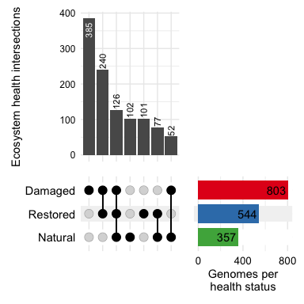
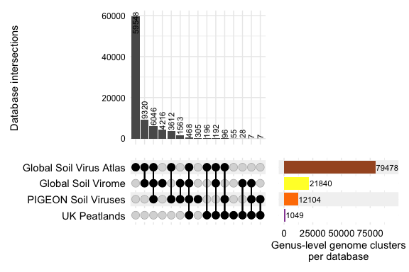
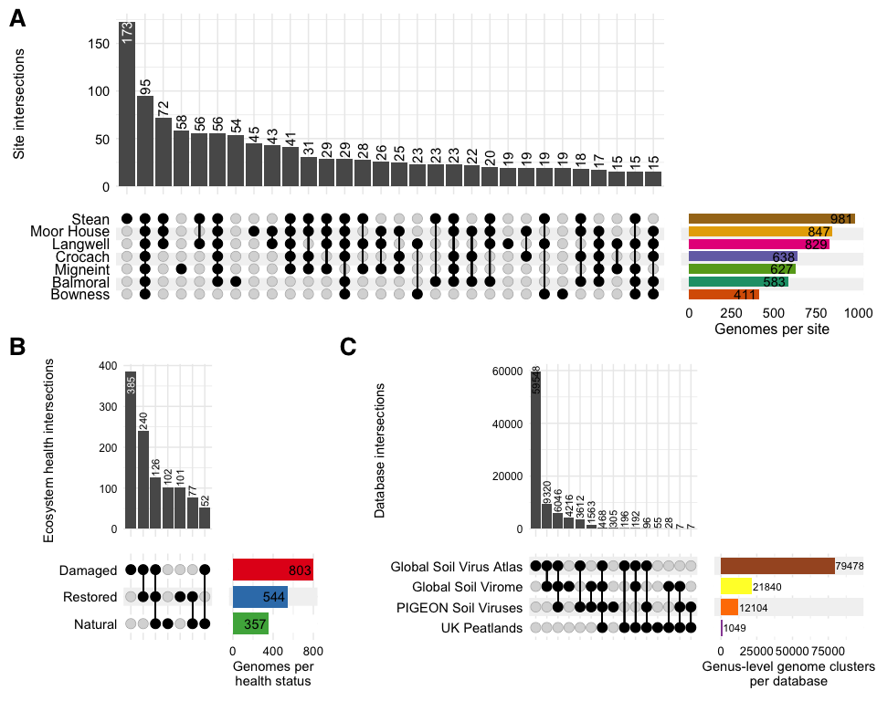

Virus Presence/Absence
================
James C. Kosmopoulos
2025-08-05

# Virus distribution

# Load packages

``` r
library("tidyverse");packageVersion("tidyverse")
```

    ## [1] '2.0.0'

``` r
library("RColorBrewer");packageVersion("RColorBrewer")
```

    ## [1] '1.1.3'

``` r
library("UpSetR");packageVersion("UpSetR")
```

    ## [1] '1.4.0'

``` r
library("ComplexUpset");packageVersion("ComplexUpset")
```

    ## [1] '1.3.3'

# Load data

``` r
metadata <- readRDS("../Data/metadata_simple.RDS")
breadths <- readRDS("../Data/virus_covered_fraction.RDS")
genus_clusters <- readRDS("../Data/virus_genus_clusters.RDS")
```

# Investigate viruses present in \> 1 site or treatment

## Get names of present viruses in each sample site

Consider values \>= 0.5 to be “present”

``` r
present_by_site <- list()
for (site in unique(metadata$site)) {
  meta_site <- metadata[metadata$site == site, ]
  subset_breadths <- breadths[, row.names(meta_site)]
  present_rows <- apply(subset_breadths, 1, function(row) any(row >= 0.5))
  present_object_name <- paste0("present.", site)
  assign(present_object_name, rownames(subset_breadths)[present_rows])
  present_by_site[[site]] <- get(present_object_name)
}
```

## Now get viruses present in each treatment

``` r
present_by_treatment <- list()
for (treatment in unique(metadata$treatment)) {
  meta_treatment <- metadata[metadata$treatment == treatment, ]
  subset_breadths <- breadths[, row.names(meta_treatment)]
  present_rows <- apply(subset_breadths, 1, function(row) any(row >= 0.5))
  present_object_name <- paste0("present.", treatment)
  assign(present_object_name, rownames(subset_breadths)[present_rows])
  present_by_treatment[[treatment]] <- get(present_object_name)
}
```

## Viruses present in each site, by treatment

``` r
present_by_site_and_treatment <- list()
for (site in unique(metadata$site)) {
  meta_site <- metadata[metadata$site == site, ]
  presnt_by_treatment <- list()
  for (treatment in unique(meta_site$treatment)) {
    meta_treatment <- meta_site[meta_site$treatment == treatment, ]
    subset_breadths <- breadths[, row.names(meta_treatment)]
    present_rows <- apply(subset_breadths, 1, function(row) any(row >= 0.5))
    present_object_name <- paste0("present.", site, ".", treatment)
    assign(present_object_name, rownames(subset_breadths)[present_rows])
    present_by_treatment[[treatment]] <- get(present_object_name)
  }
  present_by_site_and_treatment[[site]] <- present_by_treatment
}
```

## Combine and save lists

``` r
presence_absence <- list("site" = present_by_site, "treatment" = present_by_treatment, "site_treatment" = present_by_site_and_treatment)
saveRDS(presence_absence, file="../Data/virus_presence_absence.RDS")
```

# Upset plots of virus distribution

## Sites

### Prepare data

``` r
# Prepare your data in the appropriate format
upset_site_data <- fromList(list(
  "Balmoral" = presence_absence[["site"]][["Balmoral"]],
  "Bowness" = presence_absence[["site"]][["Bowness"]],
  "Crocach" = presence_absence[["site"]][["Crocach"]],
  "Langwell" = presence_absence[["site"]][["Langwell"]],
  "Migneint" = presence_absence[["site"]][["Migneint"]],
  "Moor House" = presence_absence[["site"]][["Moor_House"]],
  "Stean" = presence_absence[["site"]][["Stean"]]
))

# Convert the matrix to a tibble and ensure column names match the site names
upset_site_data_df <- as.data.frame(upset_site_data)
colnames(upset_site_data_df) <- c("Balmoral", "Bowness", "Crocach", "Langwell", "Migneint", "Moor House", "Stean")
```

### Get a count and % of species present in 1 site vs \>1 site

``` r
row_sums_site <- rowSums(upset_site_data_df)

count_sums_site <- table(factor(ifelse(row_sums_site == 1, "sum_1", "sum_greater_than_1"), levels = c("sum_1", "sum_greater_than_1")))

count_sums_site
```

    ## 
    ##              sum_1 sum_greater_than_1 
    ##                368               1177

``` r
(count_sums_site[["sum_greater_than_1"]] / (count_sums_site[["sum_greater_than_1"]] + count_sums_site[["sum_1"]])) * 100
```

    ## [1] 76.18123

### Plot using ComplexUpset

``` r
upset.sites <- ComplexUpset::upset(
  upset_site_data_df,
  intersect = c('Balmoral', 'Bowness', 'Crocach', 'Langwell', 'Migneint', 'Moor House', 'Stean'),
  sort_sets = "descending",
  sort_intersections = 'descending',
  name = 'Site intersections',
  base_annotations = list(
    'Intersection size' = (
      intersection_size(text = list(size = 4, angle = 90, vjust = 0.52, hjust = -0.1),
                        text_colors = list(on_background='black', on_bar='white')
      ) +
        ylab("Site intersections")
    )
  ),
  themes = upset_modify_themes(
    list(
      'overall_sizes' = theme(axis.text.x = element_text(color = 'black', size = 11),
                              axis.title.x = element_text(color = 'black', size = 12)
                              ),
      'intersections_matrix' = theme(axis.text.x = element_blank(),
                                     axis.title.x = element_blank(),
                                     axis.text.y = element_text(color = 'black', size = 12)
                                     ),
      'Intersection size' = theme(axis.text.y = element_text(color = 'black', size = 11),
                                  axis.title.y = element_text(size = 12)
                                  )
    )
  ),
  queries=list(upset_query(set = "Balmoral", fill = "#1B9E77"),
               upset_query(set = "Bowness", fill = "#D95F02"),
               upset_query(set = "Crocach", fill = "#7570B3"),
               upset_query(set = "Langwell", fill = "#E7298A"),
               upset_query(set = "Migneint", fill = "#66A61E"),
               upset_query(set = "Moor House", fill = "#E6AB02"),
               upset_query(set = "Stean", fill = "#A6761D")),
  set_sizes=(
    upset_set_size(
        geom=geom_bar(
            aes(x = group),
            show.legend = FALSE,
            width=0.8,
            height = 4
        ),
        position='right'
    )) +
    ylab("Genomes per site") +
    geom_text(aes(label=..count..), hjust=1.1, stat='count'),
  width_ratio = 0.25,
  wrap = FALSE,
  min_size = 15 # Don't show all intersections
)
upset.sites
```

<!-- -->

### Save the plot

``` r
ggsave(upset.sites,
       file = "../Plots/distribution/upset_virus_presence_sites.png",
       width = 10,
       height = 4,
       units = "in",
       dpi = 600,
       bg = "white")
```

## Treatments

### Prepare the data

``` r
upset_treatment_data <- fromList(list(
  "Damaged" = presence_absence[["treatment"]][["DAM"]],
  "Natural" = presence_absence[["treatment"]][["NAT"]],
  "Restored" = presence_absence[["treatment"]][["REST"]]
))

# Convert the list into a data frame suitable for ComplexUpset
upset_treatment_data_df <- as.data.frame(upset_treatment_data)
```

### Get a count and % of species present in 1 treatment vs \>1 treatment

``` r
row_sums_treatment <- rowSums(upset_treatment_data_df)

count_sums_treatment <- table(factor(ifelse(row_sums_treatment == 1, "sum_1", "sum_greater_than_1"), levels = c("sum_1", "sum_greater_than_1")))

count_sums_treatment
```

    ## 
    ##              sum_1 sum_greater_than_1 
    ##                588                495

``` r
(count_sums_treatment[["sum_greater_than_1"]] / (count_sums_treatment[["sum_greater_than_1"]] + count_sums_treatment[["sum_1"]])) * 100
```

    ## [1] 45.70637

``` r
(count_sums_treatment[["sum_1"]] / (count_sums_treatment[["sum_greater_than_1"]] + count_sums_treatment[["sum_1"]])) * 100
```

    ## [1] 54.29363

### Plot using ComplexUpset

``` r
upset.treatments <- ComplexUpset::upset(
  upset_treatment_data_df,
  intersect = c('Damaged', 'Natural', 'Restored'),
  sort_sets = "descending",
  sort_intersections = 'descending',
  name = 'Ecosystem health intersections',
  base_annotations = list(
    'Intersection size' = (
      intersection_size(text = list(size = 3, angle = 90, vjust = 0.52, hjust = -0.1),
                        text_colors = list(on_background='black', on_bar='white')
      ) +
        ylab("Ecosystem health intersections")
    )
  ),
  themes = upset_modify_themes(
    list(
      'overall_sizes' = theme(axis.text.x = element_text(color = 'black', size = 10),
                              axis.title.x = element_text(color = 'black', size = 11)
                              ),
      'intersections_matrix' = theme(axis.text.x = element_blank(),
                                     axis.title.x = element_blank(),
                                     axis.text.y = element_text(color = 'black', size = 11)
                                     ),
      'Intersection size' = theme(axis.text.y = element_text(color = 'black', size = 9),
                                  axis.title.y = element_text(size = 11)
                                  )
    )
  ),
  queries = list(upset_query(set = "Damaged", fill = "#E41A1C"),
                 upset_query(set = "Natural", fill = "#4DAF4A"),
                 upset_query(set = "Restored", fill = "#377EB8")),
  set_sizes = (
    upset_set_size(
        geom = geom_bar(
            aes(x = group),
            show.legend = FALSE,
            width = 0.8,
            height = 4
        ),
        position = 'right'
    )) +
    ylab("Genomes per\nhealth status") +
    scale_y_continuous(breaks=c(0, 400, 800)) +
    geom_text(aes(label=..count..), hjust=1.1, stat='count'),
  width_ratio = 0.5,
  wrap = FALSE,
  min_size = 15  # Don't show all intersections
)
upset.treatments
```

<!-- -->

### Save the plot

``` r
ggsave(upset.treatments,
       file = "../Plots/distribution/upset_virus_presence_treatments.png",
       width = 4,
       height = 4,
       units = "in",
       dpi = 600,
       bg = "white")
```

# Investigate genus-level viral genome clusters with viruses of other databases

## All genus clusters, including singleton genomes

### Prepare the data

``` r
upset_database_data <- fromList(
  list(
    "UK Peatlands" = subset(genus_clusters, Database == "UK Peatlands")$Cluster,
    "PIGEON Soil Viruses" = subset(genus_clusters, Database == "PIGEON")$Cluster,
    "Global Soil Virome" = subset(genus_clusters, Database == "GSV")$Cluster,
    "Global Soil Virus Atlas" = subset(genus_clusters, Database == "GSV Atlas")$Cluster
  )
)

upset_database_data_df <- as.data.frame(upset_database_data)
```

### Plot using ComplexUpset

``` r
upset.databases <- ComplexUpset::upset(
  upset_database_data_df,
  intersect = c('UK Peatlands', 'PIGEON Soil Viruses', 'Global Soil Virome', 'Global Soil Virus Atlas'),
  sort_sets = "descending",
  sort_intersections = 'descending',
  name = 'Database intersections',
  base_annotations = list(
    'Intersection size' = (
      intersection_size(text = list(size = 3, angle = 90, vjust = 0.52, hjust = -0.05),
                        text_colors = list(on_background='black', on_bar='black')
      ) +
        ylab("Database intersections")
    )
  ),
  themes = upset_modify_themes(
    list(
      'overall_sizes' = theme(axis.text.x = element_text(color = 'black', size = 10),
                              axis.title.x = element_text(color = 'black', size = 11)
                              ),
      'intersections_matrix' = theme(axis.text.x = element_blank(),
                                     axis.title.x = element_blank(),
                                     axis.text.y = element_text(color = 'black', size = 11)
                                     ),
      'Intersection size' = theme(axis.text.y = element_text(color = 'black', size = 9),
                                  axis.title.y = element_text(size = 11)
                                  )
    )
  ),
  queries = list(upset_query(set = "UK Peatlands", fill = "#984EA3"),
                 upset_query(set = "PIGEON Soil Viruses", fill = "#FF7F00"),
                 upset_query(set = "Global Soil Virome", fill = "#FFFF33"),
                 upset_query(set = "Global Soil Virus Atlas", fill = "#A65628")),
  set_sizes = (
    upset_set_size(
        geom = geom_bar(
            aes(x = group),
            show.legend = FALSE,
            width = 0.8,
            height = 4
        ),
        position = 'right'
    )) +
    ylab("Genus-level genome clusters\nper database") +
    geom_text(aes(label=..count..), hjust = -0.025, stat='count', size = 3) +
    ylim(0, 95000),
  width_ratio = 0.47,
  wrap = FALSE,
  min_size = 1 # Don't show small intersections
)
upset.databases
```

<!-- -->

### Save the plot

``` r
ggsave(upset.databases,
       file = "../Plots/distribution/upset_virus_databases.png",
       width = 6,
       height = 4,
       units = "in",
       dpi = 600,
       bg = "white")
```

# Combine the three upset plots

``` r
Fig2 <- cowplot::plot_grid(upset.sites,
                                     cowplot::plot_grid(ggplot() + cowplot::theme_cowplot(),
                                                        upset.treatments,
                                                        ggplot() + cowplot::theme_cowplot(),
                                                        upset.databases,
                                                        ncol = 4,
                                                        labels = c("B", "", "C", ""),
                                                        label_fontface = "bold",
                                                        label_size = 20,
                                                        label_fontfamily = "sans",
                                                        vjust = 0.25,
                                                        rel_widths = c(0.7, 7, 0.7, 12)),
                                     nrow = 2,
                                     labels = c("A", ""),
                                     label_fontface = "bold",
                                     label_size = 20,
                                     label_fontfamily = "sans",
                                     rel_heights = c(1, 1)
                                     )
Fig2
```

<!-- -->

## Save the plot

``` r
ggsave(Fig2,
       file = "../Plots/distribution/Fig2.png",
       width = 10,
       height = 8,
       units = "in",
       dpi = 600,
       bg = "white")
```
