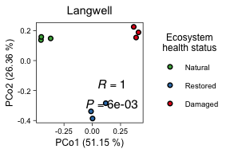
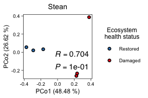
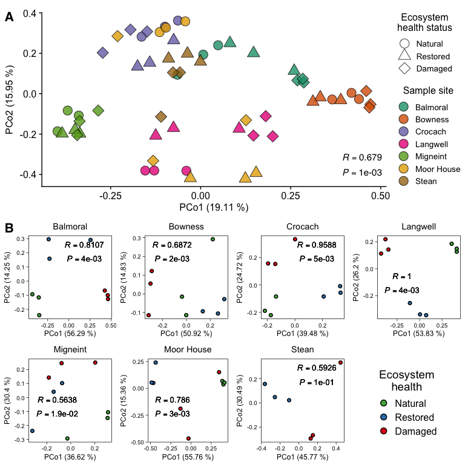

Peatland Map and Virus/Host Diversity
================
James C. Kosmopoulos
2024-11-18

# Map

# Load packages

``` r
library("tidyverse");packageVersion("tidyverse")
```

    ## [1] '2.0.0'

``` r
library("maps");packageVersion("maps")
```

    ## [1] '3.4.2'

``` r
library("mapdata");packageVersion("mapdata")
```

    ## [1] '2.3.1'

``` r
library("sf");packageVersion("sf")
```

    ## [1] '1.0.16'

``` r
library("ggrepel");packageVersion("ggrepel")
```

    ## [1] '0.9.5'

# Load and format data

*NOTE:* The shapefile and associated data for Scottish peatlands will
have to be manually obtained from [ArcGIS
Hub](https://hub.arcgis.com/datasets/snh::carbon-and-peatland-2016-map/about)
since the files are too large to be stored in this repository.

``` r
# Get the map data for the UK
uk_map <- map_data("worldHires") %>%
  filter(subregion == "Great Britain" | subregion == "Scotland")

# Load the shapefiles for England and Wales
england_peatlands <- st_read("../Data/Peaty_Soils_Location_(England)___BGS_&_NSRI.shp") # Source: https://hub.arcgis.com/datasets/Defra::peaty-soils-location-england/about
```

    ## Reading layer `Peaty_Soils_Location_(England)___BGS_&_NSRI' from data source 
    ##   `/Users/kosmopoulos/Library/CloudStorage/Dropbox/RESEARCH/AnantharamanLab/Peatlands/manuscript/UKPeatlandViruses/Data/Peaty_Soils_Location_(England)___BGS_&_NSRI.shp' 
    ##   using driver `ESRI Shapefile'
    ## Simple feature collection with 9028 features and 4 fields
    ## Geometry type: POLYGON
    ## Dimension:     XY
    ## Bounding box:  xmin: -714420.5 ymin: 6422876 xmax: 192373.5 ymax: 7505817
    ## Projected CRS: WGS 84 / Pseudo-Mercator

``` r
wales_peatlands <- st_read("../Data/Unified_peat_map_for_Wales.shp") # Source: https://hub.arcgis.com/datasets/theriverstrust::unified-peat-map-for-wales/about
```

    ## Reading layer `Unified_peat_map_for_Wales' from data source 
    ##   `/Users/kosmopoulos/Library/CloudStorage/Dropbox/RESEARCH/AnantharamanLab/Peatlands/manuscript/UKPeatlandViruses/Data/Unified_peat_map_for_Wales.shp' 
    ##   using driver `ESRI Shapefile'
    ## Simple feature collection with 1 feature and 1 field
    ## Geometry type: MULTIPOLYGON
    ## Dimension:     XYZ
    ## Bounding box:  xmin: 172224 ymin: 174931 xmax: 352114.7 ymax: 395060.9
    ## z_range:       zmin: 0 zmax: 0
    ## Projected CRS: OSGB36 / British National Grid

``` r
# The shapefile and associated data for 
scotland_peatlands <- st_read("../Data/CARBONPEATLANDMAP_SCOTLAND.shp") # Source: https://hub.arcgis.com/datasets/snh::carbon-and-peatland-2016-map/about
```

    ## Reading layer `CARBONPEATLANDMAP_SCOTLAND' from data source 
    ##   `/Users/kosmopoulos/Library/CloudStorage/Dropbox/RESEARCH/AnantharamanLab/Peatlands/manuscript/UKPeatlandViruses/Data/CARBONPEATLANDMAP_SCOTLAND.shp' 
    ##   using driver `ESRI Shapefile'
    ## Simple feature collection with 439659 features and 47 fields
    ## Geometry type: MULTIPOLYGON
    ## Dimension:     XY
    ## Bounding box:  xmin: 54296.34 ymin: 530257.3 xmax: 469820.9 ymax: 1219755
    ## Projected CRS: OSGB36 / British National Grid

``` r
scotland_peatlands <- scotland_peatlands %>%
  filter(grepl("peat", COMPSOIL) | grepl("Peat", COMPSOIL)) # Only peat areas
```

## Ensure all data are in the same coordinate system

``` r
england_peatlands <- st_transform(england_peatlands, crs = st_crs(4326))
wales_peatlands <- st_transform(wales_peatlands, crs = st_crs(4326))
scotland_peatlands <- st_transform(scotland_peatlands, crs = st_crs(4326))
```

## Create a data frame for the labels

``` r
labels <- data.frame(
  name = c("Balmoral", "Bowness", "Crocach", "Langwell", "Migneint", "Moor House", "Stean"),
  lat = c(56.92341, 54.93297, 58.39304, 58.19629, 52.99565, 54.69166, 54.1308),
  lon = c(-3.15831, -3.23945, -4.00182, -3.61489, -3.81652, -2.38228, -1.95015)
)
```

## Plot the map

``` r
peat_soil_map <- ggplot() +
  geom_polygon(data = uk_map, aes(x = long, y = lat, group = group), fill = "grey90", color = "black") +
  geom_sf(data = england_peatlands, fill = "#4f3a2b", color = NA, alpha = 1) +
  geom_sf(data = wales_peatlands, fill = "#4f3a2b", color = NA, alpha = 1) +
  geom_sf(data = scotland_peatlands, fill = "#4f3a2b", color = NA, alpha = 1) +
  coord_sf(xlim = c(-8, 2), ylim = c(50, 60.75)) +
  theme_void() +
  geom_point(data = labels,
             aes(x = lon, y = lat),
             color = "#E41A1C",
             size = 2) +
  geom_text_repel(data = labels,
                  aes(x = lon, y = lat, label = name),
                  fontface = "bold",
                  size = 4,
                  color = "white",
                  bg.color = "black",
                  bg.r = .15,
                  box.padding = 0.5,
                  segment.color = "#E41A1C",
                  force = 4
                  )
peat_soil_map
```

<!-- -->

## Save the plot

``` r
ggsave(filename = "../Plots/map/sample_sites.png", plot = peat_soil_map, device = "png", dpi = 600, height = 6, width = 4, units = "in")
```

# Diversity

# Load packages

``` r
library("tidyverse");packageVersion("tidyverse")
```

    ## [1] '2.0.0'

``` r
library("vegan");packageVersion("vegan")
```

    ## [1] '2.6.6.1'

``` r
library("ape");packageVersion("ape")
```

    ## [1] '5.8'

``` r
library("RColorBrewer");packageVersion("RColorBrewer")
```

    ## [1] '1.1.3'

``` r
library("cowplot");packageVersion("cowplot")
```

    ## [1] '1.1.3'

# Load data

``` r
tmeans <- readRDS("../Data/virus_tmeans_norm_50.RDS")
metadata <- readRDS("../Data/metadata_simple.RDS") %>%
  mutate(treatment = factor(treatment, levels = c("NAT", "REST", "DAM")))
```

# PCoA

## Plot everything, together

### Standardize (transform) data and create a dissimilarity matrix

``` r
tmeans.xform <- decostand(tmeans, method="hellinger")
bray_curtis_dist <- as.matrix(vegdist(t(tmeans.xform), method='bray'))
saveRDS(bray_curtis_dist, file="../Data/bray_curtis_hellinger.RDS")
```

### Perform pcoa

``` r
pcoa <- pcoa(as.dist(bray_curtis_dist))
```

### Store pcoa data

``` r
axes <- as.data.frame(pcoa$vectors) # make a dataframe named axes, put pcoa values in there
axes$SampleID <- rownames(axes) # Give df extra column with the rownames in it 
axes <- merge(metadata[,c("site", "treatment")] %>% mutate("SampleID" = row.names(.)), axes, by.x = "SampleID", by.y = "SampleID")
saveRDS(axes, "../Data/pcoa_axes_all.RDS")
head(axes)
```

    ##   SampleID     site treatment      Axis.1     Axis.2      Axis.3      Axis.4
    ## 1    BAr1A Balmoral       NAT  0.04371291 0.18451482 -0.15041196 -0.14188699
    ## 2    BAr1B Balmoral       NAT  0.12509204 0.11290333 -0.01355911 -0.15777814
    ## 3    BAr1C Balmoral       NAT  0.07573731 0.19005565 -0.11998814 -0.21585861
    ## 4    BAr2D Balmoral      REST -0.13431734 0.04146957 -0.37359144 -0.11933176
    ## 5    BAr2E Balmoral      REST  0.04361772 0.20493269 -0.24637683 -0.09453819
    ## 6    BAr2F Balmoral      REST -0.01345630 0.22568096 -0.14002827 -0.10427358
    ##        Axis.5      Axis.6      Axis.7    Axis.8       Axis.9     Axis.10
    ## 1  0.17930176 -0.27422853 -0.16270742 0.1506712 -0.083531388 -0.01741684
    ## 2  0.08750215 -0.26348402 -0.13622059 0.1192593 -0.072239697 -0.08836205
    ## 3  0.15009436 -0.22669522 -0.15673278 0.1647575 -0.081488979  0.04767164
    ## 4 -0.21928546 -0.05865147 -0.05571750 0.2322950  0.004340442  0.07247052
    ## 5  0.02036570 -0.26455556  0.01657082 0.2524575  0.129795748  0.02370932
    ## 6  0.02440819 -0.30726213  0.02259120 0.2153167  0.174130616  0.02700788
    ##       Axis.11      Axis.12     Axis.13      Axis.14     Axis.15      Axis.16
    ## 1 -0.07970216 -0.006995791 -0.02977212 -0.037376238  0.08308013  0.003988271
    ## 2 -0.08606747 -0.086003320 -0.03242512  0.007773963  0.10183265  0.075755229
    ## 3 -0.05267126 -0.008056003 -0.07316804 -0.060725469  0.14480213  0.019016484
    ## 4  0.04285946  0.345525916  0.12403993  0.073697912 -0.29784021 -0.016792225
    ## 5  0.04270235  0.108899426  0.07984357  0.051718115  0.04049609 -0.009429673
    ## 6 -0.02372285 -0.027027357  0.06725828 -0.004395857  0.08271041 -0.040900098
    ##       Axis.17     Axis.18     Axis.19       Axis.20     Axis.21     Axis.22
    ## 1 -0.03216564 -0.16324649  0.08465762 -0.0068267120 -0.04042638 -0.07969833
    ## 2 -0.03883213  0.16077022  0.07672093  0.0254287442 -0.05590251 -0.03878547
    ## 3  0.02586843  0.08929712  0.03795676 -0.0005975661  0.04626828 -0.08112790
    ## 4 -0.06706394  0.10049403  0.01198987 -0.0058887834  0.01551224 -0.06821224
    ## 5  0.02741909 -0.12657876 -0.10257384  0.0503800013 -0.04834024  0.05031351
    ## 6  0.07406061  0.02707200 -0.04833647 -0.0081383012  0.04315971  0.17952346
    ##       Axis.23      Axis.24      Axis.25      Axis.26     Axis.27      Axis.28
    ## 1  0.12950413  0.020617968 -0.032350973  0.001942465  0.01320123  0.032602023
    ## 2 -0.04011368 -0.020087404 -0.114651283 -0.047960509  0.01674630 -0.054326088
    ## 3 -0.06728402  0.100373789  0.052373883  0.048048969 -0.04345406 -0.023326743
    ## 4 -0.03354708  0.002727829 -0.042840452  0.011460466 -0.04220243  0.009140842
    ## 5  0.14059425 -0.056550981  0.060615369  0.024545785  0.03072022 -0.036982487
    ## 6 -0.15036182 -0.057598660 -0.006948497 -0.055291145  0.01773650  0.043159798
    ##        Axis.29     Axis.30      Axis.31      Axis.32      Axis.33      Axis.34
    ## 1 -0.012354882  0.09837892  0.005756206  0.012704326  0.011119693  0.005186470
    ## 2  0.005393969 -0.01549636  0.001696600 -0.013203056 -0.027501378  0.020463425
    ## 3  0.004533032 -0.06933277 -0.002872125 -0.035424842  0.033153819 -0.027958968
    ## 4  0.018518788  0.01174181  0.014842334  0.005151433  0.019619237  0.013042629
    ## 5  0.037333566 -0.06989838 -0.006975531 -0.008079250 -0.003547636 -0.012384896
    ## 6 -0.025391940  0.06694167  0.009577004  0.039489003  0.002762926  0.008085522
    ##       Axis.35     Axis.36       Axis.37      Axis.38      Axis.39       Axis.40
    ## 1  0.06442921  0.03593387 -0.0054641075 -0.028595867 -0.013354243 -0.0006417938
    ## 2  0.00269502 -0.01467149 -0.0252231703  0.056399092  0.045264506 -0.0122797069
    ## 3 -0.04671876 -0.02520317  0.0200877910 -0.039508019 -0.031974340  0.0164844462
    ## 4  0.01779616  0.00235429  0.0046779737 -0.006763775 -0.002362349 -0.0043962271
    ## 5 -0.05116890 -0.01189664 -0.0205591433  0.041270282  0.028118243  0.0046402707
    ## 6 -0.00189501  0.01716017 -0.0004045092 -0.016176052 -0.023983319  0.0112602535
    ##        Axis.41      Axis.42      Axis.43       Axis.44       Axis.45
    ## 1  0.006366143 -0.010157815 -0.007973550 -0.0005049305 -0.0178187451
    ## 2 -0.007705516 -0.025383289  0.004064383 -0.0102446672 -0.0001679119
    ## 3  0.009387638  0.031296552  0.007248152  0.0123023517  0.0054766495
    ## 4  0.002785043 -0.004936833 -0.002236385 -0.0029488926 -0.0039309033
    ## 5 -0.006978819  0.008751067  0.011992370  0.0055605738  0.0027827288
    ## 6  0.013757721  0.001111148 -0.007627011 -0.0013453058  0.0068464548
    ##         Axis.46      Axis.47      Axis.48       Axis.49      Axis.50
    ## 1  1.147908e-03  0.005528662  0.002071864  0.0075505494 -0.001247303
    ## 2  3.114218e-03  0.006133357 -0.009123581 -0.0035482684 -0.001227902
    ## 3 -4.697283e-03 -0.008263843  0.007690408 -0.0006555739 -0.001976656
    ## 4  4.445503e-04  0.004245735  0.001356511 -0.0007139325  0.002607341
    ## 5 -1.391903e-03 -0.004851907 -0.003577446  0.0018178344  0.003150204
    ## 6 -3.249358e-05  0.002211507 -0.002461927 -0.0017083288 -0.004435184
    ##         Axis.51       Axis.52       Axis.53
    ## 1 -2.769627e-03 -0.0007203044  0.0019571448
    ## 2  1.294089e-03  0.0024104025 -0.0061216137
    ## 3  2.541265e-03 -0.0040200257  0.0059884359
    ## 4  1.144068e-03 -0.0009344757 -0.0010763477
    ## 5 -4.274404e-05 -0.0001837958  0.0017608138
    ## 6 -1.400982e-03  0.0008185965 -0.0006090748

#### Store eigenvalues

``` r
eigval <- round(pcoa$values$Relative_eig * 100, digits = 2) # calculate the eigenvalues for each pcoa axes 
eigval <- data.frame(PC = 1:length(eigval), Eigval = eigval)
head(eigval) # see top eigenvalues
```

    ##   PC Eigval
    ## 1  1  16.96
    ## 2  2  13.72
    ## 3  3   9.37
    ## 4  4   8.49
    ## 5  5   8.20
    ## 6  6   5.49

``` r
eigval[[1,2]] # see first axes percentage
```

    ## [1] 16.96

``` r
eigval[[2,2]] # second axes
```

    ## [1] 13.72

``` r
eigval[[3,2]] # third axes
```

    ## [1] 9.37

``` r
eigval[[4,2]] # fourth axes
```

    ## [1] 8.49

#### Run ANOSIM on matrix to plot with PCoA

An R-value close to 1 means that the dissimilarities between groups are
much greater than the dissimilarities within groups, suggesting strong
differences between the groups.

``` r
anosim_result <- anosim(bray_curtis_dist, metadata$site)
r_statistic <- anosim_result$statistic
p_value <- anosim_result$signif
summary(anosim_result)
```

    ## 
    ## Call:
    ## anosim(x = bray_curtis_dist, grouping = metadata$site) 
    ## Dissimilarity: user supplied square matrix 
    ## 
    ## ANOSIM statistic R: 0.6557 
    ##       Significance: 0.001 
    ## 
    ## Permutation: free
    ## Number of permutations: 999
    ## 
    ## Upper quantiles of permutations (null model):
    ##    90%    95%  97.5%    99% 
    ## 0.0420 0.0555 0.0719 0.0828 
    ## 
    ## Dissimilarity ranks between and within classes:
    ##            0%    25%   50%     75%   100%    N
    ## Between     2 565.50 964.0 1359.50 1769.5 1539
    ## Balmoral    9 156.25 950.5 1495.75 1640.0   36
    ## Bowness     6  63.75  89.5  149.50  267.0   36
    ## Crocach    10  56.00 123.5  157.50  255.0   36
    ## Langwell    1 148.25 291.5  491.75 1205.0   36
    ## Migneint    8  62.75  98.5  138.25  223.0   36
    ## Moor_House 12 142.00 697.5 1547.00 1658.0   36
    ## Stean       7  65.50 160.0  219.50  528.0   15

Moderately high R-value (0.656) and low p-value (0.001): There is a
moderately high and statistically significant separation between sample
sites. This separation suggests that the groups defined by sample site
are meaningfully different in terms of their Bray-Curtis
dissimilarities.

#### Plot PCoA: treatment and site

``` r
plot.pcoa <- ggplot(axes, aes(Axis.1, Axis.2)) +
  geom_point(aes(shape=as.character(treatment),
                 fill=as.character(site)),
             color = "black",
             size = 4,
             alpha=0.8,
             stroke=0.5) +
  xlab(paste("PCo1 (", eigval$Eigval[1], " %)", sep = "")) +
  ylab(paste("PCo2 (", eigval$Eigval[2], " %)", sep = "")) +
  annotate("text", x = Inf, y = -Inf, 
           label = bquote(atop(italic(R) == .(round(r_statistic, 3)), italic(P) == .(format(p_value, scientific = TRUE)))), 
           hjust = 1.1, vjust = -0.5, size = 4) +
  scale_shape_manual(name = "Ecosystem\nhealth",
                     #values=c(16,17,18),
                     values=c(21,24,23),
                     breaks = c("NAT", "REST", "DAM"),
                     labels=c("Natural", "Restored", "Damaged")) +
  scale_fill_brewer(name = "Sample site",
                    palette = "Dark2",
                    labels=c("Balmoral", "Bowness", "Crocach",
                             "Langwell", "Migneint", "Moor House",
                             "Stean")) +
  guides(fill = guide_legend(title.position = "top",
                             title.hjust = 0.5,
                             override.aes = list(shape = 21, color = "black")),
         shape = guide_legend(title.position = "top",
                              title.hjust = 0.5)) +
  theme_linedraw() +
  theme(text = element_text(size = 12),
        panel.grid.major = element_blank(),
        panel.grid.minor = element_blank(),
        legend.position = "right")
ggsave("../Plots/diversity/pcoa_all_site_treat.png", plot.pcoa, device="png", dpi=600, width=5, height=4, units="in")
plot.pcoa
```

<!-- -->

## Plot PCoA for for each site, separately

### Define a function that will plot PCoA for each site, separately

``` r
# Function to calculate the sum of distances from a candidate position to all points
total_distance_to_points <- function(x, y, points) {
  dists <- sqrt((points$Axis.1 - x)^2 + (points$Axis.2 - y)^2)
  return(sum(dists))
}

# Function to dynamically position the annotation
find_best_annotation_position <- function(points) {
  # Define candidate positions (bottom-left, bottom-right, top-left, top-right)
  candidate_positions <- data.frame(
    x = c(min(points$Axis.1), max(points$Axis.1), min(points$Axis.1), max(points$Axis.1)),
    y = c(min(points$Axis.2), min(points$Axis.2), max(points$Axis.2), max(points$Axis.2)),
    hjust = c(-0.1, 1.1, -0.1, 1.1),
    vjust = c(-1.1, -1.1, 1.1, 1.1)
  )
  
  # Calculate the total distance from each candidate position to all points
  distances <- apply(candidate_positions, 1, function(pos) {
    total_distance_to_points(pos["x"], pos["y"], points)
  })
  
  # Select the candidate position with the maximum total distance to all points
  best_position <- candidate_positions[which.max(distances), ]
  
  return(best_position)
}

pcoa_plot_by_site <- function(metadata, tmeans) {
  plots <- list()
  
  for(site in unique(metadata$site)) {
    # Filter data for the specific site
    site_metadata <- metadata[metadata$site == site, , drop = FALSE]
    site_tmeans <- tmeans[, colnames(tmeans) %in% rownames(site_metadata), drop = FALSE]

    # Standardize (transform) data and create a dissimilarity matrix
    tmeans_xform <- decostand(site_tmeans, method = "hellinger")
    bray_curtis_dist <- as.matrix(vegdist(t(tmeans_xform), method = 'bray'))
    
    # Perform pcoa
    pcoa <- pcoa(as.dist(bray_curtis_dist))
    
    # Store pcoa data
    axes <- as.data.frame(pcoa$vectors)
    axes$SampleID <- rownames(axes)
    axes <- merge(site_metadata[, c("site", "treatment")] %>% mutate(SampleID = row.names(.)), axes, by = "SampleID")
    
    # Save the axes data for the current site
    saveRDS(axes, paste0("../Data/pcoa_axes_", site, ".RDS"))
    
    # Store eigenvalues
    eigval <- round(pcoa$values$Relative_eig * 100, digits = 2)
    eigval <- data.frame(PC = 1:length(eigval), Eigval = eigval)
    
    # Perform ANOSIM using treatment as the grouping variable
    anosim_result <- anosim(bray_curtis_dist, site_metadata$treatment)
    r_statistic <- anosim_result$statistic
    p_value <- anosim_result$signif
    
    # Find the best position for the annotation
    best_position <- find_best_annotation_position(axes)
    
    # Plot PCoA: treatment and site
    plot.pcoa <- ggplot(axes, aes(Axis.1, Axis.2)) +
      geom_point(aes(fill = as.character(treatment)), size = 1.5, stroke = 0.75, color="black", shape=21) +
      xlab(paste("PCo1 (", eigval$Eigval[1], " %)", sep = "")) +
      ylab(paste("PCo2 (", eigval$Eigval[2], " %)", sep = "")) +
      annotate("text", x = best_position$x,
               y = best_position$y, 
               label = bquote(atop(italic(R) == .(round(r_statistic, 4)), italic(P) == .(format(p_value, scientific = TRUE)))), 
               hjust = best_position$hjust,
               vjust = best_position$vjust, 
               size = 2.5,
               lineheight = 0.5) +
      scale_fill_manual(values = c("NAT" = "#4DAF4A", "REST" = "#377EB8", "DAM" = "#E41A1C"), name = "Ecosystem\nhealth", breaks = c("NAT", "REST", "DAM"), labels = c("Natural", "Restored", "Damaged")) +
      guides(fill = guide_legend(title.position = "top", title.hjust = 0.5)) +
      theme_linedraw() +
      ggtitle(ifelse(site == "Moor_House", "Moor House", site)) + # Change title for "Moor_House"
      theme(text = element_text(size = 9),
            panel.grid.major = element_blank(),
            panel.grid.minor = element_blank(),
            legend.position = "right",
            plot.title = element_text(hjust = 0.5))
    
    # Print or save the plot as needed
    ggsave(paste0("../Plots/diversity/pcoa_", site, "_treat.png"), plot.pcoa, device="png", dpi=600, width=3, height=3, units="in")
    
    plots[[site]] <- plot.pcoa
  }
  return(plots)
}

# Usage:
# pcoa_plot_by_site(metadata, tmeans)
```

### Call the function and make plots

``` r
pcoa_list <- pcoa_plot_by_site(metadata, tmeans)
pcoa_list
```

    ## $Balmoral

<!-- -->

    ## 
    ## $Bowness

<!-- -->

    ## 
    ## $Crocach

<!-- -->

    ## 
    ## $Langwell

<!-- -->

    ## 
    ## $Migneint

<!-- -->

    ## 
    ## $Moor_House

<!-- -->

    ## 
    ## $Stean

<!-- -->

### Combine into one plot with cowplot

``` r
legend_plot <- cowplot::get_legend(pcoa_list[[1]] + theme(legend.title = element_text(size = 14), legend.text = element_text(size = 12), legend.title.align=0.5) + guides(fill = guide_legend(override.aes = list(size=3))))
for(name in names(pcoa_list)){
  pcoa_list[[name]] <- pcoa_list[[name]] + theme(legend.position = "none")
}
combined_pcoa_plots <- cowplot::plot_grid(plotlist = c(pcoa_list, list(legend_plot)), nrow = 2)
combined_pcoa_plots
```

<!-- -->

``` r
ggsave("../Plots/diversity/pcoa_treat.png", combined_pcoa_plots, device="png", dpi=600, width=7.08661, height=3.5, units="in", bg = "white")
```

# Combine map and virus PCoA plots

## First combine the map and all sites PCoA

``` r
combined_map_pcoa_all <- cowplot::plot_grid(peat_soil_map, plot.pcoa,
                                           ncol = 2,
                                           rel_widths = c(6, 13),
                                           labels = c("A", "B"),
                                           label_fontface = "bold",
                                           label_fontfamily = "sans",
                                           label_size = 16)
combined_map_pcoa_all
```

<!-- -->

## Then combine with the per-site PCoA

``` r
combined_map_pcoas <- cowplot::plot_grid(combined_map_pcoa_all, combined_pcoa_plots,
                                           nrow = 2,
                                           rel_heights = c(8, 9),
                                           labels = c("", "C"),
                                           label_fontface = "bold",
                                           label_fontfamily = "sans",
                                           label_size = 16)
combined_map_pcoas
```

<!-- -->

``` r
ggsave("../Plots/diversity/Fig1.png",
       combined_map_pcoas,
       device = "png",
       dpi = 600,
       width = 8, height = 8, units="in",
       bg = "white")
```

# Is virus community composition influenced by host community composition?

## Create host dissimilarity matrix

``` r
tmeans.host <- readRDS("../Data/host_tmeans_norm_50.RDS")
tmeans.xform.host <- decostand(tmeans.host, method="hellinger")
bray_curtis_dist_host <- as.matrix(vegdist(t(tmeans.xform.host), method='bray'))
saveRDS(bray_curtis_dist_host, file="../Data/bray_curtis_hellinger_host.RDS")
```

## Perform PCoA on hosts for all sites

``` r
pcoa_host <- pcoa(as.dist(bray_curtis_dist_host))
axes_host <- as.data.frame(pcoa_host$vectors) # make a dataframe named axes, put pcoa values in there
axes_host$SampleID <- rownames(axes_host) # Give df extra column with the rownames in it 
axes_host <- merge(metadata[,c("site", "treatment")] %>% mutate("SampleID" = row.names(.)), axes_host, by.x = "SampleID", by.y = "SampleID")
saveRDS(axes_host, "../Data/pcoa_axes_host_all.RDS")
head(axes_host)
```

    ##   SampleID     site treatment      Axis.1     Axis.2      Axis.3      Axis.4
    ## 1    BAr1A Balmoral       NAT  0.00714021 0.19355679  0.03395340 -0.02008537
    ## 2    BAr1B Balmoral       NAT -0.06449806 0.09369297  0.07084953  0.12658267
    ## 3    BAr1C Balmoral       NAT  0.04846473 0.23972982 -0.02410970  0.14795764
    ## 4    BAr2D Balmoral      REST  0.25972327 0.11279392 -0.46710777 -0.05547807
    ## 5    BAr2E Balmoral      REST  0.08127189 0.25017064 -0.11889848 -0.05774070
    ## 6    BAr2F Balmoral      REST  0.14689434 0.20037918 -0.09665265  0.08878230
    ##        Axis.5      Axis.6      Axis.7     Axis.8      Axis.9    Axis.10
    ## 1 -0.24377214 -0.07974512 -0.28298318 0.07283297 -0.09220161 0.07270307
    ## 2 -0.12319931 -0.04640611 -0.33764358 0.17997989 -0.02816323 0.01362414
    ## 3 -0.15841780 -0.05731493 -0.26067745 0.15369331 -0.01895733 0.01262902
    ## 4  0.03802455 -0.03680643 -0.02814462 0.06629549  0.10296676 0.07863998
    ## 5 -0.07651190  0.07815563 -0.15524992 0.22795266  0.24202655 0.01913468
    ## 6 -0.05837722  0.09058111 -0.21171203 0.20171691  0.10107206 0.01381487
    ##         Axis.11     Axis.12     Axis.13      Axis.14      Axis.15     Axis.16
    ## 1 -0.0334713418 -0.03284145  0.10891264  0.141932529  0.037391349 -0.09770782
    ## 2 -0.0263130105  0.05395438 -0.04374575 -0.001971325  0.010498722 -0.03171775
    ## 3 -0.1111182969 -0.04872180 -0.07970736 -0.031134996 -0.036294063 -0.13096290
    ## 4 -0.2064603309  0.05090192  0.00115690 -0.057051710  0.045295448  0.24462804
    ## 5 -0.0009566301  0.03223264 -0.14724674  0.097918438  0.034403086  0.11474346
    ## 6  0.1029012401  0.05827115 -0.12333002 -0.069325726  0.008018201 -0.02461296
    ##       Axis.17      Axis.18      Axis.19      Axis.20      Axis.21      Axis.22
    ## 1  0.15883405 -0.125645152  0.075435835 -0.058707648  0.021870327 -0.005877874
    ## 2 -0.08887027  0.050282616 -0.003827812 -0.026196073 -0.042415166  0.039722307
    ## 3  0.01445609  0.007506588  0.031591228 -0.057463820 -0.047986023  0.087194720
    ## 4 -0.05252606 -0.113989353 -0.000333256 -0.005688488 -0.005276882  0.103761249
    ## 5  0.07737974 -0.033259210  0.034921192  0.050332493  0.053466774 -0.132959282
    ## 6 -0.04110163  0.127909737 -0.126728530 -0.055660071  0.006485771 -0.027834752
    ##        Axis.23     Axis.24     Axis.25     Axis.26      Axis.27      Axis.28
    ## 1  0.011732110 -0.01136539 -0.01993049  0.06105822  0.012930952 -0.019398242
    ## 2 -0.056442688  0.04906887 -0.01634432 -0.06450418 -0.037937994 -0.050432080
    ## 3 -0.040248419 -0.08144293  0.00476655 -0.04863892 -0.003588618  0.044081716
    ## 4  0.015162096 -0.02684365 -0.02127863  0.05438575  0.002363089  0.004331242
    ## 5 -0.005940074  0.04885685  0.07763683 -0.04262406 -0.007070534  0.026588942
    ## 6  0.055534598  0.03497519 -0.05900434  0.08320018  0.055978594 -0.042871168
    ##        Axis.29      Axis.30       Axis.31      Axis.32       Axis.33
    ## 1  0.025634809  0.001612813  0.0028650594  0.007873355 -0.0007179483
    ## 2 -0.004302576  0.034538033 -0.0525276132 -0.056038923 -0.0253776470
    ## 3 -0.028995594 -0.023080758 -0.0086232059  0.046505664  0.0163437997
    ## 4 -0.008259591 -0.013581617 -0.0004644215  0.012090954  0.0100080087
    ## 5  0.033672542 -0.003881859 -0.0094171795 -0.018134883  0.0027380671
    ## 6 -0.015764527 -0.005694897  0.0373460107  0.034602338  0.0147316051
    ##        Axis.34       Axis.35      Axis.36      Axis.37      Axis.38
    ## 1 -0.001335208 -2.733529e-02  0.009094454  0.048057076  0.002934483
    ## 2 -0.002435833  2.549721e-02 -0.010108227  0.015898827 -0.005158872
    ## 3  0.011012970 -7.314123e-06 -0.006024906 -0.041529754  0.009523529
    ## 4 -0.009522320  2.070399e-02 -0.012858099  0.008510080  0.017388586
    ## 5 -0.005061732 -2.300049e-03 -0.004622964 -0.025546923 -0.015372878
    ## 6 -0.005723615 -9.403158e-03  0.014615222  0.007695665 -0.009362747
    ##        Axis.39       Axis.40       Axis.41      Axis.42       Axis.43
    ## 1 -0.004852738  0.0095684896  0.0021512303  0.002025272  0.0025205953
    ## 2 -0.009225441 -0.0183235528  0.0014409822 -0.003022627 -0.0039672423
    ## 3  0.008146081  0.0008684416  0.0015595129 -0.010632307 -0.0006707481
    ## 4  0.002844365  0.0012303142 -0.0008063377  0.001979308 -0.0041501992
    ## 5  0.007587850 -0.0090242957  0.0002141975  0.001419993  0.0040379679
    ## 6 -0.006978365  0.0111371787 -0.0052932605  0.001882011 -0.0005719896
    ##         Axis.44       Axis.45      Axis.46
    ## 1 -0.0008516797  0.0080775905  0.002225515
    ## 2 -0.0012063246  0.0059283471 -0.006508267
    ## 3  0.0028003178 -0.0072268099  0.006224829
    ## 4 -0.0005039340  0.0009647050 -0.003618141
    ## 5  0.0014378406 -0.0009912762  0.004272346
    ## 6  0.0003206199  0.0030580837  0.001951821

### Store eigenvalues

``` r
eigval_host <- round(pcoa_host$values$Relative_eig * 100, digits = 2)
eigval_host <- data.frame(PC = 1:length(eigval_host), Eigval = eigval_host)
```

## ANOSIM for hosts

``` r
anosim_result_hosts <- anosim(bray_curtis_dist_host, metadata$site)
r_statistic_host <- anosim_result_hosts$statistic
p_value_host <- anosim_result_hosts$signif
summary(anosim_result_hosts)
```

    ## 
    ## Call:
    ## anosim(x = bray_curtis_dist_host, grouping = metadata$site) 
    ## Dissimilarity: user supplied square matrix 
    ## 
    ## ANOSIM statistic R: 0.6785 
    ##       Significance: 0.001 
    ## 
    ## Permutation: free
    ## Number of permutations: 999
    ## 
    ## Upper quantiles of permutations (null model):
    ##    90%    95%  97.5%    99% 
    ## 0.0447 0.0604 0.0690 0.0812 
    ## 
    ## Dissimilarity ranks between and within classes:
    ##            0%    25%   50%     75% 100%    N
    ## Between     2 569.50 969.0 1368.00 1770 1539
    ## Balmoral    7 161.50 615.5 1233.00 1663   36
    ## Bowness     6  46.75  75.5  120.50  268   36
    ## Crocach    18  60.75 122.5  162.50  210   36
    ## Langwell    1 141.75 307.5  698.25 1336   36
    ## Migneint   12  77.25 106.5  157.25  439   36
    ## Moor_House 10 206.25 552.5 1543.25 1640   36
    ## Stean      15 106.00 138.0  236.50  663   15

## Plot PCoA for hosts

``` r
plot.pcoa.host <- ggplot(axes_host, aes(Axis.1, Axis.2)) +
  geom_point(aes(shape=as.character(treatment),
                 fill=as.character(site)),
             color = "black",
             size = 4,
             alpha=0.8,
             stroke=0.5) +
  xlab(paste("PCo1 (", eigval_host$Eigval[1], " %)", sep = "")) +
  ylab(paste("PCo2 (", eigval_host$Eigval[2], " %)", sep = "")) +
  annotate("text", x = Inf, y = -Inf, 
           label = bquote(atop(italic(R) == .(round(r_statistic_host, 3)), italic(P) == .(format(p_value_host, scientific = TRUE)))), 
           hjust = 1.1, vjust = -0.5, size = 4) +
  scale_shape_manual(name = "Ecosystem\nhealth",
                     #values=c(16,17,18),
                     values=c(21,24,23),
                     breaks = c("NAT", "REST", "DAM"),
                     labels=c("Natural", "Restored", "Damaged")) +
  scale_fill_brewer(name = "Sample site",
                    palette = "Dark2",
                    labels=c("Balmoral", "Bowness", "Crocach",
                             "Langwell", "Migneint", "Moor House",
                             "Stean")) +
  guides(fill = guide_legend(title.position = "top",
                             title.hjust = 0.5,
                             override.aes = list(shape = 21, color = "black")),
         shape = guide_legend(title.position = "top",
                              title.hjust = 0.5)) +
  theme_linedraw() +
  theme(text = element_text(size = 12),
        panel.grid.major = element_blank(),
        panel.grid.minor = element_blank(),
        legend.position = "right")
ggsave("../Plots/diversity/pcoa_host_all_site_treat.png", plot.pcoa, device="png", dpi=600, width=5, height=4, units="in")
plot.pcoa.host
```

<!-- -->

## Run PERMANOVA

``` r
permanova_reduced <- adonis2(bray_curtis_dist ~ Axis.1 + Axis.2 + Axis.3 + Axis.4 + treatment * site, data = axes_host, method = "bray")
write.csv(permanova_reduced, file = "../Tables/virus_host_bray_permanova.csv", row.names = TRUE)
permanova_reduced
```

    ## Permutation test for adonis under reduced model
    ## Terms added sequentially (first to last)
    ## Permutation: free
    ## Number of permutations: 999
    ## 
    ## adonis2(formula = bray_curtis_dist ~ Axis.1 + Axis.2 + Axis.3 + Axis.4 + treatment * site, data = axes_host, method = "bray")
    ##                Df SumOfSqs      R2       F Pr(>F)    
    ## Axis.1          1   3.3072 0.16104 50.0990  0.001 ***
    ## Axis.2          1   2.7684 0.13481 41.9377  0.001 ***
    ## Axis.3          1   1.8758 0.09134 28.4149  0.001 ***
    ## Axis.4          1   1.8025 0.08777 27.3054  0.001 ***
    ## treatment       2   0.9826 0.04785  7.4424  0.001 ***
    ## site            6   3.9558 0.19262  9.9874  0.001 ***
    ## treatment:site 11   3.4679 0.16886  4.7757  0.001 ***
    ## Residual       36   2.3765 0.11572                   
    ## Total          59  20.5366 1.00000                   
    ## ---
    ## Signif. codes:  0 '***' 0.001 '**' 0.01 '*' 0.05 '.' 0.1 ' ' 1

## Adjust p-values

``` r
p_values <- c(permanova_reduced$`Pr(>F)`)
p_values_bh <- p.adjust(p_values, method = "BH")
p_values_bh
```

    ## [1] 0.001 0.001 0.001 0.001 0.001 0.001 0.001    NA    NA

## Variance partitioning

``` r
# Host composition matrix
host_matrix <- axes_host[, c("Axis.1", "Axis.2", "Axis.3", "Axis.4")]

# Site matrix
site_matrix <- model.matrix(~ site - 1, data = axes_host)

# Treatment matrix
treatment_matrix <- model.matrix(~ treatment - 1, data = axes_host)

# Perform variance partitioning with separate and interaction terms
varpart_result <- varpart(
  Y = bray_curtis_dist,            # Response matrix (virus composition)
  X = host_matrix,                 # Explanatory set 1: Host composition
  X1 = site_matrix,                # Explanatory set 2: Site
  X2 = treatment_matrix           # Explanatory set 3: Treatment
)
write.csv(rbind(varpart_result[["part"]]$fract %>% mutate(Fraction = "basic fractions"),
                varpart_result[["part"]]$indfract %>% mutate(Fraction = "individual fractions"),
                varpart_result[["part"]]$contr1 %>% mutate(Fraction = "controlled")),
          file = "../Tables/virus_host_bray_varpart.csv", row.names = TRUE)
varpart_result
```

    ## 
    ## Partition of squared Unknown user-supplied distance in dbRDA 
    ## 
    ## Call: varpart(Y = bray_curtis_dist, X = host_matrix, X1 = site_matrix,
    ## X2 = treatment_matrix)
    ## 
    ## Explanatory tables:
    ## X1:  host_matrix
    ## X2:  site_matrix
    ## X3:  treatment_matrix 
    ## 
    ## No. of explanatory tables: 3 
    ## Total variation (SS): 20.537 
    ## No. of observations: 60 
    ## 
    ## Partition table:
    ##                       Df R.square Adj.R.square Testable
    ## [a+d+f+g] = X1         4  0.47495      0.43677     TRUE
    ## [b+d+e+g] = X2         6  0.46757      0.40730     TRUE
    ## [c+e+f+g] = X3         2  0.06724      0.03451     TRUE
    ## [a+b+d+e+f+g] = X1+X2 10  0.67981      0.61447     TRUE
    ## [a+c+d+e+f+g] = X1+X3  6  0.52280      0.46877     TRUE
    ## [b+c+d+e+f+g] = X2+X3  8  0.53024      0.45655     TRUE
    ## [a+b+c+d+e+f+g] = All 12  0.71542      0.64276     TRUE
    ## Individual fractions                                   
    ## [a] = X1 | X2+X3       4               0.18621     TRUE
    ## [b] = X2 | X1+X3       6               0.17398     TRUE
    ## [c] = X3 | X1+X2       2               0.02829     TRUE
    ## [d]                    0               0.24805    FALSE
    ## [e]                    0               0.00372    FALSE
    ## [f]                    0               0.02096    FALSE
    ## [g]                    0              -0.01846    FALSE
    ## [h] = Residuals                        0.35724    FALSE
    ## Controlling 1 table X                                  
    ## [a+d] = X1 | X3        4               0.43426     TRUE
    ## [a+f] = X1 | X2        4               0.20717     TRUE
    ## [b+d] = X2 | X3        6               0.42204     TRUE
    ## [b+e] = X2 | X1        6               0.17770     TRUE
    ## [c+e] = X3 | X1        2               0.03201     TRUE
    ## [c+f] = X3 | X2        2               0.04925     TRUE
    ## ---
    ## Use function 'dbrda' to test significance of fractions of interest

## Test significance of the unique contributions

``` r
# Replace row names of host_matrix, site_matrix, and treatment_matrix
rownames(host_matrix) <- rownames(bray_curtis_dist)
rownames(site_matrix) <- rownames(bray_curtis_dist)
rownames(treatment_matrix) <- rownames(bray_curtis_dist)
all(rownames(bray_curtis_dist) == rownames(host_matrix))
```

    ## [1] TRUE

``` r
all(rownames(bray_curtis_dist) == rownames(site_matrix))
```

    ## [1] TRUE

``` r
all(rownames(bray_curtis_dist) == rownames(treatment_matrix))
```

    ## [1] TRUE

``` r
# Convert any factors to characters
axes_host_clean <- data.frame(lapply(axes_host, function(x) if (is.factor(x)) as.character(x) else x))

# Ensure the row names are correctly set
rownames(axes_host_clean) <- rownames(axes_host)
```

``` r
site_matrix <- model.matrix(~ site - 1, data = axes_host)
treatment_matrix <- model.matrix(~ treatment - 1, data = axes_host)
combined_data <- cbind(axes_host, site_matrix, treatment_matrix)

# Run dbRDA for site
dbrda_site <- dbrda(bray_curtis_dist ~ site + Condition(treatment + Axis.1 + Axis.2 + Axis.3 + Axis.4), data = combined_data)
anova(dbrda_site, by = "terms")
```

    ## Permutation test for dbrda under reduced model
    ## Terms added sequentially (first to last)
    ## Permutation: free
    ## Number of permutations: 999
    ## 
    ## Model: dbrda(formula = bray_curtis_dist ~ site + Condition(treatment + Axis.1 + Axis.2 + Axis.3 + Axis.4), data = combined_data)
    ##          Df SumOfSqs     F Pr(>F)    
    ## site      6   3.9558 5.302  0.001 ***
    ## Residual 47   5.8443                 
    ## ---
    ## Signif. codes:  0 '***' 0.001 '**' 0.01 '*' 0.05 '.' 0.1 ' ' 1

``` r
# Run dbRDA for treatment
dbrda_treatment <- dbrda(bray_curtis_dist ~ treatment + Condition(site + Axis.1 + Axis.2 + Axis.3 + Axis.4), data = combined_data)
anova(dbrda_treatment, by = "terms")
```

    ## Permutation test for dbrda under reduced model
    ## Terms added sequentially (first to last)
    ## Permutation: free
    ## Number of permutations: 999
    ## 
    ## Model: dbrda(formula = bray_curtis_dist ~ treatment + Condition(site + Axis.1 + Axis.2 + Axis.3 + Axis.4), data = combined_data)
    ##           Df SumOfSqs      F Pr(>F)    
    ## treatment  2   0.7312 2.9402  0.001 ***
    ## Residual  47   5.8443                  
    ## ---
    ## Signif. codes:  0 '***' 0.001 '**' 0.01 '*' 0.05 '.' 0.1 ' ' 1

``` r
# Run dbRDA for host community axes (if Axis.1, Axis.2, etc. represent host community)
dbrda_host <- dbrda(bray_curtis_dist ~ Axis.1 + Axis.2 + Axis.3 + Axis.4 + Condition(site + treatment), data = combined_data)
anova(dbrda_host, by = "terms")
```

    ## Permutation test for dbrda under reduced model
    ## Terms added sequentially (first to last)
    ## Permutation: free
    ## Number of permutations: 999
    ## 
    ## Model: dbrda(formula = bray_curtis_dist ~ Axis.1 + Axis.2 + Axis.3 + Axis.4 + Condition(site + treatment), data = combined_data)
    ##          Df SumOfSqs       F Pr(>F)    
    ## Axis.1    1   0.8786  7.0658  0.001 ***
    ## Axis.2    1   1.4362 11.5496  0.001 ***
    ## Axis.3    1   1.1801  9.4899  0.001 ***
    ## Axis.4    1   0.3081  2.4781  0.005 ** 
    ## Residual 47   5.8443                   
    ## ---
    ## Signif. codes:  0 '***' 0.001 '**' 0.01 '*' 0.05 '.' 0.1 ' ' 1

# Run the PCoA/PERMANOVA/VarPart/dbra analysis for each site

## Define a function that will plot PCoA for each site, separately, for hosts

``` r
pcoa_plot_by_site_hosts <- function(metadata, tmeans) {
  plots <- list()
  
  for(site in unique(metadata$site)) {
    # Filter data for the specific site
    site_metadata <- metadata[metadata$site == site, , drop = FALSE]
    site_tmeans <- tmeans[, colnames(tmeans) %in% rownames(site_metadata), drop = FALSE]

    # Standardize (transform) data and create a dissimilarity matrix
    tmeans_xform <- decostand(site_tmeans, method = "hellinger")
    bray_curtis_dist <- as.matrix(vegdist(t(tmeans_xform), method = 'bray'))
    
    # Perform pcoa
    pcoa <- pcoa(as.dist(bray_curtis_dist))
    
    # Store pcoa data
    axes <- as.data.frame(pcoa$vectors)
    axes$SampleID <- rownames(axes)
    axes <- merge(site_metadata[, c("site", "treatment")] %>% mutate(SampleID = row.names(.)), axes, by = "SampleID")
    
    # Save the axes data for the current site
    saveRDS(axes, paste0("../Data/pcoa_axes_host_", site, ".RDS"))
    
    # Store eigenvalues
    eigval <- round(pcoa$values$Relative_eig * 100, digits = 2)
    eigval <- data.frame(PC = 1:length(eigval), Eigval = eigval)
    
    # Perform ANOSIM using treatment as the grouping variable
    anosim_result <- anosim(bray_curtis_dist, site_metadata$treatment)
    r_statistic <- anosim_result$statistic
    p_value <- anosim_result$signif
    
    # Find the best position for the annotation
    best_position <- find_best_annotation_position(axes)
    
    # Plot PCoA: treatment and site
    plot.pcoa <- ggplot(axes, aes(Axis.1, Axis.2)) +
      geom_point(aes(fill = as.character(treatment)), size = 1.5, stroke = 0.75, color="black", shape=21) +
      xlab(paste("PCo1 (", eigval$Eigval[1], " %)", sep = "")) +
      ylab(paste("PCo2 (", eigval$Eigval[2], " %)", sep = "")) +
      annotate("text", x = best_position$x,
               y = best_position$y, 
               label = bquote(atop(italic(R) == .(round(r_statistic, 4)), italic(P) == .(format(p_value, scientific = TRUE)))), 
               hjust = best_position$hjust,
               vjust = best_position$vjust, 
               size = 3.5,
               lineheight = 0.5) +
      scale_fill_manual(values = c("NAT" = "#4DAF4A", "REST" = "#377EB8", "DAM" = "#E41A1C"), name = "Ecosystem\nhealth", breaks = c("NAT", "REST", "DAM"), labels = c("Natural", "Restored", "Damaged")) +
      guides(fill = guide_legend(title.position = "top", title.hjust = 0.5)) +
      theme_linedraw() +
      ggtitle(ifelse(site == "Moor_House", "Moor House", site)) + # Change title for "Moor_House"
      theme(text = element_text(size = 9),
            panel.grid.major = element_blank(),
            panel.grid.minor = element_blank(),
            legend.position = "right",
            plot.title = element_text(hjust = 0.5))
    
    # Print or save the plot as needed
    ggsave(paste0("../Plots/diversity/pcoa_host_", site, "_treat.png"), plot.pcoa, device="png", dpi=600, width=3, height=3, units="in")
    
    plots[[site]] <- plot.pcoa
  }
  return(plots)
}

# Usage:
# pcoa_plot_by_site_hosts(metadata, tmeans)
```

## Host PCoA for each site

``` r
pcoa_list_hosts <- pcoa_plot_by_site_hosts(metadata, tmeans.host)
pcoa_list_hosts
```

    ## $Balmoral

<!-- -->

    ## 
    ## $Bowness

<!-- -->

    ## 
    ## $Crocach

<!-- -->

    ## 
    ## $Langwell

<!-- -->

    ## 
    ## $Migneint

<!-- -->

    ## 
    ## $Moor_House

<!-- -->

    ## 
    ## $Stean

<!-- -->

## Combine into one plot with cowplot

``` r
legend_plot_hosts <- cowplot::get_legend(pcoa_list_hosts[[1]] + theme(legend.title = element_text(size = 14), legend.text = element_text(size = 12), legend.title.align=0.5) + guides(fill = guide_legend(override.aes = list(size=3))))
for(name in names(pcoa_list_hosts)){
  pcoa_list_hosts[[name]] <- pcoa_list_hosts[[name]] + theme(legend.position = "none")
}
combined_pcoa_plots_host <- cowplot::plot_grid(plotlist = c(pcoa_list_hosts, list(legend_plot_hosts)), nrow = 2)
combined_pcoa_plots_host
```

<!-- -->

``` r
ggsave("../Plots/diversity/pcoa_treat_hosts.png", combined_pcoa_plots_host, device="png", dpi=600, width=7.08661, height=3.5, units="in", bg = "white")
```

## Combine each pcoa plot

``` r
combined_pcoas_host <- cowplot::plot_grid(
   ggplot() + cowplot::theme_cowplot(),
   plot.pcoa.host,
   combined_pcoa_plots_host,
   nrow = 3,
   rel_heights = c(0.2, 6, 7),
   labels = c("", "A", "B"),
   label_fontface = "bold",
   label_fontfamily = "sans",
   label_size = 16)
combined_pcoas_host
```

<!-- -->

``` r
ggsave("../Plots/diversity/FigS1",
       combined_pcoas_host,
       device="png",
       dpi=600,
       width=8, height=8, units="in",
       bg = "white")
```

``` r
# Load virus and host PCoA axes and metadata for each site
virus_pcoa_files <- list(
    Balmoral = "../Data/pcoa_axes_Balmoral.RDS",
    Bowness = "../Data/pcoa_axes_Bowness.RDS",
    Crocach = "../Data/pcoa_axes_Crocach.RDS",
    Langwell = "../Data/pcoa_axes_Langwell.RDS",
    Migneint = "../Data/pcoa_axes_Migneint.RDS",
    Moor_House = "../Data/pcoa_axes_Moor_House.RDS"#,
    #Stean = "../Data/pcoa_axes_Stean.RDS"
)

host_pcoa_files <- list(
    Balmoral = "../Data/pcoa_axes_host_Balmoral.RDS",
    Bowness = "../Data/pcoa_axes_host_Bowness.RDS",
    Crocach = "../Data/pcoa_axes_host_Crocach.RDS",
    Langwell = "../Data/pcoa_axes_host_Langwell.RDS",
    Migneint = "../Data/pcoa_axes_host_Migneint.RDS",
    Moor_House = "../Data/pcoa_axes_host_Moor_House.RDS"#,
    #Stean = "../Data/pcoa_axes_host_Stean.RDS"
)
# Function to perform PCoA, PERMANOVA, variance partitioning, and dbRDA for each site
analyze_site_data <- function(metadata, virus_pcoa_files, host_pcoa_files) {
  
  results <- list()
  
  for (site in names(virus_pcoa_files)) {
    # Load virus and host PCoA axes
    axes_virus <- readRDS(virus_pcoa_files[[site]])
    axes_host <- readRDS(host_pcoa_files[[site]])
    
    # Extract the corresponding metadata for the site
    site_metadata <- metadata[metadata$site == site, , drop = FALSE]
    site_metadata <- cbind(site_metadata[, 1:3], site_metadata[, 5:length(colnames(site_metadata))])
    
    # Ensure the SampleID order matches between metadata and PCoA axes
    axes_virus <- axes_virus[match(site_metadata$SampleID, axes_virus$SampleID), ] 
    axes_host <- axes_host[match(site_metadata$SampleID, axes_host$SampleID), ]
    
    axes_virus_matrix <- as.matrix(axes_virus[, grepl("Axis", names(axes_virus))])
    rownames(axes_virus_matrix) <- axes_virus$SampleID
    axes_host_matrix <- as.matrix(axes_host[, grepl("Axis", names(axes_host))])
    rownames(axes_host_matrix) <- axes_host$SampleID
    
    # Recalculate Bray-Curtis distance for virus
    bray_curtis_dist_virus <- as.matrix(vegdist(axes_virus_matrix, method = 'bray', diag = TRUE))
    
    # Perform PERMANOVA
    permanova_result <- adonis2(bray_curtis_dist_virus ~ Axis.1 + Axis.2 + treatment, data = axes_virus, method = "bray")
    
    # Adjust p-values using BH method
    p_values <- c(permanova_result$`Pr(>F)`)
    p_values_bh <- p.adjust(p_values, method = "BH")
    
    # Variance partitioning using host PCoA axes
    host_matrix <- as.matrix(axes_host_matrix[, c("Axis.1", "Axis.2")])
    treatment_matrix <- model.matrix(~ treatment - 1, data = axes_virus)
    
    varpart_result <- varpart(
      Y = as.matrix(bray_curtis_dist_virus),
      X = axes_host_matrix,
      X1 = treatment_matrix
    )
    
    # Combine the necessary data into one dataframe
    combined_data <- cbind(axes_virus[, grepl("Axis", names(axes_virus))], treatment_matrix)
    combined_data <- combined_data %>%
      mutate(treatment = case_when(
        treatmentNAT == 1 & treatmentREST == 0 & treatmentDAM == 0 ~ "DAM",
        treatmentNAT == 0 & treatmentREST == 1 & treatmentDAM == 0 ~ "REST",
        treatmentNAT == 0 & treatmentREST == 0 & treatmentDAM == 1 ~ "DAM"
      )) %>%
      select(-treatmentNAT, -treatmentREST, -treatmentDAM)
    rownames(combined_data) <- axes_virus$SampleID
    
    # Replace row names of host_matrix, and treatment_matrix
    rownames(host_matrix) <- rownames(bray_curtis_dist_virus)
    rownames(treatment_matrix) <- rownames(bray_curtis_dist_virus)
    
    # Run dbRDA for treatment
    dbrda_treatment <- dbrda(bray_curtis_dist_virus ~ treatment + Axis.1 + Axis.2, data = combined_data)
    anova_treatment <- anova(dbrda_treatment, by = "terms")
    
    # Run dbRDA for host community axes
    dbrda_host <- dbrda(bray_curtis_dist_virus ~ Axis.1 + Axis.2 + Condition(treatment), data = combined_data)
    anova_host <- anova(dbrda_host, by = "terms")
    
    # Store the results
    results[[site]] <- list(
      PERMANOVA = permanova_result,
      Adjusted_p_values_BH = p_values_bh,
      Variance_Partitioning = varpart_result,
      dbRDA_Treatment = anova_treatment,
      dbRDA_Host = anova_host
    )
    
    print(paste("Results for", site, "completed."))
  }
  
  return(results)
}

# Usage:
# results_pcoa_stats <- analyze_site_data(metadata, virus_pcoa_files, host_pcoa_files)
```

``` r
results_pcoa_stats <- analyze_site_data(metadata, virus_pcoa_files, host_pcoa_files)
```

    ## [1] "Results for Balmoral completed."

    ## [1] "Results for Bowness completed."

    ## [1] "Results for Crocach completed."

    ## [1] "Results for Langwell completed."

    ## [1] "Results for Migneint completed."

    ## [1] "Results for Moor_House completed."

``` r
results_pcoa_stats
```

    ## $Balmoral
    ## $Balmoral$PERMANOVA
    ## Permutation test for adonis under reduced model
    ## Terms added sequentially (first to last)
    ## Permutation: free
    ## Number of permutations: 999
    ## 
    ## adonis2(formula = bray_curtis_dist_virus ~ Axis.1 + Axis.2 + treatment, data = axes_virus, method = "bray")
    ##           Df SumOfSqs      R2       F Pr(>F)  
    ## Axis.1     1   184.77 0.13595 12.2435  0.082 .
    ## Axis.2     1   137.23 0.10097  9.0934  0.098 .
    ## treatment  2   976.75 0.71867 32.3616  0.019 *
    ## Residual   4    60.36 0.04441                 
    ## Total      8  1359.11 1.00000                 
    ## ---
    ## Signif. codes:  0 '***' 0.001 '**' 0.01 '*' 0.05 '.' 0.1 ' ' 1
    ## 
    ## $Balmoral$Adjusted_p_values_BH
    ## [1] 0.098 0.098 0.057    NA    NA
    ## 
    ## $Balmoral$Variance_Partitioning
    ## 
    ## Partition of squared Unknown user-supplied distance in dbRDA 
    ## 
    ## Call: varpart(Y = as.matrix(bray_curtis_dist_virus), X =
    ## axes_host_matrix, X1 = treatment_matrix)
    ## 
    ## Explanatory tables:
    ## X1:  axes_host_matrix
    ## X2:  treatment_matrix 
    ## 
    ## No. of explanatory tables: 2 
    ## Total variation (SS): 1359.1 
    ## No. of observations: 9 
    ## 
    ## Partition table:
    ##                      Df R.squared Adj.R.squared Testable
    ## [a+c] = X1            8   1.00000                   TRUE
    ## [b+c] = X2            2   0.99981       0.99974     TRUE
    ## [a+b+c] = X1+X2       8   1.00000                   TRUE
    ## Individual fractions                                    
    ## [a] = X1|X2           6                             TRUE
    ## [b] = X2|X1           0                            FALSE
    ## [c]                   0                            FALSE
    ## [d] = Residuals                                    FALSE
    ## ---
    ## Use function 'dbrda' to test significance of fractions of interest

    ## 
    ## $Balmoral$dbRDA_Treatment
    ## Permutation test for dbrda under reduced model
    ## Terms added sequentially (first to last)
    ## Permutation: free
    ## Number of permutations: 999
    ## 
    ## Model: dbrda(formula = bray_curtis_dist_virus ~ treatment + Axis.1 + Axis.2, data = combined_data)
    ##           Df Variance       F Pr(>F)
    ## treatment  1   75.705  2.1681  0.325
    ## Axis.1     1  -11.395 -0.3263  0.417
    ## Axis.2     1  -69.011 -1.9764  0.591
    ## Residual   5  174.590               
    ## 
    ## $Balmoral$dbRDA_Host
    ## Permutation test for dbrda under reduced model
    ## Terms added sequentially (first to last)
    ## Permutation: free
    ## Number of permutations: 999
    ## 
    ## Model: dbrda(formula = bray_curtis_dist_virus ~ Axis.1 + Axis.2 + Condition(treatment), data = combined_data)
    ##          Df Variance       F Pr(>F)
    ## Axis.1    1  -11.395 -0.3263  0.353
    ## Axis.2    1  -69.011 -1.9764  0.606
    ## Residual  5  174.590               
    ## 
    ## 
    ## $Bowness
    ## $Bowness$PERMANOVA
    ## Permutation test for adonis under reduced model
    ## Terms added sequentially (first to last)
    ## Permutation: free
    ## Number of permutations: 999
    ## 
    ## adonis2(formula = bray_curtis_dist_virus ~ Axis.1 + Axis.2 + treatment, data = axes_virus, method = "bray")
    ##           Df SumOfSqs       R2       F Pr(>F)
    ## Axis.1     1   458.61  0.51368 -3.0901  0.742
    ## Axis.2     1   671.18  0.75178 -4.5225  0.775
    ## treatment  2   356.64  0.39946 -1.2015  0.553
    ## Residual   4  -593.64 -0.66493               
    ## Total      8   892.79  1.00000               
    ## 
    ## $Bowness$Adjusted_p_values_BH
    ## [1] 0.775 0.775 0.775    NA    NA
    ## 
    ## $Bowness$Variance_Partitioning
    ## 
    ## Partition of squared Unknown user-supplied distance in dbRDA 
    ## 
    ## Call: varpart(Y = as.matrix(bray_curtis_dist_virus), X =
    ## axes_host_matrix, X1 = treatment_matrix)
    ## 
    ## Explanatory tables:
    ## X1:  axes_host_matrix
    ## X2:  treatment_matrix 
    ## 
    ## No. of explanatory tables: 2 
    ## Total variation (SS): 892.79 
    ## No. of observations: 9 
    ## 
    ## Partition table:
    ##                      Df R.squared Adj.R.squared Testable
    ## [a+c] = X1            8   1.00000                   TRUE
    ## [b+c] = X2            2   0.98047       0.97396     TRUE
    ## [a+b+c] = X1+X2       8   1.00000                   TRUE
    ## Individual fractions                                    
    ## [a] = X1|X2           6                             TRUE
    ## [b] = X2|X1           0                            FALSE
    ## [c]                   0                            FALSE
    ## [d] = Residuals                                    FALSE
    ## ---
    ## Use function 'dbrda' to test significance of fractions of interest

    ## 
    ## $Bowness$dbRDA_Treatment
    ## Permutation test for dbrda under reduced model
    ## Terms added sequentially (first to last)
    ## Permutation: free
    ## Number of permutations: 999
    ## 
    ## Model: dbrda(formula = bray_curtis_dist_virus ~ treatment + Axis.1 + Axis.2, data = combined_data)
    ##           Df Variance       F Pr(>F)
    ## treatment  1  109.088 -7.6974  0.794
    ## Axis.1     1   -1.827  0.1289  0.494
    ## Axis.2     1   75.198 -5.3061  0.709
    ## Residual   5  -70.860               
    ## 
    ## $Bowness$dbRDA_Host
    ## Permutation test for dbrda under reduced model
    ## Terms added sequentially (first to last)
    ## Permutation: free
    ## Number of permutations: 999
    ## 
    ## Model: dbrda(formula = bray_curtis_dist_virus ~ Axis.1 + Axis.2 + Condition(treatment), data = combined_data)
    ##          Df Variance       F Pr(>F)
    ## Axis.1    1   -1.827  0.1289  0.345
    ## Axis.2    1   75.198 -5.3061  0.811
    ## Residual  5  -70.860               
    ## 
    ## 
    ## $Crocach
    ## $Crocach$PERMANOVA
    ## Permutation test for adonis under reduced model
    ## Terms added sequentially (first to last)
    ## Permutation: free
    ## Number of permutations: 999
    ## 
    ## adonis2(formula = bray_curtis_dist_virus ~ Axis.1 + Axis.2 + treatment, data = axes_virus, method = "bray")
    ##           Df SumOfSqs       R2       F Pr(>F)
    ## Axis.1     1   -53.64 -0.10150 -0.4738  0.513
    ## Axis.2     1  -412.65 -0.78080 -3.6445  0.821
    ## treatment  2   541.88  1.02533  2.3929  0.158
    ## Residual   4   452.90  0.85697               
    ## Total      8   528.49  1.00000               
    ## 
    ## $Crocach$Adjusted_p_values_BH
    ## [1] 0.7695 0.8210 0.4740     NA     NA
    ## 
    ## $Crocach$Variance_Partitioning
    ## 
    ## Partition of squared Unknown user-supplied distance in dbRDA 
    ## 
    ## Call: varpart(Y = as.matrix(bray_curtis_dist_virus), X =
    ## axes_host_matrix, X1 = treatment_matrix)
    ## 
    ## Explanatory tables:
    ## X1:  axes_host_matrix
    ## X2:  treatment_matrix 
    ## 
    ## No. of explanatory tables: 2 
    ## Total variation (SS): 528.49 
    ## No. of observations: 9 
    ## 
    ## Partition table:
    ##                      Df R.squared Adj.R.squared Testable
    ## [a+c] = X1            8   1.00000                   TRUE
    ## [b+c] = X2            2  -0.91468       -1.5529     TRUE
    ## [a+b+c] = X1+X2       8   1.00000                   TRUE
    ## Individual fractions                                    
    ## [a] = X1|X2           6                             TRUE
    ## [b] = X2|X1           0                            FALSE
    ## [c]                   0                            FALSE
    ## [d] = Residuals                                    FALSE
    ## ---
    ## Use function 'dbrda' to test significance of fractions of interest

    ## 
    ## $Crocach$dbRDA_Treatment
    ## Permutation test for dbrda under reduced model
    ## Terms added sequentially (first to last)
    ## Permutation: free
    ## Number of permutations: 999
    ## 
    ## Model: dbrda(formula = bray_curtis_dist_virus ~ treatment + Axis.1 + Axis.2, data = combined_data)
    ##           Df Variance       F Pr(>F)
    ## treatment  1  -17.896 -0.9763  0.566
    ## Axis.1     1   26.535  1.4477  0.210
    ## Axis.2     1  -34.227 -1.8673  0.714
    ## Residual   5   91.649               
    ## 
    ## $Crocach$dbRDA_Host
    ## Permutation test for dbrda under reduced model
    ## Terms added sequentially (first to last)
    ## Permutation: free
    ## Number of permutations: 999
    ## 
    ## Model: dbrda(formula = bray_curtis_dist_virus ~ Axis.1 + Axis.2 + Condition(treatment), data = combined_data)
    ##          Df Variance       F Pr(>F)
    ## Axis.1    1   26.535  1.4477  0.224
    ## Axis.2    1  -34.227 -1.8673  0.787
    ## Residual  5   91.649               
    ## 
    ## 
    ## $Langwell
    ## $Langwell$PERMANOVA
    ## Permutation test for adonis under reduced model
    ## Terms added sequentially (first to last)
    ## Permutation: free
    ## Number of permutations: 999
    ## 
    ## adonis2(formula = bray_curtis_dist_virus ~ Axis.1 + Axis.2 + treatment, data = axes_virus, method = "bray")
    ##           Df SumOfSqs       R2       F Pr(>F)
    ## Axis.1     1   233.28  0.53175 -2.8831  0.817
    ## Axis.2     1   315.83  0.71990 -3.9033  0.850
    ## treatment  2   213.25  0.48609 -1.3178  0.708
    ## Residual   4  -323.65 -0.73773               
    ## Total      8   438.71  1.00000               
    ## 
    ## $Langwell$Adjusted_p_values_BH
    ## [1] 0.85 0.85 0.85   NA   NA
    ## 
    ## $Langwell$Variance_Partitioning
    ## 
    ## Partition of squared Unknown user-supplied distance in dbRDA 
    ## 
    ## Call: varpart(Y = as.matrix(bray_curtis_dist_virus), X =
    ## axes_host_matrix, X1 = treatment_matrix)
    ## 
    ## Explanatory tables:
    ## X1:  axes_host_matrix
    ## X2:  treatment_matrix 
    ## 
    ## No. of explanatory tables: 2 
    ## Total variation (SS): 438.71 
    ## No. of observations: 9 
    ## 
    ## Partition table:
    ##                      Df R.squared Adj.R.squared Testable
    ## [a+c] = X1            8   1.00000                   TRUE
    ## [b+c] = X2            2   0.99871       0.99828     TRUE
    ## [a+b+c] = X1+X2       8   1.00000                   TRUE
    ## Individual fractions                                    
    ## [a] = X1|X2           6                             TRUE
    ## [b] = X2|X1           0                            FALSE
    ## [c]                   0                            FALSE
    ## [d] = Residuals                                    FALSE
    ## ---
    ## Use function 'dbrda' to test significance of fractions of interest

    ## 
    ## $Langwell$dbRDA_Treatment
    ## Permutation test for dbrda under reduced model
    ## Terms added sequentially (first to last)
    ## Permutation: free
    ## Number of permutations: 999
    ## 
    ## Model: dbrda(formula = bray_curtis_dist_virus ~ treatment + Axis.1 + Axis.2, data = combined_data)
    ##           Df Variance       F Pr(>F)
    ## treatment  1   36.447 -8.9688  0.931
    ## Axis.1     1   28.551 -7.0257  0.910
    ## Axis.2     1   10.160 -2.5001  0.774
    ## Residual   5  -20.319               
    ## 
    ## $Langwell$dbRDA_Host
    ## Permutation test for dbrda under reduced model
    ## Terms added sequentially (first to last)
    ## Permutation: free
    ## Number of permutations: 999
    ## 
    ## Model: dbrda(formula = bray_curtis_dist_virus ~ Axis.1 + Axis.2 + Condition(treatment), data = combined_data)
    ##          Df Variance       F Pr(>F)
    ## Axis.1    1   28.551 -7.0257  0.829
    ## Axis.2    1   10.160 -2.5001  0.667
    ## Residual  5  -20.319               
    ## 
    ## 
    ## $Migneint
    ## $Migneint$PERMANOVA
    ## Permutation test for adonis under reduced model
    ## Terms added sequentially (first to last)
    ## Permutation: free
    ## Number of permutations: 999
    ## 
    ## adonis2(formula = bray_curtis_dist_virus ~ Axis.1 + Axis.2 + treatment, data = axes_virus, method = "bray")
    ##           Df SumOfSqs       R2       F Pr(>F)
    ## Axis.1     1   152.69  0.32345  1.0446  0.356
    ## Axis.2     1  -248.61 -0.52664 -1.7008  0.746
    ## treatment  2   -16.70 -0.03538 -0.0571  0.280
    ## Residual   4   584.69  1.23857               
    ## Total      8   472.07  1.00000               
    ## 
    ## $Migneint$Adjusted_p_values_BH
    ## [1] 0.534 0.746 0.534    NA    NA
    ## 
    ## $Migneint$Variance_Partitioning
    ## 
    ## Partition of squared Unknown user-supplied distance in dbRDA 
    ## 
    ## Call: varpart(Y = as.matrix(bray_curtis_dist_virus), X =
    ## axes_host_matrix, X1 = treatment_matrix)
    ## 
    ## Explanatory tables:
    ## X1:  axes_host_matrix
    ## X2:  treatment_matrix 
    ## 
    ## No. of explanatory tables: 2 
    ## Total variation (SS): 472.07 
    ## No. of observations: 9 
    ## 
    ## Partition table:
    ##                      Df R.squared Adj.R.squared Testable
    ## [a+c] = X1            8   1.00000                   TRUE
    ## [b+c] = X2            2   0.92432        0.8991     TRUE
    ## [a+b+c] = X1+X2       8   1.00000                   TRUE
    ## Individual fractions                                    
    ## [a] = X1|X2           6                             TRUE
    ## [b] = X2|X1           0                            FALSE
    ## [c]                   0                            FALSE
    ## [d] = Residuals                                    FALSE
    ## ---
    ## Use function 'dbrda' to test significance of fractions of interest

    ## 
    ## $Migneint$dbRDA_Treatment
    ## Permutation test for dbrda under reduced model
    ## Terms added sequentially (first to last)
    ## Permutation: free
    ## Number of permutations: 999
    ## 
    ## Model: dbrda(formula = bray_curtis_dist_virus ~ treatment + Axis.1 + Axis.2, data = combined_data)
    ##           Df Variance       F Pr(>F)
    ## treatment  1  -27.781 -1.8741  0.622
    ## Axis.1     1   43.127  2.9094  0.130
    ## Axis.2     1  -30.455 -2.0545  0.446
    ## Residual   5   74.117               
    ## 
    ## $Migneint$dbRDA_Host
    ## Permutation test for dbrda under reduced model
    ## Terms added sequentially (first to last)
    ## Permutation: free
    ## Number of permutations: 999
    ## 
    ## Model: dbrda(formula = bray_curtis_dist_virus ~ Axis.1 + Axis.2 + Condition(treatment), data = combined_data)
    ##          Df Variance       F Pr(>F)
    ## Axis.1    1   43.127  2.9094  0.221
    ## Axis.2    1  -30.455 -2.0545  0.696
    ## Residual  5   74.117               
    ## 
    ## 
    ## $Moor_House
    ## $Moor_House$PERMANOVA
    ## Permutation test for adonis under reduced model
    ## Terms added sequentially (first to last)
    ## Permutation: free
    ## Number of permutations: 999
    ## 
    ## adonis2(formula = bray_curtis_dist_virus ~ Axis.1 + Axis.2 + treatment, data = axes_virus, method = "bray")
    ##           Df SumOfSqs       R2       F Pr(>F)
    ## Axis.1     1  136.142  0.93317 17.4611  0.119
    ## Axis.2     1   14.005  0.09600  1.7962  0.328
    ## treatment  2  -35.443 -0.24294 -2.2729  0.822
    ## Residual   4   31.188  0.21377               
    ## Total      8  145.892  1.00000               
    ## 
    ## $Moor_House$Adjusted_p_values_BH
    ## [1] 0.357 0.492 0.822    NA    NA
    ## 
    ## $Moor_House$Variance_Partitioning
    ## 
    ## Partition of squared Unknown user-supplied distance in dbRDA 
    ## 
    ## Call: varpart(Y = as.matrix(bray_curtis_dist_virus), X =
    ## axes_host_matrix, X1 = treatment_matrix)
    ## 
    ## Explanatory tables:
    ## X1:  axes_host_matrix
    ## X2:  treatment_matrix 
    ## 
    ## No. of explanatory tables: 2 
    ## Total variation (SS): 145.89 
    ## No. of observations: 9 
    ## 
    ## Partition table:
    ##                      Df R.squared Adj.R.squared Testable
    ## [a+c] = X1            8   1.00000                   TRUE
    ## [b+c] = X2            2   0.74682       0.66242     TRUE
    ## [a+b+c] = X1+X2       8   1.00000                   TRUE
    ## Individual fractions                                    
    ## [a] = X1|X2           6                             TRUE
    ## [b] = X2|X1           0                            FALSE
    ## [c]                   0                            FALSE
    ## [d] = Residuals                                    FALSE
    ## ---
    ## Use function 'dbrda' to test significance of fractions of interest

    ## 
    ## $Moor_House$dbRDA_Treatment
    ## Permutation test for dbrda under reduced model
    ## Terms added sequentially (first to last)
    ## Permutation: free
    ## Number of permutations: 999
    ## 
    ## Model: dbrda(formula = bray_curtis_dist_virus ~ treatment + Axis.1 + Axis.2, data = combined_data)
    ##           Df Variance       F Pr(>F)  
    ## treatment  1  11.7451 24.1381  0.065 .
    ## Axis.1     1   6.4937 13.3457  0.113  
    ## Axis.2     1  -2.4353 -5.0049  0.809  
    ## Residual   5   2.4329                 
    ## ---
    ## Signif. codes:  0 '***' 0.001 '**' 0.01 '*' 0.05 '.' 0.1 ' ' 1
    ## 
    ## $Moor_House$dbRDA_Host
    ## Permutation test for dbrda under reduced model
    ## Terms added sequentially (first to last)
    ## Permutation: free
    ## Number of permutations: 999
    ## 
    ## Model: dbrda(formula = bray_curtis_dist_virus ~ Axis.1 + Axis.2 + Condition(treatment), data = combined_data)
    ##          Df Variance       F Pr(>F)  
    ## Axis.1    1   6.4937 13.3457  0.054 .
    ## Axis.2    1  -2.4353 -5.0049  0.792  
    ## Residual  5   2.4329                 
    ## ---
    ## Signif. codes:  0 '***' 0.001 '**' 0.01 '*' 0.05 '.' 0.1 ' ' 1
