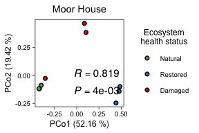
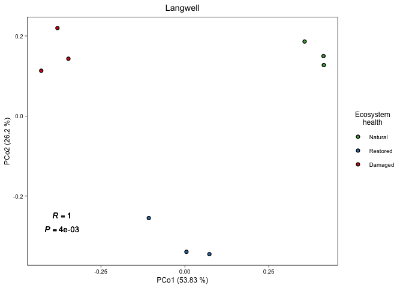

Peatland Sampling Map and Virus/Host Diversity
================
James C. Kosmopoulos
2025-08-05

# Map

# Load packages

``` r
library("tidyverse");packageVersion("tidyverse")
```

    ## [1] '2.0.0'

``` r
library("maps");packageVersion("maps")
```

    ## [1] '3.4.2'

``` r
library("mapdata");packageVersion("mapdata")
```

    ## [1] '2.3.1'

``` r
library("sf");packageVersion("sf")
```

    ## [1] '1.0.19'

``` r
library("ggrepel");packageVersion("ggrepel")
```

    ## [1] '0.9.5'

# Load and format data

*NOTE:* The shapefile and associated data for Scottish peatlands will
have to be manually obtained from [ArcGIS
Hub](https://hub.arcgis.com/datasets/snh::carbon-and-peatland-2016-map/about)
since the files are too large to be stored in this repository.

``` r
# Get the map data for the UK
uk_map <- map_data("worldHires") %>%
  filter(subregion == "Great Britain" | subregion == "Scotland")

# Load the shapefiles for England and Wales
england_peatlands <- st_read("../Data/Peaty_Soils_Location_(England)___BGS_&_NSRI.shp") # Source: https://hub.arcgis.com/datasets/Defra::peaty-soils-location-england/about
```

    ## Reading layer `Peaty_Soils_Location_(England)___BGS_&_NSRI' from data source 
    ##   `/Users/kosmopoulos/Library/CloudStorage/Dropbox/Research/AnantharamanLab/Peatlands/manuscript/UKPeatlandViruses/Data/Peaty_Soils_Location_(England)___BGS_&_NSRI.shp' 
    ##   using driver `ESRI Shapefile'
    ## Simple feature collection with 9028 features and 4 fields
    ## Geometry type: POLYGON
    ## Dimension:     XY
    ## Bounding box:  xmin: -714420.5 ymin: 6422876 xmax: 192373.5 ymax: 7505817
    ## Projected CRS: WGS 84 / Pseudo-Mercator

``` r
wales_peatlands <- st_read("../Data/Unified_peat_map_for_Wales.shp") # Source: https://hub.arcgis.com/datasets/theriverstrust::unified-peat-map-for-wales/about
```

    ## Reading layer `Unified_peat_map_for_Wales' from data source 
    ##   `/Users/kosmopoulos/Library/CloudStorage/Dropbox/Research/AnantharamanLab/Peatlands/manuscript/UKPeatlandViruses/Data/Unified_peat_map_for_Wales.shp' 
    ##   using driver `ESRI Shapefile'
    ## Simple feature collection with 1 feature and 1 field
    ## Geometry type: MULTIPOLYGON
    ## Dimension:     XYZ
    ## Bounding box:  xmin: 172224 ymin: 174931 xmax: 352114.7 ymax: 395060.9
    ## z_range:       zmin: 0 zmax: 0
    ## Projected CRS: OSGB36 / British National Grid

``` r
# The shapefile and associated data for 
scotland_peatlands <- st_read("../Data/CARBONPEATLANDMAP_SCOTLAND.shp") # Source: https://hub.arcgis.com/datasets/snh::carbon-and-peatland-2016-map/about
```

    ## Reading layer `CARBONPEATLANDMAP_SCOTLAND' from data source 
    ##   `/Users/kosmopoulos/Library/CloudStorage/Dropbox/Research/AnantharamanLab/Peatlands/manuscript/UKPeatlandViruses/Data/CARBONPEATLANDMAP_SCOTLAND.shp' 
    ##   using driver `ESRI Shapefile'
    ## Simple feature collection with 439659 features and 47 fields
    ## Geometry type: MULTIPOLYGON
    ## Dimension:     XY
    ## Bounding box:  xmin: 54296.34 ymin: 530257.3 xmax: 469820.9 ymax: 1219755
    ## Projected CRS: OSGB36 / British National Grid

``` r
scotland_peatlands <- scotland_peatlands %>%
  filter(grepl("peat", COMPSOIL) | grepl("Peat", COMPSOIL) | grepl("peat", MSSG_NAME) | grepl("Peat", MSSG_NAME) | grepl("peat", SMU_NAME) | grepl("Peat", SMU_NAME)) # Only peat areas
```

## Ensure all data are in the same coordinate system

``` r
england_peatlands <- st_transform(england_peatlands, crs = st_crs(4326))
wales_peatlands <- st_transform(wales_peatlands, crs = st_crs(4326))
scotland_peatlands <- st_transform(scotland_peatlands, crs = st_crs(4326))
```

## Create a data frame for the labels

``` r
labels <- data.frame(
  name = c("Balmoral", "Bowness", "Crocach", "Langwell", "Migneint", "Moor House", "Stean"),
  lat = c(56.92341, 54.93297, 58.39304, 58.19629, 52.99565, 54.69166, 54.1308),
  lon = c(-3.15831, -3.23945, -4.00182, -3.61489, -3.81652, -2.38228, -1.95015)
)
```

## Plot the map

``` r
peat_soil_map <- ggplot() +
  # Base polygon (UK outline)
  geom_polygon(
    data = uk_map,
    aes(x = long, y = lat, group = group),
    fill = "grey90",
    color = "black",
    linewidth = 1
  ) +
  # Peatlands layers
  geom_sf(data = england_peatlands, fill = "#654321", color = NA, alpha = 1) +
  geom_sf(data = wales_peatlands, fill = "#654321", color = NA, alpha = 1) +
  geom_sf(data = scotland_peatlands, fill = "#654321", color = NA, alpha = 1) +
  # Expand the bounding box slightly to give label space
  coord_sf(xlim = c(-12, 4), ylim = c(50, 60.5)) +
  # Minimal theme
  theme_void() +
  # Points for each site
  geom_point(
    data = labels,
    aes(x = lon, y = lat),
    color = "#E41A1C",
    size = 4
  ) +
  # Repelled text labels
  geom_text_repel(
    data = labels,
    aes(x = lon, y = lat, label = name),
    fontface = "bold",
    size = 8,
    color = "white",
    bg.color = "black",
    bg.r = 0.125,
    # Increase the padding around labels and the points
    box.padding = unit(1.125, "lines"),
    # Control how strongly labels push away from each other & from points
    force = 2,
    # Color of the connecting segments
    segment.color = "#E41A1C"
  )

peat_soil_map
```

<!-- -->

## Add ecosystem health index variation

### Load and format the data

``` r
eco_index <- readRDS("../Data/env_data.RDS") %>%
  select(SampleID, site, treatment, index) %>%
  mutate(
    shape = case_when(
      treatment == "NAT" ~ 21,
      treatment == "REST" ~ 24,
      treatment == "DAM" ~ 23
    )
  ) %>%
  filter(!is.na(index))
eco_index_avg <- eco_index %>%
  select(site, treatment, shape, index) %>%
  group_by(site, treatment, shape) %>%
  summarise(avg_index = mean(index))

eco_plot_data <- eco_index_avg %>%
  left_join(labels %>% select(name, lon, lat), by = join_by(site == name))

top <- 58.5
bottom <- 50.5
label_positions <- tibble(
  site = c(
    "Crocach", "Langwell", "Balmoral", "Bowness", "Moor House", "Stean", "Migneint"
    ),
  label_x = -12.5,
  # label_y = c(59.0, 58.0, 57.0, 55.5, 54.5, 53.0, 52.0)
  label_y = c(
    bottom + (6/6)*(top-bottom),
    bottom + (5/6)*(top-bottom),
    bottom + (4/6)*(top-bottom),
    bottom + (3/6)*(top-bottom),
    bottom + (2/6)*(top-bottom),
    bottom + (1/6)*(top-bottom),
    bottom + (0/7)*(top-bottom))
)

treatment_offsets <- tibble(
  treatment = c("NAT","REST","DAM"),
  dx = c(1, 2.3, 3.6)
)
eco_index_avg <- eco_index_avg %>%
  mutate(site = gsub("_", " ", site))
eco_plot_data <- eco_index_avg %>%
  # filter(!is.na(avg_index)) %>%
  left_join(labels %>% select(site = name, lon, lat), by = "site") %>%
  left_join(label_positions, by = "site") %>%
  left_join(treatment_offsets, by = "treatment") %>%
  mutate(
    x_shape = label_x + dx,
    y_shape = label_y
  )
eco_plot_data
```

    ## # A tibble: 20 × 11
    ## # Groups:   site, treatment [20]
    ##    site      treatment shape avg_index   lon   lat label_x label_y    dx x_shape
    ##    <chr>     <chr>     <dbl>     <dbl> <dbl> <dbl>   <dbl>   <dbl> <dbl>   <dbl>
    ##  1 Balmoral  DAM          23   -1.03   -3.16  56.9   -12.5    55.8   3.6    -8.9
    ##  2 Balmoral  NAT          21   -0.368  -3.16  56.9   -12.5    55.8   1     -11.5
    ##  3 Balmoral  REST         24   -0.542  -3.16  56.9   -12.5    55.8   2.3   -10.2
    ##  4 Bowness   DAM          23   -0.648  -3.24  54.9   -12.5    54.5   3.6    -8.9
    ##  5 Bowness   NAT          21   -0.0130 -3.24  54.9   -12.5    54.5   1     -11.5
    ##  6 Bowness   REST         24    0.202  -3.24  54.9   -12.5    54.5   2.3   -10.2
    ##  7 Crocach   DAM          23    0.225  -4.00  58.4   -12.5    58.5   3.6    -8.9
    ##  8 Crocach   NAT          21    0.547  -4.00  58.4   -12.5    58.5   1     -11.5
    ##  9 Crocach   REST         24    0.181  -4.00  58.4   -12.5    58.5   2.3   -10.2
    ## 10 Langwell  DAM          23   -0.268  -3.61  58.2   -12.5    57.2   3.6    -8.9
    ## 11 Langwell  NAT          21    0.577  -3.61  58.2   -12.5    57.2   1     -11.5
    ## 12 Langwell  REST         24   -0.107  -3.61  58.2   -12.5    57.2   2.3   -10.2
    ## 13 Migneint  DAM          23    0.0450 -3.82  53.0   -12.5    50.5   3.6    -8.9
    ## 14 Migneint  NAT          21    1.07   -3.82  53.0   -12.5    50.5   1     -11.5
    ## 15 Migneint  REST         24    0.657  -3.82  53.0   -12.5    50.5   2.3   -10.2
    ## 16 Moor Hou… DAM          23   -0.169  -2.38  54.7   -12.5    53.2   3.6    -8.9
    ## 17 Moor Hou… NAT          21    0.285  -2.38  54.7   -12.5    53.2   1     -11.5
    ## 18 Moor Hou… REST         24   -0.135  -2.38  54.7   -12.5    53.2   2.3   -10.2
    ## 19 Stean     DAM          23   -0.771  -1.95  54.1   -12.5    51.8   3.6    -8.9
    ## 20 Stean     REST         24    0.178  -1.95  54.1   -12.5    51.8   2.3   -10.2
    ## # ℹ 1 more variable: y_shape <dbl>

``` r
segment_data <- eco_plot_data %>%
  group_by(site) %>%
  filter(dx == max(dx)) %>%
  ungroup()
segment_data
```

    ## # A tibble: 7 × 11
    ##   site       treatment shape avg_index   lon   lat label_x label_y    dx x_shape
    ##   <chr>      <chr>     <dbl>     <dbl> <dbl> <dbl>   <dbl>   <dbl> <dbl>   <dbl>
    ## 1 Balmoral   DAM          23   -1.03   -3.16  56.9   -12.5    55.8   3.6    -8.9
    ## 2 Bowness    DAM          23   -0.648  -3.24  54.9   -12.5    54.5   3.6    -8.9
    ## 3 Crocach    DAM          23    0.225  -4.00  58.4   -12.5    58.5   3.6    -8.9
    ## 4 Langwell   DAM          23   -0.268  -3.61  58.2   -12.5    57.2   3.6    -8.9
    ## 5 Migneint   DAM          23    0.0450 -3.82  53.0   -12.5    50.5   3.6    -8.9
    ## 6 Moor House DAM          23   -0.169  -2.38  54.7   -12.5    53.2   3.6    -8.9
    ## 7 Stean      DAM          23   -0.771  -1.95  54.1   -12.5    51.8   3.6    -8.9
    ## # ℹ 1 more variable: y_shape <dbl>

### Plot the map with ecosystem index

``` r
peat_soil_map_eco_index <-
  ggplot() +
  # Base polygon (UK outline)
  geom_polygon(
    data = uk_map,
    aes(x = long, y = lat, group = group),
    fill = "grey90", color = "black", linewidth = 0.5
  ) +
  # Peatlands layers
  geom_sf(
    data = england_peatlands,
    fill = "#7B3F00", color = NA, alpha = 1
    ) +
  geom_sf(
    data = wales_peatlands,
    fill = "#7B3F00", color = NA, alpha = 1
    ) +
  geom_sf(
    data = scotland_peatlands,
    fill = "#7B3F00", color = NA, alpha = 1
    ) +
  # Expand the bounding box slightly to give label space
  coord_sf(
    xlim = c(-20.25, 1.5),
    ylim = c(50.25, 59)
    ) +
  # Minimal theme
  theme_void() +
  # connector from shape back to real map point
  geom_segment(
    data = segment_data,
    aes(x = x_shape, y = y_shape, xend = lon, yend = lat),
    color = "black", size = 0.66
  ) +
  # Points for each site
  geom_point(
    data = labels,
    aes(x = lon, y = lat),
    color = "black", fill = "red", size = 3, shape = 21, stroke = 1
  ) +
  # draw the fan of 3 treatment shapes next to each label
  geom_point(
    data = eco_plot_data,
    aes(x = x_shape, y = y_shape, shape = treatment, fill = avg_index),
    color  = "black", size = 5, stroke = 1
  ) +
  # give each treatment its numeric code
  scale_shape_manual(
    name   = "Ecosystem\nhealth status",
    values = c(
      NAT  = 21, # filled circle
      REST = 24, # filled triangle
      DAM  = 23 # filled diamond
    ),
    breaks = c("NAT", "REST", "DAM"),
    labels=c("Natural", "Restored", "Damaged")
  ) +
  # continuous viridis for the index
  scale_fill_viridis_c(
    name   = "Avg. ecosystem\nhealth index",
    option = "viridis"
  ) +
  # draw the fixed labels (one per site)
  geom_text(
    data = label_positions,
    aes(x = label_x, y = label_y, label = site),
    hjust = 1, # right align
    fontface = "bold",
    color = "black",
    size = 7,
    nudge_x = 0.02 # little buffer so text outline doesn’t overlap point
  ) +
  # give each guide an explicit order
  guides(
    shape = guide_legend(
      order = 1,
      title.position = "top",
      title.hjust = 0.5,
      override.aes = list(fill = "grey50", size = 4)
    ),
    fill = guide_colorbar(
      order = 2,
      title.position = "top",
      title.hjust = 0.5,
      label.position = "left"
    )
  ) +
  # stack legends vertically, center them, and adjust spacing
  theme(
    legend.position = "right", # move both legends below plot
    legend.box = "vertical", # stack shape above fill
    legend.box.just = "center", # center the stacked box
    legend.title.align = 0.5, # center titles inside each legend
    legend.margin = margin(t = 5, r = 10, b = 5, l = -25, unit = "pt"),
    text = element_text(size = 14)
  )

peat_soil_map_eco_index
```

<!-- -->

### Save the map image

``` r
ggsave("../Plots/diversity/sample_map.png",
       peat_soil_map_eco_index,
       device="png",
       dpi=600,
       width=6, height=4, units="in",
       bg = "white")
```

# Diversity

# Load packages

    ## [1] '2.6.6.1'

    ## [1] '5.8'

    ## [1] '1.1.3'

    ## [1] '1.1.3'

# Load data

``` r
tmeans <- readRDS("../Data/virus_tmeans_norm_50.RDS")
metadata <- readRDS("../Data/metadata_simple.RDS") %>%
  mutate(treatment = factor(treatment, levels = c("NAT", "REST", "DAM")))
```

# PCoA

## Plot everything, together

### Standardize (transform) data and create a dissimilarity matrix

``` r
tmeans.xform <- decostand(tmeans, method="hellinger")
bray_curtis_dist <- as.matrix(vegdist(t(tmeans.xform), method='bray'))
```

### Perform pcoa

``` r
pcoa <- pcoa(as.dist(bray_curtis_dist))
```

### Store pcoa data

``` r
axes <- as.data.frame(pcoa$vectors) # make a dataframe named axes, put pcoa values in there
axes$SampleID <- rownames(axes) # Give df extra column with the rownames in it 
axes <- merge(metadata[,c("site", "treatment")] %>% mutate("SampleID" = row.names(.)), axes, by.x = "SampleID", by.y = "SampleID")
saveRDS(axes, "../Data/pcoa_axes_all.RDS")
head(axes)
```

    ##   SampleID     site treatment      Axis.1     Axis.2      Axis.3      Axis.4
    ## 1    BAr1A Balmoral       NAT  0.04371291 0.18451482 -0.15041196 -0.14188699
    ## 2    BAr1B Balmoral       NAT  0.12509204 0.11290333 -0.01355911 -0.15777814
    ## 3    BAr1C Balmoral       NAT  0.07573731 0.19005565 -0.11998814 -0.21585861
    ## 4    BAr2D Balmoral      REST -0.13431734 0.04146957 -0.37359144 -0.11933176
    ## 5    BAr2E Balmoral      REST  0.04361772 0.20493269 -0.24637683 -0.09453819
    ## 6    BAr2F Balmoral      REST -0.01345630 0.22568096 -0.14002827 -0.10427358
    ##        Axis.5      Axis.6      Axis.7    Axis.8       Axis.9     Axis.10
    ## 1  0.17930176 -0.27422853 -0.16270742 0.1506712 -0.083531388 -0.01741684
    ## 2  0.08750215 -0.26348402 -0.13622059 0.1192593 -0.072239697 -0.08836205
    ## 3  0.15009436 -0.22669522 -0.15673278 0.1647575 -0.081488979  0.04767164
    ## 4 -0.21928546 -0.05865147 -0.05571750 0.2322950  0.004340442  0.07247052
    ## 5  0.02036570 -0.26455556  0.01657082 0.2524575  0.129795748  0.02370932
    ## 6  0.02440819 -0.30726213  0.02259120 0.2153167  0.174130616  0.02700788
    ##       Axis.11      Axis.12     Axis.13      Axis.14     Axis.15      Axis.16
    ## 1 -0.07970216 -0.006995791 -0.02977212 -0.037376238  0.08308013  0.003988271
    ## 2 -0.08606747 -0.086003320 -0.03242512  0.007773963  0.10183265  0.075755229
    ## 3 -0.05267126 -0.008056003 -0.07316804 -0.060725469  0.14480213  0.019016484
    ## 4  0.04285946  0.345525916  0.12403993  0.073697912 -0.29784021 -0.016792225
    ## 5  0.04270235  0.108899426  0.07984357  0.051718115  0.04049609 -0.009429673
    ## 6 -0.02372285 -0.027027357  0.06725828 -0.004395857  0.08271041 -0.040900098
    ##       Axis.17     Axis.18     Axis.19       Axis.20     Axis.21     Axis.22
    ## 1 -0.03216564 -0.16324649  0.08465762 -0.0068267120 -0.04042638 -0.07969833
    ## 2 -0.03883213  0.16077022  0.07672093  0.0254287442 -0.05590251 -0.03878547
    ## 3  0.02586843  0.08929712  0.03795676 -0.0005975661  0.04626828 -0.08112790
    ## 4 -0.06706394  0.10049403  0.01198987 -0.0058887834  0.01551224 -0.06821224
    ## 5  0.02741909 -0.12657876 -0.10257384  0.0503800013 -0.04834024  0.05031351
    ## 6  0.07406061  0.02707200 -0.04833647 -0.0081383012  0.04315971  0.17952346
    ##       Axis.23      Axis.24      Axis.25      Axis.26     Axis.27      Axis.28
    ## 1  0.12950413  0.020617968 -0.032350973  0.001942465  0.01320123  0.032602023
    ## 2 -0.04011368 -0.020087404 -0.114651283 -0.047960509  0.01674630 -0.054326088
    ## 3 -0.06728402  0.100373789  0.052373883  0.048048969 -0.04345406 -0.023326743
    ## 4 -0.03354708  0.002727829 -0.042840452  0.011460466 -0.04220243  0.009140842
    ## 5  0.14059425 -0.056550981  0.060615369  0.024545785  0.03072022 -0.036982487
    ## 6 -0.15036182 -0.057598660 -0.006948497 -0.055291145  0.01773650  0.043159798
    ##        Axis.29     Axis.30      Axis.31      Axis.32      Axis.33      Axis.34
    ## 1 -0.012354882  0.09837892  0.005756206  0.012704326  0.011119693  0.005186470
    ## 2  0.005393969 -0.01549636  0.001696600 -0.013203056 -0.027501378  0.020463425
    ## 3  0.004533032 -0.06933277 -0.002872125 -0.035424842  0.033153819 -0.027958968
    ## 4  0.018518788  0.01174181  0.014842334  0.005151433  0.019619237  0.013042629
    ## 5  0.037333566 -0.06989838 -0.006975531 -0.008079250 -0.003547636 -0.012384896
    ## 6 -0.025391940  0.06694167  0.009577004  0.039489003  0.002762926  0.008085522
    ##       Axis.35     Axis.36       Axis.37      Axis.38      Axis.39       Axis.40
    ## 1  0.06442921  0.03593387 -0.0054641075 -0.028595867 -0.013354243 -0.0006417938
    ## 2  0.00269502 -0.01467149 -0.0252231703  0.056399092  0.045264506 -0.0122797069
    ## 3 -0.04671876 -0.02520317  0.0200877910 -0.039508019 -0.031974340  0.0164844462
    ## 4  0.01779616  0.00235429  0.0046779737 -0.006763775 -0.002362349 -0.0043962271
    ## 5 -0.05116890 -0.01189664 -0.0205591433  0.041270282  0.028118243  0.0046402707
    ## 6 -0.00189501  0.01716017 -0.0004045092 -0.016176052 -0.023983319  0.0112602535
    ##        Axis.41      Axis.42      Axis.43       Axis.44       Axis.45
    ## 1  0.006366143 -0.010157815 -0.007973550 -0.0005049305 -0.0178187451
    ## 2 -0.007705516 -0.025383289  0.004064383 -0.0102446672 -0.0001679119
    ## 3  0.009387638  0.031296552  0.007248152  0.0123023517  0.0054766495
    ## 4  0.002785043 -0.004936833 -0.002236385 -0.0029488926 -0.0039309033
    ## 5 -0.006978819  0.008751067  0.011992370  0.0055605738  0.0027827288
    ## 6  0.013757721  0.001111148 -0.007627011 -0.0013453058  0.0068464548
    ##         Axis.46      Axis.47      Axis.48       Axis.49      Axis.50
    ## 1  1.147908e-03  0.005528662  0.002071864  0.0075505494 -0.001247303
    ## 2  3.114218e-03  0.006133357 -0.009123581 -0.0035482684 -0.001227902
    ## 3 -4.697283e-03 -0.008263843  0.007690408 -0.0006555739 -0.001976656
    ## 4  4.445503e-04  0.004245735  0.001356511 -0.0007139325  0.002607341
    ## 5 -1.391903e-03 -0.004851907 -0.003577446  0.0018178344  0.003150204
    ## 6 -3.249358e-05  0.002211507 -0.002461927 -0.0017083288 -0.004435184
    ##         Axis.51       Axis.52       Axis.53
    ## 1 -2.769627e-03 -0.0007203044  0.0019571448
    ## 2  1.294089e-03  0.0024104025 -0.0061216137
    ## 3  2.541265e-03 -0.0040200257  0.0059884359
    ## 4  1.144068e-03 -0.0009344757 -0.0010763477
    ## 5 -4.274404e-05 -0.0001837958  0.0017608138
    ## 6 -1.400982e-03  0.0008185965 -0.0006090748

#### Store eigenvalues

``` r
eigval <- round(pcoa$values$Relative_eig * 100, digits = 2) # calculate the eigenvalues for each pcoa axes 
eigval <- data.frame(PC = 1:length(eigval), Eigval = eigval)
head(eigval) # see top eigenvalues
```

    ##   PC Eigval
    ## 1  1  16.96
    ## 2  2  13.72
    ## 3  3   9.37
    ## 4  4   8.49
    ## 5  5   8.20
    ## 6  6   5.49

``` r
eigval[[1,2]] # see first axes percentage
```

    ## [1] 16.96

``` r
eigval[[2,2]] # second axes
```

    ## [1] 13.72

``` r
eigval[[3,2]] # third axes
```

    ## [1] 9.37

``` r
eigval[[4,2]] # fourth axes
```

    ## [1] 8.49

#### Run ANOSIM on matrix to plot with PCoA

An R-value close to 1 means that the dissimilarities between groups are
much greater than the dissimilarities within groups, suggesting strong
differences between the groups.

``` r
anosim_result <- anosim(bray_curtis_dist, metadata$site)
r_statistic <- round(anosim_result$statistic, 3)
p_value <- format(anosim_result$signif, scientific = TRUE)
summary(anosim_result)
```

    ## 
    ## Call:
    ## anosim(x = bray_curtis_dist, grouping = metadata$site) 
    ## Dissimilarity: user supplied square matrix 
    ## 
    ## ANOSIM statistic R: 0.6557 
    ##       Significance: 0.001 
    ## 
    ## Permutation: free
    ## Number of permutations: 999
    ## 
    ## Upper quantiles of permutations (null model):
    ##    90%    95%  97.5%    99% 
    ## 0.0412 0.0569 0.0678 0.0847 
    ## 
    ## Dissimilarity ranks between and within classes:
    ##            0%    25%   50%     75%   100%    N
    ## Between     2 565.50 964.0 1359.50 1769.5 1539
    ## Balmoral    9 156.25 950.5 1495.75 1640.0   36
    ## Bowness     6  63.75  89.5  149.50  267.0   36
    ## Crocach    10  56.00 123.5  157.50  255.0   36
    ## Langwell    1 148.25 291.5  491.75 1205.0   36
    ## Migneint    8  62.75  98.5  138.25  223.0   36
    ## Moor_House 12 142.00 697.5 1547.00 1658.0   36
    ## Stean       7  65.50 160.0  219.50  528.0   15

Moderately high R-value (0.656) and low p-value (0.001): There is a
moderately high and statistically significant separation between sample
sites. This separation suggests that the groups defined by sample site
are meaningfully different in terms of their Bray-Curtis
dissimilarities.

#### Plot PCoA: treatment and site

``` r
plot.pcoa <- ggplot(axes, aes(Axis.1, Axis.2)) +
  geom_point(aes(shape=as.character(treatment),
                 fill=as.character(site)),
             color = "black",
             size = 5,
             alpha=0.8,
             stroke=0.5) +
  xlab(paste("PCo1 (", eigval$Eigval[1], " %)", sep = "")) +
  ylab(paste("PCo2 (", eigval$Eigval[2], " %)", sep = "")) +
  ## force ggplot2::annotate and plain font for the expression
  ggplot2::annotate(
    "text",
    x      = Inf,
    y      = -Inf,
    label  = as.expression(
      bquote(
        atop(
          italic(R) == .(r_statistic),
          italic(P) == .(p_value)
        )
      )
    ),
    fontface= "plain",
    family  = "sans",
    hjust   = 1.1,
    vjust   = -0.5,
    size    = 4,
    parse   = FALSE
  ) +
  scale_shape_manual(name = "Ecosystem\nhealth status",
                     #values=c(16,17,18),
                     values=c(21,24,23),
                     breaks = c("NAT", "REST", "DAM"),
                     labels=c("Natural", "Restored", "Damaged")) +
  scale_fill_brewer(name = "Sample site",
                    palette = "Dark2",
                    labels=c("Balmoral", "Bowness", "Crocach",
                             "Langwell", "Migneint", "Moor House",
                             "Stean")) +
  guides(fill = guide_legend(title.position = "top",
                             title.hjust = 0.5,
                             override.aes = list(shape = 21, color = "black")),
         shape = guide_legend(title.position = "top",
                              title.hjust = 0.5)) +
  cowplot::theme_cowplot() +
  theme(text = element_text(size = 14),
        panel.grid.major = element_blank(),
        panel.grid.minor = element_blank(),
        legend.position = "right")
ggsave("../Plots/diversity/pcoa_all_site_treat.png",
       plot.pcoa,
       device="png",
       dpi=600,
       width=6, height=4, units="in",
       bg = "white")
plot.pcoa
```

<!-- -->

## Plot PCoA for for each site, separately

### Define a function that will plot PCoA for each site, separately

``` r
# Function to calculate the sum of distances from a candidate position to all points
total_distance_to_points <- function(x, y, points) {
  dists <- sqrt((points$Axis.1 - x)^2 + (points$Axis.2 - y)^2)
  return(sum(dists))
}

# Function to dynamically position the annotation
find_best_annotation_position <- function(points) {
  # Define candidate positions (bottom-left, bottom-right, top-left, top-right)
  candidate_positions <- data.frame(
    x = c(min(points$Axis.1), max(points$Axis.1), min(points$Axis.1), max(points$Axis.1)),
    y = c(min(points$Axis.2), min(points$Axis.2), max(points$Axis.2), max(points$Axis.2)),
    hjust = c(-0.1, 1.1, -0.1, 1.1),
    vjust = c(-1.1, -1.1, 1.1, 1.1)
  )
  
  # Calculate the total distance from each candidate position to all points
  distances <- apply(candidate_positions, 1, function(pos) {
    total_distance_to_points(pos["x"], pos["y"], points)
  })
  
  # Select the candidate position with the maximum total distance to all points
  best_position <- candidate_positions[which.max(distances), ]
  
  return(best_position)
}

pcoa_plot_by_site <- function(metadata, tmeans) {
  plots <- list()
  
  for(site in unique(metadata$site)) {
    # Filter data for the specific site
    site_metadata <- metadata[metadata$site == site, , drop = FALSE]
    site_tmeans <- tmeans[, colnames(tmeans) %in% rownames(site_metadata), drop = FALSE]

    # Standardize (transform) data and create a dissimilarity matrix
    tmeans_xform <- decostand(site_tmeans, method = "hellinger")
    bray_curtis_dist <- as.matrix(vegdist(t(tmeans_xform), method = 'bray'))
    
    # Perform pcoa
    pcoa <- pcoa(as.dist(bray_curtis_dist))
    
    # Store pcoa data
    axes <- as.data.frame(pcoa$vectors)
    axes$SampleID <- rownames(axes)
    axes <- merge(site_metadata[, c("site", "treatment")] %>% mutate(SampleID = row.names(.)), axes, by = "SampleID")
    
    # Store eigenvalues
    eigval <- round(pcoa$values$Relative_eig * 100, digits = 2)
    eigval <- data.frame(PC = 1:length(eigval), Eigval = eigval)
    
    # Perform ANOSIM using treatment as the grouping variable
    anosim_result <- anosim(bray_curtis_dist, site_metadata$treatment)
    r_statistic <- round(anosim_result$statistic, 3)
    p_value <- format(anosim_result$signif, scientific = TRUE)
    
    # Find the best position for the annotation
    best_position <- find_best_annotation_position(axes)
    
    # Plot PCoA: treatment and site
    plot.pcoa <- ggplot(axes, aes(Axis.1, Axis.2)) +
      geom_point(aes(fill = as.character(treatment)), size = 1.5, stroke = 0.75, color="black", shape=21) +
      xlab(paste("PCo1 (", eigval$Eigval[1], " %)", sep = "")) +
      ylab(paste("PCo2 (", eigval$Eigval[2], " %)", sep = "")) +
      ## force ggplot2::annotate and plain font for the expression
      ggplot2::annotate(
        "text",
        x      = Inf,
        y      = -Inf,
        label  = as.expression(
          bquote(
            atop(
              italic(R) == .(r_statistic),
              italic(P) == .(p_value)
            )
          )
        ),
        fontface= "plain",
        family  = "sans",
        hjust   = 1.1,
        vjust   = -0.5,
        size    = 4,
        parse   = FALSE
      ) +
      scale_fill_manual(
        values = c("NAT" = "#4DAF4A", "REST" = "#377EB8", "DAM" = "#E41A1C"),
        name = "Ecosystem\nhealth status",
        breaks = c("NAT", "REST", "DAM"),
        labels = c("Natural", "Restored", "Damaged")
        ) +
      guides(fill = guide_legend(title.position = "top", title.hjust = 0.5)) +
      theme_linedraw() +
      ggtitle(ifelse(site == "Moor_House", "Moor House", site)) + # Change title for "Moor_House"
      theme(text = element_text(size = 9),
            panel.grid.major = element_blank(),
            panel.grid.minor = element_blank(),
            legend.position = "right",
            plot.title = element_text(hjust = 0.5))
    
    plots[[site]] <- plot.pcoa
  }
  return(plots)
}

# Usage:
# pcoa_plot_by_site(metadata, tmeans)
```

### Call the function and make plots

``` r
pcoa_list <- pcoa_plot_by_site(metadata, tmeans)
pcoa_list
```

    ## $Balmoral

<!-- -->

    ## 
    ## $Bowness

<!-- -->

    ## 
    ## $Crocach

<!-- -->

    ## 
    ## $Langwell

<!-- -->

    ## 
    ## $Migneint

<!-- -->

    ## 
    ## $Moor_House

<!-- -->

    ## 
    ## $Stean

<!-- -->

# Is virus community composition influenced by host community composition?

## Create host dissimilarity matrix

``` r
tmeans.host <- readRDS("../Data/host_tmeans_norm_50.RDS")
tmeans.xform.host <- decostand(tmeans.host, method="hellinger")
bray_curtis_dist_host <- as.matrix(vegdist(t(tmeans.xform.host), method='bray'))
```

## Perform PCoA on hosts for all sites

``` r
env_data <- read_rds("../Data/env_data.RDS")
pcoa_host <- pcoa(as.dist(bray_curtis_dist_host))
axes_host <- as.data.frame(pcoa_host$vectors) # make a dataframe named axes, put pcoa values in there
axes_host$SampleID <- rownames(axes_host) # Give df extra column with the rownames in it 
axes_host <- merge(metadata[,c("site", "treatment")] %>% mutate("SampleID" = row.names(.)), axes_host, by.x = "SampleID", by.y = "SampleID") %>% left_join(
  env_data %>%
    select(
      SampleID,
      index # Include ecosystem health indices too, for PerMANOVA with hsot axes and index as predictors
      ),
  by = "SampleID")
saveRDS(axes_host, "../Data/pcoa_axes_host_all.RDS")
head(axes_host)
```

    ##   SampleID     site treatment      Axis.1     Axis.2      Axis.3      Axis.4
    ## 1    BAr1A Balmoral       NAT  0.00714021 0.19355679  0.03395340 -0.02008537
    ## 2    BAr1B Balmoral       NAT -0.06449806 0.09369297  0.07084953  0.12658267
    ## 3    BAr1C Balmoral       NAT  0.04846473 0.23972982 -0.02410970  0.14795764
    ## 4    BAr2D Balmoral      REST  0.25972327 0.11279392 -0.46710777 -0.05547807
    ## 5    BAr2E Balmoral      REST  0.08127189 0.25017064 -0.11889848 -0.05774070
    ## 6    BAr2F Balmoral      REST  0.14689434 0.20037918 -0.09665265  0.08878230
    ##        Axis.5      Axis.6      Axis.7     Axis.8      Axis.9    Axis.10
    ## 1 -0.24377214 -0.07974512 -0.28298318 0.07283297 -0.09220161 0.07270307
    ## 2 -0.12319931 -0.04640611 -0.33764358 0.17997989 -0.02816323 0.01362414
    ## 3 -0.15841780 -0.05731493 -0.26067745 0.15369331 -0.01895733 0.01262902
    ## 4  0.03802455 -0.03680643 -0.02814462 0.06629549  0.10296676 0.07863998
    ## 5 -0.07651190  0.07815563 -0.15524992 0.22795266  0.24202655 0.01913468
    ## 6 -0.05837722  0.09058111 -0.21171203 0.20171691  0.10107206 0.01381487
    ##         Axis.11     Axis.12     Axis.13      Axis.14      Axis.15     Axis.16
    ## 1 -0.0334713418 -0.03284145  0.10891264  0.141932529  0.037391349 -0.09770782
    ## 2 -0.0263130105  0.05395438 -0.04374575 -0.001971325  0.010498722 -0.03171775
    ## 3 -0.1111182969 -0.04872180 -0.07970736 -0.031134996 -0.036294063 -0.13096290
    ## 4 -0.2064603309  0.05090192  0.00115690 -0.057051710  0.045295448  0.24462804
    ## 5 -0.0009566301  0.03223264 -0.14724674  0.097918438  0.034403086  0.11474346
    ## 6  0.1029012401  0.05827115 -0.12333002 -0.069325726  0.008018201 -0.02461296
    ##       Axis.17      Axis.18      Axis.19      Axis.20      Axis.21      Axis.22
    ## 1  0.15883405 -0.125645152  0.075435835 -0.058707648  0.021870327 -0.005877874
    ## 2 -0.08887027  0.050282616 -0.003827812 -0.026196073 -0.042415166  0.039722307
    ## 3  0.01445609  0.007506588  0.031591228 -0.057463820 -0.047986023  0.087194720
    ## 4 -0.05252606 -0.113989353 -0.000333256 -0.005688488 -0.005276882  0.103761249
    ## 5  0.07737974 -0.033259210  0.034921192  0.050332493  0.053466774 -0.132959282
    ## 6 -0.04110163  0.127909737 -0.126728530 -0.055660071  0.006485771 -0.027834752
    ##        Axis.23     Axis.24     Axis.25     Axis.26      Axis.27      Axis.28
    ## 1  0.011732110 -0.01136539 -0.01993049  0.06105822  0.012930952 -0.019398242
    ## 2 -0.056442688  0.04906887 -0.01634432 -0.06450418 -0.037937994 -0.050432080
    ## 3 -0.040248419 -0.08144293  0.00476655 -0.04863892 -0.003588618  0.044081716
    ## 4  0.015162096 -0.02684365 -0.02127863  0.05438575  0.002363089  0.004331242
    ## 5 -0.005940074  0.04885685  0.07763683 -0.04262406 -0.007070534  0.026588942
    ## 6  0.055534598  0.03497519 -0.05900434  0.08320018  0.055978594 -0.042871168
    ##        Axis.29      Axis.30       Axis.31      Axis.32       Axis.33
    ## 1  0.025634809  0.001612813  0.0028650594  0.007873355 -0.0007179483
    ## 2 -0.004302576  0.034538033 -0.0525276132 -0.056038923 -0.0253776470
    ## 3 -0.028995594 -0.023080758 -0.0086232059  0.046505664  0.0163437997
    ## 4 -0.008259591 -0.013581617 -0.0004644215  0.012090954  0.0100080087
    ## 5  0.033672542 -0.003881859 -0.0094171795 -0.018134883  0.0027380671
    ## 6 -0.015764527 -0.005694897  0.0373460107  0.034602338  0.0147316051
    ##        Axis.34       Axis.35      Axis.36      Axis.37      Axis.38
    ## 1 -0.001335208 -2.733529e-02  0.009094454  0.048057076  0.002934483
    ## 2 -0.002435833  2.549721e-02 -0.010108227  0.015898827 -0.005158872
    ## 3  0.011012970 -7.314123e-06 -0.006024906 -0.041529754  0.009523529
    ## 4 -0.009522320  2.070399e-02 -0.012858099  0.008510080  0.017388586
    ## 5 -0.005061732 -2.300049e-03 -0.004622964 -0.025546923 -0.015372878
    ## 6 -0.005723615 -9.403158e-03  0.014615222  0.007695665 -0.009362747
    ##        Axis.39       Axis.40       Axis.41      Axis.42       Axis.43
    ## 1 -0.004852738  0.0095684896  0.0021512303  0.002025272  0.0025205953
    ## 2 -0.009225441 -0.0183235528  0.0014409822 -0.003022627 -0.0039672423
    ## 3  0.008146081  0.0008684416  0.0015595129 -0.010632307 -0.0006707481
    ## 4  0.002844365  0.0012303142 -0.0008063377  0.001979308 -0.0041501992
    ## 5  0.007587850 -0.0090242957  0.0002141975  0.001419993  0.0040379679
    ## 6 -0.006978365  0.0111371787 -0.0052932605  0.001882011 -0.0005719896
    ##         Axis.44       Axis.45      Axis.46      index
    ## 1 -0.0008516797  0.0080775905  0.002225515 -0.8723888
    ## 2 -0.0012063246  0.0059283471 -0.006508267 -0.3207317
    ## 3  0.0028003178 -0.0072268099  0.006224829  0.0897700
    ## 4 -0.0005039340  0.0009647050 -0.003618141 -0.8617882
    ## 5  0.0014378406 -0.0009912762  0.004272346 -0.4388270
    ## 6  0.0003206199  0.0030580837  0.001951821 -0.3250964

### Store eigenvalues

``` r
eigval_host <- round(pcoa_host$values$Relative_eig * 100, digits = 2)
eigval_host <- data.frame(PC = 1:length(eigval_host), Eigval = eigval_host)
```

## ANOSIM for hosts

``` r
anosim_result_hosts <- anosim(bray_curtis_dist_host, metadata$site)
r_statistic_host <- anosim_result_hosts$statistic
p_value_host <- anosim_result_hosts$signif
summary(anosim_result_hosts)
```

    ## 
    ## Call:
    ## anosim(x = bray_curtis_dist_host, grouping = metadata$site) 
    ## Dissimilarity: user supplied square matrix 
    ## 
    ## ANOSIM statistic R: 0.6785 
    ##       Significance: 0.001 
    ## 
    ## Permutation: free
    ## Number of permutations: 999
    ## 
    ## Upper quantiles of permutations (null model):
    ##    90%    95%  97.5%    99% 
    ## 0.0450 0.0601 0.0750 0.0933 
    ## 
    ## Dissimilarity ranks between and within classes:
    ##            0%    25%   50%     75% 100%    N
    ## Between     2 569.50 969.0 1368.00 1770 1539
    ## Balmoral    7 161.50 615.5 1233.00 1663   36
    ## Bowness     6  46.75  75.5  120.50  268   36
    ## Crocach    18  60.75 122.5  162.50  210   36
    ## Langwell    1 141.75 307.5  698.25 1336   36
    ## Migneint   12  77.25 106.5  157.25  439   36
    ## Moor_House 10 206.25 552.5 1543.25 1640   36
    ## Stean      15 106.00 138.0  236.50  663   15

## Plot PCoA for hosts

``` r
plot.pcoa.host <- ggplot(axes_host, aes(Axis.1, Axis.2)) +
  geom_point(aes(shape=as.character(treatment),
                 fill=as.character(site)),
             color = "black",
             size = 5,
             alpha=0.8,
             stroke=0.5) +
  xlab(paste("PCo1 (", eigval_host$Eigval[1], " %)", sep = "")) +
  ylab(paste("PCo2 (", eigval_host$Eigval[2], " %)", sep = "")) +
  ## force ggplot2::annotate and plain font for the expression
  ggplot2::annotate(
    "text",
    x      = Inf,
    y      = -Inf,
    label  = as.expression(
      bquote(
        atop(
          italic(R) == .(round(r_statistic_host, 3)),
          italic(P) == .(format(p_value, scientific = TRUE))
        )
      )
    ),
    fontface= "plain",
    family  = "sans",
    hjust   = 1.1,
    vjust   = -0.5,
    size    = 4,
    parse   = FALSE
  ) +
  scale_shape_manual(name = "Ecosystem\nhealth status",
                     #values=c(16,17,18),
                     values=c(21,24,23),
                     breaks = c("NAT", "REST", "DAM"),
                     labels=c("Natural", "Restored", "Damaged")) +
  scale_fill_brewer(name = "Sample site",
                    palette = "Dark2",
                    labels=c("Balmoral", "Bowness", "Crocach",
                             "Langwell", "Migneint", "Moor House",
                             "Stean")) +
  guides(fill = guide_legend(title.position = "top",
                             title.hjust = 0.5,
                             override.aes = list(shape = 21, color = "black")),
         shape = guide_legend(title.position = "top",
                              title.hjust = 0.5)) +
  cowplot::theme_cowplot() +
  theme(text = element_text(size = 12),
        panel.grid.major = element_blank(),
        panel.grid.minor = element_blank(),
        legend.position = "right")
ggsave("../Plots/diversity/pcoa_host_all_site_treat.png",
       plot.pcoa,
       device="png",
       dpi=600,
       width=6, height=4, units="in",
       bg = "white")
plot.pcoa.host
```

<!-- -->

## Run PERMANOVA

### Dispersion check for sample sites and ecosystem health statuses

``` r
bd_treat <- betadisper(as.dist(bray_curtis_dist), group = axes_host$treatment)
bd_site  <- betadisper(as.dist(bray_curtis_dist), group = axes_host$site)
permutest(bd_treat, permutations = 999)
```

    ## 
    ## Permutation test for homogeneity of multivariate dispersions
    ## Permutation: free
    ## Number of permutations: 999
    ## 
    ## Response: Distances
    ##           Df  Sum Sq   Mean Sq      F N.Perm Pr(>F)
    ## Groups     2 0.03329 0.0166448 1.8856    999  0.164
    ## Residuals 57 0.50317 0.0088275

``` r
permutest(bd_site,  permutations = 999)
```

    ## 
    ## Permutation test for homogeneity of multivariate dispersions
    ## Permutation: free
    ## Number of permutations: 999
    ## 
    ## Response: Distances
    ##           Df  Sum Sq  Mean Sq      F N.Perm Pr(>F)    
    ## Groups     6 0.38862 0.064770 12.614    999  0.001 ***
    ## Residuals 53 0.27215 0.005135                         
    ## ---
    ## Signif. codes:  0 '***' 0.001 '**' 0.01 '*' 0.05 '.' 0.1 ' ' 1

``` r
plot(bd_treat)
```

<!-- -->

``` r
plot(bd_site)
```

<!-- -->

- The three treatment groups (Natural, Damaged, Restored) do not differ
  significantly in their average distance to their group centroid. This
  means I can be confident that PERMANOVA results for treatment are not
  driven by differences in dispersion, but by real shifts in centroid
  location (community composition).
- The seven sites differ strongly in their multivariate dispersion. Some
  sites have communities that are much more spread‑out in PCoA space
  than others. So PERMANOVA “site” effects (and any interactions with
  site) could be partly or entirely due to these dispersion differences
  rather than true shifts in community centroids.

Given these results, to control for site-level heterogeneity, PerMANOVA
will be run while holding sampling site constant by blocking by site.
This means that I will not be able to test site itself, but any
significant treatment or index effects I observe can be confidently
interpreted as within‑site patterns, unaffected by the among‑site spread
differences.

### Run PerMANOVA using host PCoA axes, ecosystem health index, and ecosystem health status as predictors

``` r
set.seed(123)
library("permute")
perm <- shuffleSet(n = nrow(bray_curtis_dist), nset = 9999, control = how(blocks = axes_host$site)) # Reuse the same site-blocked permutation matrix in all tests (except for site)

permanova_host_and_eco_index <- adonis2(
  bray_curtis_dist ~
    Axis.1 + Axis.2 + Axis.3 + Axis.4 +
    index + treatment,
  data = axes_host,
  method = "bray",
  by = "margin", # marginal tests, order‑invariant and give a read on each predictor’s unique effect
  permutations = perm
  )
write.csv(permanova_host_and_eco_index, file = "../Tables/virus_host_bray_permanova.csv", row.names = TRUE)
permanova_host_and_eco_index
```

    ## Permutation test for adonis under reduced model
    ## Marginal effects of terms
    ## Blocks:  axes_host$site 
    ## Permutation: free
    ## Number of permutations: 9999
    ## 
    ## adonis2(formula = bray_curtis_dist ~ Axis.1 + Axis.2 + Axis.3 + Axis.4 + index + treatment, data = axes_host, permutations = perm, method = "bray", by = "margin")
    ##           Df SumOfSqs      R2       F Pr(>F)    
    ## Axis.1     1   2.1009 0.10230 11.8662 0.0001 ***
    ## Axis.2     1   2.6593 0.12949 15.0202 0.0001 ***
    ## Axis.3     1   1.6628 0.08097  9.3921 0.0001 ***
    ## Axis.4     1   1.4710 0.07163  8.3087 0.0001 ***
    ## index      1   0.5937 0.02891  3.3531 0.0045 ** 
    ## treatment  2   1.0531 0.05128  2.9742 0.0001 ***
    ## Residual  52   9.2064 0.44829                   
    ## Total     59  20.5366 1.00000                   
    ## ---
    ## Signif. codes:  0 '***' 0.001 '**' 0.01 '*' 0.05 '.' 0.1 ' ' 1

## Variance partitioning

``` r
# Host composition matrix
host_matrix <- axes_host[, c("Axis.1", "Axis.2", "Axis.3", "Axis.4")]

# Ecosystem health index matrix
eco_index_matrix <- model.matrix(~ index - 1, data = axes_host)

# Ecosystem health status matrix
treatment_matrix <- model.matrix(~ treatment - 1, data = axes_host)

# Site matrix
site_matrix <- model.matrix(~ site - 1, data = axes_host)

# Perform variance partitioning with separate and interaction terms
varpart_result <- varpart(
  Y = bray_curtis_dist,            # Response matrix (virus composition)
  X = host_matrix,                 # Explanatory set 1: Host composition
  X1 = eco_index_matrix,           # Explanatory set 2: Ecosystem health index
  X2 = treatment_matrix,           # Explanatory set 3: Ecosystem health status
  X3 = site_matrix                 # Explanatory set 4: Sample site
)
write.csv(rbind(varpart_result[["part"]]$fract %>% mutate(Fraction = "basic fractions"),
                varpart_result[["part"]]$indfract %>% mutate(Fraction = "individual fractions"),
                varpart_result[["part"]]$contr1 %>% mutate(Fraction = "controlled")),
          file = "../Tables/virus_host_bray_varpart.csv", row.names = TRUE)
varpart_result
```

    ## 
    ## Partition of squared Unknown user-supplied distance in dbRDA 
    ## 
    ## Call: varpart(Y = bray_curtis_dist, X = host_matrix, X1 =
    ## eco_index_matrix, X2 = treatment_matrix, X3 = site_matrix)
    ## 
    ## Explanatory tables:
    ## X1:  host_matrix
    ## X2:  eco_index_matrix
    ## X3:  treatment_matrix
    ## X4:  site_matrix 
    ## 
    ## No. of explanatory tables: 4 
    ## Total variation (SS): 20.537 
    ## No. of observations: 60 
    ## 
    ## Partition table:
    ##                             Df R.square Adj.R.square Testable
    ## [aeghklno] = X1              4  0.47495      0.43677     TRUE
    ## [befiklmo] = X2              1  0.08567      0.06991     TRUE
    ## [cfgjlmno] = X3              2  0.06724      0.03451     TRUE
    ## [dhijkmno] = X4              6  0.46757      0.40730     TRUE
    ## [abefghiklmno] = X1+X2       5  0.50042      0.45417     TRUE
    ## [acefghjklmno] = X1+X3       6  0.52280      0.46877     TRUE
    ## [adeghijklmno] = X1+X4      10  0.67981      0.61447     TRUE
    ## [bcefgijklmno] = X2+X3       3  0.14995      0.10441     TRUE
    ## [bdefhijklmno] = X2+X4       7  0.49821      0.43067     TRUE
    ## [cdfghijklmno] = X3+X4       8  0.53024      0.45655     TRUE
    ## [abcefghijklmno] = X1+X2+X3  7  0.55171      0.49136     TRUE
    ## [abdefghijklmno] = X1+X2+X4 11  0.69273      0.62231     TRUE
    ## [acdefghijklmno] = X1+X3+X4 12  0.71542      0.64276     TRUE
    ## [bcdefghijklmno] = X2+X3+X4  9  0.54294      0.46067     TRUE
    ## [abcdefghijklmno] = All     13  0.72502      0.64730     TRUE
    ## Individual fractions                                         
    ## [a] = X1 | X2+X3+X4          4               0.18663     TRUE
    ## [b] = X2 | X1+X3+X4          1               0.00455     TRUE
    ## [c] = X3 | X1+X2+X4          2               0.02499     TRUE
    ## [d] = X4 | X1+X2+X3          6               0.15595     TRUE
    ## [e]                          0              -0.00043    FALSE
    ## [f]                          0               0.00330    FALSE
    ## [g]                          0               0.00501    FALSE
    ## [h]                          0               0.20031    FALSE
    ## [i]                          0               0.01804    FALSE
    ## [j]                          0               0.01220    FALSE
    ## [k]                          0               0.04774    FALSE
    ## [l]                          0               0.01595    FALSE
    ## [m]                          0              -0.00848    FALSE
    ## [n]                          0              -0.00770    FALSE
    ## [o]                          0              -0.01076    FALSE
    ## [p] = Residuals              0               0.35270    FALSE
    ## Controlling 2 tables X                                       
    ## [ae] = X1 | X3+X4            4               0.18621     TRUE
    ## [ag] = X1 | X2+X4            4               0.19165     TRUE
    ## [ah] = X1 | X2+X3            4               0.38695     TRUE
    ## [be] = X2 | X3+X4            1               0.00412     TRUE
    ## [bf] = X2 | X1+X4            1               0.00784     TRUE
    ## [bi] = X2 | X1+X3            1               0.02258     TRUE
    ## [cf] = X3 | X1+X4            2               0.02829     TRUE
    ## [cg] = X3 | X2+X4            2               0.03000     TRUE
    ## [cj] = X3 | X1+X2            2               0.03719     TRUE
    ## [dh] = X4 | X2+X3            6               0.35626     TRUE
    ## [di] = X4 | X1+X3            6               0.17398     TRUE
    ## [dj] = X4 | X1+X2            6               0.16815     TRUE
    ## Controlling 1 table X                                        
    ## [aghn] = X1 | X2             4               0.38426     TRUE
    ## [aehk] = X1 | X3             4               0.43426     TRUE
    ## [aegl] = X1 | X4             4               0.20717     TRUE
    ## [bfim] = X2 | X1             1               0.01740     TRUE
    ## [beik] = X2 | X3             1               0.06990     TRUE
    ## [befl] = X2 | X4             1               0.02337     TRUE
    ## [cfjm] = X3 | X1             2               0.03201     TRUE
    ## [cgjn] = X3 | X2             2               0.03451     TRUE
    ## [cfgl] = X3 | X4             2               0.04925     TRUE
    ## [dijm] = X4 | X1             6               0.17770     TRUE
    ## [dhjn] = X4 | X2             6               0.36076     TRUE
    ## [dhik] = X4 | X3             6               0.42204     TRUE
    ## ---
    ## Use function 'dbrda' to test significance of fractions of interest

## Test significance of the unique contributions with db-RDA

### Format matrices for db-RDA

``` r
# Replace row names of host_matrix, site_matrix, and eco_index_matrix
rownames(host_matrix) <- rownames(bray_curtis_dist)
rownames(site_matrix) <- rownames(bray_curtis_dist)
rownames(eco_index_matrix) <- rownames(bray_curtis_dist)
rownames(treatment_matrix) <- rownames(bray_curtis_dist)
all(rownames(bray_curtis_dist) == rownames(host_matrix))
```

    ## [1] TRUE

``` r
all(rownames(bray_curtis_dist) == rownames(site_matrix))
```

    ## [1] TRUE

``` r
all(rownames(bray_curtis_dist) == rownames(eco_index_matrix))
```

    ## [1] TRUE

``` r
all(rownames(bray_curtis_dist) == rownames(treatment_matrix))
```

    ## [1] TRUE

``` r
# Convert any factors to characters
axes_host_clean <- data.frame(lapply(axes_host, function(x) if (is.factor(x)) as.character(x) else x))

# Ensure the row names are correctly set
rownames(axes_host_clean) <- rownames(axes_host)
```

### Perform db-RDA

``` r
eco_index_matrix <- model.matrix(~ index - 1, data = axes_host)
treatment_matrix <- model.matrix(~ treatment - 1, data = axes_host)
site_matrix <- model.matrix(~ site - 1, data = axes_host)
combined_data <- cbind(axes_host, eco_index_matrix, treatment_matrix, site_matrix)

# Run dbRDA for host community axes (if Axis.1, Axis.2, etc. represent host community)
dbrda_host <- dbrda(bray_curtis_dist ~ Axis.1 + Axis.2 + Axis.3 + Axis.4 + Condition(index + treatment + site), data = combined_data)

# Run dbRDA for index
dbrda_index <- dbrda(bray_curtis_dist ~ index + Condition(treatment + site + Axis.1 + Axis.2 + Axis.3 + Axis.4), data = combined_data)

# Run dbRDA for treatment
dbrda_treatment <- dbrda(bray_curtis_dist ~ treatment + Condition(index + site + Axis.1 + Axis.2 + Axis.3 + Axis.4), data = combined_data)

# Run dbRDA for site
perm_site = shuffleSet(n = nrow(bray_curtis_dist), nset = 9999, control = how()) # Use new, non-site-blocked permutation matrix for dbRDA on sites
dbrda_site <- dbrda(bray_curtis_dist ~ site + Condition(index + treatment + Axis.1 + Axis.2 + Axis.3 + Axis.4), data = combined_data)
```

### Run ANOVA on the db-RDA results, gather, and save

``` r
# Extract just the four “pure” fractions a–d and their Adj.R²
indf <- as.data.frame(varpart_result$part$indfract) %>%
  rownames_to_column("fraction") %>%
  # keep only rows whose names start with “[a]”, “[b]”, “[c]” or “[d]”
  filter(grepl("^\\[[abcd]\\]", fraction)) %>%
  mutate(
    factor = case_when(
      grepl("^\\[a\\]", fraction) ~ "Host axes",
      grepl("^\\[b\\]", fraction) ~ "Ecosystem index",
      grepl("^\\[c\\]", fraction) ~ "Ecosystem status",
      grepl("^\\[d\\]", fraction) ~ "Site"
    ),
    Adj.R2 = Adj.R.square
  ) %>%
  select(factor, Adj.R2)

set.seed(123)
# Pull F-stats and p-values from your four partial db-RDAs:
db_tests <- tibble(
  factor   = c("Host axes", "Ecosystem index", "Ecosystem status", "Site"),
  F        = c(
    anova(dbrda_host,      permutations = perm)$F[1],
    anova(dbrda_index,     permutations = perm)$F[1],
    anova(dbrda_treatment, permutations = perm)$F[1],
    anova(dbrda_site,      permutations = perm_site)$F[1]
  ),
  p.value  = c(
    anova(dbrda_host,      permutations = perm)$`Pr(>F)`[1],
    anova(dbrda_index,     permutations = perm)$`Pr(>F)`[1],
    anova(dbrda_treatment, permutations = perm)$`Pr(>F)`[1],
    anova(dbrda_site,      permutations = perm_site)$`Pr(>F)`[1]
  )
)

# Combine into one summary table
summary_table <- indf %>%
  left_join(db_tests, by = "factor")

write.csv(
  summary_table,
  file = "../Tables/dbrda_results.csv"  
  )
```

``` r
summary_table
```

    ##             factor      Adj.R2        F p.value
    ## 1        Host axes 0.186634274 7.614571  0.0001
    ## 2  Ecosystem index 0.004545594 1.605744  0.0393
    ## 3 Ecosystem status 0.024992326 2.700663  0.0001
    ## 4             Site 0.155947024 4.832035  0.0001

## Adjust and store PermANOVA p-values, store R-squared for plotting

``` r
p_values_index <- c(permanova_host_and_eco_index$`Pr(>F)`)
p_values_index_bh <- p.adjust(p_values_index, method = "BH")
p_values_index_bh <- p_values_index_bh[[5]]
p_values_index_bh <- format(p_values_index_bh, scientific = TRUE)
p_values_index_bh
```

    ## [1] "4.5e-03"

``` r
R_permanova_index <- c(permanova_host_and_eco_index$R2)
R_permanova_index <- R_permanova_index[[5]]
R_permanova_index <- round(R_permanova_index, 3)
R_permanova_index
```

    ## [1] 0.029

``` r
p_values_treatment_bh <- format(p.adjust(permanova_host_and_eco_index$`Pr(>F)`[[6]], method = "BH"), scientific = TRUE)
p_values_treatment_bh
```

    ## [1] "1e-04"

``` r
R_permanova_treatment <- round(permanova_host_and_eco_index$R2[[6]], 3)
R_permanova_treatment
```

    ## [1] 0.051

## Plot the PCoA with points colored by ecosystem health index

### Merge virus PCoA axes with ecosystem health indices

``` r
axes.eco.index <- axes %>%
  left_join(
    env_data %>%
    select(
      SampleID,
      index
      ),
  by = "SampleID")
head(axes.eco.index)
```

    ##   SampleID     site treatment      Axis.1     Axis.2      Axis.3      Axis.4
    ## 1    BAr1A Balmoral       NAT  0.04371291 0.18451482 -0.15041196 -0.14188699
    ## 2    BAr1B Balmoral       NAT  0.12509204 0.11290333 -0.01355911 -0.15777814
    ## 3    BAr1C Balmoral       NAT  0.07573731 0.19005565 -0.11998814 -0.21585861
    ## 4    BAr2D Balmoral      REST -0.13431734 0.04146957 -0.37359144 -0.11933176
    ## 5    BAr2E Balmoral      REST  0.04361772 0.20493269 -0.24637683 -0.09453819
    ## 6    BAr2F Balmoral      REST -0.01345630 0.22568096 -0.14002827 -0.10427358
    ##        Axis.5      Axis.6      Axis.7    Axis.8       Axis.9     Axis.10
    ## 1  0.17930176 -0.27422853 -0.16270742 0.1506712 -0.083531388 -0.01741684
    ## 2  0.08750215 -0.26348402 -0.13622059 0.1192593 -0.072239697 -0.08836205
    ## 3  0.15009436 -0.22669522 -0.15673278 0.1647575 -0.081488979  0.04767164
    ## 4 -0.21928546 -0.05865147 -0.05571750 0.2322950  0.004340442  0.07247052
    ## 5  0.02036570 -0.26455556  0.01657082 0.2524575  0.129795748  0.02370932
    ## 6  0.02440819 -0.30726213  0.02259120 0.2153167  0.174130616  0.02700788
    ##       Axis.11      Axis.12     Axis.13      Axis.14     Axis.15      Axis.16
    ## 1 -0.07970216 -0.006995791 -0.02977212 -0.037376238  0.08308013  0.003988271
    ## 2 -0.08606747 -0.086003320 -0.03242512  0.007773963  0.10183265  0.075755229
    ## 3 -0.05267126 -0.008056003 -0.07316804 -0.060725469  0.14480213  0.019016484
    ## 4  0.04285946  0.345525916  0.12403993  0.073697912 -0.29784021 -0.016792225
    ## 5  0.04270235  0.108899426  0.07984357  0.051718115  0.04049609 -0.009429673
    ## 6 -0.02372285 -0.027027357  0.06725828 -0.004395857  0.08271041 -0.040900098
    ##       Axis.17     Axis.18     Axis.19       Axis.20     Axis.21     Axis.22
    ## 1 -0.03216564 -0.16324649  0.08465762 -0.0068267120 -0.04042638 -0.07969833
    ## 2 -0.03883213  0.16077022  0.07672093  0.0254287442 -0.05590251 -0.03878547
    ## 3  0.02586843  0.08929712  0.03795676 -0.0005975661  0.04626828 -0.08112790
    ## 4 -0.06706394  0.10049403  0.01198987 -0.0058887834  0.01551224 -0.06821224
    ## 5  0.02741909 -0.12657876 -0.10257384  0.0503800013 -0.04834024  0.05031351
    ## 6  0.07406061  0.02707200 -0.04833647 -0.0081383012  0.04315971  0.17952346
    ##       Axis.23      Axis.24      Axis.25      Axis.26     Axis.27      Axis.28
    ## 1  0.12950413  0.020617968 -0.032350973  0.001942465  0.01320123  0.032602023
    ## 2 -0.04011368 -0.020087404 -0.114651283 -0.047960509  0.01674630 -0.054326088
    ## 3 -0.06728402  0.100373789  0.052373883  0.048048969 -0.04345406 -0.023326743
    ## 4 -0.03354708  0.002727829 -0.042840452  0.011460466 -0.04220243  0.009140842
    ## 5  0.14059425 -0.056550981  0.060615369  0.024545785  0.03072022 -0.036982487
    ## 6 -0.15036182 -0.057598660 -0.006948497 -0.055291145  0.01773650  0.043159798
    ##        Axis.29     Axis.30      Axis.31      Axis.32      Axis.33      Axis.34
    ## 1 -0.012354882  0.09837892  0.005756206  0.012704326  0.011119693  0.005186470
    ## 2  0.005393969 -0.01549636  0.001696600 -0.013203056 -0.027501378  0.020463425
    ## 3  0.004533032 -0.06933277 -0.002872125 -0.035424842  0.033153819 -0.027958968
    ## 4  0.018518788  0.01174181  0.014842334  0.005151433  0.019619237  0.013042629
    ## 5  0.037333566 -0.06989838 -0.006975531 -0.008079250 -0.003547636 -0.012384896
    ## 6 -0.025391940  0.06694167  0.009577004  0.039489003  0.002762926  0.008085522
    ##       Axis.35     Axis.36       Axis.37      Axis.38      Axis.39       Axis.40
    ## 1  0.06442921  0.03593387 -0.0054641075 -0.028595867 -0.013354243 -0.0006417938
    ## 2  0.00269502 -0.01467149 -0.0252231703  0.056399092  0.045264506 -0.0122797069
    ## 3 -0.04671876 -0.02520317  0.0200877910 -0.039508019 -0.031974340  0.0164844462
    ## 4  0.01779616  0.00235429  0.0046779737 -0.006763775 -0.002362349 -0.0043962271
    ## 5 -0.05116890 -0.01189664 -0.0205591433  0.041270282  0.028118243  0.0046402707
    ## 6 -0.00189501  0.01716017 -0.0004045092 -0.016176052 -0.023983319  0.0112602535
    ##        Axis.41      Axis.42      Axis.43       Axis.44       Axis.45
    ## 1  0.006366143 -0.010157815 -0.007973550 -0.0005049305 -0.0178187451
    ## 2 -0.007705516 -0.025383289  0.004064383 -0.0102446672 -0.0001679119
    ## 3  0.009387638  0.031296552  0.007248152  0.0123023517  0.0054766495
    ## 4  0.002785043 -0.004936833 -0.002236385 -0.0029488926 -0.0039309033
    ## 5 -0.006978819  0.008751067  0.011992370  0.0055605738  0.0027827288
    ## 6  0.013757721  0.001111148 -0.007627011 -0.0013453058  0.0068464548
    ##         Axis.46      Axis.47      Axis.48       Axis.49      Axis.50
    ## 1  1.147908e-03  0.005528662  0.002071864  0.0075505494 -0.001247303
    ## 2  3.114218e-03  0.006133357 -0.009123581 -0.0035482684 -0.001227902
    ## 3 -4.697283e-03 -0.008263843  0.007690408 -0.0006555739 -0.001976656
    ## 4  4.445503e-04  0.004245735  0.001356511 -0.0007139325  0.002607341
    ## 5 -1.391903e-03 -0.004851907 -0.003577446  0.0018178344  0.003150204
    ## 6 -3.249358e-05  0.002211507 -0.002461927 -0.0017083288 -0.004435184
    ##         Axis.51       Axis.52       Axis.53      index
    ## 1 -2.769627e-03 -0.0007203044  0.0019571448 -0.8723888
    ## 2  1.294089e-03  0.0024104025 -0.0061216137 -0.3207317
    ## 3  2.541265e-03 -0.0040200257  0.0059884359  0.0897700
    ## 4  1.144068e-03 -0.0009344757 -0.0010763477 -0.8617882
    ## 5 -4.274404e-05 -0.0001837958  0.0017608138 -0.4388270
    ## 6 -1.400982e-03  0.0008185965 -0.0006090748 -0.3250964

### Make the plot

``` r
plot.pcoa.eco.index <- ggplot(axes.eco.index, aes(Axis.1, Axis.2)) +
  geom_point(
    aes(fill = index),
    color = "black",
    shape = 21,
    size  = 5
  ) +
  xlab(paste0("PCo1 (", eigval$Eigval[1], " %)")) +
  ylab(paste0("PCo2 (", eigval$Eigval[2], " %)")) +

  # annotation with plain fontface and sans family
  ggplot2::annotate(
    "text",
    x     = 0.02,
    y     = -0.50,
    label = as.expression(
      bquote(atop(
        italic(R[index]^2) == .(R_permanova_index) * "," ~ italic(P) == .(p_values_index_bh),
        italic(R[status]^2) == .(R_permanova_treatment) * "," ~ italic(P) == .(p_values_treatment_bh)
      ))
    ),
    fontface = "plain",
    family   = "sans",
    hjust    = 0,
    vjust    = -0.5,
    size     = 4,
    parse    = FALSE
  ) +

  viridis::scale_fill_viridis(name = "Ecosystem\nhealth index") +
  guides(
    fill = guide_colorbar(
      title.position = "top",
      title.hjust    = 0.5,
      label.position = "left"
    ),
    color = "none"
  ) +

  theme_cowplot() +
  theme(
    panel.grid.major   = element_blank(),
    panel.grid.minor   = element_blank(),
    text               = element_text(size = 14),
    legend.position    = "right"
  )

plot.pcoa.eco.index
```

<!-- -->

## Regression of PCoA axes (viruses) over ecosystem health index

### Format the data

    ## [1] '0.6.0'

    ## [1] '0.6.1'

    ## # A tibble: 6 × 6
    ##   SampleID site     treatment  index Axis              value
    ##   <chr>    <chr>    <fct>      <dbl> <chr>             <dbl>
    ## 1 BAr1A    Balmoral NAT       -0.872 Axis 1 (16.96%)  0.0437
    ## 2 BAr1A    Balmoral NAT       -0.872 Axis 2 (13.72%)  0.185 
    ## 3 BAr1A    Balmoral NAT       -0.872 Axis 3 (9.37%)  -0.150 
    ## 4 BAr1A    Balmoral NAT       -0.872 Axis 4 (8.49%)  -0.142 
    ## 5 BAr1B    Balmoral NAT       -0.321 Axis 1 (16.96%)  0.125 
    ## 6 BAr1B    Balmoral NAT       -0.321 Axis 2 (13.72%)  0.113

### Just host PCo 1

``` r
plot.eco.index.pcoa1 <- ggplot(axes_long %>%
                                filter(Axis == "Axis 1 (16.96%)"),
                              aes(y=value, x=index)
                              ) +
  geom_point(
    aes(fill=site, shape=treatment),
    color = "black",
    size = 4,
    alpha = 0.8
    ) +
  scale_color_brewer(palette = "Dark2", name = "Site") +
  geom_smooth(method = "lm", se = TRUE, color = "black") +
  stat_poly_line(se=FALSE, color = NA) +
  stat_poly_eq(use_label(c("R2", "p")), size=4) +
  ylab(expression("PCo1 (16.96%)")) +
  xlab("Ecosystem health index") +
  theme(
    legend.position = "right",
    text = element_text(size = 14)
    ) +
  scale_shape_manual(name = "Ecosystem\nhealth status",
                     values=c(21,24,23),
                     breaks = c("NAT", "REST", "DAM"),
                     labels=c("Natural", "Restored", "Damaged")) +
  scale_fill_brewer(name = "Sample site",
                    palette = "Dark2",
                    labels=c("Balmoral", "Bowness", "Crocach",
                             "Langwell", "Migneint", "Moor House",
                             "Stean")) +
  guides(fill = guide_legend(title.position = "top",
                             title.hjust = 0.5,
                             override.aes = list(shape = 21, color = "black")),
         shape = guide_legend(title.position = "top",
                              title.hjust = 0.5)) +
  cowplot::theme_cowplot()
plot.eco.index.pcoa1
```

<!-- -->

### All four axes

``` r
plot.eco.index.pcoa <- ggplot(axes_long, aes(x=index, y=value)) +
  geom_point(aes(fill=site, shape=treatment), color = "black") +
  facet_wrap(~Axis, ncol=2) +
  scale_color_brewer(palette = "Dark2", name = "Site") +
  geom_smooth(method = "lm", se = TRUE, color = "black") +
  stat_poly_line(se=FALSE, color = NA) +
  stat_poly_eq(use_label(c("R2")), label.y = 0.95) +
  stat_poly_eq(use_label(c("p")), label.y = 0.85) +
  ylab(expression("PCo axis")) +
  xlab("Ecosystem health index") +
  theme(legend.position = "right",
        text = element_text(size=14)) +
  scale_shape_manual(name = "Ecosystem\nhealth status",
                     values=c(21,24,23),
                     breaks = c("NAT", "REST", "DAM"),
                     labels=c("Natural", "Restored", "Damaged")) +
  scale_fill_brewer(name = "Sample site",
                    palette = "Dark2",
                    labels=c("Balmoral", "Bowness", "Crocach",
                             "Langwell", "Migneint", "Moor House",
                             "Stean")) +
  guides(fill = guide_legend(title.position = "top",
                             title.hjust = 0.5,
                             override.aes = list(shape = 21, color = "black")),
         shape = guide_legend(title.position = "top",
                              title.hjust = 0.5)) +
  cowplot::theme_cowplot()
plot.eco.index.pcoa
```

<!-- -->

## Combine the plots into one

``` r
legend_plot <- cowplot::get_legend(
  pcoa_list[[1]] +
    theme(
      legend.title = element_text(size = 16),
      legend.text = element_text(size = 14),
      legend.title.align=0.5) +
    guides(
      fill = guide_legend(
        override.aes = list(size=3)
        )
      )
  )

Fig1 <- cowplot::plot_grid(
  # Left major column
  cowplot::plot_grid(
    peat_soil_map_eco_index,
    plot.pcoa,
    plot.pcoa.eco.index,
    ncol = 1,
    nrow = 3,
    rel_heights = c(4, 4, 4),
    labels = c("A", "B", "D"),
    label_fontface = "bold",
    label_size = 24,
    label_fontfamily = "sans",
    label_x = -0.01,
    label_y = 1.02
  ),
  
  
  # Middle major pseudo column
  cowplot::plot_grid(
    ggplot() + cowplot::theme_cowplot(),
    ggplot() + cowplot::theme_cowplot(),
    ncol = 1,
    nrow = 2,
    rel_heights = c(8, 4),
    labels = c("", ""),
    label_fontface = "bold",
    label_size = 24,
    label_fontfamily = "sans",
    label_x = -0.01,
    label_y = 1.02
  ),
  
  
  # Right major column
  cowplot::plot_grid(
    # Top 2/3 row
    cowplot::plot_grid(
      ggplot() + cowplot::theme_cowplot(),
      pcoa_list[["Balmoral"]] + theme(text = element_text(size = 12), legend.position = "none"),
      pcoa_list[["Bowness"]] + theme(text = element_text(size = 12), legend.position = "none"),
      ggplot() + cowplot::theme_cowplot(),
      pcoa_list[["Crocach"]] + theme(text = element_text(size = 12), legend.position = "none"),
      pcoa_list[["Langwell"]] + theme(text = element_text(size = 12), legend.position = "none"),
      ggplot() + cowplot::theme_cowplot(),
      pcoa_list[["Migneint"]] + theme(text = element_text(size = 12), legend.position = "none"),
      pcoa_list[["Moor_House"]] + theme(text = element_text(size = 12), legend.position = "none"),
      ggplot() + cowplot::theme_cowplot(),
      pcoa_list[["Stean"]] + theme(text = element_text(size = 12), legend.position = "none"),
      legend_plot,
      ncol = 3,
      nrow = 4,
      rel_widths = c(0.25, 2.875, 2.875),
      labels = c("", "", "", "", "", "", "", "", "", "", ""),
      label_fontface = "bold",
      label_size = 24,
      label_fontfamily = "sans",
      label_x = -0.05,
      label_y = 1.02
    ),
    
    # Bottom 1/3 row
    cowplot::plot_grid(
      plot.eco.index.pcoa1,
      labels = c("E"),
      label_fontface = "bold",
      label_size = 24,
      label_fontfamily = "sans",
      label_x = -0.05,
      label_y = 1 + 0.02*(3/3)
    ),
    labels = c("C", ""),
    label_fontface = "bold",
    label_size = 24,
    label_fontfamily = "sans",
    label_x = -0.05,
    label_y = 1 + 0.02*(1.5/3),
    ncol = 1,
    nrow = 2,
    rel_heights = c(8, 4)
  ),
  
  
  ncol = 3,
  nrow = 1,
  rel_widths = c(7, 0.25, 4.75),
  labels = NA
)

ggsave(filename = "../Plots/diversity/Fig1.png",
       plot = Fig1,
       device = "png",
       width = 12, height = 12, units = "in",
       dpi = 600,
       bg = "white")
Fig1
```

<!-- -->

# Run the PCoA for each site for hosts

## Define a function that will plot PCoA for each site, separately, for hosts

``` r
pcoa_plot_by_site_hosts <- function(metadata, tmeans) {
  plots <- list()
  
  for(site in unique(metadata$site)) {
    # Filter data for the specific site
    site_metadata <- metadata[metadata$site == site, , drop = FALSE]
    site_tmeans <- tmeans[, colnames(tmeans) %in% rownames(site_metadata), drop = FALSE]

    # Standardize (transform) data and create a dissimilarity matrix
    tmeans_xform <- decostand(site_tmeans, method = "hellinger")
    bray_curtis_dist <- as.matrix(vegdist(t(tmeans_xform), method = 'bray'))
    
    # Perform pcoa
    pcoa <- pcoa(as.dist(bray_curtis_dist))
    
    # Store pcoa data
    axes <- as.data.frame(pcoa$vectors)
    axes$SampleID <- rownames(axes)
    axes <- merge(site_metadata[, c("site", "treatment")] %>% mutate(SampleID = row.names(.)), axes, by = "SampleID")
    
    # Store eigenvalues
    eigval <- round(pcoa$values$Relative_eig * 100, digits = 2)
    eigval <- data.frame(PC = 1:length(eigval), Eigval = eigval)
    
    # Perform ANOSIM using treatment as the grouping variable
    anosim_result <- anosim(bray_curtis_dist, site_metadata$treatment)
    r_statistic <- anosim_result$statistic
    p_value <- anosim_result$signif
    
    # Find the best position for the annotation
    best_position <- find_best_annotation_position(axes)
    
    # Plot PCoA: treatment and site
    plot.pcoa <- ggplot(axes, aes(Axis.1, Axis.2)) +
      geom_point(aes(fill = as.character(treatment)), size = 1.5, stroke = 0.75, color="black", shape=21) +
      xlab(paste("PCo1 (", eigval$Eigval[1], " %)", sep = "")) +
      ylab(paste("PCo2 (", eigval$Eigval[2], " %)", sep = "")) +
      ggplot2::annotate("text", x = best_position$x,
               y = best_position$y, 
               label = bquote(atop(italic(R) == .(round(r_statistic, 4)), italic(P) == .(format(p_value, scientific = TRUE)))), 
               hjust = best_position$hjust,
               vjust = best_position$vjust, 
               size = 3.5,
               lineheight = 0.5) +
      scale_fill_manual(values = c("NAT" = "#4DAF4A", "REST" = "#377EB8", "DAM" = "#E41A1C"), name = "Ecosystem\nhealth", breaks = c("NAT", "REST", "DAM"), labels = c("Natural", "Restored", "Damaged")) +
      guides(fill = guide_legend(title.position = "top", title.hjust = 0.5)) +
      theme_linedraw() +
      ggtitle(ifelse(site == "Moor_House", "Moor House", site)) + # Change title for "Moor_House"
      theme(text = element_text(size = 9),
            panel.grid.major = element_blank(),
            panel.grid.minor = element_blank(),
            legend.position = "right",
            plot.title = element_text(hjust = 0.5))
    
    plots[[site]] <- plot.pcoa
  }
  return(plots)
}

# Usage:
# pcoa_plot_by_site_hosts(metadata, tmeans)
```

## Host PCoA for each site

``` r
pcoa_list_hosts <- pcoa_plot_by_site_hosts(metadata, tmeans.host)
pcoa_list_hosts
```

    ## $Balmoral

<!-- -->

    ## 
    ## $Bowness

<!-- -->

    ## 
    ## $Crocach

<!-- -->

    ## 
    ## $Langwell

<!-- -->

    ## 
    ## $Migneint

<!-- -->

    ## 
    ## $Moor_House

<!-- -->

    ## 
    ## $Stean

<!-- -->

## Combine into one plot with cowplot

``` r
legend_plot_hosts <- cowplot::get_legend(pcoa_list_hosts[[1]] + theme(legend.title = element_text(size = 14), legend.text = element_text(size = 12), legend.title.align=0.5) + guides(fill = guide_legend(override.aes = list(size=3))))
for(name in names(pcoa_list_hosts)){
  pcoa_list_hosts[[name]] <- pcoa_list_hosts[[name]] + theme(legend.position = "none")
}
combined_pcoa_plots_host <- cowplot::plot_grid(plotlist = c(pcoa_list_hosts, list(legend_plot_hosts)), nrow = 2)
combined_pcoa_plots_host
```

<!-- -->

``` r
ggsave("../Plots/diversity/pcoa_treat_hosts.png",
       combined_pcoa_plots_host,
       device="png",
       dpi=600,
       width=7.08661, height=3.5, units="in",
       bg = "white")
```

## Combine each pcoa plot

``` r
combined_pcoas_host <- cowplot::plot_grid(
   ggplot() + cowplot::theme_cowplot(),
   plot.pcoa.host,
   combined_pcoa_plots_host,
   nrow = 3,
   rel_heights = c(0.2, 6, 7),
   labels = c("", "A", "B"),
   label_fontface = "bold",
   label_fontfamily = "sans",
   label_size = 16)
combined_pcoas_host
```

<!-- -->

``` r
ggsave("../Plots/diversity/FigS2.png",
       combined_pcoas_host,
       device="png",
       dpi=600,
       width=8, height=8, units="in",
       bg = "white")
```
