Soil Environmental Parameters
================
James C. Kosmopoulos
2025-08-05

# Credit

Code for Principal Component Analyses were adapted by [**Kirsten
Ball**](https://orcid.org/0000-0001-9632-0874) on 14022023 from original
script by [**Dr Laura Castaneda
Gomez**](https://orcid.org/0000-0002-4167-4672) & **Kirsten Ball**, then
further adapted for these data by James C. Kosmopoulos on 8 September
2023 and 3 March 2025

# Load packages

``` r
library("tidyverse");packageVersion("tidyverse")
```

    ## [1] '2.0.0'

``` r
library("RColorBrewer");packageVersion("RColorBrewer")
```

    ## [1] '1.1.3'

``` r
library("ggpubr");packageVersion("ggpubr")
```

    ## [1] '0.6.0'

``` r
library("ggtext");packageVersion("ggtext")
```

    ## [1] '0.1.2'

``` r
library("factoextra");packageVersion("factoextra")
```

    ## [1] '1.0.7'

``` r
library("cowplot");packageVersion("cowplot")
```

    ## [1] '1.1.3'

``` r
library("vegan");packageVersion("vegan")
```

    ## [1] '2.6.6.1'

# Load and format data

``` r
env_data_unscaled <- readRDS("../Data/env_data.RDS") # Unscaled data
env_scaled_site <- readRDS("../Data/env_data_scaled_site_specific.RDS") # Site-specific scaling when analyzing sites separately
env_scaled_global <- readRDS("../Data/env_data_scaled_global.RDS") # Global scaling when analyzing all sites together
```

# Principal Component Analysis of soil environmental parameters

## Define working groups for analysis

``` r
groups.All <- env_scaled_global %>%
  mutate(treatment = as.factor(treatment)) %>%
    mutate(
      treatment = recode_factor(
        treatment,
        "NAT" = "Natural",
        "REST" = "Restored",
        "DAM" = "Damaged"
    )
  ) %>%
  dplyr::rename(
    `TC` = TC,
    `TN` = TN,
    `Moisture` = percent_moisture,
    `O2` = O2_avg,
    pH = ph
  )

groups.All.site.specific <- env_scaled_site %>%
  mutate(treatment = as.factor(treatment)) %>%
    mutate(
      treatment = recode_factor(
        treatment,
        "NAT" = "Natural",
        "REST" = "Restored",
        "DAM" = "Damaged"
    )
  ) %>%
  dplyr::rename(
    `TC` = TC,
    `TN` = TN,
    `Moisture` = percent_moisture,
    `O2` = O2_avg,
    pH = ph
  )
```

## Check for and handle NA values

PCA cannot handle NA points, so either samples with `NA` for *any*
parameter must be dropped, or those missing values will have to be
imputed.

### Check for missing values

``` r
groups.All[!complete.cases(groups.All), ]
```

    ##    SampleID     site treatment          TC         TN          O2          pH
    ## 2   LABRr1B Langwell   Natural -0.96348049 -1.6032362          NA  1.06945204
    ## 3     SEr2D    Stean  Restored -1.44606252 -0.7814682          NA  0.08510500
    ## 4     SEr2E    Stean  Restored -1.78582664 -1.1030949          NA  0.70032190
    ## 5   LASYr2F Langwell  Restored -0.49821107 -0.9967076          NA  0.02358331
    ## 16  LASCr2E Langwell  Restored -1.62227171 -0.8494483  0.39338933          NA
    ## 17  LAWAr2F Langwell  Restored -0.23557754 -0.6918094  0.73942591          NA
    ## 26  LASAr3H Langwell   Damaged  1.06503114  0.7201767          NA -0.03793838
    ## 28  LASYr2E Langwell  Restored  0.18563279 -0.1598173 -0.68108734  0.57727852
    ## 31  LASCr2F Langwell  Restored -1.01599153  1.1524543  1.27997033          NA
    ## 38    SEr3G    Stean   Damaged -1.35936923  1.7323674          NA -0.16098175
    ## 44    CRr3G  Crocach   Damaged -0.30928372  1.1311652          NA -0.09946006
    ## 48  LASYr2D Langwell  Restored  0.46369590  0.9254574          NA -0.40706851
    ## 49  LAWAr2E Langwell  Restored  0.51906201  0.7099135  0.79425178          NA
    ## 52  LAWAr2D Langwell  Restored -0.03532376  1.1531514 -0.07800287          NA
    ## 55  LASAr3I Langwell   Damaged  0.28168336 -1.1216507          NA -0.16098175
    ## 62  LASCr2D Langwell  Restored -1.88637408 -2.7379815          NA          NA
    ##    conductivity    Moisture       index
    ## 2   -1.49533858  1.19785442  0.31879455
    ## 3    0.14864788  1.22237208  0.05530566
    ## 4   -0.58966939  0.99599111  0.46290766
    ## 5   -0.09745788  0.39022072          NA
    ## 16           NA  0.80303704  0.10547961
    ## 17           NA -0.07815761          NA
    ## 26   2.37344392  0.18314177 -0.04479833
    ## 28   0.83774400  0.06681646          NA
    ## 31           NA  0.39313971 -0.43789648
    ## 38   1.63512665 -0.26176975 -0.92214719
    ## 44   0.55226132  0.32505598  0.16811044
    ## 48   1.40870935  0.03610097          NA
    ## 49           NA  0.66203322          NA
    ## 52           NA  0.26120087          NA
    ## 55   2.52110738  0.27276543 -0.38444454
    ## 62           NA  0.74876770  0.01113260

Some sites, such as Langwell, have at least one `NA` for six samples,
and Stean has missing values for at least one parameter in half of the
samples. Since I don’t want to lose this much data and lose some
functionality in the PCAs, I will impute these values, **ensuring that
the structured sample design (sites and treatments) are considered when
imputing missing values**. There is a way to impute values with PCA, but
this generally requires more replicates than I have for each site x
treatment combination. So, I will impute the missing values using a
**linear mixed-effects model** with ecosystem health (treatment) as a
fixed effect and sample site as a random effect that predict the
environmental parameter. If the model fails or there are too few samples
for modeling, I will simply impute the missing values by calculating the
mean value for that parameter at the missing sample’s site x treatment
combination.

``` r
impute_lme <- function(data, variable) {
  # Check if the variable has any missing values
  if (all(!is.na(data[[variable]]))) {
    message(paste("Skipping", variable, "- no missing values."))
    return(data) # Return unchanged data if no imputation is needed
  }

  # Subset the data for the given variable
  subset_data <- data %>%
    select(site, treatment, all_of(variable)) %>%
    filter(!is.na(!!sym(variable))) # Only use complete cases for modeling

  # Skip if there are too few observed values
  if (nrow(subset_data) < 3) {
    message(paste("Skipping", variable, "- too few non-missing values for modeling."))
    return(data)
  }

  # Fit linear mixed-effects model
  model <- tryCatch(
    lmer(as.formula(paste(variable, "~ treatment + (1 | site)")), data = subset_data, REML = FALSE),
    error = function(e) {
      message(paste("Error in fitting model for", variable, "- using global mean instead."))
      return(NULL)
    }
  )

  # If the model fails, fill missing values with the global mean
  if (is.null(model)) {
    message(paste("Using global mean for", variable, "due to model failure."))
    data <- data %>%
      mutate(!!sym(variable) := ifelse(is.na(!!sym(variable)), mean(!!sym(variable), na.rm = TRUE), !!sym(variable)))
  } else {
    # Predict missing values
    missing_indices <- which(is.na(data[[variable]]))
    predicted_values <- predict(model, newdata = data[missing_indices, ], allow.new.levels = TRUE)
    data[missing_indices, variable] <- predicted_values
  }

  return(data)
}

# Identify numeric environmental variables with missing values
env_vars_to_impute <- names(groups.All)[sapply(groups.All, is.numeric) & !(names(groups.All) %in% c("SampleID"))]
env_vars_to_impute <- env_vars_to_impute[sapply(env_vars_to_impute, function(var) any(is.na(groups.All[[var]])))]

# Apply imputation only to variables with missing values
groups.All.imputed <- groups.All
for (var in env_vars_to_impute) {
  message(paste("Imputing", var, "using mixed-effects model..."))
  groups.All.imputed <- impute_lme(groups.All.imputed, var)
}

groups.All.imputed
```

    ##    SampleID       site treatment          TC          TN            O2
    ## 1     CRr1C    Crocach   Natural  0.44569784 -0.46623071 -1.129337e+00
    ## 2   LABRr1B   Langwell   Natural -0.96348049 -1.60323617  3.885781e-16
    ## 3     SEr2D      Stean  Restored -1.44606252 -0.78146818  3.885781e-16
    ## 4     SEr2E      Stean  Restored -1.78582664 -1.10309493  3.885781e-16
    ## 5   LASYr2F   Langwell  Restored -0.49821107 -0.99670756  3.885781e-16
    ## 6     CRr2D    Crocach  Restored -0.74261112  1.84985089 -1.566015e+00
    ## 7     CRr2E    Crocach  Restored  1.03315441  0.34584738 -3.570913e-01
    ## 8   LABRr1C   Langwell   Natural  0.50789264 -0.29103326 -5.441604e-01
    ## 9     CRr2F    Crocach  Restored  1.65848552  0.56364844 -1.672671e-01
    ## 10    BOr3G    Bowness   Damaged  0.30765369 -0.70083944  1.133401e+00
    ## 11    CRr1A    Crocach   Natural  1.21957398 -0.21175104 -8.574117e-01
    ## 12    MGr2E   Migneint  Restored  1.10802959  0.15979264 -2.533320e+00
    ## 13    BOr1C    Bowness   Natural -0.74367952 -0.84088693 -9.954406e-01
    ## 14    MHr1A Moor_House   Natural -0.80597033 -0.18265447  1.470070e+00
    ## 15    BAr2D   Balmoral  Restored -1.44583733  1.05079468  8.019660e-01
    ## 16  LASCr2E   Langwell  Restored -1.62227171 -0.84944825  3.933893e-01
    ## 17  LAWAr2F   Langwell  Restored -0.23557754 -0.69180937  7.394259e-01
    ## 18  LASAr3G   Langwell   Damaged -0.64779131 -0.62637604  3.928383e-01
    ## 19    BOr3H    Bowness   Damaged  0.55779214 -1.29678693  1.109707e+00
    ## 20    BOr1A    Bowness   Natural -0.51421279 -0.47118538 -4.694981e-01
    ## 21    BAr1A   Balmoral   Natural -1.30099379 -0.84718514  1.125135e+00
    ## 22    SEr3H      Stean   Damaged -2.06787659  0.47042775  1.043585e+00
    ## 23    BAr3G   Balmoral   Damaged -0.37012281 -2.37993590  8.901282e-01
    ## 24    BAr1B   Balmoral   Natural -1.29951807 -0.78840532  5.699892e-01
    ## 25    BAr1C   Balmoral   Natural -1.07200250  0.52693998 -4.361618e-01
    ## 26  LASAr3H   Langwell   Damaged  1.06503114  0.72017667  3.885781e-16
    ## 27    BOr2D    Bowness  Restored -0.02335177  0.33269264  1.286273e-01
    ## 28  LASYr2E   Langwell  Restored  0.18563279 -0.15981730 -6.810873e-01
    ## 29    MHr2F Moor_House  Restored -0.32608208  0.07936095  1.372265e+00
    ## 30    BAr2E   Balmoral  Restored -0.20503746  1.42153075  2.178915e-01
    ## 31  LASCr2F   Langwell  Restored -1.01599153  1.15245428  1.279970e+00
    ## 32    BOr2E    Bowness  Restored  0.38081032 -0.17794313 -2.014644e-02
    ## 33    MGr1B   Migneint   Natural  2.45407990  0.94223973 -2.876601e+00
    ## 34    BAr2F   Balmoral  Restored -0.26815560  1.06186991  2.696868e-01
    ## 35    MHr1C Moor_House   Natural -0.63938561  0.35856472  2.575645e-01
    ## 36    BAr3I   Balmoral   Damaged -0.55738102 -0.55357117  1.357388e+00
    ## 37    BOr2F    Bowness  Restored  0.20260268  0.42555505  5.410610e-01
    ## 38    SEr3G      Stean   Damaged -1.35936923  1.73236738  3.885781e-16
    ## 39    MHr3G Moor_House   Damaged -0.20248310  0.55293745  2.501258e-01
    ## 40    MHr2D Moor_House  Restored  0.44862775  0.86188417  7.195894e-01
    ## 41    MHr3H Moor_House   Damaged -0.07767630  0.87813204  1.051575e+00
    ## 42    MGr2F   Migneint  Restored  2.09258060  1.35157269 -9.943386e-01
    ## 43    MHr2E Moor_House  Restored  1.13955972  0.99702626  4.705312e-01
    ## 44    CRr3G    Crocach   Damaged -0.30928372  1.13116516  3.885781e-16
    ## 45    MHr1B Moor_House   Natural -0.16822990  0.40527359 -1.496347e-01
    ## 46    SEr3I      Stean   Damaged -0.72752673  1.34207685  1.154339e+00
    ## 47    MGr1A   Migneint   Natural  0.78766971  0.42246641 -1.343406e+00
    ## 48  LASYr2D   Langwell  Restored  0.46369590  0.92545744  3.885781e-16
    ## 49  LAWAr2E   Langwell  Restored  0.51906201  0.70991353  7.942518e-01
    ## 50    MGr3G   Migneint   Damaged  0.46466477  0.67606829 -1.081123e+00
    ## 51    BOr3I    Bowness   Damaged  1.87792753  0.60157803  5.380304e-01
    ## 52  LAWAr2D   Langwell  Restored -0.03532376  1.15315143 -7.800287e-02
    ## 53    BAr3H   Balmoral   Damaged  0.59220170  0.89911961  8.380574e-01
    ## 54  LABRr1A   Langwell   Natural  0.52124082  0.57391009 -8.946051e-01
    ## 55  LASAr3I   Langwell   Damaged  0.28168336 -1.12165069  3.885781e-16
    ## 56    MGr3H   Migneint   Damaged  0.90452683 -0.55638663  8.014150e-01
    ## 57    MGr1C   Migneint   Natural  1.69575087 -1.78112368 -2.200783e+00
    ## 58    CRr3H    Crocach   Damaged  0.05297584 -0.65123599  1.357904e-01
    ## 59    MHr3I Moor_House   Damaged  0.42704964 -0.22565667 -3.849175e-01
    ## 60    SEr2F      Stean  Restored -1.07679496 -1.33980257  6.121418e-01
    ## 61    CRr3I    Crocach   Damaged  0.30238084 -1.85642156 -1.840730e-01
    ## 62  LASCr2D   Langwell  Restored -1.88637408 -2.73798150  3.885781e-16
    ## 63    MGr3I   Migneint   Damaged  1.18601540  0.60074802 -5.364463e-01
    ## 64    MGr2D   Migneint  Restored  1.05718487 -1.13547570 -8.048244e-02
    ## 65    CRr1B    Crocach   Natural  0.65208145  0.22142525 -1.271498e+00
    ## 66    BOr1B    Bowness   Natural -0.15282326 -0.07191852 -6.270880e-01
    ##               pH  conductivity    Moisture        index
    ## 1   1.746191e+00 -1.209856e+00  0.59223313  0.974647050
    ## 2   1.069452e+00 -1.495339e+00  1.19785442  0.318794546
    ## 3   8.510500e-02  1.486479e-01  1.22237208  0.055305662
    ## 4   7.003219e-01 -5.896694e-01  0.99599111  0.462907656
    ## 5   2.358331e-02 -9.745788e-02  0.39022072 -0.004007857
    ## 6   1.130974e+00 -2.254329e-01 -1.28011482 -0.033306484
    ## 7   1.069452e+00  3.553767e-01 -0.75423219  0.173641711
    ## 8   8.848870e-01 -1.524871e+00  0.44935131  0.704354976
    ## 9   1.561626e+00 -4.616944e-01 -0.97104312  0.401446952
    ## 10 -1.514459e+00 -3.041867e-01 -1.51999315 -0.626651551
    ## 11  8.848870e-01  7.885228e-01 -0.30738909  0.137120448
    ## 12  3.927135e-01  1.024784e+00  0.24161052  0.919580766
    ## 13 -9.607637e-01  6.605479e-01 -0.81684602 -0.112365103
    ## 14 -5.916336e-01  1.566217e+00  0.45902623 -0.252022444
    ## 15 -8.377203e-01 -1.702067e+00 -0.20911557 -0.861788205
    ## 16  3.672988e-15 -1.152782e-15  0.80303704  0.105479608
    ## 17  3.672988e-15 -1.152782e-15 -0.07815761 -0.004007857
    ## 18 -4.070685e-01  1.713880e+00  0.22833590 -0.374910130
    ## 19 -1.575981e+00  4.144421e-01 -2.00854369 -0.935412031
    ## 20 -1.391416e+00  2.864671e-01  0.36468875  0.066541715
    ## 21 -7.146770e-01  8.377440e-01 -0.59587016 -0.872388753
    ## 22 -5.916336e-01  6.211709e-01  0.56305518 -0.763943486
    ## 23 -1.514459e+00 -3.041867e-01 -2.83166569 -0.755040527
    ## 24 -2.840251e-01 -9.342175e-01 -0.18470380 -0.320731707
    ## 25  3.927135e-01 -1.603625e+00  0.69107569  0.089770005
    ## 26 -3.793838e-02  2.373444e+00  0.18314177 -0.044798328
    ## 27  1.869234e+00 -7.078002e-01  0.05759360  0.299486592
    ## 28  5.772785e-01  8.377440e-01  0.06681646 -0.004007857
    ## 29 -6.531553e-01 -1.269906e-01  0.63834889 -0.240792645
    ## 30 -7.146770e-01 -1.268921e+00 -0.22432840 -0.438826990
    ## 31  3.672988e-15 -1.152782e-15  0.39313971 -0.437896483
    ## 32  1.192495e+00 -7.865540e-01 -0.51616866  0.111499409
    ## 33  5.772785e-01 -9.243732e-01  1.02386251  1.396351814
    ## 34 -2.068154e+00  6.989404e-02 -0.74430028 -0.325096378
    ## 35  6.388002e-01 -8.062425e-01  1.26922033  0.555763355
    ## 36 -1.391416e+00 -3.337194e-01 -4.44197615 -1.497950267
    ## 37  1.315539e+00 -7.274886e-01 -0.22029603  0.195822181
    ## 38 -1.609818e-01  1.635127e+00 -0.26176975 -0.922147193
    ## 39 -8.992420e-01  6.989404e-02  0.67689536  0.008831597
    ## 40  2.696701e-01 -1.073021e-01 -0.05932301 -0.188796232
    ## 41 -1.268372e+00  9.942673e-02  0.61069954 -0.582883862
    ## 42  2.358331e-02 -6.792519e-02 -0.03867266  0.364005021
    ## 43  3.927135e-01 -7.471771e-01 -0.21224999  0.024697972
    ## 44 -9.946006e-02  5.522613e-01  0.32505598  0.168110443
    ## 45  8.233653e-01 -1.209856e+00  1.25548777  0.551376705
    ## 46 -6.531553e-01  8.672767e-01 -0.32524122 -0.627714840
    ## 47 -3.455468e-01  1.044473e+00  1.50979520  1.039833529
    ## 48 -4.070685e-01  1.408709e+00  0.03610097 -0.004007857
    ## 49  3.672988e-15 -1.152782e-15  0.66203322 -0.004007857
    ## 50  2.081484e-01 -2.854827e-02  0.17578686 -0.026448296
    ## 51 -1.391416e+00 -3.337194e-01 -0.72061055 -0.381937074
    ## 52  3.672988e-15 -1.152782e-15  0.26120087 -0.004007857
    ## 53 -1.575981e+00  4.144421e-01 -2.71897007 -0.831613140
    ## 54  1.869234e+00 -1.229544e+00  0.48915836  0.709029404
    ## 55 -1.609818e-01  2.521107e+00  0.27276543 -0.384444538
    ## 56  8.510500e-02 -5.010713e-01  0.50715088  0.202461524
    ## 57  4.542351e-01 -7.963982e-01  0.19360257  0.776499950
    ## 58  2.696701e-01  2.019052e+00  0.50473851  0.042392608
    ## 59 -8.992420e-01  5.020557e-02  0.19724477  0.068085083
    ## 60  1.069452e+00 -1.022816e+00  0.39244724  0.016103806
    ## 61  1.930756e+00  6.802363e-01  0.47721762  0.465350015
    ## 62  3.672988e-15 -1.152782e-15  0.74876770  0.011132604
    ## 63 -5.916336e-01 -3.337194e-01  0.13651408 -0.041149766
    ## 64 -9.946006e-02 -7.668655e-01  0.66535156  0.688060648
    ## 65  1.192495e+00 -7.274886e-01  0.24778694  0.529210487
    ## 66 -8.992420e-01  9.460305e-01 -0.13519514  0.006889205

## Impute the site-specific scaled data, too

``` r
env_vars_to_impute_site <- names(groups.All.site.specific)[sapply(groups.All.site.specific, is.numeric) & !(names(groups.All.site.specific) %in% c("SampleID"))]
env_vars_to_impute_site <- env_vars_to_impute_site[sapply(env_vars_to_impute_site, function(var) any(is.na(groups.All.site.specific[[var]])))]

groups.All.site.specific.imputed <- groups.All.site.specific
for (var in env_vars_to_impute_site) {
  message(paste("Imputing", var, "using mixed-effects model..."))
  groups.All.site.specific.imputed <- impute_lme(groups.All.site.specific.imputed, var)
}

groups.All.site.specific.imputed
```

    ##    SampleID       site treatment          TC          TN            O2
    ## 1     CRr1C    Crocach   Natural -0.04411064 -0.53001497 -7.395161e-01
    ## 2   LABRr1B   Langwell   Natural -0.85855376 -1.19118847 -8.326673e-17
    ## 3     SEr2D      Stean  Restored -0.07384339 -0.63552279 -8.326673e-17
    ## 4     SEr2E      Stean  Restored -0.78085584 -0.88034801 -8.326673e-17
    ## 5   LASYr2F   Langwell  Restored -0.31832719 -0.65483333 -8.326673e-17
    ## 6     CRr2D    Crocach  Restored -1.61049033  1.62680155 -1.449685e+00
    ## 7     CRr2E    Crocach  Restored  0.73025030  0.22622066  5.163843e-01
    ## 8   LABRr1C   Langwell   Natural  0.84986467 -0.03080335 -9.360690e-01
    ## 9     CRr2F    Crocach  Restored  1.55453590  0.42904466  8.250948e-01
    ## 10    BOr3G    Bowness   Damaged  0.12892001 -0.71556894  1.309875e+00
    ## 11    CRr1A    Crocach   Natural  0.97598086 -0.29303457 -2.972850e-01
    ## 12    MGr2E   Migneint  Restored -0.30570028  0.08194275 -1.114382e+00
    ## 13    BOr1C    Bowness   Natural -1.26333154 -0.93513129 -1.522080e+00
    ## 14    MHr1A Moor_House   Natural -1.29694695 -1.31131672  1.404038e+00
    ## 15    BAr2D   Balmoral  Restored -1.16873972  0.80166336  3.243347e-01
    ## 16  LASCr2E   Langwell  Restored -1.62347942 -0.52461147  3.177681e-01
    ## 17  LAWAr2F   Langwell  Restored -0.01338214 -0.38521091  7.805419e-01
    ## 18  LASAr3G   Langwell   Damaged -0.49200553 -0.32734802  3.170312e-01
    ## 19    BOr3H    Bowness   Damaged  0.46017145 -1.64987797  1.278356e+00
    ## 20    BOr1A    Bowness   Natural -0.95945508 -0.35552403 -8.224288e-01
    ## 21    BAr1A   Balmoral   Natural -0.95372046 -0.70880166  9.200203e-01
    ## 22    SEr3H      Stean   Damaged -1.36777133  0.31743185  3.731521e-01
    ## 23    BAr3G   Balmoral   Damaged  0.42815120 -1.92860726  4.868405e-01
    ## 24    BAr1B   Balmoral   Natural -0.95152977 -0.66202305 -1.032589e-01
    ## 25    BAr1C   Balmoral   Natural -0.61378444  0.38476525 -1.957857e+00
    ## 26  LASAr3H   Langwell   Damaged  1.49676085  0.86341273 -8.326673e-17
    ## 27    BOr2D    Bowness  Restored -0.30942138  0.90477239 -2.675459e-02
    ## 28  LASYr2E   Langwell  Restored  0.47568720  0.08523133 -1.119189e+00
    ## 29    MHr2F Moor_House  Restored -0.50231040 -0.73534240  1.252829e+00
    ## 30    BAr2E   Balmoral  Restored  0.67321928  1.09670541 -7.522668e-01
    ## 31  LASCr2F   Langwell  Restored -0.91952458  1.24567717  1.503442e+00
    ## 32    BOr2E    Bowness  Restored  0.22579931  0.10421259 -2.246653e-01
    ## 33    MGr1B   Migneint   Natural  1.77692043  0.84297992 -1.402377e+00
    ## 34    BAr2F   Balmoral  Restored  0.57952083  0.81047734 -6.567946e-01
    ## 35    MHr1C Moor_House   Natural -1.02110292 -0.12158390 -4.705209e-01
    ## 36    BAr3I   Balmoral   Damaged  0.15016766 -0.47513552  1.348122e+00
    ## 37    BOr2F    Bowness  Restored -0.01019615  1.05035936  5.218978e-01
    ## 38    SEr3G      Stean   Damaged  0.10655600  1.27803185 -8.326673e-17
    ## 39    MHr3G Moor_House   Damaged -0.29764554  0.30569515 -4.820213e-01
    ## 40    MHr2D Moor_House  Restored  0.78051478  0.98483600  2.437792e-01
    ## 41    MHr3H Moor_House   Damaged -0.09098067  1.02055279  7.570360e-01
    ## 42    MGr2F   Migneint  Restored  1.21760559  1.24111239  1.767417e-01
    ## 43    MHr2E Moor_House  Restored  1.92461404  1.28191152 -1.412699e-01
    ## 44    CRr3G    Crocach   Damaged -1.03929609  0.95753616 -8.326673e-17
    ## 45    MHr1B Moor_House   Natural -0.24092640 -0.01890631 -1.100059e+00
    ## 46    SEr3I      Stean   Damaged  1.42135202  0.98093913  7.597685e-01
    ## 47    MGr1A   Migneint   Natural -0.80136386  0.33742903 -1.161071e-01
    ## 48  LASYr2D   Langwell  Restored  0.79854761  1.04494316 -8.326673e-17
    ## 49  LAWAr2E   Langwell  Restored  0.86283347  0.85433700  8.538636e-01
    ## 50    MGr3G   Migneint   Damaged -1.30111992  0.58409167  1.039340e-01
    ## 51    BOr3I    Bowness   Damaged  2.20839030  1.32632303  5.178662e-01
    ## 52  LAWAr2D   Langwell  Restored  0.21913348  1.24629366 -3.126507e-01
    ## 53    BAr3H   Balmoral   Damaged  1.85671542  0.68095613  3.908605e-01
    ## 54  LABRr1A   Langwell   Natural  0.86536330  0.73406874 -1.404738e+00
    ## 55  LASAr3I   Langwell   Damaged  0.58721198 -0.76532093 -8.326673e-17
    ## 56    MGr3H   Migneint   Damaged -0.62056152 -0.61463989  1.683283e+00
    ## 57    MGr1C   Migneint   Natural  0.60362719 -1.80586474 -8.354010e-01
    ## 58    CRr3H    Crocach   Damaged -0.56178052 -0.70229838  1.317956e+00
    ## 59    MHr3I Moor_House   Damaged  0.74478406 -1.40584612 -1.463811e+00
    ## 60    SEr2F      Stean  Restored  0.69456254 -1.06053203 -1.132921e+00
    ## 61    CRr3I    Crocach   Damaged -0.23302517 -1.82460951  7.977633e-01
    ## 62  LASCr2D   Langwell  Restored -1.93012994 -2.19464730 -8.326673e-17
    ## 63    MGr3I   Migneint   Damaged -0.18503996  0.51083236  5.608890e-01
    ## 64    MGr2D   Migneint  Restored -0.38436767 -1.17788348  9.434184e-01
    ## 65    CRr1B    Crocach   Natural  0.22793569  0.11035440 -9.707129e-01
    ## 66    BOr1B    Bowness   Natural -0.48087691  0.27043486 -1.032067e+00
    ##               pH  conductivity    Moisture        index
    ## 1   1.012707e+00 -1.452682e+00  1.00890364  0.974647050
    ## 2   8.894364e-01 -1.219432e+00  2.35204824  0.318794546
    ## 3   1.476797e-02 -1.310447e-01  1.24599533  0.055305662
    ## 4   9.008463e-01 -8.870715e-01  0.88950006  0.462907656
    ## 5  -4.579277e-01 -3.654955e-01 -0.04965280 -0.004007857
    ## 6   8.266995e-02 -4.360304e-01 -1.60833360 -0.033306484
    ## 7  -1.033374e-02  1.637938e-01 -0.87323540  0.173641711
    ## 8   6.516663e-01 -1.237473e+00  0.12618682  0.704354976
    ## 9   7.336958e-01 -6.800268e-01 -1.17630175  0.401446952
    ## 10 -8.129120e-01 -3.722555e-01 -1.19365371 -0.626651551
    ## 11 -2.893448e-01  6.111204e-01 -0.24862159  0.137120448
    ## 12  8.225441e-01  1.587025e+00 -0.49680401  0.919580766
    ## 13 -4.186253e-01  1.106706e+00 -0.26845741 -0.112365103
    ## 14 -4.508158e-01  2.149970e+00 -0.15175743 -0.252022444
    ## 15  1.727398e-01 -1.298804e+00  0.62035315 -0.861788205
    ## 16 -1.849447e-15 -1.332268e-16  1.17795989  0.105479608
    ## 17 -1.849447e-15 -1.332268e-16 -1.44249306 -0.004007857
    ## 18 -1.012725e+00  7.410136e-01 -0.53105786 -0.374910130
    ## 19 -8.567216e-01  7.294195e-01 -1.83648524 -0.935412031
    ## 20 -7.252927e-01  5.332308e-01  1.28619815  0.066541715
    ## 21  3.363880e-01  1.530298e+00  0.39009482 -0.872388753
    ## 22 -9.599182e-01  3.528125e-01  0.20773067 -0.763943486
    ## 23 -7.273253e-01  2.582988e-01 -0.94100908 -0.755040527
    ## 24  9.091567e-01 -4.434941e-01  0.63488694 -0.320731707
    ## 25  1.809222e+00 -1.189149e+00  1.15629128  0.089770005
    ## 26 -5.371844e-01  1.143927e+00 -0.66545392 -0.044798328
    ## 27  1.596618e+00 -9.910045e-01  0.88212440  0.299486592
    ## 28  2.553827e-01  2.058000e-01 -1.01137636 -0.004007857
    ## 29 -5.303715e-01  9.678320e-03  0.19608677 -0.240792645
    ## 30  3.363880e-01 -8.163216e-01  0.61129603 -0.438826990
    ## 31 -1.849447e-15 -1.332268e-16 -0.04097245 -0.437896483
    ## 32  1.114712e+00 -1.111736e+00  0.12717185  0.111499409
    ## 33  1.305342e+00 -1.046195e+00  1.06428621  1.396351814
    ## 34 -1.463742e+00  6.749883e-01  0.30172542 -0.325096378
    ## 35  1.140299e+00 -8.489269e-01  1.41983044  0.555763355
    ## 36 -5.636771e-01  2.254022e-01 -1.89972399 -1.497950267
    ## 37  1.202331e+00 -1.021187e+00  0.51647908  0.195822181
    ## 38 -3.396634e-01  1.391089e+00 -1.09116913 -0.922147193
    ## 39 -8.485944e-01  2.585494e-01  0.27085796  0.008831597
    ## 40  6.629644e-01  3.456543e-02 -1.15723424 -0.188796232
    ## 41 -1.325929e+00  2.958801e-01  0.14245348 -0.582883862
    ## 42 -1.430511e-01  1.108258e-01 -1.05614720  0.364005021
    ## 43  8.220759e-01 -7.742656e-01 -1.45387697  0.024697972
    ## 44 -1.777404e+00  3.671241e-01  0.63543354  0.168110443
    ## 45  1.378966e+00 -1.359113e+00  1.39319249  0.551376705
    ## 46 -1.048526e+00  6.048215e-01 -1.19112134 -0.627714840
    ## 47 -1.108646e+00  1.613624e+00  2.03403095  1.039833529
    ## 48 -1.012725e+00  5.545909e-01 -1.10271654 -0.004007857
    ## 49 -1.849447e-15 -1.332268e-16  0.75864974 -0.004007857
    ## 50  3.397465e-01  1.640222e-01 -0.62816407 -0.026448296
    ## 51 -7.252927e-01 -4.175298e-01 -0.14183141 -0.381937074
    ## 52 -1.849447e-15 -1.332268e-16 -0.43332565 -0.004007857
    ## 53 -8.091494e-01  1.058781e+00 -0.87391457 -0.831613140
    ## 54  1.919774e+00 -1.057064e+00  0.24456305  0.709029404
    ## 55 -6.956978e-01  1.234132e+00 -0.39893552 -0.384444538
    ## 56  1.788139e-02 -4.743344e-01  0.03311789  0.202461524
    ## 57  9.834766e-01 -8.733073e-01 -0.59261039  0.776499950
    ## 58 -1.219382e+00  1.881935e+00  0.88660043  0.042392608
    ## 59 -8.485944e-01  2.336623e-01 -0.65955251  0.068085083
    ## 60  1.432493e+00 -1.330607e+00 -0.06093558  0.016103806
    ## 61  1.291718e+00  4.992887e-01  0.84813070  0.465350015
    ## 62 -1.849447e-15 -1.332268e-16  1.01657642  0.011132604
    ## 63 -1.752376e+00 -2.482498e-01 -0.70653824 -0.041149766
    ## 64 -4.649162e-01 -8.334100e-01  0.34882885  0.688060648
    ## 65  1.756736e-01 -9.545226e-01  0.52742402  0.529210487
    ## 66 -3.748157e-01  1.544357e+00  0.62845428  0.006889205

## Use the site-specific imputed data to define working groups for each site

``` r
groups.Balmoral <- subset(groups.All.site.specific.imputed, site=="Balmoral")
groups.Bowness <- subset(groups.All.site.specific.imputed, site=="Bowness")
groups.Crocach <- subset(groups.All.site.specific.imputed, site=="Crocach")
groups.Langwell <- subset(groups.All.site.specific.imputed, site=="Langwell")
groups.Migneint <- subset(groups.All.site.specific.imputed, site=="Migneint")
groups.Moor_House <- subset(groups.All.site.specific.imputed, site=="Moor_House")
groups.Stean <- subset(groups.All.site.specific.imputed, site=="Stean")
```

## Make function to plot PCA for each group

``` r
plot_pca <- function(group, group_name){
  pca.data <- prcomp(group[,4:length(group)],scale=TRUE) # Do PCA analysis
  eigen_viz <- fviz_eig(pca.data) # Visualize eigenvalues
  eigenvalues <- get_eigenvalue(pca.data) # Get eigenvalues and variance explained
  pca.var <- get_pca_var(pca.data) # Extract variable information including contributions
  contrib <- pca.var$contrib
  overall_contrib <- pca.data[[2]]
  arrow_lengths <- sort(sqrt(rowSums(overall_contrib[, 1:2]^2)), decreasing = TRUE)
  
  label_size <- ifelse(group_name == "All sites", 6, 4)
  axis_title_size <- ifelse(group_name == "All sites", 16, 12)
  
  plot <- fviz_pca_biplot(
    pca.data, axes = c(1, 2),
    geom.ind = "point",
    pointshape = 21,
    pointsize = 2,
    fill.ind = group$treatment,
    col.ind = "black",
    habillage = group$treatment,
    addEllipses = TRUE,
    ellipse.type = "confidence",
    legend.title = "Ecosystem health",
    palette = c("Natural" = "#4DAF4A", "Restored" = "#377EB8", "Damaged" = "#E41A1C"),
    col.var = "grey40",
    labelsize = label_size,
    repel = TRUE
    ) +
    cowplot::theme_cowplot() +
    theme(text = element_text(size = 12),
          axis.title = element_text(size = axis_title_size),
          axis.text = element_text(size = 12),
          legend.position = "bottom",
          legend.justification = "center",
          plot.title = element_text(
            hjust = 0.5,
            size = 20)) +
    ggtitle(group_name)
  
  print(eigen_viz)
  print(eigenvalues)
  print(arrow_lengths)
  print(plot)
  result <- list(
    "pca_object" = pca.data,
    "eigenvalues" = eigenvalues,
    "arrow_lengths" = arrow_lengths,
    "plot" = plot
  )
  return(result)
}
```

## Generate the PCA plots

``` r
results_list <- list()
i = 0
groups.List <- list(
  "All sites" = groups.All.imputed,
  "Balmoral" = groups.Balmoral,
  "Bowness" = groups.Bowness,
  "Crocach" = groups.Crocach,
  "Langwell" = groups.Langwell,
  "Migneint" = groups.Migneint,
  "Moor House" = groups.Moor_House,
  "Stean" = groups.Stean
)

for(group_name in names(groups.List)){
  i = i + 1
  group <- groups.List[[group_name]]
  results_list[[group_name]] <- plot_pca(group, group_name)
}
```

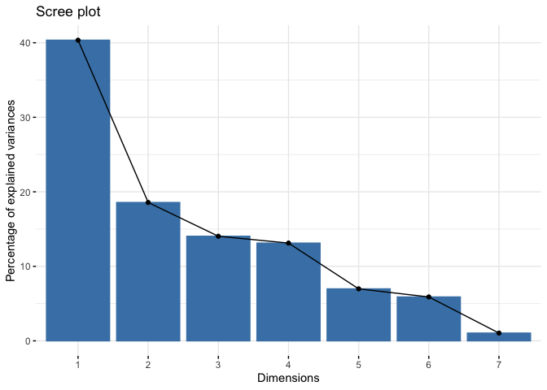<!-- -->

    ##       eigenvalue variance.percent cumulative.variance.percent
    ## Dim.1 2.82462780        40.351826                    40.35183
    ## Dim.2 1.29999774        18.571396                    58.92322
    ## Dim.3 0.98266005        14.038001                    72.96122
    ## Dim.4 0.91838616        13.119802                    86.08102
    ## Dim.5 0.48863986         6.980569                    93.06159
    ## Dim.6 0.41251042         5.893006                    98.95460
    ## Dim.7 0.07317798         1.045400                   100.00000
    ##           TC        index           O2     Moisture           TN           pH 
    ##    0.7032076    0.5744415    0.5308971    0.5226815    0.5215718    0.5016060 
    ## conductivity 
    ##    0.3111632

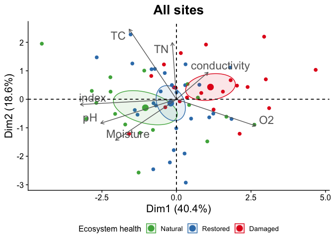<!-- -->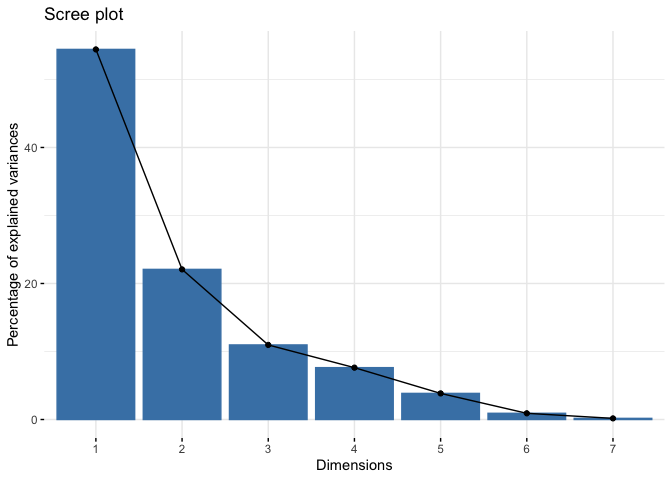<!-- -->

    ##       eigenvalue variance.percent cumulative.variance.percent
    ## Dim.1 3.80921642       54.4173775                    54.41738
    ## Dim.2 1.54512272       22.0731817                    76.49056
    ## Dim.3 0.76751191       10.9644558                    87.45502
    ## Dim.4 0.53373472        7.6247817                    95.07980
    ## Dim.5 0.26874130        3.8391615                    98.91896
    ## Dim.6 0.06394307        0.9134724                    99.83243
    ## Dim.7 0.01172986        0.1675694                   100.00000
    ##           TC           TN           O2           pH        index     Moisture 
    ##    0.6936362    0.5761366    0.5436197    0.5404868    0.4851592    0.4669201 
    ## conductivity 
    ##    0.3819597

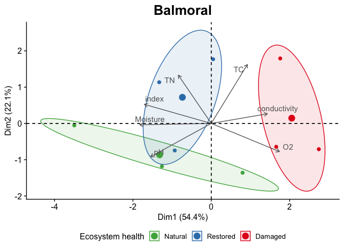<!-- -->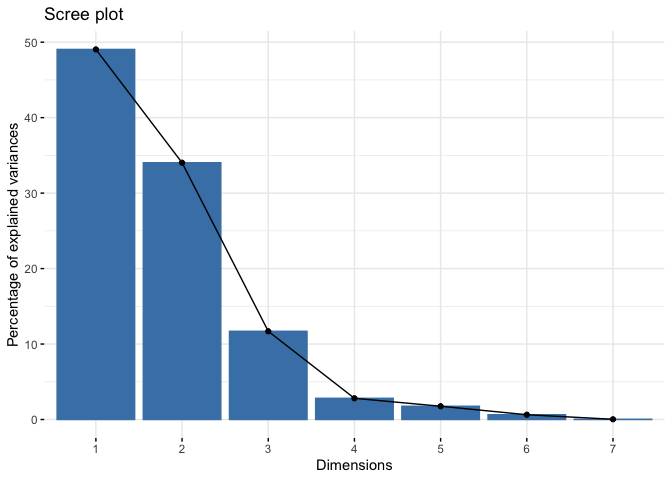<!-- -->

    ##        eigenvalue variance.percent cumulative.variance.percent
    ## Dim.1 3.432905056      49.04150080                    49.04150
    ## Dim.2 2.381999711      34.02856730                    83.07007
    ## Dim.3 0.818497214      11.69281735                    94.76289
    ## Dim.4 0.196869817       2.81242595                    97.57531
    ## Dim.5 0.123020748       1.75743926                    99.33275
    ## Dim.6 0.044475620       0.63536600                    99.96812
    ## Dim.7 0.002231834       0.03188335                   100.00000
    ## conductivity           O2           TC        index     Moisture           TN 
    ##    0.5763203    0.5755410    0.5454229    0.5411614    0.5090330    0.5083005 
    ##           pH 
    ##    0.4783112

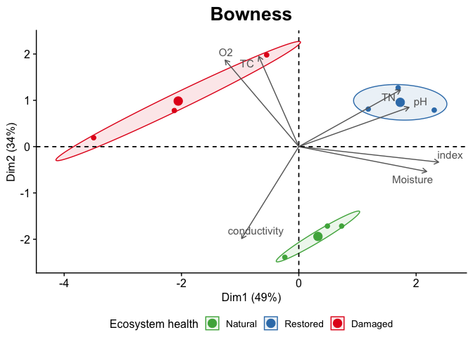<!-- -->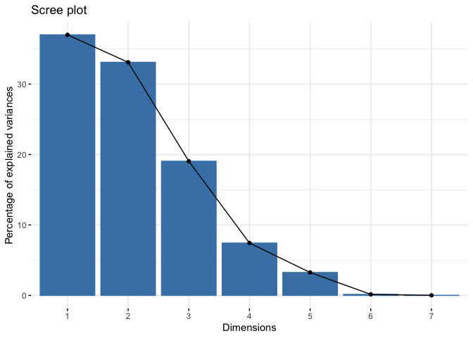<!-- -->

    ##         eigenvalue variance.percent cumulative.variance.percent
    ## Dim.1 2.5901710184       37.0024431                    37.00244
    ## Dim.2 2.3170261222       33.1003732                    70.10282
    ## Dim.3 1.3336428707       19.0520410                    89.15486
    ## Dim.4 0.5203124764        7.4330354                    96.58789
    ## Dim.5 0.2279474019        3.2563915                    99.84428
    ## Dim.6 0.0100850304        0.1440719                    99.98836
    ## Dim.7 0.0008150801        0.0116440                   100.00000
    ## conductivity           TN        index           O2           pH     Moisture 
    ##    0.6243537    0.6195054    0.5812648    0.5508499    0.5283519    0.4571642 
    ##           TC 
    ##    0.3113459

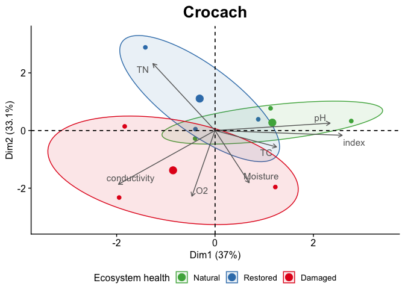<!-- -->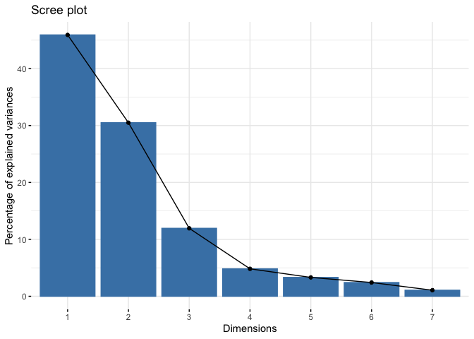<!-- -->

    ##       eigenvalue variance.percent cumulative.variance.percent
    ## Dim.1  3.2146832        45.924045                    45.92405
    ## Dim.2  2.1348885        30.498407                    76.42245
    ## Dim.3  0.8361472        11.944961                    88.36741
    ## Dim.4  0.3379245         4.827494                    93.19491
    ## Dim.5  0.2321294         3.316134                    96.51104
    ## Dim.6  0.1694241         2.420345                    98.93139
    ## Dim.7  0.0748030         1.068614                   100.00000
    ##           TC        index     Moisture           TN           pH conductivity 
    ##    0.6322122    0.5459101    0.5426471    0.5128591    0.5102211    0.5092994 
    ##           O2 
    ##    0.4744346

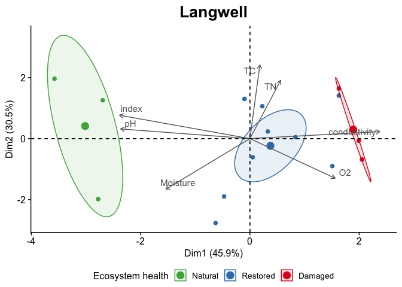<!-- -->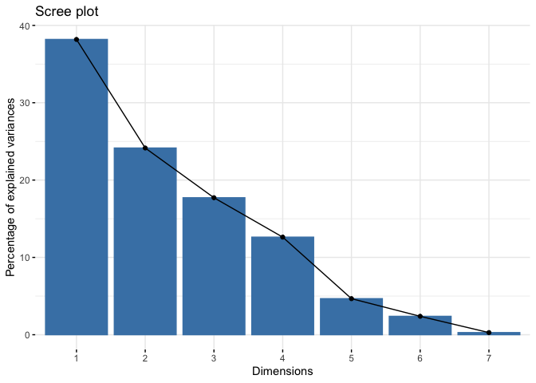<!-- -->

    ##       eigenvalue variance.percent cumulative.variance.percent
    ## Dim.1 2.67295564       38.1850806                    38.18508
    ## Dim.2 1.69030612       24.1472303                    62.33231
    ## Dim.3 1.24018485       17.7169265                    80.04924
    ## Dim.4 0.88351685       12.6216693                    92.67091
    ## Dim.5 0.32668203        4.6668861                    97.33779
    ## Dim.6 0.16683983        2.3834261                    99.72122
    ## Dim.7 0.01951468        0.2787811                   100.00000
    ## conductivity        index     Moisture           O2           pH           TC 
    ##    0.6470241    0.5895896    0.5372829    0.5345794    0.5291776    0.5265569 
    ##           TN 
    ##    0.3193816

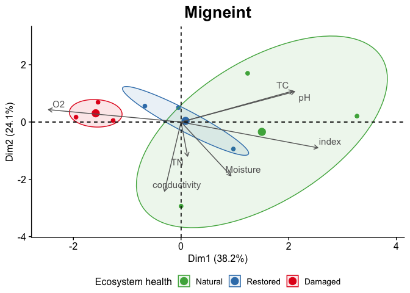<!-- -->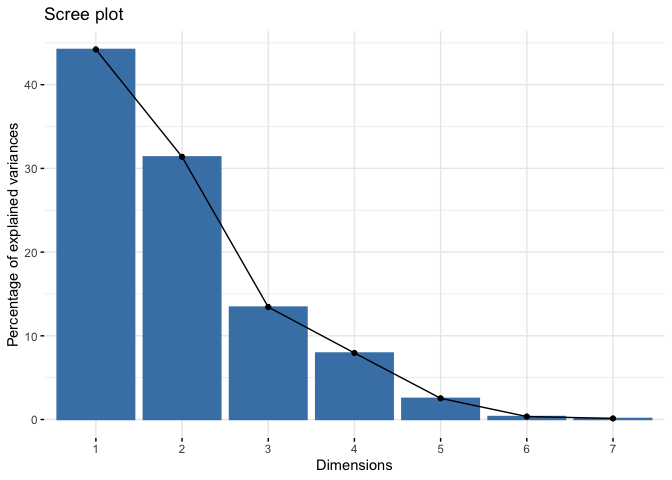<!-- -->

    ##        eigenvalue variance.percent cumulative.variance.percent
    ## Dim.1 3.095113610       44.2159087                    44.21591
    ## Dim.2 2.196662935       31.3808991                    75.59681
    ## Dim.3 0.940500463       13.4357209                    89.03253
    ## Dim.4 0.556322558        7.9474651                    96.97999
    ## Dim.5 0.177280132        2.5325733                    99.51257
    ## Dim.6 0.025025946        0.3575135                    99.87008
    ## Dim.7 0.009094358        0.1299194                   100.00000
    ##           TC     Moisture        index conductivity           TN           pH 
    ##    0.6398829    0.5956788    0.5630083    0.5275382    0.4931841    0.4592665 
    ##           O2 
    ##    0.4316079

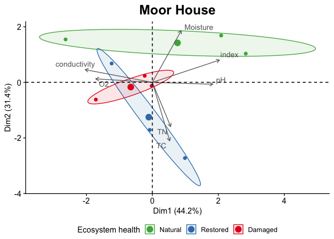<!-- -->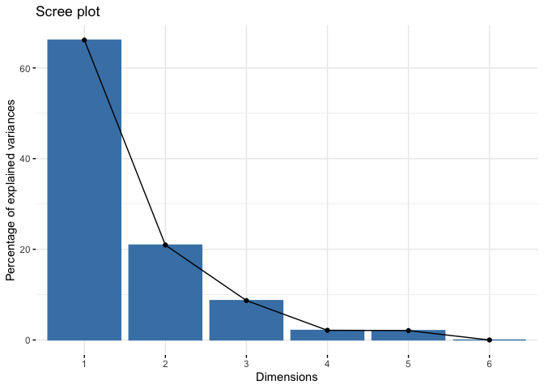<!-- -->

    ##         eigenvalue variance.percent cumulative.variance.percent
    ## Dim.1 4.630751e+00     6.615359e+01                    66.15359
    ## Dim.2 1.465838e+00     2.094055e+01                    87.09414
    ## Dim.3 6.089047e-01     8.698638e+00                    95.79278
    ## Dim.4 1.491815e-01     2.131164e+00                    97.92394
    ## Dim.5 1.453240e-01     2.076056e+00                   100.00000
    ## Dim.6 2.107327e-32     3.010467e-31                   100.00000
    ##           TC     Moisture           O2           pH           TN conductivity 
    ##    0.7205656    0.6059424    0.5135460    0.5026258    0.4615456    0.4484741 
    ##        index 
    ##    0.4279060

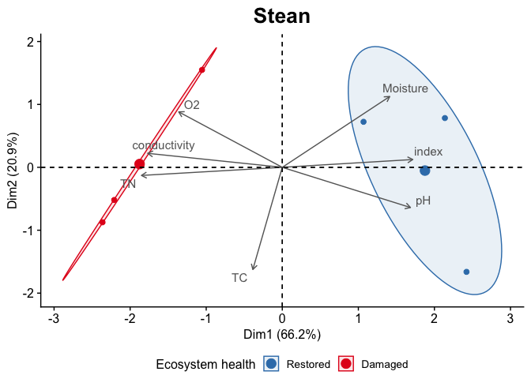<!-- -->

## Get the overall contribution of each parameter to all PCs

``` r
overall_contrib <- results_list[["All sites"]][["pca_object"]][[2]]
arrow_lengths <- sort(sqrt(rowSums(overall_contrib[, 1:2]^2)), decreasing = TRUE)
arrow_lengths
```

    ##           TC        index           O2     Moisture           TN           pH 
    ##    0.7032076    0.5744415    0.5308971    0.5226815    0.5215718    0.5016060 
    ## conductivity 
    ##    0.3111632

## Combine the ‘All sites’ plot with each site’s plot into a single figure

``` r
plot.pca.env.merged <-
  cowplot::plot_grid(
    results_list[[1]][[4]] +
      theme(
        legend.position = "bottom",
        legend.justification = "center"
        ) +
      labs(title = element_blank()),
    cowplot::plot_grid(
      (results_list[[2]][[4]] + theme(legend.position = "none")),
      (results_list[[3]][[4]] + theme(legend.position = "none")),
      (results_list[[4]][[4]] + theme(legend.position = "none")),
      (results_list[[5]][[4]] + theme(legend.position = "none")),
      (results_list[[6]][[4]] + theme(legend.position = "none")),
      (results_list[[7]][[4]] + theme(legend.position = "none")),
      (results_list[[8]][[4]] + theme(legend.position = "none")),
      (get_legend(
        (results_list[[1]][[4]] +
           theme(
             legend.position = "right",
             legend.key.size = unit(0.3, 'in'),
             legend.title = element_text(size=16, hjust = 0.5),
             legend.text = element_text(size=14)
             )
         )
        )
       ),
      ncol = 4
      ),
    ncol = 2,
    rel_widths = c(6, 12),
    labels = c("A", "B"),
    label_fontface = "bold",
    label_size = 24,
    label_fontfamily = "sans",
    label_x = -0.01,
    label_y = 1.0
  )

ggsave(plot.pca.env.merged,
       file="../Plots/environment/FigS1.png",
       device="png",
       dpi=600, units="in", width=8, height=3,
       scale = 2,
       bg = "white")
plot.pca.env.merged
```

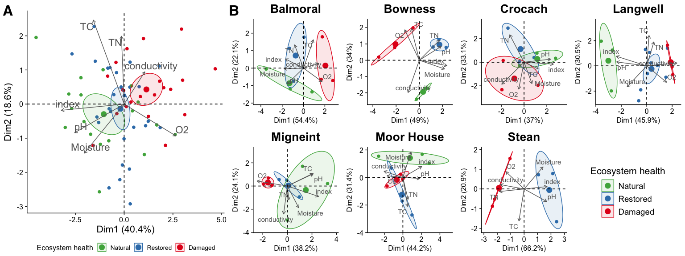<!-- -->
