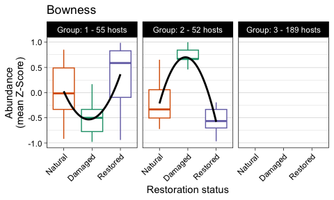
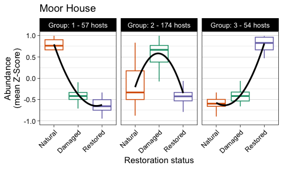

Host Genome DESeq and Abundance Clustering
================
James C. Kosmopoulos
2025-08-05

# Load packages

``` r
library("dplyr");packageVersion("dplyr")
```

    ## [1] '1.1.4'

``` r
library("reshape2");packageVersion("reshape2")
```

    ## [1] '1.4.4'

``` r
library("tidyverse");packageVersion("tidyverse")
```

    ## [1] '2.0.0'

``` r
library("DESeq2");packageVersion("DESeq2")
```

    ## [1] '1.44.0'

``` r
library("biobroom");packageVersion("biobroom")
```

    ## [1] '1.36.0'

# Load data

``` r
host_genome_counts <- readRDS("../Data/host_genome_counts.RDS")
metadata <- readRDS("../Data/metadata_simple.RDS")
row.names(metadata) <- metadata$SampleID
metadata <- metadata[,-1]
tmeans <- readRDS("../Data/host_tmeans_norm_50.RDS")
```

# Run models and retrieve results, site by site

## Balmoral

### DESeq

``` r
metadata_balmoral <- subset(metadata, site=="Balmoral")
dds_balmoral <- DESeqDataSetFromMatrix(countData = host_genome_counts %>%
                                         select(all_of(rownames(metadata_balmoral))),
                                       colData = metadata_balmoral,
                                       design =  ~ treatment)
dds_balmoral <- DESeq(dds_balmoral, test = "LRT", reduced = ~1)
res_balmoral <- results(dds_balmoral) %>% tidy() %>% dplyr::rename("Host" = "gene")
res_balmoral
```

    ## # A tibble: 459 × 7
    ##    Host               baseMean estimate stderror statistic  p.value p.adjusted
    ##    <chr>                 <dbl>    <dbl>    <dbl>     <dbl>    <dbl>      <dbl>
    ##  1 CRr3G3H3I__bin_97    48639.   -1.42     0.410    66.5   3.55e-15   6.08e-14
    ##  2 MGr2D2E2F__bin_102     881.   -1.07     0.586     3.25  1.97e- 1   2.41e- 1
    ##  3 MGr2D2E2F__bin_107     156.   -0.160    0.577    12.2   2.30e- 3   4.71e- 3
    ##  4 BOr1A1B1C__bin_57    41881.    1.27     1.12      8.32  1.56e- 2   2.55e- 2
    ##  5 CRr2D2E2F__bin_21    44463.    0.870    0.735     3.48  1.76e- 1   2.17e- 1
    ##  6 SEr2D2E2F__bin_42     1965.    0.482    0.344     7.98  1.85e- 2   2.95e- 2
    ##  7 LASYr2D2E2F__bin_2    4669.    0.625    0.542     1.90  3.87e- 1   4.39e- 1
    ##  8 SEr3G3H3I__bin_90    10259.    0.281    0.585     0.249 8.83e- 1   8.93e- 1
    ##  9 CRr1A1B1C__bin_11   212761.    3.41     1.06     10.8   4.60e- 3   8.90e- 3
    ## 10 CRr1A1B1C__bin_138   71309.   -0.693    0.543     9.34  9.39e- 3   1.66e- 2
    ## # ℹ 449 more rows

### Save Balmoral results

``` r
res_balmoral <- res_balmoral %>%
  filter(!is.na(p.value))
head(res_balmoral)
```

    ## # A tibble: 6 × 7
    ##   Host               baseMean estimate stderror statistic  p.value p.adjusted
    ##   <chr>                 <dbl>    <dbl>    <dbl>     <dbl>    <dbl>      <dbl>
    ## 1 CRr3G3H3I__bin_97    48639.   -1.42     0.410     66.5  3.55e-15   6.08e-14
    ## 2 MGr2D2E2F__bin_102     881.   -1.07     0.586      3.25 1.97e- 1   2.41e- 1
    ## 3 MGr2D2E2F__bin_107     156.   -0.160    0.577     12.2  2.30e- 3   4.71e- 3
    ## 4 BOr1A1B1C__bin_57    41881.    1.27     1.12       8.32 1.56e- 2   2.55e- 2
    ## 5 CRr2D2E2F__bin_21    44463.    0.870    0.735      3.48 1.76e- 1   2.17e- 1
    ## 6 SEr2D2E2F__bin_42     1965.    0.482    0.344      7.98 1.85e- 2   2.95e- 2

### Subset to return genomes with padj \< 0.05 in Balmoral

``` r
padj.cutoff <- 0.05 # Set alpha to 0.05
sig_host_balmoral <- res_balmoral %>%
  filter(p.adjusted < padj.cutoff)
insig_host_balmoral <- res_balmoral %>%
  filter(p.adjusted >= padj.cutoff)
```

### Get number of significant genomes in Balmoral

``` r
length(unique(sig_host_balmoral$Host))
```

    ## [1] 287

### Get number of insignificant genomes in Balmoral

``` r
length(unique(insig_host_balmoral$Host))
```

    ## [1] 141

### Subset tmeans with just significant hosts in Balmoral

``` r
tmeans_balmoral <- tmeans %>%
  select(all_of(rownames(metadata_balmoral)))
tmeans_sig_balmoral <- tmeans_balmoral[rownames(tmeans_balmoral) %in% sig_host_balmoral$Host, ]
```

## Bowness

### DESeq

``` r
metadata_bowness <- subset(metadata, site=="Bowness")
dds_bowness <- DESeqDataSetFromMatrix(countData = host_genome_counts %>%
                                         select(all_of(rownames(metadata_bowness))),
                                       colData = metadata_bowness,
                                       design =  ~ treatment)
dds_bowness <- DESeq(dds_bowness, test = "LRT", reduced = ~1)
res_bowness <- results(dds_bowness) %>% tidy() %>% dplyr::rename("Host" = "gene")
res_bowness
```

    ## # A tibble: 459 × 7
    ##    Host               baseMean estimate stderror statistic  p.value p.adjusted
    ##    <chr>                 <dbl>    <dbl>    <dbl>     <dbl>    <dbl>      <dbl>
    ##  1 CRr3G3H3I__bin_97   39042.  -1.18       0.281    18.8   8.29e- 5   2.49e- 4
    ##  2 MGr2D2E2F__bin_102   9156.   5.25       0.441   101.    1.01e-22   7.63e-21
    ##  3 MGr2D2E2F__bin_107     73.9  1.07       0.420     8.39  1.51e- 2   2.52e- 2
    ##  4 BOr1A1B1C__bin_57  312879.  -2.07       0.779     6.90  3.18e- 2   4.82e- 2
    ##  5 CRr2D2E2F__bin_21   89322.  -0.00363    0.519     0.661 7.19e- 1   7.47e- 1
    ##  6 SEr2D2E2F__bin_42    4014.   0.0508     0.317     0.892 6.40e- 1   6.75e- 1
    ##  7 LASYr2D2E2F__bin_2  36536.  -3.12       0.649    22.9   1.05e- 5   4.17e- 5
    ##  8 SEr3G3H3I__bin_90   10860.   0.894      0.539     9.79  7.47e- 3   1.38e- 2
    ##  9 CRr1A1B1C__bin_11  490143.   0.216      0.530     5.72  5.73e- 2   8.23e- 2
    ## 10 CRr1A1B1C__bin_138  64234.  -2.01       0.535    13.3   1.32e- 3   2.89e- 3
    ## # ℹ 449 more rows

### Save Bowness results

``` r
res_bowness <- res_bowness %>%
  filter(!is.na(p.value))
head(res_bowness)
```

    ## # A tibble: 6 × 7
    ##   Host               baseMean estimate stderror statistic  p.value p.adjusted
    ##   <chr>                 <dbl>    <dbl>    <dbl>     <dbl>    <dbl>      <dbl>
    ## 1 CRr3G3H3I__bin_97   39042.  -1.18       0.281    18.8   8.29e- 5   2.49e- 4
    ## 2 MGr2D2E2F__bin_102   9156.   5.25       0.441   101.    1.01e-22   7.63e-21
    ## 3 MGr2D2E2F__bin_107     73.9  1.07       0.420     8.39  1.51e- 2   2.52e- 2
    ## 4 BOr1A1B1C__bin_57  312879.  -2.07       0.779     6.90  3.18e- 2   4.82e- 2
    ## 5 CRr2D2E2F__bin_21   89322.  -0.00363    0.519     0.661 7.19e- 1   7.47e- 1
    ## 6 SEr2D2E2F__bin_42    4014.   0.0508     0.317     0.892 6.40e- 1   6.75e- 1

### Subset to return genomes with padj \< 0.05 in Bowness

``` r
padj.cutoff <- 0.05 # Set alpha to 0.05
sig_host_bowness <- res_bowness %>%
  filter(p.adjusted < padj.cutoff)
insig_host_bowness <- res_bowness %>%
  filter(p.adjusted >= padj.cutoff)
```

### Get number of significant genomes in Bowness

``` r
length(unique(sig_host_bowness$Host))
```

    ## [1] 299

### Get number of insignificant genomes in Bowness

``` r
length(unique(insig_host_bowness$Host))
```

    ## [1] 152

### Subset tmeans with just significant hosts in Bowness

``` r
tmeans_bowness <- tmeans %>%
  select(all_of(rownames(metadata_bowness)))
tmeans_sig_bowness <- tmeans_bowness[rownames(tmeans_bowness) %in% sig_host_bowness$Host, ]
```

## Crocach

### DESeq

``` r
metadata_crocach <- subset(metadata, site=="Crocach")
dds_crocach <- DESeqDataSetFromMatrix(countData = host_genome_counts %>%
                                         select(all_of(rownames(metadata_crocach))),
                                       colData = metadata_crocach,
                                       design =  ~ treatment)
dds_crocach <- DESeq(dds_crocach, test = "LRT", reduced = ~1)
res_crocach <- results(dds_crocach) %>% tidy() %>% dplyr::rename("Host" = "gene")
res_crocach
```

    ## # A tibble: 459 × 7
    ##    Host               baseMean estimate stderror statistic   p.value p.adjusted
    ##    <chr>                 <dbl>    <dbl>    <dbl>     <dbl>     <dbl>      <dbl>
    ##  1 CRr3G3H3I__bin_97   184105.  -3.62      0.777    20.1   0.0000421  0.000191 
    ##  2 MGr2D2E2F__bin_102    5557.  -1.65      0.613     7.51  0.0235     0.0431   
    ##  3 MGr2D2E2F__bin_107     265.   0.961     0.383     7.30  0.0260     0.0460   
    ##  4 BOr1A1B1C__bin_57    35992.  -0.0158    1.19      0.300 0.861      0.876    
    ##  5 CRr2D2E2F__bin_21   907560.  -1.46      0.589    18.1   0.000116   0.000480 
    ##  6 SEr2D2E2F__bin_42    12588.   2.21      0.549    22.9   0.0000107  0.0000554
    ##  7 LASYr2D2E2F__bin_2    1696.   1.35      0.479     8.49  0.0143     0.0285   
    ##  8 SEr3G3H3I__bin_90    53274.   0.781     0.782     7.67  0.0216     0.0405   
    ##  9 CRr1A1B1C__bin_11   542219.   0.205     0.709     4.76  0.0926     0.130    
    ## 10 CRr1A1B1C__bin_138  142217.  -1.04      0.648    10.6   0.00500    0.0116   
    ## # ℹ 449 more rows

### Save Crocach results

``` r
res_crocach <- res_crocach %>%
  filter(!is.na(p.value))
head(res_crocach)
```

    ## # A tibble: 6 × 7
    ##   Host               baseMean estimate stderror statistic   p.value p.adjusted
    ##   <chr>                 <dbl>    <dbl>    <dbl>     <dbl>     <dbl>      <dbl>
    ## 1 CRr3G3H3I__bin_97   184105.  -3.62      0.777    20.1   0.0000421  0.000191 
    ## 2 MGr2D2E2F__bin_102    5557.  -1.65      0.613     7.51  0.0235     0.0431   
    ## 3 MGr2D2E2F__bin_107     265.   0.961     0.383     7.30  0.0260     0.0460   
    ## 4 BOr1A1B1C__bin_57    35992.  -0.0158    1.19      0.300 0.861      0.876    
    ## 5 CRr2D2E2F__bin_21   907560.  -1.46      0.589    18.1   0.000116   0.000480 
    ## 6 SEr2D2E2F__bin_42    12588.   2.21      0.549    22.9   0.0000107  0.0000554

### Subset to return genomes with padj \< 0.05 in Crocach

``` r
padj.cutoff <- 0.05 # Set alpha to 0.05
sig_host_crocach <- res_crocach %>%
  filter(p.adjusted < padj.cutoff)
insig_host_crocach <- res_crocach %>%
  filter(p.adjusted >= padj.cutoff)
```

### Get number of significant genomes in Crocach

``` r
length(unique(sig_host_crocach$Host))
```

    ## [1] 265

### Get number of insignificant genomes in Crocach

``` r
length(unique(insig_host_crocach$Host))
```

    ## [1] 189

### Subset tmeans with just significant hosts in Crocach

``` r
tmeans_crocach <- tmeans %>%
  select(all_of(rownames(metadata_crocach)))
tmeans_sig_crocach <- tmeans_crocach[rownames(tmeans_crocach) %in% sig_host_crocach$Host, ]
```

## Langwell

### DESeq

``` r
metadata_langwell <- subset(metadata, site=="Langwell")
dds_langwell <- DESeqDataSetFromMatrix(countData = host_genome_counts %>%
                                         select(all_of(rownames(metadata_langwell))),
                                       colData = metadata_langwell,
                                       design =  ~ treatment)
dds_langwell <- DESeq(dds_langwell, test = "LRT", reduced = ~1)
res_langwell <- results(dds_langwell) %>% tidy() %>% dplyr::rename("Host" = "gene")
res_langwell
```

    ## # A tibble: 459 × 7
    ##    Host               baseMean estimate stderror statistic  p.value p.adjusted
    ##    <chr>                 <dbl>    <dbl>    <dbl>     <dbl>    <dbl>      <dbl>
    ##  1 CRr3G3H3I__bin_97    13579.  -1.84      0.529     11.6  3.00e- 3   4.46e- 3
    ##  2 MGr2D2E2F__bin_102   41833.   2.78      0.888     18.9  7.74e- 5   1.43e- 4
    ##  3 MGr2D2E2F__bin_107    3078.   2.31      0.705     76.8  2.15e-17   1.71e-16
    ##  4 BOr1A1B1C__bin_57    15276.   2.01      1.60       6.83 3.29e- 2   4.07e- 2
    ##  5 CRr2D2E2F__bin_21    59049.   0.0871    0.493     20.6  3.42e- 5   6.84e- 5
    ##  6 SEr2D2E2F__bin_42     3769.   1.14      0.513     16.5  2.68e- 4   4.64e- 4
    ##  7 LASYr2D2E2F__bin_2   17098.  -2.32      0.913     12.2  2.26e- 3   3.38e- 3
    ##  8 SEr3G3H3I__bin_90    17947.   0.950     0.337     22.7  1.18e- 5   2.54e- 5
    ##  9 CRr1A1B1C__bin_11  3150934.  -0.465     0.618     14.5  7.21e- 4   1.17e- 3
    ## 10 CRr1A1B1C__bin_138   34715.  -1.34      0.489      7.59 2.25e- 2   2.86e- 2
    ## # ℹ 449 more rows

### Save Langwell results

``` r
res_langwell <- res_langwell %>%
  filter(!is.na(p.value))
head(res_langwell)
```

    ## # A tibble: 6 × 7
    ##   Host               baseMean estimate stderror statistic  p.value p.adjusted
    ##   <chr>                 <dbl>    <dbl>    <dbl>     <dbl>    <dbl>      <dbl>
    ## 1 CRr3G3H3I__bin_97    13579.  -1.84      0.529     11.6  3.00e- 3   4.46e- 3
    ## 2 MGr2D2E2F__bin_102   41833.   2.78      0.888     18.9  7.74e- 5   1.43e- 4
    ## 3 MGr2D2E2F__bin_107    3078.   2.31      0.705     76.8  2.15e-17   1.71e-16
    ## 4 BOr1A1B1C__bin_57    15276.   2.01      1.60       6.83 3.29e- 2   4.07e- 2
    ## 5 CRr2D2E2F__bin_21    59049.   0.0871    0.493     20.6  3.42e- 5   6.84e- 5
    ## 6 SEr2D2E2F__bin_42     3769.   1.14      0.513     16.5  2.68e- 4   4.64e- 4

### Subset to return genomes with padj \< 0.05 in Langwell

``` r
padj.cutoff <- 0.05 # Set alpha to 0.05
sig_host_langwell <- res_langwell %>%
  filter(p.adjusted < padj.cutoff)
insig_host_langwell <- res_langwell %>%
  filter(p.adjusted >= padj.cutoff)
```

### Get number of significant genomes in Langwell

``` r
length(unique(sig_host_langwell$Host))
```

    ## [1] 364

### Get number of insignificant genomes in Langwell

``` r
length(unique(insig_host_langwell$Host))
```

    ## [1] 82

### Subset tmeans with just significant hosts in Langwell

``` r
tmeans_langwell <- tmeans %>%
  select(all_of(rownames(metadata_langwell)))
tmeans_sig_langwell <- tmeans_langwell[rownames(tmeans_langwell) %in% sig_host_langwell$Host, ]
```

## Migneint

### DESeq

``` r
metadata_migneint <- subset(metadata, site=="Migneint")
dds_migneint <- DESeqDataSetFromMatrix(countData = host_genome_counts %>%
                                         select(all_of(rownames(metadata_migneint))),
                                       colData = metadata_migneint,
                                       design =  ~ treatment)
dds_migneint <- DESeq(dds_migneint, test = "LRT", reduced = ~1)
res_migneint <- results(dds_migneint) %>% tidy() %>% dplyr::rename("Host" = "gene")
res_migneint
```

    ## # A tibble: 459 × 7
    ##    Host               baseMean estimate stderror statistic  p.value p.adjusted
    ##    <chr>                 <dbl>    <dbl>    <dbl>     <dbl>    <dbl>      <dbl>
    ##  1 CRr3G3H3I__bin_97    52100.    0.428    0.728      1.00 0.607       0.737  
    ##  2 MGr2D2E2F__bin_102   81905.    1.15     0.786      3.04 0.218       0.408  
    ##  3 MGr2D2E2F__bin_107  179251.    6.31     1.62       9.52 0.00859     0.0463 
    ##  4 BOr1A1B1C__bin_57     2095.    0.297    0.967      6.85 0.0325      0.116  
    ##  5 CRr2D2E2F__bin_21    84414.   -1.52     0.705      7.59 0.0224      0.0918 
    ##  6 SEr2D2E2F__bin_42    47078.   -1.21     0.747     16.8  0.000227    0.00296
    ##  7 LASYr2D2E2F__bin_2     571.   -0.221    0.279      3.65 0.161       0.339  
    ##  8 SEr3G3H3I__bin_90    45273.    0.273    0.827      1.09 0.580       0.718  
    ##  9 CRr1A1B1C__bin_11  2860431.    0.418    0.429      1.05 0.590       0.722  
    ## 10 CRr1A1B1C__bin_138   32821.   -0.223    0.514     11.3  0.00346     0.0231 
    ## # ℹ 449 more rows

### Save Migneint results

``` r
res_migneint <- res_migneint %>%
  filter(!is.na(p.value))
head(res_migneint)
```

    ## # A tibble: 6 × 7
    ##   Host               baseMean estimate stderror statistic  p.value p.adjusted
    ##   <chr>                 <dbl>    <dbl>    <dbl>     <dbl>    <dbl>      <dbl>
    ## 1 CRr3G3H3I__bin_97    52100.    0.428    0.728      1.00 0.607       0.737  
    ## 2 MGr2D2E2F__bin_102   81905.    1.15     0.786      3.04 0.218       0.408  
    ## 3 MGr2D2E2F__bin_107  179251.    6.31     1.62       9.52 0.00859     0.0463 
    ## 4 BOr1A1B1C__bin_57     2095.    0.297    0.967      6.85 0.0325      0.116  
    ## 5 CRr2D2E2F__bin_21    84414.   -1.52     0.705      7.59 0.0224      0.0918 
    ## 6 SEr2D2E2F__bin_42    47078.   -1.21     0.747     16.8  0.000227    0.00296

### Subset to return genomes with padj \< 0.05 in Migneint

``` r
padj.cutoff <- 0.05 # Set alpha to 0.05
sig_host_migneint <- res_migneint %>%
  filter(p.adjusted < padj.cutoff)
insig_host_migneint <- res_migneint %>%
  filter(p.adjusted >= padj.cutoff)
```

### Get number of significant genomes in Migneint

``` r
length(unique(sig_host_migneint$Host))
```

    ## [1] 82

### Get number of insignificant genomes in Migneint

``` r
length(unique(insig_host_migneint$Host))
```

    ## [1] 360

### Subset tmeans with just significant hosts in Migneint

``` r
tmeans_migneint <- tmeans %>%
  select(all_of(rownames(metadata_migneint)))
tmeans_sig_migneint <- tmeans_migneint[rownames(tmeans_migneint) %in% sig_host_migneint$Host, ]
```

## Moor House

### DESeq

``` r
metadata_moor_house <- subset(metadata, site=="Moor_House")
dds_moor_house <- DESeqDataSetFromMatrix(countData = host_genome_counts %>%
                                         select(all_of(rownames(metadata_moor_house))),
                                       colData = metadata_moor_house,
                                       design =  ~ treatment)
dds_moor_house <- DESeq(dds_moor_house, test = "LRT", reduced = ~1)
res_moor_house <- results(dds_moor_house) %>% tidy() %>% dplyr::rename("Host" = "gene")
res_moor_house
```

    ## # A tibble: 459 × 7
    ##    Host               baseMean estimate stderror statistic    p.value p.adjusted
    ##    <chr>                 <dbl>    <dbl>    <dbl>     <dbl>      <dbl>      <dbl>
    ##  1 CRr3G3H3I__bin_97   101126.  -1.11      1.08    1.04       5.95e-1 0.640     
    ##  2 MGr2D2E2F__bin_102    5471.  -3.42      0.835  15.0        5.64e-4 0.00124   
    ##  3 MGr2D2E2F__bin_107     173.  -0.468     0.409   1.90       3.88e-1 0.442     
    ##  4 BOr1A1B1C__bin_57    25342.  -2.44      1.05    7.18       2.76e-2 0.0407    
    ##  5 CRr2D2E2F__bin_21   539088.  -3.12      0.928  23.0        1.02e-5 0.0000382 
    ##  6 SEr2D2E2F__bin_42     7955.   1.66      0.938   4.01       1.35e-1 0.175     
    ##  7 LASYr2D2E2F__bin_2    4136.   2.59      0.643  27.8        9.07e-7 0.00000457
    ##  8 SEr3G3H3I__bin_90    15418.  -0.0116    0.577   0.00719    9.96e-1 0.999     
    ##  9 CRr1A1B1C__bin_11  1650241.   1.12      0.779   6.28       4.33e-2 0.0614    
    ## 10 CRr1A1B1C__bin_138  110132.   0.137     0.682  12.1        2.35e-3 0.00446   
    ## # ℹ 449 more rows

### Save Moor House results

``` r
res_moor_house <- res_moor_house %>%
  filter(!is.na(p.value))
head(res_moor_house)
```

    ## # A tibble: 6 × 7
    ##   Host               baseMean estimate stderror statistic   p.value p.adjusted
    ##   <chr>                 <dbl>    <dbl>    <dbl>     <dbl>     <dbl>      <dbl>
    ## 1 CRr3G3H3I__bin_97   101126.   -1.11     1.08       1.04 0.595      0.640    
    ## 2 MGr2D2E2F__bin_102    5471.   -3.42     0.835     15.0  0.000564   0.00124  
    ## 3 MGr2D2E2F__bin_107     173.   -0.468    0.409      1.90 0.388      0.442    
    ## 4 BOr1A1B1C__bin_57    25342.   -2.44     1.05       7.18 0.0276     0.0407   
    ## 5 CRr2D2E2F__bin_21   539088.   -3.12     0.928     23.0  0.0000102  0.0000382
    ## 6 SEr2D2E2F__bin_42     7955.    1.66     0.938      4.01 0.135      0.175

### Subset to return genomes with padj \< 0.05 in Moor House

``` r
padj.cutoff <- 0.05 # Set alpha to 0.05
sig_host_moor_house <- res_moor_house %>%
  filter(p.adjusted < padj.cutoff)
insig_host_moor_house <- res_moor_house %>%
  filter(p.adjusted >= padj.cutoff)
```

### Get number of significant genomes in Moor House

``` r
length(unique(sig_host_moor_house$Host))
```

    ## [1] 287

### Get number of insignificant genomes in Moor House

``` r
length(unique(insig_host_moor_house$Host))
```

    ## [1] 130

### Subset tmeans with just significant hosts in Moor House

``` r
tmeans_moor_house <- tmeans %>%
  select(all_of(rownames(metadata_moor_house)))
tmeans_sig_moor_house <- tmeans_moor_house[rownames(tmeans_moor_house) %in% sig_host_moor_house$Host, ]
```

## Stean

### DESeq

``` r
metadata_stean <- subset(metadata, site=="Stean")
dds_stean <- DESeqDataSetFromMatrix(countData = host_genome_counts %>%
                                         select(all_of(rownames(metadata_stean))),
                                       colData = metadata_stean,
                                       design =  ~ treatment)
dds_stean <- DESeq(dds_stean, test = "LRT", reduced = ~1)
res_stean <- results(dds_stean) %>% tidy() %>% dplyr::rename("Host" = "gene")
res_stean
```

    ## # A tibble: 459 × 7
    ##    Host               baseMean estimate stderror statistic   p.value p.adjusted
    ##    <chr>                 <dbl>    <dbl>    <dbl>     <dbl>     <dbl>      <dbl>
    ##  1 CRr3G3H3I__bin_97    12858.    1.83     0.700    6.43    0.0112      0.0467 
    ##  2 MGr2D2E2F__bin_102    5401.   -1.49     0.728    3.99    0.0458      0.135  
    ##  3 MGr2D2E2F__bin_107     337.   -1.49     0.594    6.01    0.0142      0.0552 
    ##  4 BOr1A1B1C__bin_57    45837.    0.372    1.45     0.0662  0.797       0.870  
    ##  5 CRr2D2E2F__bin_21   253458.    0.994    1.08     0.833   0.361       0.541  
    ##  6 SEr2D2E2F__bin_42   111146.    1.98     0.688    7.69    0.00555     0.0271 
    ##  7 LASYr2D2E2F__bin_2   25099.    5.19     1.18    13.6     0.000223    0.00212
    ##  8 SEr3G3H3I__bin_90   274930.    0.727    0.810    0.796   0.372       0.549  
    ##  9 CRr1A1B1C__bin_11   457391.   -4.77     1.62     6.30   NA          NA      
    ## 10 CRr1A1B1C__bin_138   65583.    1.06     0.940    1.25    0.264       0.429  
    ## # ℹ 449 more rows

### Save Stean results

``` r
res_stean <- res_stean %>%
  filter(!is.na(p.value))
head(res_stean)
```

    ## # A tibble: 6 × 7
    ##   Host               baseMean estimate stderror statistic p.value p.adjusted
    ##   <chr>                 <dbl>    <dbl>    <dbl>     <dbl>   <dbl>      <dbl>
    ## 1 CRr3G3H3I__bin_97    12858.    1.83     0.700    6.43   0.0112      0.0467
    ## 2 MGr2D2E2F__bin_102    5401.   -1.49     0.728    3.99   0.0458      0.135 
    ## 3 MGr2D2E2F__bin_107     337.   -1.49     0.594    6.01   0.0142      0.0552
    ## 4 BOr1A1B1C__bin_57    45837.    0.372    1.45     0.0662 0.797       0.870 
    ## 5 CRr2D2E2F__bin_21   253458.    0.994    1.08     0.833  0.361       0.541 
    ## 6 SEr2D2E2F__bin_42   111146.    1.98     0.688    7.69   0.00555     0.0271

### Subset to return genomes with padj \< 0.05 in Stean

``` r
padj.cutoff <- 0.05 # Set alpha to 0.05
sig_host_stean <- res_stean %>%
  filter(p.adjusted < padj.cutoff)
insig_host_stean <- res_stean %>%
  filter(p.adjusted >= padj.cutoff)
```

### Get number of significant genomes in Stean

``` r
length(unique(sig_host_stean$Host))
```

    ## [1] 99

### Get number of insignificant genomes in Stean

``` r
length(unique(insig_host_stean$Host))
```

    ## [1] 301

### Subset tmeans with just significant hosts in Stean

``` r
tmeans_stean <- tmeans %>%
  select(all_of(rownames(metadata_stean)))
tmeans_sig_stean <- tmeans_stean[rownames(tmeans_stean) %in% sig_host_stean$Host, ]
```

# Combine DESeq2 result tables and write

``` r
combined_deseq_results <- rbind(res_balmoral %>% mutate(site = "Balmoral"),
                                res_bowness %>% mutate(site = "Bowness"),
                                res_crocach %>% mutate(site = "Crocach"),
                                res_langwell %>% mutate(site = "Langwell"),
                                res_migneint %>% mutate(site = "Migneint"),
                                res_moor_house %>% mutate(site = "Moor House"),
                                res_stean %>% mutate(site = "Stean")
                                )
write_csv(combined_deseq_results, file = "../Tables/host_deseq_results_combined.csv")
head(combined_deseq_results)
```

    ## # A tibble: 6 × 8
    ##   Host            baseMean estimate stderror statistic  p.value p.adjusted site 
    ##   <chr>              <dbl>    <dbl>    <dbl>     <dbl>    <dbl>      <dbl> <chr>
    ## 1 CRr3G3H3I__bin…   48639.   -1.42     0.410     66.5  3.55e-15   6.08e-14 Balm…
    ## 2 MGr2D2E2F__bin…     881.   -1.07     0.586      3.25 1.97e- 1   2.41e- 1 Balm…
    ## 3 MGr2D2E2F__bin…     156.   -0.160    0.577     12.2  2.30e- 3   4.71e- 3 Balm…
    ## 4 BOr1A1B1C__bin…   41881.    1.27     1.12       8.32 1.56e- 2   2.55e- 2 Balm…
    ## 5 CRr2D2E2F__bin…   44463.    0.870    0.735      3.48 1.76e- 1   2.17e- 1 Balm…
    ## 6 SEr2D2E2F__bin…    1965.    0.482    0.344      7.98 1.85e- 2   2.95e- 2 Balm…

# Cluster viral genomes by their abundance patterns across treatments

## General functions and format metadata

``` r
tidy_otu <- function(otu) {
  as.data.frame(otu) %>%
    mutate(Host = row.names(otu)) %>%
    tidyr::gather(key = "Sample", value = "Count", -Host)
}
rel_ab <- function(otu, total = 100) {
  t(t(otu)/colSums(otu)) * 100
}

metadata$Sample <- rownames(metadata)
```

## Balmoral

### Calculate the zscores of each genome across samples and then calculate the mean zvalue for each treatment

``` r
host.zs.balmoral <- tmeans_sig_balmoral %>%
  filter(row.names(.) %in% sig_host_balmoral$Host) %>% # Only include hosts significant from DESeq
  rel_ab() %>% 
  tidy_otu %>%
  group_by(Host) %>%
  mutate(zValue = (Count - mean(Count))/sd(Count)) %>%
  inner_join(metadata, by = "Sample") %>%
  group_by(treatment, Host) %>%
  summarise(MeanZS = mean(zValue)) 
```

### Format zscores as a matrix

``` r
host.zs.matrix.balmoral <- host.zs.balmoral %>%
  spread(key = Host, value = MeanZS) %>%
  as.data.frame()
row.names(host.zs.matrix.balmoral) <- host.zs.matrix.balmoral$Treatment
host.zs.matrix.balmoral <- host.zs.matrix.balmoral[,-1]
host.zs.matrix.balmoral <- as.matrix(host.zs.matrix.balmoral)

# Check for NA, NaN, or Inf values and handle them
host.zs.matrix.balmoral[is.na(host.zs.matrix.balmoral)] <- 0
host.zs.matrix.balmoral[is.nan(host.zs.matrix.balmoral)] <- 0
host.zs.matrix.balmoral[is.infinite(host.zs.matrix.balmoral)] <- 0

host.dist.balmoral <- dist(t(host.zs.matrix.balmoral))
```

### Perform the hierarchical clustering

``` r
host.hc.balmoral <- hclust(as.dist(host.dist.balmoral), method = "ward.D")
host.ord.balmoral <- host.hc.balmoral$labels[host.hc.balmoral$order]
host.ord.balmoral <- data.frame(Host = host.ord.balmoral, order = 1:length(host.ord.balmoral))
host.cut.balmoral <- cutree(host.hc.balmoral[c(1,2,4)],k = 3) # k = 3 for three treatments
host.clusters.balmoral <- data.frame(Host = names(host.cut.balmoral),
                                      Cluster = host.cut.balmoral) %>%
  inner_join(host.ord.balmoral, by = "Host") %>%
  inner_join(host.zs.balmoral, by = "Host") %>%
  mutate(Title = factor(treatment, levels = c("NAT", "DAM", "REST")))
host.clusters.balmoral <- host.clusters.balmoral %>%
  group_by(Cluster) %>%
  mutate(Cluster.size = n_distinct(Host)) %>%
  mutate(Title = factor(treatment, levels = c("NAT", "DAM", "REST")))
host.clusters.balmoral$Title <- paste("Group: ", host.clusters.balmoral$Cluster, " - ", host.clusters.balmoral$Cluster.size, " hosts", sep = "")

head(host.clusters.balmoral)
```

    ## # A tibble: 6 × 7
    ## # Groups:   Cluster [1]
    ##   Host               Cluster order treatment  MeanZS Title          Cluster.size
    ##   <chr>                <int> <int> <fct>       <dbl> <chr>                 <int>
    ## 1 BAr1A1B1C__bin_100       1    15 DAM       -0.875  Group: 1 - 85…           85
    ## 2 BAr1A1B1C__bin_100       1    15 NAT        0.865  Group: 1 - 85…           85
    ## 3 BAr1A1B1C__bin_100       1    15 REST       0.0103 Group: 1 - 85…           85
    ## 4 BAr1A1B1C__bin_103       1    69 DAM       -0.376  Group: 1 - 85…           85
    ## 5 BAr1A1B1C__bin_103       1    69 NAT        0.752  Group: 1 - 85…           85
    ## 6 BAr1A1B1C__bin_103       1    69 REST      -0.376  Group: 1 - 85…           85

### Plot Z-Score clusters

``` r
plot.clusters.balmoral <-
ggplot(data = host.clusters.balmoral, aes(x = factor(treatment, levels = c("NAT", "DAM", "REST")), y = MeanZS)) +
  geom_boxplot(aes(color = treatment), outlier.shape = NA) +
  scale_color_brewer(palette = "Dark2") +
  geom_smooth(aes(group = 1), method = "lm", color="black", se = F, formula = y ~ poly(x, 2),) +
  xlab("Restoration status") +
  ylab("Abundance\n(mean Z-Score)") +
  scale_x_discrete(labels = c("Natural", "Damaged", "Restored")) +
  facet_wrap(~Title, ncol = 3, labeller = labeller(label_column = as.character)) +
  theme_linedraw() +
  theme(legend.position = "none", panel.grid.major.x = element_blank(), axis.text.x = element_text(angle = 45, hjust=1)) +
  ylim(-1,1) +
  ggtitle("Balmoral")
plot.clusters.balmoral
```

<!-- -->

### Manually rename cluster titles based on abundance trends

``` r
host.clusters.balmoral <- host.clusters.balmoral %>%
  mutate(Title = case_when(Cluster == 1 ~ "Natural-abundant",
                           Cluster == 2 ~ "Restored-abundant",
                           Cluster == 3 ~ "Damaged-abundant"))
host.clusters.balmoral$site <- "Balmoral"
head(host.clusters.balmoral)
```

    ## # A tibble: 6 × 8
    ## # Groups:   Cluster [1]
    ##   Host               Cluster order treatment  MeanZS Title    Cluster.size site 
    ##   <chr>                <int> <int> <fct>       <dbl> <chr>           <int> <chr>
    ## 1 BAr1A1B1C__bin_100       1    15 DAM       -0.875  Natural…           85 Balm…
    ## 2 BAr1A1B1C__bin_100       1    15 NAT        0.865  Natural…           85 Balm…
    ## 3 BAr1A1B1C__bin_100       1    15 REST       0.0103 Natural…           85 Balm…
    ## 4 BAr1A1B1C__bin_103       1    69 DAM       -0.376  Natural…           85 Balm…
    ## 5 BAr1A1B1C__bin_103       1    69 NAT        0.752  Natural…           85 Balm…
    ## 6 BAr1A1B1C__bin_103       1    69 REST      -0.376  Natural…           85 Balm…

## Bowness

### Calculate the zscores of each genome across samples and then calculate the mean zvalue for each treatment

``` r
host.zs.bowness <- tmeans_sig_bowness %>%
  filter(row.names(.) %in% sig_host_bowness$Host) %>% # Only include hosts significant from DESeq
  rel_ab() %>% 
  tidy_otu %>%
  group_by(Host) %>%
  mutate(zValue = (Count - mean(Count))/sd(Count)) %>%
  inner_join(metadata, by = "Sample") %>%
  group_by(treatment, Host) %>%
  summarise(MeanZS = mean(zValue)) 
```

### Format zscores as a matrix

``` r
host.zs.matrix.bowness <- host.zs.bowness %>%
  spread(key = Host, value = MeanZS) %>%
  as.data.frame()
row.names(host.zs.matrix.bowness) <- host.zs.matrix.bowness$Treatment
host.zs.matrix.bowness <- host.zs.matrix.bowness[,-1]
host.zs.matrix.bowness <- as.matrix(host.zs.matrix.bowness)

# Check for NA, NaN, or Inf values and handle them
host.zs.matrix.bowness[is.na(host.zs.matrix.bowness)] <- 0
host.zs.matrix.bowness[is.nan(host.zs.matrix.bowness)] <- 0
host.zs.matrix.bowness[is.infinite(host.zs.matrix.bowness)] <- 0

host.dist.bowness <- dist(t(host.zs.matrix.bowness))
```

### Perform the hierarchical clustering

``` r
host.hc.bowness <- hclust(as.dist(host.dist.bowness), method = "ward.D")
host.ord.bowness <- host.hc.bowness$labels[host.hc.bowness$order]
host.ord.bowness <- data.frame(Host = host.ord.bowness, order = 1:length(host.ord.bowness))
host.cut.bowness <- cutree(host.hc.bowness[c(1,2,4)],k = 3) # k = 3 for three treatments
host.clusters.bowness <- data.frame(Host = names(host.cut.bowness),
                                      Cluster = host.cut.bowness) %>%
  inner_join(host.ord.bowness, by = "Host") %>%
  inner_join(host.zs.bowness, by = "Host") %>%
  mutate(Title = factor(treatment, levels = c("NAT", "DAM", "REST")))
host.clusters.bowness <- host.clusters.bowness %>%
  group_by(Cluster) %>%
  mutate(Cluster.size = n_distinct(Host)) %>%
  mutate(Title = factor(treatment, levels = c("NAT", "DAM", "REST")))
host.clusters.bowness$Title <- paste("Group: ", host.clusters.bowness$Cluster, " - ", host.clusters.bowness$Cluster.size, " hosts", sep = "")

head(host.clusters.bowness)
```

    ## # A tibble: 6 × 7
    ## # Groups:   Cluster [2]
    ##   Host               Cluster order treatment MeanZS Title           Cluster.size
    ##   <chr>                <int> <int> <fct>      <dbl> <chr>                  <int>
    ## 1 BAr1A1B1C__bin_104       1   294 DAM       -0.721 Group: 1 - 55 …           55
    ## 2 BAr1A1B1C__bin_104       1   294 NAT       -0.444 Group: 1 - 55 …           55
    ## 3 BAr1A1B1C__bin_104       1   294 REST       1.16  Group: 1 - 55 …           55
    ## 4 BAr1A1B1C__bin_105       2    34 DAM        0.667 Group: 2 - 52 …           52
    ## 5 BAr1A1B1C__bin_105       2    34 NAT       -0.333 Group: 2 - 52 …           52
    ## 6 BAr1A1B1C__bin_105       2    34 REST      -0.333 Group: 2 - 52 …           52

### Plot Z-Score clusters

``` r
plot.clusters.bowness <-
ggplot(data = host.clusters.bowness, aes(x = factor(treatment, levels = c("NAT", "DAM", "REST")), y = MeanZS)) +
  geom_boxplot(aes(color = treatment), outlier.shape = NA) +
  scale_color_brewer(palette = "Dark2") +
  geom_smooth(aes(group = 1), method = "lm", color="black", se = F, formula = y ~ poly(x, 2),) +
  xlab("Restoration status") +
  ylab("Abundance\n(mean Z-Score)") +
  scale_x_discrete(labels = c("Natural", "Damaged", "Restored")) +
  facet_wrap(~Title, ncol = 3, labeller = labeller(label_column = as.character)) +
  theme_linedraw() +
  theme(legend.position = "none", panel.grid.major.x = element_blank(), axis.text.x = element_text(angle = 45, hjust=1)) +
  ylim(-1,1) +
  ggtitle("Bowness")
plot.clusters.bowness
```

<!-- -->

### Manually rename cluster titles based on abundance trends

``` r
host.clusters.bowness <- host.clusters.bowness %>%
  mutate(Title = case_when(Cluster == 1 ~ "Restored-abundant",
                           Cluster == 2 ~ "Damaged-abundant",
                           Cluster == 3 ~ "Natural-abundant"))
host.clusters.bowness$site <- "Bowness"
head(host.clusters.bowness)
```

    ## # A tibble: 6 × 8
    ## # Groups:   Cluster [2]
    ##   Host               Cluster order treatment MeanZS Title     Cluster.size site 
    ##   <chr>                <int> <int> <fct>      <dbl> <chr>            <int> <chr>
    ## 1 BAr1A1B1C__bin_104       1   294 DAM       -0.721 Restored…           55 Bown…
    ## 2 BAr1A1B1C__bin_104       1   294 NAT       -0.444 Restored…           55 Bown…
    ## 3 BAr1A1B1C__bin_104       1   294 REST       1.16  Restored…           55 Bown…
    ## 4 BAr1A1B1C__bin_105       2    34 DAM        0.667 Damaged-…           52 Bown…
    ## 5 BAr1A1B1C__bin_105       2    34 NAT       -0.333 Damaged-…           52 Bown…
    ## 6 BAr1A1B1C__bin_105       2    34 REST      -0.333 Damaged-…           52 Bown…

## Crocach

### Calculate the zscores of each genome across samples and then calculate the mean zvalue for each treatment

``` r
host.zs.crocach <- tmeans_sig_crocach %>%
  filter(row.names(.) %in% sig_host_crocach$Host) %>% # Only include hosts significant from DESeq
  rel_ab() %>% 
  tidy_otu %>%
  group_by(Host) %>%
  mutate(zValue = (Count - mean(Count))/sd(Count)) %>%
  inner_join(metadata, by = "Sample") %>%
  group_by(treatment, Host) %>%
  summarise(MeanZS = mean(zValue)) 
```

### Format zscores as a matrix

``` r
host.zs.matrix.crocach <- host.zs.crocach %>%
  spread(key = Host, value = MeanZS) %>%
  as.data.frame()
row.names(host.zs.matrix.crocach) <- host.zs.matrix.crocach$Treatment
host.zs.matrix.crocach <- host.zs.matrix.crocach[,-1]
host.zs.matrix.crocach <- as.matrix(host.zs.matrix.crocach)

# Check for NA, NaN, or Inf values and handle them
host.zs.matrix.crocach[is.na(host.zs.matrix.crocach)] <- 0
host.zs.matrix.crocach[is.nan(host.zs.matrix.crocach)] <- 0
host.zs.matrix.crocach[is.infinite(host.zs.matrix.crocach)] <- 0

host.dist.crocach <- dist(t(host.zs.matrix.crocach))
```

### Perform the hierarchical clustering

``` r
host.hc.crocach <- hclust(as.dist(host.dist.crocach), method = "ward.D")
host.ord.crocach <- host.hc.crocach$labels[host.hc.crocach$order]
host.ord.crocach <- data.frame(Host = host.ord.crocach, order = 1:length(host.ord.crocach))
host.cut.crocach <- cutree(host.hc.crocach[c(1,2,4)],k = 3) # k = 3 for three treatments
host.clusters.crocach <- data.frame(Host = names(host.cut.crocach),
                                      Cluster = host.cut.crocach) %>%
  inner_join(host.ord.crocach, by = "Host") %>%
  inner_join(host.zs.crocach, by = "Host") %>%
  mutate(Title = factor(treatment, levels = c("NAT", "DAM", "REST")))
host.clusters.crocach <- host.clusters.crocach %>%
  group_by(Cluster) %>%
  mutate(Cluster.size = n_distinct(Host)) %>%
  mutate(Title = factor(treatment, levels = c("NAT", "DAM", "REST")))
host.clusters.crocach$Title <- paste("Group: ", host.clusters.crocach$Cluster, " - ", host.clusters.crocach$Cluster.size, " hosts", sep = "")

head(host.clusters.crocach)
```

    ## # A tibble: 6 × 7
    ## # Groups:   Cluster [2]
    ##   Host               Cluster order treatment MeanZS Title           Cluster.size
    ##   <chr>                <int> <int> <fct>      <dbl> <chr>                  <int>
    ## 1 BAr1A1B1C__bin_103       1    75 DAM       -0.333 Group: 1 - 57 …           57
    ## 2 BAr1A1B1C__bin_103       1    75 NAT        0.667 Group: 1 - 57 …           57
    ## 3 BAr1A1B1C__bin_103       1    75 REST      -0.333 Group: 1 - 57 …           57
    ## 4 BAr1A1B1C__bin_116       2    17 DAM       -0.333 Group: 2 - 52 …           52
    ## 5 BAr1A1B1C__bin_116       2    17 NAT       -0.333 Group: 2 - 52 …           52
    ## 6 BAr1A1B1C__bin_116       2    17 REST       0.667 Group: 2 - 52 …           52

### Plot Z-Score clusters

``` r
plot.clusters.crocach <-
ggplot(data = host.clusters.crocach, aes(x = factor(treatment, levels = c("NAT", "DAM", "REST")), y = MeanZS)) +
  geom_boxplot(aes(color = treatment), outlier.shape = NA) +
  scale_color_brewer(palette = "Dark2") +
  geom_smooth(aes(group = 1), method = "lm", color="black", se = F, formula = y ~ poly(x, 2),) +
  xlab("Restoration status") +
  ylab("Abundance\n(mean Z-Score)") +
  scale_x_discrete(labels = c("Natural", "Damaged", "Restored")) +
  facet_wrap(~Title, ncol = 3, labeller = labeller(label_column = as.character)) +
  theme_linedraw() +
  theme(legend.position = "none", panel.grid.major.x = element_blank(), axis.text.x = element_text(angle = 45, hjust=1)) +
  ylim(-1,1) +
  ggtitle("Crocach")
plot.clusters.crocach
```

<!-- -->

### Manually rename cluster titles based on abundance trends

``` r
host.clusters.crocach <- host.clusters.crocach %>%
  mutate(Title = case_when(Cluster == 1 ~ "Natural-abundant",
                           Cluster == 2 ~ "Restored-abundant",
                           Cluster == 3 ~ "Damaged-abundant"))
host.clusters.crocach$site <- "Crocach"
head(host.clusters.crocach)
```

    ## # A tibble: 6 × 8
    ## # Groups:   Cluster [2]
    ##   Host               Cluster order treatment MeanZS Title     Cluster.size site 
    ##   <chr>                <int> <int> <fct>      <dbl> <chr>            <int> <chr>
    ## 1 BAr1A1B1C__bin_103       1    75 DAM       -0.333 Natural-…           57 Croc…
    ## 2 BAr1A1B1C__bin_103       1    75 NAT        0.667 Natural-…           57 Croc…
    ## 3 BAr1A1B1C__bin_103       1    75 REST      -0.333 Natural-…           57 Croc…
    ## 4 BAr1A1B1C__bin_116       2    17 DAM       -0.333 Restored…           52 Croc…
    ## 5 BAr1A1B1C__bin_116       2    17 NAT       -0.333 Restored…           52 Croc…
    ## 6 BAr1A1B1C__bin_116       2    17 REST       0.667 Restored…           52 Croc…

## Langwell

### Calculate the zscores of each genome across samples and then calculate the mean zvalue for each treatment

``` r
host.zs.langwell <- tmeans_sig_langwell %>%
  filter(row.names(.) %in% sig_host_langwell$Host) %>% # Only include hosts significant from DESeq
  rel_ab() %>% 
  tidy_otu %>%
  group_by(Host) %>%
  mutate(zValue = (Count - mean(Count))/sd(Count)) %>%
  inner_join(metadata, by = "Sample") %>%
  group_by(treatment, Host) %>%
  summarise(MeanZS = mean(zValue)) 
```

### Format zscores as a matrix

``` r
host.zs.matrix.langwell <- host.zs.langwell %>%
  spread(key = Host, value = MeanZS) %>%
  as.data.frame()
row.names(host.zs.matrix.langwell) <- host.zs.matrix.langwell$Treatment
host.zs.matrix.langwell <- host.zs.matrix.langwell[,-1]
host.zs.matrix.langwell <- as.matrix(host.zs.matrix.langwell)

# Check for NA, NaN, or Inf values and handle them
host.zs.matrix.langwell[is.na(host.zs.matrix.langwell)] <- 0
host.zs.matrix.langwell[is.nan(host.zs.matrix.langwell)] <- 0
host.zs.matrix.langwell[is.infinite(host.zs.matrix.langwell)] <- 0

host.dist.langwell <- dist(t(host.zs.matrix.langwell))
```

### Perform the hierarchical clustering

``` r
host.hc.langwell <- hclust(as.dist(host.dist.langwell), method = "ward.D")
host.ord.langwell <- host.hc.langwell$labels[host.hc.langwell$order]
host.ord.langwell <- data.frame(Host = host.ord.langwell, order = 1:length(host.ord.langwell))
host.cut.langwell <- cutree(host.hc.langwell[c(1,2,4)],k = 3) # k = 3 for three treatments
host.clusters.langwell <- data.frame(Host = names(host.cut.langwell),
                                      Cluster = host.cut.langwell) %>%
  inner_join(host.ord.langwell, by = "Host") %>%
  inner_join(host.zs.langwell, by = "Host") %>%
  mutate(Title = factor(treatment, levels = c("NAT", "DAM", "REST")))
host.clusters.langwell <- host.clusters.langwell %>%
  group_by(Cluster) %>%
  mutate(Cluster.size = n_distinct(Host)) %>%
  mutate(Title = factor(treatment, levels = c("NAT", "DAM", "REST")))
host.clusters.langwell$Title <- paste("Group: ", host.clusters.langwell$Cluster, " - ", host.clusters.langwell$Cluster.size, " hosts", sep = "")

head(host.clusters.langwell)
```

    ## # A tibble: 6 × 7
    ## # Groups:   Cluster [1]
    ##   Host               Cluster order treatment MeanZS Title           Cluster.size
    ##   <chr>                <int> <int> <fct>      <dbl> <chr>                  <int>
    ## 1 BAr1A1B1C__bin_100       1   111 DAM       -0.630 Group: 1 - 75 …           75
    ## 2 BAr1A1B1C__bin_100       1   111 NAT       -0.630 Group: 1 - 75 …           75
    ## 3 BAr1A1B1C__bin_100       1   111 REST       1.26  Group: 1 - 75 …           75
    ## 4 BAr1A1B1C__bin_103       1   102 DAM       -0.643 Group: 1 - 75 …           75
    ## 5 BAr1A1B1C__bin_103       1   102 NAT       -0.643 Group: 1 - 75 …           75
    ## 6 BAr1A1B1C__bin_103       1   102 REST       1.29  Group: 1 - 75 …           75

### Plot Z-Score clusters

``` r
plot.clusters.langwell <-
ggplot(data = host.clusters.langwell, aes(x = factor(treatment, levels = c("NAT", "DAM", "REST")), y = MeanZS)) +
  geom_boxplot(aes(color = treatment), outlier.shape = NA) +
  scale_color_brewer(palette = "Dark2") +
  geom_smooth(aes(group = 1), method = "lm", color="black", se = F, formula = y ~ poly(x, 2),) +
  xlab("Restoration status") +
  ylab("Abundance\n(mean Z-Score)") +
  scale_x_discrete(labels = c("Natural", "Damaged", "Restored")) +
  facet_wrap(~Title, ncol = 3, labeller = labeller(label_column = as.character)) +
  theme_linedraw() +
  theme(legend.position = "none", panel.grid.major.x = element_blank(), axis.text.x = element_text(angle = 45, hjust=1)) +
  ylim(-1,1) +
  ggtitle("Langwell")
plot.clusters.langwell
```

<!-- -->

### Manually rename cluster titles based on abundance trends

``` r
host.clusters.langwell <- host.clusters.langwell %>%
  mutate(Title = case_when(Cluster == 1 ~ "Restored-abundant",
                           Cluster == 2 ~ "Natural-abundant",
                           Cluster == 3 ~ "Damaged-abundant"))
host.clusters.langwell$site <- "Langwell"
head(host.clusters.langwell)
```

    ## # A tibble: 6 × 8
    ## # Groups:   Cluster [1]
    ##   Host               Cluster order treatment MeanZS Title     Cluster.size site 
    ##   <chr>                <int> <int> <fct>      <dbl> <chr>            <int> <chr>
    ## 1 BAr1A1B1C__bin_100       1   111 DAM       -0.630 Restored…           75 Lang…
    ## 2 BAr1A1B1C__bin_100       1   111 NAT       -0.630 Restored…           75 Lang…
    ## 3 BAr1A1B1C__bin_100       1   111 REST       1.26  Restored…           75 Lang…
    ## 4 BAr1A1B1C__bin_103       1   102 DAM       -0.643 Restored…           75 Lang…
    ## 5 BAr1A1B1C__bin_103       1   102 NAT       -0.643 Restored…           75 Lang…
    ## 6 BAr1A1B1C__bin_103       1   102 REST       1.29  Restored…           75 Lang…

## Migneint

### Calculate the zscores of each genome across samples and then calculate the mean zvalue for each treatment

``` r
host.zs.migneint <- tmeans_sig_migneint %>%
  filter(row.names(.) %in% sig_host_migneint$Host) %>% # Only include hosts significant from DESeq
  rel_ab() %>% 
  tidy_otu %>%
  group_by(Host) %>%
  mutate(zValue = (Count - mean(Count))/sd(Count)) %>%
  inner_join(metadata, by = "Sample") %>%
  group_by(treatment, Host) %>%
  summarise(MeanZS = mean(zValue)) 
```

### Format zscores as a matrix

``` r
host.zs.matrix.migneint <- host.zs.migneint %>%
  spread(key = Host, value = MeanZS) %>%
  as.data.frame()
row.names(host.zs.matrix.migneint) <- host.zs.matrix.migneint$Treatment
host.zs.matrix.migneint <- host.zs.matrix.migneint[,-1]
host.zs.matrix.migneint <- as.matrix(host.zs.matrix.migneint)

# Check for NA, NaN, or Inf values and handle them
host.zs.matrix.migneint[is.na(host.zs.matrix.migneint)] <- 0
host.zs.matrix.migneint[is.nan(host.zs.matrix.migneint)] <- 0
host.zs.matrix.migneint[is.infinite(host.zs.matrix.migneint)] <- 0

host.dist.migneint <- dist(t(host.zs.matrix.migneint))
```

### Perform the hierarchical clustering

``` r
host.hc.migneint <- hclust(as.dist(host.dist.migneint), method = "ward.D")
host.ord.migneint <- host.hc.migneint$labels[host.hc.migneint$order]
host.ord.migneint <- data.frame(Host = host.ord.migneint, order = 1:length(host.ord.migneint))
host.cut.migneint <- cutree(host.hc.migneint[c(1,2,4)],k = 3) # k = 3 for three treatments
host.clusters.migneint <- data.frame(Host = names(host.cut.migneint),
                                      Cluster = host.cut.migneint) %>%
  inner_join(host.ord.migneint, by = "Host") %>%
  inner_join(host.zs.migneint, by = "Host") %>%
  mutate(Title = factor(treatment, levels = c("NAT", "DAM", "REST")))
host.clusters.migneint <- host.clusters.migneint %>%
  group_by(Cluster) %>%
  mutate(Cluster.size = n_distinct(Host)) %>%
  mutate(Title = factor(treatment, levels = c("NAT", "DAM", "REST")))
host.clusters.migneint$Title <- paste("Group: ", host.clusters.migneint$Cluster, " - ", host.clusters.migneint$Cluster.size, " hosts", sep = "")

head(host.clusters.migneint)
```

    ## # A tibble: 6 × 7
    ## # Groups:   Cluster [2]
    ##   Host               Cluster order treatment MeanZS Title           Cluster.size
    ##   <chr>                <int> <int> <fct>      <dbl> <chr>                  <int>
    ## 1 BAr1A1B1C__bin_104       1    32 DAM        0.667 Group: 1 - 22 …           22
    ## 2 BAr1A1B1C__bin_104       1    32 NAT       -0.333 Group: 1 - 22 …           22
    ## 3 BAr1A1B1C__bin_104       1    32 REST      -0.333 Group: 1 - 22 …           22
    ## 4 BAr1A1B1C__bin_138       2     7 DAM       -0.413 Group: 2 - 24 …           24
    ## 5 BAr1A1B1C__bin_138       2     7 NAT        0.827 Group: 2 - 24 …           24
    ## 6 BAr1A1B1C__bin_138       2     7 REST      -0.413 Group: 2 - 24 …           24

### Plot Z-Score clusters

``` r
plot.clusters.migneint <-
ggplot(data = host.clusters.migneint, aes(x = factor(treatment, levels = c("NAT", "DAM", "REST")), y = MeanZS)) +
  geom_boxplot(aes(color = treatment), outlier.shape = NA) +
  scale_color_brewer(palette = "Dark2") +
  geom_smooth(aes(group = 1), method = "lm", color="black", se = F, formula = y ~ poly(x, 2),) +
  xlab("Restoration status") +
  ylab("Abundance\n(mean Z-Score)") +
  scale_x_discrete(labels = c("Natural", "Damaged", "Restored")) +
  facet_wrap(~Title, ncol = 3, labeller = labeller(label_column = as.character)) +
  theme_linedraw() +
  theme(legend.position = "none", panel.grid.major.x = element_blank(), axis.text.x = element_text(angle = 45, hjust=1)) +
  ylim(-1,1) +
  ggtitle("Migneint")
plot.clusters.migneint
```

<!-- -->

### Manually rename cluster titles based on abundance trends

``` r
host.clusters.migneint <- host.clusters.migneint %>%
  mutate(Title = case_when(Cluster == 1 ~ "Damaged-abundant",
                           Cluster == 2 ~ "Natural-abundant",
                           Cluster == 3 ~ "Restored-abundant"))
host.clusters.migneint$site <- "Migneint"
head(host.clusters.migneint)
```

    ## # A tibble: 6 × 8
    ## # Groups:   Cluster [2]
    ##   Host               Cluster order treatment MeanZS Title     Cluster.size site 
    ##   <chr>                <int> <int> <fct>      <dbl> <chr>            <int> <chr>
    ## 1 BAr1A1B1C__bin_104       1    32 DAM        0.667 Damaged-…           22 Mign…
    ## 2 BAr1A1B1C__bin_104       1    32 NAT       -0.333 Damaged-…           22 Mign…
    ## 3 BAr1A1B1C__bin_104       1    32 REST      -0.333 Damaged-…           22 Mign…
    ## 4 BAr1A1B1C__bin_138       2     7 DAM       -0.413 Natural-…           24 Mign…
    ## 5 BAr1A1B1C__bin_138       2     7 NAT        0.827 Natural-…           24 Mign…
    ## 6 BAr1A1B1C__bin_138       2     7 REST      -0.413 Natural-…           24 Mign…

## Moor House

### Calculate the zscores of each genome across samples and then calculate the mean zvalue for each treatment

``` r
host.zs.moor_house <- tmeans_sig_moor_house %>%
  filter(row.names(.) %in% sig_host_moor_house$Host) %>% # Only include hosts significant from DESeq
  rel_ab() %>% 
  tidy_otu %>%
  group_by(Host) %>%
  mutate(zValue = (Count - mean(Count))/sd(Count)) %>%
  inner_join(metadata, by = "Sample") %>%
  group_by(treatment, Host) %>%
  summarise(MeanZS = mean(zValue)) 
```

### Format zscores as a matrix

``` r
host.zs.matrix.moor_house <- host.zs.moor_house %>%
  spread(key = Host, value = MeanZS) %>%
  as.data.frame()
row.names(host.zs.matrix.moor_house) <- host.zs.matrix.moor_house$Treatment
host.zs.matrix.moor_house <- host.zs.matrix.moor_house[,-1]
host.zs.matrix.moor_house <- as.matrix(host.zs.matrix.moor_house)

# Check for NA, NaN, or Inf values and handle them
host.zs.matrix.moor_house[is.na(host.zs.matrix.moor_house)] <- 0
host.zs.matrix.moor_house[is.nan(host.zs.matrix.moor_house)] <- 0
host.zs.matrix.moor_house[is.infinite(host.zs.matrix.moor_house)] <- 0

host.dist.moor_house <- dist(t(host.zs.matrix.moor_house))
```

### Perform the hierarchical clustering

``` r
host.hc.moor_house <- hclust(as.dist(host.dist.moor_house), method = "ward.D")
host.ord.moor_house <- host.hc.moor_house$labels[host.hc.moor_house$order]
host.ord.moor_house <- data.frame(Host = host.ord.moor_house, order = 1:length(host.ord.moor_house))
host.cut.moor_house <- cutree(host.hc.moor_house[c(1,2,4)],k = 3) # k = 3 for three treatments
host.clusters.moor_house <- data.frame(Host = names(host.cut.moor_house),
                                      Cluster = host.cut.moor_house) %>%
  inner_join(host.ord.moor_house, by = "Host") %>%
  inner_join(host.zs.moor_house, by = "Host") %>%
  mutate(Title = factor(treatment, levels = c("NAT", "DAM", "REST")))
host.clusters.moor_house <- host.clusters.moor_house %>%
  group_by(Cluster) %>%
  mutate(Cluster.size = n_distinct(Host)) %>%
  mutate(Title = factor(treatment, levels = c("NAT", "DAM", "REST")))
host.clusters.moor_house$Title <- paste("Group: ", host.clusters.moor_house$Cluster, " - ", host.clusters.moor_house$Cluster.size, " hosts", sep = "")

head(host.clusters.moor_house)
```

    ## # A tibble: 6 × 7
    ## # Groups:   Cluster [1]
    ##   Host               Cluster order treatment MeanZS Title           Cluster.size
    ##   <chr>                <int> <int> <fct>      <dbl> <chr>                  <int>
    ## 1 BAr1A1B1C__bin_100       1   101 DAM       -0.333 Group: 1 - 57 …           57
    ## 2 BAr1A1B1C__bin_100       1   101 NAT        0.667 Group: 1 - 57 …           57
    ## 3 BAr1A1B1C__bin_100       1   101 REST      -0.333 Group: 1 - 57 …           57
    ## 4 BAr1A1B1C__bin_103       1    56 DAM       -0.439 Group: 1 - 57 …           57
    ## 5 BAr1A1B1C__bin_103       1    56 NAT        0.877 Group: 1 - 57 …           57
    ## 6 BAr1A1B1C__bin_103       1    56 REST      -0.439 Group: 1 - 57 …           57

### Plot Z-Score clusters

``` r
plot.clusters.moor_house <-
ggplot(data = host.clusters.moor_house, aes(x = factor(treatment, levels = c("NAT", "DAM", "REST")), y = MeanZS)) +
  geom_boxplot(aes(color = treatment), outlier.shape = NA) +
  scale_color_brewer(palette = "Dark2") +
  geom_smooth(aes(group = 1), method = "lm", color="black", se = F, formula = y ~ poly(x, 2),) +
  xlab("Restoration status") +
  ylab("Abundance\n(mean Z-Score)") +
  scale_x_discrete(labels = c("Natural", "Damaged", "Restored")) +
  facet_wrap(~Title, ncol = 3, labeller = labeller(label_column = as.character)) +
  theme_linedraw() +
  theme(legend.position = "none", panel.grid.major.x = element_blank(), axis.text.x = element_text(angle = 45, hjust=1)) +
  ylim(-1,1) +
  ggtitle("Moor House")
plot.clusters.moor_house
```

<!-- -->

### Manually rename cluster titles based on abundance trends

``` r
host.clusters.moor_house <- host.clusters.moor_house %>%
  mutate(Title = case_when(Cluster == 1 ~ "Natural-abundant",
                           Cluster == 2 ~ "Damaged-abundant",
                           Cluster == 3 ~ "Restored-abundant"))
host.clusters.moor_house$site <- "Moor_House"
head(host.clusters.moor_house)
```

    ## # A tibble: 6 × 8
    ## # Groups:   Cluster [1]
    ##   Host               Cluster order treatment MeanZS Title     Cluster.size site 
    ##   <chr>                <int> <int> <fct>      <dbl> <chr>            <int> <chr>
    ## 1 BAr1A1B1C__bin_100       1   101 DAM       -0.333 Natural-…           57 Moor…
    ## 2 BAr1A1B1C__bin_100       1   101 NAT        0.667 Natural-…           57 Moor…
    ## 3 BAr1A1B1C__bin_100       1   101 REST      -0.333 Natural-…           57 Moor…
    ## 4 BAr1A1B1C__bin_103       1    56 DAM       -0.439 Natural-…           57 Moor…
    ## 5 BAr1A1B1C__bin_103       1    56 NAT        0.877 Natural-…           57 Moor…
    ## 6 BAr1A1B1C__bin_103       1    56 REST      -0.439 Natural-…           57 Moor…

## Stean

### Calculate the zscores of each genome across samples and then calculate the mean zvalue for each treatment

``` r
host.zs.stean <- tmeans_sig_stean %>%
  filter(row.names(.) %in% sig_host_stean$Host) %>% # Only include hosts significant from DESeq
  rel_ab() %>% 
  tidy_otu %>%
  group_by(Host) %>%
  mutate(zValue = (Count - mean(Count))/sd(Count)) %>%
  inner_join(metadata, by = "Sample") %>%
  group_by(treatment, Host) %>%
  summarise(MeanZS = mean(zValue)) 
```

### Format zscores as a matrix

``` r
host.zs.matrix.stean <- host.zs.stean %>%
  spread(key = Host, value = MeanZS) %>%
  as.data.frame()
row.names(host.zs.matrix.stean) <- host.zs.matrix.stean$Treatment
host.zs.matrix.stean <- host.zs.matrix.stean[,-1]
host.zs.matrix.stean <- as.matrix(host.zs.matrix.stean)

# Check for NA, NaN, or Inf values and handle them
host.zs.matrix.stean[is.na(host.zs.matrix.stean)] <- 0
host.zs.matrix.stean[is.nan(host.zs.matrix.stean)] <- 0
host.zs.matrix.stean[is.infinite(host.zs.matrix.stean)] <- 0

host.dist.stean <- dist(t(host.zs.matrix.stean))
```

### Perform the hierarchical clustering

``` r
host.hc.stean <- hclust(as.dist(host.dist.stean), method = "ward.D")
host.ord.stean <- host.hc.stean$labels[host.hc.stean$order]
host.ord.stean <- data.frame(Host = host.ord.stean, order = 1:length(host.ord.stean))
host.cut.stean <- cutree(host.hc.stean[c(1,2,4)],k = 2) # k = 2 for TWO treatments (stean has no Restored treatment)
host.clusters.stean <- data.frame(Host = names(host.cut.stean),
                                      Cluster = host.cut.stean) %>%
  inner_join(host.ord.stean, by = "Host") %>%
  inner_join(host.zs.stean, by = "Host") %>%
  mutate(Title = factor(treatment, levels = c("NAT", "DAM")))
host.clusters.stean <- host.clusters.stean %>%
  group_by(Cluster) %>%
  mutate(Cluster.size = n_distinct(Host)) %>%
  mutate(Title = factor(treatment, levels = c("NAT", "DAM")))
host.clusters.stean$Title <- paste("Group: ", host.clusters.stean$Cluster, " - ", host.clusters.stean$Cluster.size, " hosts", sep = "")

head(host.clusters.stean)
```

    ## # A tibble: 6 × 7
    ## # Groups:   Cluster [2]
    ##   Host               Cluster order treatment  MeanZS Title          Cluster.size
    ##   <chr>                <int> <int> <fct>       <dbl> <chr>                 <int>
    ## 1 BAr1A1B1C__bin_104       1    27 DAM        -0.534 Group: 1 - 41…           41
    ## 2 BAr1A1B1C__bin_104       1    27 REST        0.534 Group: 1 - 41…           41
    ## 3 BAr1A1B1C__bin_116       2    65 DAM       NaN     Group: 2 - 56…           56
    ## 4 BAr1A1B1C__bin_116       2    65 REST      NaN     Group: 2 - 56…           56
    ## 5 BAr1A1B1C__bin_58        1    38 DAM        -0.408 Group: 1 - 41…           41
    ## 6 BAr1A1B1C__bin_58        1    38 REST        0.408 Group: 1 - 41…           41

### Plot Z-Score clusters

``` r
plot.clusters.stean <-
ggplot(data = host.clusters.stean, aes(x = factor(treatment, levels = c("NAT", "DAM")), y = MeanZS)) +
  geom_boxplot(aes(color = treatment), outlier.shape = NA) +
  scale_color_brewer(palette = "Dark2") +
  geom_smooth(aes(group = 1), method = "lm", color="black", se = F, formula = y ~ poly(x, 2),) +
  xlab("Restoration status") +
  ylab("Abundance\n(mean Z-Score)") +
  scale_x_discrete(labels = c("Natural", "Damaged")) +
  facet_wrap(~Title, ncol = 3, labeller = labeller(label_column = as.character)) +
  theme_linedraw() +
  theme(legend.position = "none", panel.grid.major.x = element_blank(), axis.text.x = element_text(angle = 45, hjust=1)) +
  ylim(-1,1) +
  ggtitle("Stean")
plot.clusters.stean
```

<!-- -->

### Manually rename cluster titles based on abundance trends

``` r
host.clusters.stean <- host.clusters.stean %>%
  mutate(Title = case_when(Cluster == 1 ~ "Damaged-abundant",
                           Cluster == 2 ~ "Natural-abundant"))
host.clusters.stean$site <- "Stean"
head(host.clusters.stean)
```

    ## # A tibble: 6 × 8
    ## # Groups:   Cluster [2]
    ##   Host               Cluster order treatment  MeanZS Title    Cluster.size site 
    ##   <chr>                <int> <int> <fct>       <dbl> <chr>           <int> <chr>
    ## 1 BAr1A1B1C__bin_104       1    27 DAM        -0.534 Damaged…           41 Stean
    ## 2 BAr1A1B1C__bin_104       1    27 REST        0.534 Damaged…           41 Stean
    ## 3 BAr1A1B1C__bin_116       2    65 DAM       NaN     Natural…           56 Stean
    ## 4 BAr1A1B1C__bin_116       2    65 REST      NaN     Natural…           56 Stean
    ## 5 BAr1A1B1C__bin_58        1    38 DAM        -0.408 Damaged…           41 Stean
    ## 6 BAr1A1B1C__bin_58        1    38 REST        0.408 Damaged…           41 Stean

## Combine cluster dataframes into one

``` r
host.clusters <- rbind(host.clusters.balmoral,
                        host.clusters.bowness,
                        host.clusters.crocach,
                        host.clusters.langwell,
                        host.clusters.migneint,
                        host.clusters.moor_house,
                        host.clusters.stean)
saveRDS(host.clusters, file = "../Data/host_clusters.RDS")
write_csv(host.clusters, file = "../Tables/host_clusters.csv")
head(host.clusters)
```

    ## # A tibble: 6 × 8
    ## # Groups:   Cluster [1]
    ##   Host               Cluster order treatment  MeanZS Title    Cluster.size site 
    ##   <chr>                <int> <int> <fct>       <dbl> <chr>           <int> <chr>
    ## 1 BAr1A1B1C__bin_100       1    15 DAM       -0.875  Natural…           85 Balm…
    ## 2 BAr1A1B1C__bin_100       1    15 NAT        0.865  Natural…           85 Balm…
    ## 3 BAr1A1B1C__bin_100       1    15 REST       0.0103 Natural…           85 Balm…
    ## 4 BAr1A1B1C__bin_103       1    69 DAM       -0.376  Natural…           85 Balm…
    ## 5 BAr1A1B1C__bin_103       1    69 NAT        0.752  Natural…           85 Balm…
    ## 6 BAr1A1B1C__bin_103       1    69 REST      -0.376  Natural…           85 Balm…

``` r
unique(host.clusters$site)
```

    ## [1] "Balmoral"   "Bowness"    "Crocach"    "Langwell"   "Migneint"  
    ## [6] "Moor_House" "Stean"

## Combine cluster barplots

``` r
plot.clusters.combined <- cowplot::plot_grid(plot.clusters.balmoral,
                                             plot.clusters.bowness,
                                             plot.clusters.crocach,
                                             plot.clusters.langwell,
                                             plot.clusters.migneint,
                                             plot.clusters.moor_house,
                                             plot.clusters.stean,
                                             nrow = 4,
                                             ncol = 2,
                                             label_size = 16,
                                             label_fontfamily = "sans",
                                             label_fontface = "bold")
ggsave(plot = plot.clusters.combined,
       filename = "../Plots/DESeq/host_trend_groups.png",
       device = "png",
       dpi = 600,
       width = 10,
       height = 10,
       units = "in",
       bg = "white")
plot.clusters.combined
```

<!-- -->

# Merge and Save DESeq2 Results and Cluster Results

``` r
combined_deseq_clusters <- combined_deseq_results %>%
  full_join(host.clusters, by = join_by("Host", "site"))
head(combined_deseq_clusters)
```

    ## # A tibble: 6 × 14
    ##   Host    baseMean estimate stderror statistic  p.value p.adjusted site  Cluster
    ##   <chr>      <dbl>    <dbl>    <dbl>     <dbl>    <dbl>      <dbl> <chr>   <int>
    ## 1 CRr3G3…   48639.   -1.42     0.410     66.5  3.55e-15   6.08e-14 Balm…       2
    ## 2 CRr3G3…   48639.   -1.42     0.410     66.5  3.55e-15   6.08e-14 Balm…       2
    ## 3 CRr3G3…   48639.   -1.42     0.410     66.5  3.55e-15   6.08e-14 Balm…       2
    ## 4 MGr2D2…     881.   -1.07     0.586      3.25 1.97e- 1   2.41e- 1 Balm…      NA
    ## 5 MGr2D2…     156.   -0.160    0.577     12.2  2.30e- 3   4.71e- 3 Balm…       2
    ## 6 MGr2D2…     156.   -0.160    0.577     12.2  2.30e- 3   4.71e- 3 Balm…       2
    ## # ℹ 5 more variables: order <int>, treatment <fct>, MeanZS <dbl>, Title <chr>,
    ## #   Cluster.size <int>

``` r
write_csv(combined_deseq_clusters, file = "../Tables/host_deseq_and_clusters_combined.csv")
```
