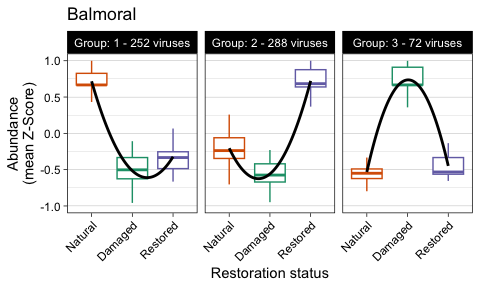
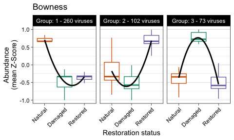
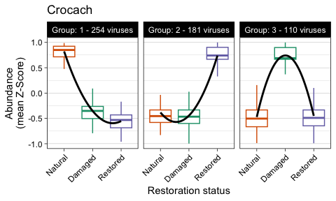
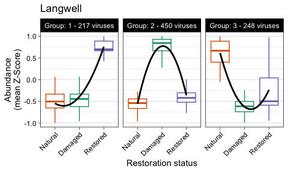
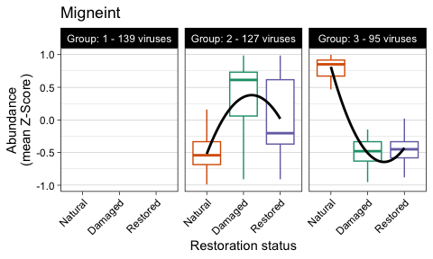
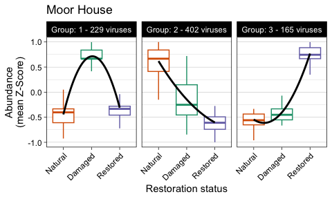
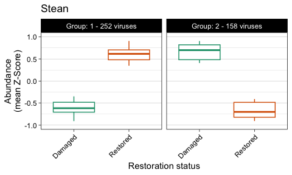
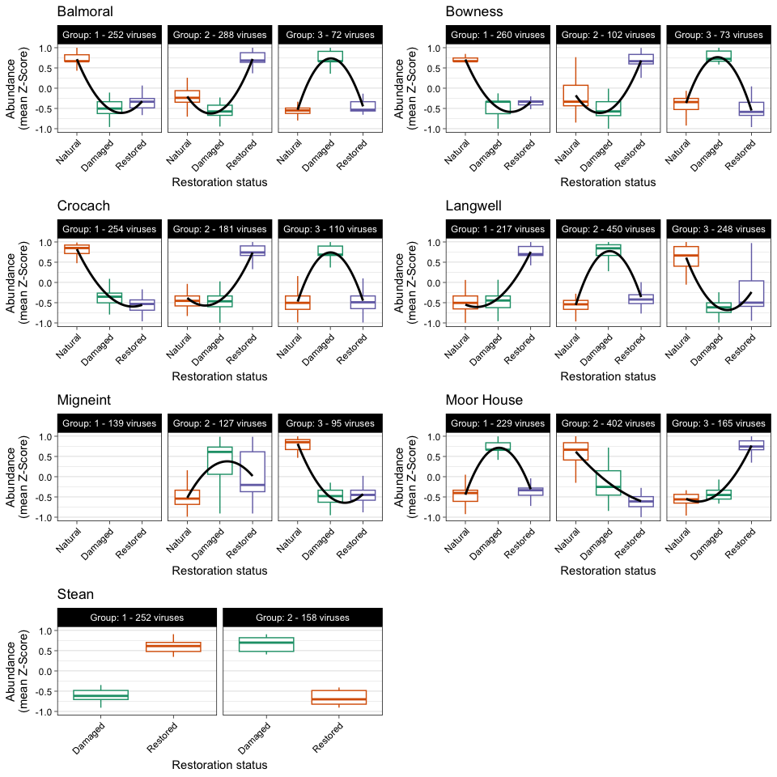

Virus Genome DESeq and Abundance Clustering
================
James C. Kosmopoulos
2025-08-05

# Load packages

``` r
library("dplyr");packageVersion("dplyr")
```

    ## [1] '1.1.4'

``` r
library("reshape2");packageVersion("reshape2")
```

    ## [1] '1.4.4'

``` r
library("tidyverse");packageVersion("tidyverse")
```

    ## [1] '2.0.0'

``` r
library("DESeq2");packageVersion("DESeq2")
```

    ## [1] '1.44.0'

``` r
library("biobroom");packageVersion("biobroom")
```

    ## [1] '1.36.0'

# Load data

``` r
virus_genome_counts <- readRDS("../Data/virus_genome_counts.RDS")
metadata <- readRDS("../Data/metadata_simple.RDS")
row.names(metadata) <- metadata$SampleID
metadata <- metadata[,-1]
tmeans <- readRDS("../Data/virus_tmeans_norm_50.RDS")
```

# Run models and retrieve results, site by site

## Balmoral

### DESeq

``` r
metadata_balmoral <- subset(metadata, site=="Balmoral")
dds_balmoral <- DESeqDataSetFromMatrix(countData = virus_genome_counts %>%
                                         select(all_of(rownames(metadata_balmoral))),
                                       colData = metadata_balmoral,
                                       design =  ~ treatment)
dds_balmoral <- DESeq(dds_balmoral, test = "LRT", reduced = ~1)
res_balmoral <- results(dds_balmoral) %>% tidy() %>% dplyr::rename("Virus" = "gene")
res_balmoral
```

    ## # A tibble: 1,548 × 7
    ##    Virus                baseMean estimate stderror statistic  p.value p.adjusted
    ##    <chr>                   <dbl>    <dbl>    <dbl>     <dbl>    <dbl>      <dbl>
    ##  1 BAr1A1B1C_vRhyme_un…  1371.     1.55      0.826      9.85  7.26e-3    2.09e-2
    ##  2 LASCr2D2E2F_vRhyme_…    38.6   -0.368     0.753      5.05  8.01e-2    1.39e-1
    ##  3 MGr2D2E2F_vRhyme_un…    26.8   -0.0751    0.858     31.0   1.85e-7    1.68e-6
    ##  4 SEr3G3H3I_vRhyme_un…     3.17  -0.807     1.05       1.08  5.83e-1    6.59e-1
    ##  5 LASCr2D2E2F_vRhyme_…   620.     7.79      1.26      31.4   1.50e-7    1.40e-6
    ##  6 LASCr2D2E2F_vRhyme_…    13.9   -0.0914    0.675      4.75  9.30e-2    1.55e-1
    ##  7 BAr3G3H3I_vRhyme_un…   137.    -5.48      1.98      11.4  NA         NA      
    ##  8 MGr1A1B1C_vRhyme_un…     1.70  -3.85      1.68       7.74  2.09e-2    4.97e-2
    ##  9 SEr3G3H3I_vRhyme_un…    26.6   -0.989     0.947     19.5   5.79e-5    3.19e-4
    ## 10 MGr1A1B1C_vRhyme_un…    15.9   -0.292     0.640     14.3   8.02e-4    3.16e-3
    ## # ℹ 1,538 more rows

### Save Balmoral results

``` r
res_balmoral <- res_balmoral %>%
  filter(!is.na(p.value))
head(res_balmoral)
```

    ## # A tibble: 6 × 7
    ##   Virus                  baseMean estimate stderror statistic p.value p.adjusted
    ##   <chr>                     <dbl>    <dbl>    <dbl>     <dbl>   <dbl>      <dbl>
    ## 1 BAr1A1B1C_vRhyme_unbi…  1371.     1.55      0.826      9.85 7.26e-3 0.0209    
    ## 2 LASCr2D2E2F_vRhyme_un…    38.6   -0.368     0.753      5.05 8.01e-2 0.139     
    ## 3 MGr2D2E2F_vRhyme_unbi…    26.8   -0.0751    0.858     31.0  1.85e-7 0.00000168
    ## 4 SEr3G3H3I_vRhyme_unbi…     3.17  -0.807     1.05       1.08 5.83e-1 0.659     
    ## 5 LASCr2D2E2F_vRhyme_un…   620.     7.79      1.26      31.4  1.50e-7 0.00000140
    ## 6 LASCr2D2E2F_vRhyme_bi…    13.9   -0.0914    0.675      4.75 9.30e-2 0.155

### Subset to return genomes with padj \< 0.05 in Balmoral

``` r
padj.cutoff <- 0.05 # Set alpha to 0.05
sig_virus_balmoral <- res_balmoral %>%
  filter(p.adjusted < padj.cutoff)
insig_virus_balmoral <- res_balmoral %>%
  filter(p.adjusted >= padj.cutoff)
```

### Get number of significant genomes in Balmoral

``` r
length(unique(sig_virus_balmoral$Virus))
```

    ## [1] 616

### Get number of insignificant genomes in Balmoral

``` r
length(unique(insig_virus_balmoral$Virus))
```

    ## [1] 835

### Subset tmeans with just significant viruses in Balmoral

``` r
tmeans_balmoral <- tmeans %>%
  select(all_of(rownames(metadata_balmoral)))
tmeans_sig_balmoral <- tmeans_balmoral[rownames(tmeans_balmoral) %in% sig_virus_balmoral$Virus, ]
```

## Bowness

### DESeq

``` r
metadata_bowness <- subset(metadata, site=="Bowness")
dds_bowness <- DESeqDataSetFromMatrix(countData = virus_genome_counts %>%
                                         select(all_of(rownames(metadata_bowness))),
                                       colData = metadata_bowness,
                                       design =  ~ treatment)
dds_bowness <- DESeq(dds_bowness, test = "LRT", reduced = ~1)
res_bowness <- results(dds_bowness) %>% tidy() %>% dplyr::rename("Virus" = "gene")
res_bowness
```

    ## # A tibble: 1,548 × 7
    ##    Virus                baseMean estimate stderror statistic  p.value p.adjusted
    ##    <chr>                   <dbl>    <dbl>    <dbl>     <dbl>    <dbl>      <dbl>
    ##  1 BAr1A1B1C_vRhyme_un…  235.       0.264    0.450     0.571 7.52e- 1   8.45e- 1
    ##  2 LASCr2D2E2F_vRhyme_…   16.8     -0.442    0.678     0.542 7.63e- 1   8.54e- 1
    ##  3 MGr2D2E2F_vRhyme_un…    4.71    -0.517    0.955     0.786 6.75e- 1   7.89e- 1
    ##  4 SEr3G3H3I_vRhyme_un…    6.81     0.179    0.913     0.477 7.88e- 1   8.64e- 1
    ##  5 LASCr2D2E2F_vRhyme_…  652.      -2.36     0.712    10.7   4.76e- 3   1.92e- 2
    ##  6 LASCr2D2E2F_vRhyme_…  310.      -6.37     0.681   114.    2.02e-25   7.00e-23
    ##  7 BAr3G3H3I_vRhyme_un…   12.5      0.507    0.799     3.68  1.59e- 1   2.97e- 1
    ##  8 MGr1A1B1C_vRhyme_un…    0.625    1.99     1.97      1.75  4.17e- 1  NA       
    ##  9 SEr3G3H3I_vRhyme_un…    5.89     0.777    0.765     1.06  5.87e- 1   7.12e- 1
    ## 10 MGr1A1B1C_vRhyme_un…   20.1     -0.755    0.482     5.73  5.71e- 2   1.37e- 1
    ## # ℹ 1,538 more rows

### Save Bowness results

``` r
res_bowness <- res_bowness %>%
  filter(!is.na(p.value))
head(res_bowness)
```

    ## # A tibble: 6 × 7
    ##   Virus                 baseMean estimate stderror statistic  p.value p.adjusted
    ##   <chr>                    <dbl>    <dbl>    <dbl>     <dbl>    <dbl>      <dbl>
    ## 1 BAr1A1B1C_vRhyme_unb…   235.      0.264    0.450     0.571 7.52e- 1   8.45e- 1
    ## 2 LASCr2D2E2F_vRhyme_u…    16.8    -0.442    0.678     0.542 7.63e- 1   8.54e- 1
    ## 3 MGr2D2E2F_vRhyme_unb…     4.71   -0.517    0.955     0.786 6.75e- 1   7.89e- 1
    ## 4 SEr3G3H3I_vRhyme_unb…     6.81    0.179    0.913     0.477 7.88e- 1   8.64e- 1
    ## 5 LASCr2D2E2F_vRhyme_u…   652.     -2.36     0.712    10.7   4.76e- 3   1.92e- 2
    ## 6 LASCr2D2E2F_vRhyme_b…   310.     -6.37     0.681   114.    2.02e-25   7.00e-23

### Subset to return genomes with padj \< 0.05 in Bowness

``` r
padj.cutoff <- 0.05 # Set alpha to 0.05
sig_virus_bowness <- res_bowness %>%
  filter(p.adjusted < padj.cutoff)
insig_virus_bowness <- res_bowness %>%
  filter(p.adjusted >= padj.cutoff)
```

### Get number of significant genomes in Bowness

``` r
length(unique(sig_virus_bowness$Virus))
```

    ## [1] 436

### Get number of insignificant genomes in Bowness

``` r
length(unique(insig_virus_bowness$Virus))
```

    ## [1] 951

### Subset tmeans with just significant viruses in Bowness

``` r
tmeans_bowness <- tmeans %>%
  select(all_of(rownames(metadata_bowness)))
tmeans_sig_bowness <- tmeans_bowness[rownames(tmeans_bowness) %in% sig_virus_bowness$Virus, ]
```

## Crocach

### DESeq

``` r
metadata_crocach <- subset(metadata, site=="Crocach")
dds_crocach <- DESeqDataSetFromMatrix(countData = virus_genome_counts %>%
                                         select(all_of(rownames(metadata_crocach))),
                                       colData = metadata_crocach,
                                       design =  ~ treatment)
dds_crocach <- DESeq(dds_crocach, test = "LRT", reduced = ~1)
res_crocach <- results(dds_crocach) %>% tidy() %>% dplyr::rename("Virus" = "gene")
res_crocach
```

    ## # A tibble: 1,548 × 7
    ##    Virus                baseMean estimate stderror statistic  p.value p.adjusted
    ##    <chr>                   <dbl>    <dbl>    <dbl>     <dbl>    <dbl>      <dbl>
    ##  1 BAr1A1B1C_vRhyme_un…  1276.     -0.113    0.403     0.914 6.33e- 1   7.44e- 1
    ##  2 LASCr2D2E2F_vRhyme_…   258.      1.13     0.635    16.0   3.43e- 4   1.54e- 3
    ##  3 MGr2D2E2F_vRhyme_un…    17.2     1.48     0.722     6.89  3.18e- 2   7.35e- 2
    ##  4 SEr3G3H3I_vRhyme_un…     3.58    0.897    0.977     0.875 6.46e- 1  NA       
    ##  5 LASCr2D2E2F_vRhyme_…   553.     -1.45     1.06     12.5   1.95e- 3   7.06e- 3
    ##  6 LASCr2D2E2F_vRhyme_…    76.8    -3.90     0.856    20.1   4.29e- 5   2.42e- 4
    ##  7 BAr3G3H3I_vRhyme_un…     5.95   -1.26     0.793     2.59  2.74e- 1   4.15e- 1
    ##  8 MGr1A1B1C_vRhyme_un…   271.    -10.2      1.42     80.2   3.85e-18   3.55e-16
    ##  9 SEr3G3H3I_vRhyme_un…    17.0     2.94     0.772    17.3   1.78e- 4   8.56e- 4
    ## 10 MGr1A1B1C_vRhyme_un…    17.4     0.354    0.566     1.12  5.71e- 1   6.93e- 1
    ## # ℹ 1,538 more rows

### Save Crocach results

``` r
res_crocach <- res_crocach %>%
  filter(!is.na(p.value))
head(res_crocach)
```

    ## # A tibble: 6 × 7
    ##   Virus                  baseMean estimate stderror statistic p.value p.adjusted
    ##   <chr>                     <dbl>    <dbl>    <dbl>     <dbl>   <dbl>      <dbl>
    ## 1 BAr1A1B1C_vRhyme_unbi…  1276.     -0.113    0.403     0.914 6.33e-1   0.744   
    ## 2 LASCr2D2E2F_vRhyme_un…   258.      1.13     0.635    16.0   3.43e-4   0.00154 
    ## 3 MGr2D2E2F_vRhyme_unbi…    17.2     1.48     0.722     6.89  3.18e-2   0.0735  
    ## 4 SEr3G3H3I_vRhyme_unbi…     3.58    0.897    0.977     0.875 6.46e-1  NA       
    ## 5 LASCr2D2E2F_vRhyme_un…   553.     -1.45     1.06     12.5   1.95e-3   0.00706 
    ## 6 LASCr2D2E2F_vRhyme_bi…    76.8    -3.90     0.856    20.1   4.29e-5   0.000242

### Subset to return genomes with padj \< 0.05 in Crocach

``` r
padj.cutoff <- 0.05 # Set alpha to 0.05
sig_virus_crocach <- res_crocach %>%
  filter(p.adjusted < padj.cutoff)
insig_virus_crocach <- res_crocach %>%
  filter(p.adjusted >= padj.cutoff)
```

### Get number of significant genomes in Crocach

``` r
length(unique(sig_virus_crocach$Virus))
```

    ## [1] 554

### Get number of insignificant genomes in Crocach

``` r
length(unique(insig_virus_crocach$Virus))
```

    ## [1] 827

### Subset tmeans with just significant viruses in Crocach

``` r
tmeans_crocach <- tmeans %>%
  select(all_of(rownames(metadata_crocach)))
tmeans_sig_crocach <- tmeans_crocach[rownames(tmeans_crocach) %in% sig_virus_crocach$Virus, ]
```

## Langwell

### DESeq

``` r
metadata_langwell <- subset(metadata, site=="Langwell")
dds_langwell <- DESeqDataSetFromMatrix(countData = virus_genome_counts %>%
                                         select(all_of(rownames(metadata_langwell))),
                                       colData = metadata_langwell,
                                       design =  ~ treatment)
dds_langwell <- DESeq(dds_langwell, test = "LRT", reduced = ~1)
res_langwell <- results(dds_langwell) %>% tidy() %>% dplyr::rename("Virus" = "gene")
res_langwell
```

    ## # A tibble: 1,548 × 7
    ##    Virus               baseMean estimate stderror statistic   p.value p.adjusted
    ##    <chr>                  <dbl>    <dbl>    <dbl>     <dbl>     <dbl>      <dbl>
    ##  1 BAr1A1B1C_vRhyme_u…   711.     0.471     0.647    11.7    2.91e- 3   5.76e- 3
    ##  2 LASCr2D2E2F_vRhyme…   432.     5.77      0.567    77.3    1.63e-17   2.60e-16
    ##  3 MGr2D2E2F_vRhyme_u…    43.0    0.919     1.25     28.3   NA         NA       
    ##  4 SEr3G3H3I_vRhyme_u…     3.57  -0.641     0.917     0.606  7.39e- 1   7.82e- 1
    ##  5 LASCr2D2E2F_vRhyme…   311.    -2.80      1.10     22.3    1.44e- 5   4.36e- 5
    ##  6 LASCr2D2E2F_vRhyme…   807.     0.442     0.615    55.4    9.25e-13   7.78e-12
    ##  7 BAr3G3H3I_vRhyme_u…    15.9    0.315     0.765    18.0    1.24e- 4   3.22e- 4
    ##  8 MGr1A1B1C_vRhyme_u…     2.09  -1.71      1.26      2.04   3.61e- 1  NA       
    ##  9 SEr3G3H3I_vRhyme_u…     5.01  -1.53      0.915     2.93   2.31e- 1   2.97e- 1
    ## 10 MGr1A1B1C_vRhyme_u…   941.     0.0680    0.815   102.     8.33e-23   2.87e-21
    ## # ℹ 1,538 more rows

### Save Langwell results

``` r
res_langwell <- res_langwell %>%
  filter(!is.na(p.value))
head(res_langwell)
```

    ## # A tibble: 6 × 7
    ##   Virus                 baseMean estimate stderror statistic  p.value p.adjusted
    ##   <chr>                    <dbl>    <dbl>    <dbl>     <dbl>    <dbl>      <dbl>
    ## 1 BAr1A1B1C_vRhyme_unb…   711.      0.471    0.647    11.7   2.91e- 3   5.76e- 3
    ## 2 LASCr2D2E2F_vRhyme_u…   432.      5.77     0.567    77.3   1.63e-17   2.60e-16
    ## 3 SEr3G3H3I_vRhyme_unb…     3.57   -0.641    0.917     0.606 7.39e- 1   7.82e- 1
    ## 4 LASCr2D2E2F_vRhyme_u…   311.     -2.80     1.10     22.3   1.44e- 5   4.36e- 5
    ## 5 LASCr2D2E2F_vRhyme_b…   807.      0.442    0.615    55.4   9.25e-13   7.78e-12
    ## 6 BAr3G3H3I_vRhyme_unb…    15.9     0.315    0.765    18.0   1.24e- 4   3.22e- 4

### Subset to return genomes with padj \< 0.05 in Langwell

``` r
padj.cutoff <- 0.05 # Set alpha to 0.05
sig_virus_langwell <- res_langwell %>%
  filter(p.adjusted < padj.cutoff)
insig_virus_langwell <- res_langwell %>%
  filter(p.adjusted >= padj.cutoff)
```

### Get number of significant genomes in Langwell

``` r
length(unique(sig_virus_langwell$Virus))
```

    ## [1] 925

### Get number of insignificant genomes in Langwell

``` r
length(unique(insig_virus_langwell$Virus))
```

    ## [1] 554

### Subset tmeans with just significant viruses in Langwell

``` r
tmeans_langwell <- tmeans %>%
  select(all_of(rownames(metadata_langwell)))
tmeans_sig_langwell <- tmeans_langwell[rownames(tmeans_langwell) %in% sig_virus_langwell$Virus, ]
```

## Migneint

### DESeq

``` r
metadata_migneint <- subset(metadata, site=="Migneint")
dds_migneint <- DESeqDataSetFromMatrix(countData = virus_genome_counts %>%
                                         select(all_of(rownames(metadata_migneint))),
                                       colData = metadata_migneint,
                                       design =  ~ treatment)
dds_migneint <- DESeq(dds_migneint, test = "LRT", reduced = ~1)
res_migneint <- results(dds_migneint) %>% tidy() %>% dplyr::rename("Virus" = "gene")
res_migneint
```

    ## # A tibble: 1,548 × 7
    ##    Virus               baseMean estimate stderror statistic   p.value p.adjusted
    ##    <chr>                  <dbl>    <dbl>    <dbl>     <dbl>     <dbl>      <dbl>
    ##  1 BAr1A1B1C_vRhyme_u…   694.     1.72      0.834      5.50 NA         NA       
    ##  2 LASCr2D2E2F_vRhyme…   191.    -0.0725    0.542      2.48  2.89e- 1   4.87e- 1
    ##  3 MGr2D2E2F_vRhyme_u…   330.     0.192     0.748     10.9   4.29e- 3   2.16e- 2
    ##  4 SEr3G3H3I_vRhyme_u…     3.36  -2.76      1.23       6.47  3.94e- 2   1.18e- 1
    ##  5 LASCr2D2E2F_vRhyme…    12.4   -1.37      0.750      6.94  3.12e- 2   9.96e- 2
    ##  6 LASCr2D2E2F_vRhyme…   120.     1.08      0.589     55.6   8.42e-13   9.35e-11
    ##  7 BAr3G3H3I_vRhyme_u…     5.63  -1.26      0.747      5.57  6.17e- 2   1.66e- 1
    ##  8 MGr1A1B1C_vRhyme_u…   262.     0.805     0.776     13.1   1.45e- 3   9.46e- 3
    ##  9 SEr3G3H3I_vRhyme_u…     7.47  -0.141     0.659      1.30  5.21e- 1   6.96e- 1
    ## 10 MGr1A1B1C_vRhyme_u…  2022.     1.64      1.51      25.2  NA         NA       
    ## # ℹ 1,538 more rows

### Save Migneint results

``` r
res_migneint <- res_migneint %>%
  filter(!is.na(p.value))
head(res_migneint)
```

    ## # A tibble: 6 × 7
    ##   Virus                 baseMean estimate stderror statistic  p.value p.adjusted
    ##   <chr>                    <dbl>    <dbl>    <dbl>     <dbl>    <dbl>      <dbl>
    ## 1 LASCr2D2E2F_vRhyme_u…   191.    -0.0725    0.542      2.48 2.89e- 1   4.87e- 1
    ## 2 MGr2D2E2F_vRhyme_unb…   330.     0.192     0.748     10.9  4.29e- 3   2.16e- 2
    ## 3 SEr3G3H3I_vRhyme_unb…     3.36  -2.76      1.23       6.47 3.94e- 2   1.18e- 1
    ## 4 LASCr2D2E2F_vRhyme_u…    12.4   -1.37      0.750      6.94 3.12e- 2   9.96e- 2
    ## 5 LASCr2D2E2F_vRhyme_b…   120.     1.08      0.589     55.6  8.42e-13   9.35e-11
    ## 6 BAr3G3H3I_vRhyme_unb…     5.63  -1.26      0.747      5.57 6.17e- 2   1.66e- 1

### Subset to return genomes with padj \< 0.05 in Migneint

``` r
padj.cutoff <- 0.05 # Set alpha to 0.05
sig_virus_migneint <- res_migneint %>%
  filter(p.adjusted < padj.cutoff)
insig_virus_migneint <- res_migneint %>%
  filter(p.adjusted >= padj.cutoff)
```

### Get number of significant genomes in Migneint

``` r
length(unique(sig_virus_migneint$Virus))
```

    ## [1] 366

### Get number of insignificant genomes in Migneint

``` r
length(unique(insig_virus_migneint$Virus))
```

    ## [1] 1085

### Subset tmeans with just significant viruses in Migneint

``` r
tmeans_migneint <- tmeans %>%
  select(all_of(rownames(metadata_migneint)))
tmeans_sig_migneint <- tmeans_migneint[rownames(tmeans_migneint) %in% sig_virus_migneint$Virus, ]
```

## Moor House

### DESeq

``` r
metadata_moor_house <- subset(metadata, site=="Moor_House")
dds_moor_house <- DESeqDataSetFromMatrix(countData = virus_genome_counts %>%
                                         select(all_of(rownames(metadata_moor_house))),
                                       colData = metadata_moor_house,
                                       design =  ~ treatment)
dds_moor_house <- DESeq(dds_moor_house, test = "LRT", reduced = ~1)
res_moor_house <- results(dds_moor_house) %>% tidy() %>% dplyr::rename("Virus" = "gene")
res_moor_house
```

    ## # A tibble: 1,548 × 7
    ##    Virus               baseMean estimate stderror statistic   p.value p.adjusted
    ##    <chr>                  <dbl>    <dbl>    <dbl>     <dbl>     <dbl>      <dbl>
    ##  1 BAr1A1B1C_vRhyme_u…   737.     -1.86     0.799     6.33  NA          NA      
    ##  2 LASCr2D2E2F_vRhyme…    63.8    -1.65     0.792     4.52   1.04e- 1    1.59e-1
    ##  3 MGr2D2E2F_vRhyme_u…    13.5     1.67     0.898     4.49   1.06e- 1    1.61e-1
    ##  4 SEr3G3H3I_vRhyme_u…     4.53   -0.743    0.912     0.805  6.69e- 1    7.42e-1
    ##  5 LASCr2D2E2F_vRhyme…   375.     -2.79     0.872    42.2    6.85e-10    1.17e-8
    ##  6 LASCr2D2E2F_vRhyme…    74.7    -2.75     0.979    11.2    3.62e- 3    8.40e-3
    ##  7 BAr3G3H3I_vRhyme_u…    66.9    -4.00     1.27     18.4   NA          NA      
    ##  8 MGr1A1B1C_vRhyme_u…    12.6    -5.38     2.06      8.82  NA          NA      
    ##  9 SEr3G3H3I_vRhyme_u…     5.07    1.44     0.912     3.85   1.46e- 1    2.13e-1
    ## 10 MGr1A1B1C_vRhyme_u…    15.7     0.904    0.649     2.01   3.67e- 1    4.57e-1
    ## # ℹ 1,538 more rows

### Save Moor House results

``` r
res_moor_house <- res_moor_house %>%
  filter(!is.na(p.value))
head(res_moor_house)
```

    ## # A tibble: 6 × 7
    ##   Virus                 baseMean estimate stderror statistic  p.value p.adjusted
    ##   <chr>                    <dbl>    <dbl>    <dbl>     <dbl>    <dbl>      <dbl>
    ## 1 LASCr2D2E2F_vRhyme_u…    63.8    -1.65     0.792     4.52  1.04e- 1    1.59e-1
    ## 2 MGr2D2E2F_vRhyme_unb…    13.5     1.67     0.898     4.49  1.06e- 1    1.61e-1
    ## 3 SEr3G3H3I_vRhyme_unb…     4.53   -0.743    0.912     0.805 6.69e- 1    7.42e-1
    ## 4 LASCr2D2E2F_vRhyme_u…   375.     -2.79     0.872    42.2   6.85e-10    1.17e-8
    ## 5 LASCr2D2E2F_vRhyme_b…    74.7    -2.75     0.979    11.2   3.62e- 3    8.40e-3
    ## 6 SEr3G3H3I_vRhyme_unb…     5.07    1.44     0.912     3.85  1.46e- 1    2.13e-1

### Subset to return genomes with padj \< 0.05 in Moor House

``` r
padj.cutoff <- 0.05 # Set alpha to 0.05
sig_virus_moor_house <- res_moor_house %>%
  filter(p.adjusted < padj.cutoff)
insig_virus_moor_house <- res_moor_house %>%
  filter(p.adjusted >= padj.cutoff)
```

### Get number of significant genomes in Moor House

``` r
length(unique(sig_virus_moor_house$Virus))
```

    ## [1] 804

### Get number of insignificant genomes in Moor House

``` r
length(unique(insig_virus_moor_house$Virus))
```

    ## [1] 643

### Subset tmeans with just significant viruses in Moor House

``` r
tmeans_moor_house <- tmeans %>%
  select(all_of(rownames(metadata_moor_house)))
tmeans_sig_moor_house <- tmeans_moor_house[rownames(tmeans_moor_house) %in% sig_virus_moor_house$Virus, ]
```

## Stean

### DESeq

``` r
metadata_stean <- subset(metadata, site=="Stean")
dds_stean <- DESeqDataSetFromMatrix(countData = virus_genome_counts %>%
                                         select(all_of(rownames(metadata_stean))),
                                       colData = metadata_stean,
                                       design =  ~ treatment)
dds_stean <- DESeq(dds_stean, test = "LRT", reduced = ~1)
res_stean <- results(dds_stean) %>% tidy() %>% dplyr::rename("Virus" = "gene")
res_stean
```

    ## # A tibble: 1,548 × 7
    ##    Virus                baseMean estimate stderror statistic  p.value p.adjusted
    ##    <chr>                   <dbl>    <dbl>    <dbl>     <dbl>    <dbl>      <dbl>
    ##  1 BAr1A1B1C_vRhyme_un…  2108.    -0.630     0.670   0.877    0.349      0.535  
    ##  2 LASCr2D2E2F_vRhyme_…   102.    -0.199     0.893   0.0498   0.823      0.906  
    ##  3 MGr2D2E2F_vRhyme_un…    24.6   -2.56      1.00    6.18     0.0129     0.0440 
    ##  4 SEr3G3H3I_vRhyme_un…   158.    -2.08      0.955   4.40     0.0359     0.0958 
    ##  5 LASCr2D2E2F_vRhyme_…  1363.     3.72      1.05   10.2      0.00142    0.00697
    ##  6 LASCr2D2E2F_vRhyme_…    15.7   -0.822     0.743   1.22     0.269      0.443  
    ##  7 BAr3G3H3I_vRhyme_un…     6.91  -1.01      0.824   1.59     0.207      0.372  
    ##  8 MGr1A1B1C_vRhyme_un…     1.50   0.0973    1.15    0.00823  0.928      0.960  
    ##  9 SEr3G3H3I_vRhyme_un…   103.    -3.88      1.39    6.28    NA         NA      
    ## 10 MGr1A1B1C_vRhyme_un…    37.0   -1.32      0.890   2.16     0.142      0.280  
    ## # ℹ 1,538 more rows

### Save Stean results

``` r
res_stean <- res_stean %>%
  filter(!is.na(p.value))
head(res_stean)
```

    ## # A tibble: 6 × 7
    ##   Virus                  baseMean estimate stderror statistic p.value p.adjusted
    ##   <chr>                     <dbl>    <dbl>    <dbl>     <dbl>   <dbl>      <dbl>
    ## 1 BAr1A1B1C_vRhyme_unbi…   2108.    -0.630    0.670    0.877  0.349      0.535  
    ## 2 LASCr2D2E2F_vRhyme_un…    102.    -0.199    0.893    0.0498 0.823      0.906  
    ## 3 MGr2D2E2F_vRhyme_unbi…     24.6   -2.56     1.00     6.18   0.0129     0.0440 
    ## 4 SEr3G3H3I_vRhyme_unbi…    158.    -2.08     0.955    4.40   0.0359     0.0958 
    ## 5 LASCr2D2E2F_vRhyme_un…   1363.     3.72     1.05    10.2    0.00142    0.00697
    ## 6 LASCr2D2E2F_vRhyme_bi…     15.7   -0.822    0.743    1.22   0.269      0.443

### Subset to return genomes with padj \< 0.05 in Stean

``` r
padj.cutoff <- 0.05 # Set alpha to 0.05
sig_virus_stean <- res_stean %>%
  filter(p.adjusted < padj.cutoff)
insig_virus_stean <- res_stean %>%
  filter(p.adjusted >= padj.cutoff)
```

### Get number of significant genomes in Stean

``` r
length(unique(sig_virus_stean$Virus))
```

    ## [1] 418

### Get number of insignificant genomes in Stean

``` r
length(unique(insig_virus_stean$Virus))
```

    ## [1] 946

### Subset tmeans with just significant viruses in Stean

``` r
tmeans_stean <- tmeans %>%
  select(all_of(rownames(metadata_stean)))
tmeans_sig_stean <- tmeans_stean[rownames(tmeans_stean) %in% sig_virus_stean$Virus, ]
```

# Combine DESeq2 result tables and write

``` r
combined_deseq_results <- rbind(res_balmoral %>% mutate(site = "Balmoral"),
                                res_bowness %>% mutate(site = "Bowness"),
                                res_crocach %>% mutate(site = "Crocach"),
                                res_langwell %>% mutate(site = "Langwell"),
                                res_migneint %>% mutate(site = "Migneint"),
                                res_moor_house %>% mutate(site = "Moor House"),
                                res_stean %>% mutate(site = "Stean")
                                )
write_csv(combined_deseq_results, file = "../Tables/virus_deseq_results_combined.csv")
head(combined_deseq_results)
```

    ## # A tibble: 6 × 8
    ##   Virus            baseMean estimate stderror statistic p.value p.adjusted site 
    ##   <chr>               <dbl>    <dbl>    <dbl>     <dbl>   <dbl>      <dbl> <chr>
    ## 1 BAr1A1B1C_vRhym…  1371.     1.55      0.826      9.85 7.26e-3 0.0209     Balm…
    ## 2 LASCr2D2E2F_vRh…    38.6   -0.368     0.753      5.05 8.01e-2 0.139      Balm…
    ## 3 MGr2D2E2F_vRhym…    26.8   -0.0751    0.858     31.0  1.85e-7 0.00000168 Balm…
    ## 4 SEr3G3H3I_vRhym…     3.17  -0.807     1.05       1.08 5.83e-1 0.659      Balm…
    ## 5 LASCr2D2E2F_vRh…   620.     7.79      1.26      31.4  1.50e-7 0.00000140 Balm…
    ## 6 LASCr2D2E2F_vRh…    13.9   -0.0914    0.675      4.75 9.30e-2 0.155      Balm…

# Cluster viral genomes by their abundance patterns across treatments

## General functions and format metadata

``` r
tidy_otu <- function(otu) {
  as.data.frame(otu) %>%
    mutate(Virus = row.names(otu)) %>%
    tidyr::gather(key = "Sample", value = "Count", -Virus)
}
rel_ab <- function(otu, total = 100) {
  t(t(otu)/colSums(otu)) * 100
}

metadata$Sample <- rownames(metadata)
```

## Balmoral

### Calculate the zscores of each genome across samples and then calculate the mean zvalue for each treatment

``` r
virus.zs.balmoral <- tmeans_sig_balmoral %>%
  filter(row.names(.) %in% sig_virus_balmoral$Virus) %>% # Only include viruses significant from DESeq
  rel_ab() %>% 
  tidy_otu %>%
  group_by(Virus) %>%
  mutate(zValue = (Count - mean(Count))/sd(Count)) %>%
  inner_join(metadata, by = "Sample") %>%
  group_by(treatment, Virus) %>%
  summarise(MeanZS = mean(zValue)) 
```

### Format zscores as a matrix

``` r
virus.zs.matrix.balmoral <- virus.zs.balmoral %>%
  spread(key = Virus, value = MeanZS) %>%
  as.data.frame()
row.names(virus.zs.matrix.balmoral) <- virus.zs.matrix.balmoral$Treatment
virus.zs.matrix.balmoral <- virus.zs.matrix.balmoral[,-1]
virus.zs.matrix.balmoral <- as.matrix(virus.zs.matrix.balmoral)

# Check for NA, NaN, or Inf values and handle them
virus.zs.matrix.balmoral[is.na(virus.zs.matrix.balmoral)] <- 0
virus.zs.matrix.balmoral[is.nan(virus.zs.matrix.balmoral)] <- 0
virus.zs.matrix.balmoral[is.infinite(virus.zs.matrix.balmoral)] <- 0

virus.dist.balmoral <- dist(t(virus.zs.matrix.balmoral))
```

### Perform the hierarchical clustering

``` r
virus.hc.balmoral <- hclust(as.dist(virus.dist.balmoral), method = "ward.D")
virus.ord.balmoral <- virus.hc.balmoral$labels[virus.hc.balmoral$order]
virus.ord.balmoral <- data.frame(Virus = virus.ord.balmoral, order = 1:length(virus.ord.balmoral))
virus.cut.balmoral <- cutree(virus.hc.balmoral[c(1,2,4)],k = 3) # k = 3 for three treatments
virus.clusters.balmoral <- data.frame(Virus = names(virus.cut.balmoral),
                                      Cluster = virus.cut.balmoral) %>%
  inner_join(virus.ord.balmoral, by = "Virus") %>%
  inner_join(virus.zs.balmoral, by = "Virus") %>%
  mutate(Title = factor(treatment, levels = c("NAT", "DAM", "REST")))
virus.clusters.balmoral <- virus.clusters.balmoral %>%
  group_by(Cluster) %>%
  mutate(Cluster.size = n_distinct(Virus)) %>%
  mutate(Title = factor(treatment, levels = c("NAT", "DAM", "REST")))
virus.clusters.balmoral$Title <- paste("Group: ", virus.clusters.balmoral$Cluster, " - ", virus.clusters.balmoral$Cluster.size, " viruses", sep = "")

head(virus.clusters.balmoral)
```

    ## # A tibble: 6 × 7
    ## # Groups:   Cluster [1]
    ##   Virus                   Cluster order treatment MeanZS Title      Cluster.size
    ##   <chr>                     <int> <int> <fct>      <dbl> <chr>             <int>
    ## 1 BAr1A1B1C_vRhyme_bin_10       1    55 DAM       -0.479 Group: 1 …          252
    ## 2 BAr1A1B1C_vRhyme_bin_10       1    55 NAT        0.957 Group: 1 …          252
    ## 3 BAr1A1B1C_vRhyme_bin_10       1    55 REST      -0.479 Group: 1 …          252
    ## 4 BAr1A1B1C_vRhyme_bin_13       1    22 DAM       -0.576 Group: 1 …          252
    ## 5 BAr1A1B1C_vRhyme_bin_13       1    22 NAT        1.15  Group: 1 …          252
    ## 6 BAr1A1B1C_vRhyme_bin_13       1    22 REST      -0.576 Group: 1 …          252

### Plot Z-Score clusters

``` r
plot.clusters.balmoral <-
ggplot(data = virus.clusters.balmoral, aes(x = factor(treatment, levels = c("NAT", "DAM", "REST")), y = MeanZS)) +
  geom_boxplot(aes(color = treatment), outlier.shape = NA) +
  scale_color_brewer(palette = "Dark2") +
  geom_smooth(aes(group = 1), method = "lm", color="black", se = F, formula = y ~ poly(x, 2),) +
  xlab("Restoration status") +
  ylab("Abundance\n(mean Z-Score)") +
  scale_x_discrete(labels = c("Natural", "Damaged", "Restored")) +
  facet_wrap(~Title, ncol = 3, labeller = labeller(label_column = as.character)) +
  theme_linedraw() +
  theme(legend.position = "none", panel.grid.major.x = element_blank(), axis.text.x = element_text(angle = 45, hjust=1)) +
  ylim(-1,1) +
  ggtitle("Balmoral")
plot.clusters.balmoral
```

<!-- -->

### Manually rename cluster titles based on abundance trends

``` r
virus.clusters.balmoral <- virus.clusters.balmoral %>%
  mutate(Title = case_when(Cluster == 1 ~ "Natural-abundant",
                           Cluster == 2 ~ "Restored-abundant",
                           Cluster == 3 ~ "Damaged-abundant"))
virus.clusters.balmoral$site <- "Balmoral"
head(virus.clusters.balmoral)
```

    ## # A tibble: 6 × 8
    ## # Groups:   Cluster [1]
    ##   Virus                  Cluster order treatment MeanZS Title Cluster.size site 
    ##   <chr>                    <int> <int> <fct>      <dbl> <chr>        <int> <chr>
    ## 1 BAr1A1B1C_vRhyme_bin_…       1    55 DAM       -0.479 Natu…          252 Balm…
    ## 2 BAr1A1B1C_vRhyme_bin_…       1    55 NAT        0.957 Natu…          252 Balm…
    ## 3 BAr1A1B1C_vRhyme_bin_…       1    55 REST      -0.479 Natu…          252 Balm…
    ## 4 BAr1A1B1C_vRhyme_bin_…       1    22 DAM       -0.576 Natu…          252 Balm…
    ## 5 BAr1A1B1C_vRhyme_bin_…       1    22 NAT        1.15  Natu…          252 Balm…
    ## 6 BAr1A1B1C_vRhyme_bin_…       1    22 REST      -0.576 Natu…          252 Balm…

## Bowness

### Calculate the zscores of each genome across samples and then calculate the mean zvalue for each treatment

``` r
virus.zs.bowness <- tmeans_sig_bowness %>%
  filter(row.names(.) %in% sig_virus_bowness$Virus) %>% # Only include viruses significant from DESeq
  rel_ab() %>% 
  tidy_otu %>%
  group_by(Virus) %>%
  mutate(zValue = (Count - mean(Count))/sd(Count)) %>%
  inner_join(metadata, by = "Sample") %>%
  group_by(treatment, Virus) %>%
  summarise(MeanZS = mean(zValue)) 
```

### Format zscores as a matrix

``` r
virus.zs.matrix.bowness <- virus.zs.bowness %>%
  spread(key = Virus, value = MeanZS) %>%
  as.data.frame()
row.names(virus.zs.matrix.bowness) <- virus.zs.matrix.bowness$Treatment
virus.zs.matrix.bowness <- virus.zs.matrix.bowness[,-1]
virus.zs.matrix.bowness <- as.matrix(virus.zs.matrix.bowness)

# Check for NA, NaN, or Inf values and handle them
virus.zs.matrix.bowness[is.na(virus.zs.matrix.bowness)] <- 0
virus.zs.matrix.bowness[is.nan(virus.zs.matrix.bowness)] <- 0
virus.zs.matrix.bowness[is.infinite(virus.zs.matrix.bowness)] <- 0

virus.dist.bowness <- dist(t(virus.zs.matrix.bowness))
```

### Perform the hierarchical clustering

``` r
virus.hc.bowness <- hclust(as.dist(virus.dist.bowness), method = "ward.D")
virus.ord.bowness <- virus.hc.bowness$labels[virus.hc.bowness$order]
virus.ord.bowness <- data.frame(Virus = virus.ord.bowness, order = 1:length(virus.ord.bowness))
virus.cut.bowness <- cutree(virus.hc.bowness[c(1,2,4)],k = 3) # k = 3 for three treatments
virus.clusters.bowness <- data.frame(Virus = names(virus.cut.bowness),
                                      Cluster = virus.cut.bowness) %>%
  inner_join(virus.ord.bowness, by = "Virus") %>%
  inner_join(virus.zs.bowness, by = "Virus") %>%
  mutate(Title = factor(treatment, levels = c("NAT", "DAM", "REST")))
virus.clusters.bowness <- virus.clusters.bowness %>%
  group_by(Cluster) %>%
  mutate(Cluster.size = n_distinct(Virus)) %>%
  mutate(Title = factor(treatment, levels = c("NAT", "DAM", "REST")))
virus.clusters.bowness$Title <- paste("Group: ", virus.clusters.bowness$Cluster, " - ", virus.clusters.bowness$Cluster.size, " viruses", sep = "")

head(virus.clusters.bowness)
```

    ## # A tibble: 6 × 7
    ## # Groups:   Cluster [1]
    ##   Virus                   Cluster order treatment MeanZS Title      Cluster.size
    ##   <chr>                     <int> <int> <fct>      <dbl> <chr>             <int>
    ## 1 BAr1A1B1C_vRhyme_bin_10       1   381 DAM       -0.333 Group: 1 …          260
    ## 2 BAr1A1B1C_vRhyme_bin_10       1   381 NAT        0.667 Group: 1 …          260
    ## 3 BAr1A1B1C_vRhyme_bin_10       1   381 REST      -0.333 Group: 1 …          260
    ## 4 BAr1A1B1C_vRhyme_bin_13       1   384 DAM       -0.333 Group: 1 …          260
    ## 5 BAr1A1B1C_vRhyme_bin_13       1   384 NAT        0.667 Group: 1 …          260
    ## 6 BAr1A1B1C_vRhyme_bin_13       1   384 REST      -0.333 Group: 1 …          260

### Plot Z-Score clusters

``` r
plot.clusters.bowness <-
ggplot(data = virus.clusters.bowness, aes(x = factor(treatment, levels = c("NAT", "DAM", "REST")), y = MeanZS)) +
  geom_boxplot(aes(color = treatment), outlier.shape = NA) +
  scale_color_brewer(palette = "Dark2") +
  geom_smooth(aes(group = 1), method = "lm", color="black", se = F, formula = y ~ poly(x, 2),) +
  xlab("Restoration status") +
  ylab("Abundance\n(mean Z-Score)") +
  scale_x_discrete(labels = c("Natural", "Damaged", "Restored")) +
  facet_wrap(~Title, ncol = 3, labeller = labeller(label_column = as.character)) +
  theme_linedraw() +
  theme(legend.position = "none", panel.grid.major.x = element_blank(), axis.text.x = element_text(angle = 45, hjust=1)) +
  ylim(-1,1) +
  ggtitle("Bowness")
plot.clusters.bowness
```

<!-- -->

### Manually rename cluster titles based on abundance trends

``` r
virus.clusters.bowness <- virus.clusters.bowness %>%
  mutate(Title = case_when(Cluster == 1 ~ "Natural-abundant",
                           Cluster == 2 ~ "Restored-abundant",
                           Cluster == 3 ~ "Damaged-abundant"))
virus.clusters.bowness$site <- "Bowness"
head(virus.clusters.bowness)
```

    ## # A tibble: 6 × 8
    ## # Groups:   Cluster [1]
    ##   Virus                  Cluster order treatment MeanZS Title Cluster.size site 
    ##   <chr>                    <int> <int> <fct>      <dbl> <chr>        <int> <chr>
    ## 1 BAr1A1B1C_vRhyme_bin_…       1   381 DAM       -0.333 Natu…          260 Bown…
    ## 2 BAr1A1B1C_vRhyme_bin_…       1   381 NAT        0.667 Natu…          260 Bown…
    ## 3 BAr1A1B1C_vRhyme_bin_…       1   381 REST      -0.333 Natu…          260 Bown…
    ## 4 BAr1A1B1C_vRhyme_bin_…       1   384 DAM       -0.333 Natu…          260 Bown…
    ## 5 BAr1A1B1C_vRhyme_bin_…       1   384 NAT        0.667 Natu…          260 Bown…
    ## 6 BAr1A1B1C_vRhyme_bin_…       1   384 REST      -0.333 Natu…          260 Bown…

## Crocach

### Calculate the zscores of each genome across samples and then calculate the mean zvalue for each treatment

``` r
virus.zs.crocach <- tmeans_sig_crocach %>%
  filter(row.names(.) %in% sig_virus_crocach$Virus) %>% # Only include viruses significant from DESeq
  rel_ab() %>% 
  tidy_otu %>%
  group_by(Virus) %>%
  mutate(zValue = (Count - mean(Count))/sd(Count)) %>%
  inner_join(metadata, by = "Sample") %>%
  group_by(treatment, Virus) %>%
  summarise(MeanZS = mean(zValue)) 
```

### Format zscores as a matrix

``` r
virus.zs.matrix.crocach <- virus.zs.crocach %>%
  spread(key = Virus, value = MeanZS) %>%
  as.data.frame()
row.names(virus.zs.matrix.crocach) <- virus.zs.matrix.crocach$Treatment
virus.zs.matrix.crocach <- virus.zs.matrix.crocach[,-1]
virus.zs.matrix.crocach <- as.matrix(virus.zs.matrix.crocach)

# Check for NA, NaN, or Inf values and handle them
virus.zs.matrix.crocach[is.na(virus.zs.matrix.crocach)] <- 0
virus.zs.matrix.crocach[is.nan(virus.zs.matrix.crocach)] <- 0
virus.zs.matrix.crocach[is.infinite(virus.zs.matrix.crocach)] <- 0

virus.dist.crocach <- dist(t(virus.zs.matrix.crocach))
```

### Perform the hierarchical clustering

``` r
virus.hc.crocach <- hclust(as.dist(virus.dist.crocach), method = "ward.D")
virus.ord.crocach <- virus.hc.crocach$labels[virus.hc.crocach$order]
virus.ord.crocach <- data.frame(Virus = virus.ord.crocach, order = 1:length(virus.ord.crocach))
virus.cut.crocach <- cutree(virus.hc.crocach[c(1,2,4)],k = 3) # k = 3 for three treatments
virus.clusters.crocach <- data.frame(Virus = names(virus.cut.crocach),
                                      Cluster = virus.cut.crocach) %>%
  inner_join(virus.ord.crocach, by = "Virus") %>%
  inner_join(virus.zs.crocach, by = "Virus") %>%
  mutate(Title = factor(treatment, levels = c("NAT", "DAM", "REST")))
virus.clusters.crocach <- virus.clusters.crocach %>%
  group_by(Cluster) %>%
  mutate(Cluster.size = n_distinct(Virus)) %>%
  mutate(Title = factor(treatment, levels = c("NAT", "DAM", "REST")))
virus.clusters.crocach$Title <- paste("Group: ", virus.clusters.crocach$Cluster, " - ", virus.clusters.crocach$Cluster.size, " viruses", sep = "")

head(virus.clusters.crocach)
```

    ## # A tibble: 6 × 7
    ## # Groups:   Cluster [1]
    ##   Virus                   Cluster order treatment  MeanZS Title     Cluster.size
    ##   <chr>                     <int> <int> <fct>       <dbl> <chr>            <int>
    ## 1 BAr1A1B1C_vRhyme_bin_10       1   450 DAM       NaN     Group: 1…          254
    ## 2 BAr1A1B1C_vRhyme_bin_10       1   450 NAT       NaN     Group: 1…          254
    ## 3 BAr1A1B1C_vRhyme_bin_10       1   450 REST      NaN     Group: 1…          254
    ## 4 BAr1A1B1C_vRhyme_bin_13       1   517 DAM        -0.333 Group: 1…          254
    ## 5 BAr1A1B1C_vRhyme_bin_13       1   517 NAT         0.667 Group: 1…          254
    ## 6 BAr1A1B1C_vRhyme_bin_13       1   517 REST       -0.333 Group: 1…          254

### Plot Z-Score clusters

``` r
plot.clusters.crocach <-
ggplot(data = virus.clusters.crocach, aes(x = factor(treatment, levels = c("NAT", "DAM", "REST")), y = MeanZS)) +
  geom_boxplot(aes(color = treatment), outlier.shape = NA) +
  scale_color_brewer(palette = "Dark2") +
  geom_smooth(aes(group = 1), method = "lm", color="black", se = F, formula = y ~ poly(x, 2),) +
  xlab("Restoration status") +
  ylab("Abundance\n(mean Z-Score)") +
  scale_x_discrete(labels = c("Natural", "Damaged", "Restored")) +
  facet_wrap(~Title, ncol = 3, labeller = labeller(label_column = as.character)) +
  theme_linedraw() +
  theme(legend.position = "none", panel.grid.major.x = element_blank(), axis.text.x = element_text(angle = 45, hjust=1)) +
  ylim(-1,1) +
  ggtitle("Crocach")
plot.clusters.crocach
```

<!-- -->

### Manually rename cluster titles based on abundance trends

``` r
virus.clusters.crocach <- virus.clusters.crocach %>%
  mutate(Title = case_when(Cluster == 1 ~ "Natural-abundant",
                           Cluster == 2 ~ "Restored-abundant",
                           Cluster == 3 ~ "Damaged-abundant"))
virus.clusters.crocach$site <- "Crocach"
head(virus.clusters.crocach)
```

    ## # A tibble: 6 × 8
    ## # Groups:   Cluster [1]
    ##   Virus                 Cluster order treatment  MeanZS Title Cluster.size site 
    ##   <chr>                   <int> <int> <fct>       <dbl> <chr>        <int> <chr>
    ## 1 BAr1A1B1C_vRhyme_bin…       1   450 DAM       NaN     Natu…          254 Croc…
    ## 2 BAr1A1B1C_vRhyme_bin…       1   450 NAT       NaN     Natu…          254 Croc…
    ## 3 BAr1A1B1C_vRhyme_bin…       1   450 REST      NaN     Natu…          254 Croc…
    ## 4 BAr1A1B1C_vRhyme_bin…       1   517 DAM        -0.333 Natu…          254 Croc…
    ## 5 BAr1A1B1C_vRhyme_bin…       1   517 NAT         0.667 Natu…          254 Croc…
    ## 6 BAr1A1B1C_vRhyme_bin…       1   517 REST       -0.333 Natu…          254 Croc…

## Langwell

### Calculate the zscores of each genome across samples and then calculate the mean zvalue for each treatment

``` r
virus.zs.langwell <- tmeans_sig_langwell %>%
  filter(row.names(.) %in% sig_virus_langwell$Virus) %>% # Only include viruses significant from DESeq
  rel_ab() %>% 
  tidy_otu %>%
  group_by(Virus) %>%
  mutate(zValue = (Count - mean(Count))/sd(Count)) %>%
  inner_join(metadata, by = "Sample") %>%
  group_by(treatment, Virus) %>%
  summarise(MeanZS = mean(zValue)) 
```

### Format zscores as a matrix

``` r
virus.zs.matrix.langwell <- virus.zs.langwell %>%
  spread(key = Virus, value = MeanZS) %>%
  as.data.frame()
row.names(virus.zs.matrix.langwell) <- virus.zs.matrix.langwell$Treatment
virus.zs.matrix.langwell <- virus.zs.matrix.langwell[,-1]
virus.zs.matrix.langwell <- as.matrix(virus.zs.matrix.langwell)

# Check for NA, NaN, or Inf values and handle them
virus.zs.matrix.langwell[is.na(virus.zs.matrix.langwell)] <- 0
virus.zs.matrix.langwell[is.nan(virus.zs.matrix.langwell)] <- 0
virus.zs.matrix.langwell[is.infinite(virus.zs.matrix.langwell)] <- 0

virus.dist.langwell <- dist(t(virus.zs.matrix.langwell))
```

### Perform the hierarchical clustering

``` r
virus.hc.langwell <- hclust(as.dist(virus.dist.langwell), method = "ward.D")
virus.ord.langwell <- virus.hc.langwell$labels[virus.hc.langwell$order]
virus.ord.langwell <- data.frame(Virus = virus.ord.langwell, order = 1:length(virus.ord.langwell))
virus.cut.langwell <- cutree(virus.hc.langwell[c(1,2,4)],k = 3) # k = 3 for three treatments
virus.clusters.langwell <- data.frame(Virus = names(virus.cut.langwell),
                                      Cluster = virus.cut.langwell) %>%
  inner_join(virus.ord.langwell, by = "Virus") %>%
  inner_join(virus.zs.langwell, by = "Virus") %>%
  mutate(Title = factor(treatment, levels = c("NAT", "DAM", "REST")))
virus.clusters.langwell <- virus.clusters.langwell %>%
  group_by(Cluster) %>%
  mutate(Cluster.size = n_distinct(Virus)) %>%
  mutate(Title = factor(treatment, levels = c("NAT", "DAM", "REST")))
virus.clusters.langwell$Title <- paste("Group: ", virus.clusters.langwell$Cluster, " - ", virus.clusters.langwell$Cluster.size, " viruses", sep = "")

head(virus.clusters.langwell)
```

    ## # A tibble: 6 × 7
    ## # Groups:   Cluster [1]
    ##   Virus                   Cluster order treatment MeanZS Title      Cluster.size
    ##   <chr>                     <int> <int> <fct>      <dbl> <chr>             <int>
    ## 1 BAr1A1B1C_vRhyme_bin_10       1   354 DAM       -0.612 Group: 1 …          217
    ## 2 BAr1A1B1C_vRhyme_bin_10       1   354 NAT       -0.612 Group: 1 …          217
    ## 3 BAr1A1B1C_vRhyme_bin_10       1   354 REST       1.22  Group: 1 …          217
    ## 4 BAr1A1B1C_vRhyme_bin_13       1   334 DAM       -0.645 Group: 1 …          217
    ## 5 BAr1A1B1C_vRhyme_bin_13       1   334 NAT       -0.645 Group: 1 …          217
    ## 6 BAr1A1B1C_vRhyme_bin_13       1   334 REST       1.29  Group: 1 …          217

### Plot Z-Score clusters

``` r
plot.clusters.langwell <-
ggplot(data = virus.clusters.langwell, aes(x = factor(treatment, levels = c("NAT", "DAM", "REST")), y = MeanZS)) +
  geom_boxplot(aes(color = treatment), outlier.shape = NA) +
  scale_color_brewer(palette = "Dark2") +
  geom_smooth(aes(group = 1), method = "lm", color="black", se = F, formula = y ~ poly(x, 2),) +
  xlab("Restoration status") +
  ylab("Abundance\n(mean Z-Score)") +
  scale_x_discrete(labels = c("Natural", "Damaged", "Restored")) +
  facet_wrap(~Title, ncol = 3, labeller = labeller(label_column = as.character)) +
  theme_linedraw() +
  theme(legend.position = "none", panel.grid.major.x = element_blank(), axis.text.x = element_text(angle = 45, hjust=1)) +
  ylim(-1,1) +
  ggtitle("Langwell")
plot.clusters.langwell
```

<!-- -->

### Manually rename cluster titles based on abundance trends

``` r
virus.clusters.langwell <- virus.clusters.langwell %>%
  mutate(Title = case_when(Cluster == 1 ~ "Restored-abundant",
                           Cluster == 2 ~ "Damaged-abundant",
                           Cluster == 3 ~ "Natural-abundant"))
virus.clusters.langwell$site <- "Langwell"
head(virus.clusters.langwell)
```

    ## # A tibble: 6 × 8
    ## # Groups:   Cluster [1]
    ##   Virus                  Cluster order treatment MeanZS Title Cluster.size site 
    ##   <chr>                    <int> <int> <fct>      <dbl> <chr>        <int> <chr>
    ## 1 BAr1A1B1C_vRhyme_bin_…       1   354 DAM       -0.612 Rest…          217 Lang…
    ## 2 BAr1A1B1C_vRhyme_bin_…       1   354 NAT       -0.612 Rest…          217 Lang…
    ## 3 BAr1A1B1C_vRhyme_bin_…       1   354 REST       1.22  Rest…          217 Lang…
    ## 4 BAr1A1B1C_vRhyme_bin_…       1   334 DAM       -0.645 Rest…          217 Lang…
    ## 5 BAr1A1B1C_vRhyme_bin_…       1   334 NAT       -0.645 Rest…          217 Lang…
    ## 6 BAr1A1B1C_vRhyme_bin_…       1   334 REST       1.29  Rest…          217 Lang…

## Migneint

### Calculate the zscores of each genome across samples and then calculate the mean zvalue for each treatment

``` r
virus.zs.migneint <- tmeans_sig_migneint %>%
  filter(row.names(.) %in% sig_virus_migneint$Virus) %>% # Only include viruses significant from DESeq
  rel_ab() %>% 
  tidy_otu %>%
  group_by(Virus) %>%
  mutate(zValue = (Count - mean(Count))/sd(Count)) %>%
  inner_join(metadata, by = "Sample") %>%
  group_by(treatment, Virus) %>%
  summarise(MeanZS = mean(zValue)) 
```

### Format zscores as a matrix

``` r
virus.zs.matrix.migneint <- virus.zs.migneint %>%
  spread(key = Virus, value = MeanZS) %>%
  as.data.frame()
row.names(virus.zs.matrix.migneint) <- virus.zs.matrix.migneint$Treatment
virus.zs.matrix.migneint <- virus.zs.matrix.migneint[,-1]
virus.zs.matrix.migneint <- as.matrix(virus.zs.matrix.migneint)

# Check for NA, NaN, or Inf values and handle them
virus.zs.matrix.migneint[is.na(virus.zs.matrix.migneint)] <- 0
virus.zs.matrix.migneint[is.nan(virus.zs.matrix.migneint)] <- 0
virus.zs.matrix.migneint[is.infinite(virus.zs.matrix.migneint)] <- 0

virus.dist.migneint <- dist(t(virus.zs.matrix.migneint))
```

### Perform the hierarchical clustering

``` r
virus.hc.migneint <- hclust(as.dist(virus.dist.migneint), method = "ward.D")
virus.ord.migneint <- virus.hc.migneint$labels[virus.hc.migneint$order]
virus.ord.migneint <- data.frame(Virus = virus.ord.migneint, order = 1:length(virus.ord.migneint))
virus.cut.migneint <- cutree(virus.hc.migneint[c(1,2,4)],k = 3) # k = 3 for three treatments
virus.clusters.migneint <- data.frame(Virus = names(virus.cut.migneint),
                                      Cluster = virus.cut.migneint) %>%
  inner_join(virus.ord.migneint, by = "Virus") %>%
  inner_join(virus.zs.migneint, by = "Virus") %>%
  mutate(Title = factor(treatment, levels = c("NAT", "DAM", "REST")))
virus.clusters.migneint <- virus.clusters.migneint %>%
  group_by(Cluster) %>%
  mutate(Cluster.size = n_distinct(Virus)) %>%
  mutate(Title = factor(treatment, levels = c("NAT", "DAM", "REST")))
virus.clusters.migneint$Title <- paste("Group: ", virus.clusters.migneint$Cluster, " - ", virus.clusters.migneint$Cluster.size, " viruses", sep = "")

head(virus.clusters.migneint)
```

    ## # A tibble: 6 × 7
    ## # Groups:   Cluster [2]
    ##   Virus                   Cluster order treatment   MeanZS Title    Cluster.size
    ##   <chr>                     <int> <int> <fct>        <dbl> <chr>           <int>
    ## 1 BAr1A1B1C_vRhyme_bin_14       1   233 DAM       NaN      Group: …          139
    ## 2 BAr1A1B1C_vRhyme_bin_14       1   233 NAT       NaN      Group: …          139
    ## 3 BAr1A1B1C_vRhyme_bin_14       1   233 REST      NaN      Group: …          139
    ## 4 BAr1A1B1C_vRhyme_bin_15       2   354 DAM         0.622  Group: …          127
    ## 5 BAr1A1B1C_vRhyme_bin_15       2   354 NAT        -0.594  Group: …          127
    ## 6 BAr1A1B1C_vRhyme_bin_15       2   354 REST       -0.0278 Group: …          127

### Plot Z-Score clusters

``` r
plot.clusters.migneint <-
ggplot(data = virus.clusters.migneint, aes(x = factor(treatment, levels = c("NAT", "DAM", "REST")), y = MeanZS)) +
  geom_boxplot(aes(color = treatment), outlier.shape = NA) +
  scale_color_brewer(palette = "Dark2") +
  geom_smooth(aes(group = 1), method = "lm", color="black", se = F, formula = y ~ poly(x, 2),) +
  xlab("Restoration status") +
  ylab("Abundance\n(mean Z-Score)") +
  scale_x_discrete(labels = c("Natural", "Damaged", "Restored")) +
  facet_wrap(~Title, ncol = 3, labeller = labeller(label_column = as.character)) +
  theme_linedraw() +
  theme(legend.position = "none", panel.grid.major.x = element_blank(), axis.text.x = element_text(angle = 45, hjust=1)) +
  ylim(-1,1) +
  ggtitle("Migneint")
plot.clusters.migneint
```

<!-- -->

### Manually rename cluster titles based on abundance trends

``` r
virus.clusters.migneint <- virus.clusters.migneint %>%
  mutate(Title = case_when(Cluster == 1 ~ "Restored-abundant",
                           Cluster == 2 ~ "Damaged-abundant",
                           Cluster == 3 ~ "Natural-abundant"))
virus.clusters.migneint$site <- "Migneint"
head(virus.clusters.migneint)
```

    ## # A tibble: 6 × 8
    ## # Groups:   Cluster [2]
    ##   Virus                Cluster order treatment   MeanZS Title Cluster.size site 
    ##   <chr>                  <int> <int> <fct>        <dbl> <chr>        <int> <chr>
    ## 1 BAr1A1B1C_vRhyme_bi…       1   233 DAM       NaN      Rest…          139 Mign…
    ## 2 BAr1A1B1C_vRhyme_bi…       1   233 NAT       NaN      Rest…          139 Mign…
    ## 3 BAr1A1B1C_vRhyme_bi…       1   233 REST      NaN      Rest…          139 Mign…
    ## 4 BAr1A1B1C_vRhyme_bi…       2   354 DAM         0.622  Dama…          127 Mign…
    ## 5 BAr1A1B1C_vRhyme_bi…       2   354 NAT        -0.594  Dama…          127 Mign…
    ## 6 BAr1A1B1C_vRhyme_bi…       2   354 REST       -0.0278 Dama…          127 Mign…

## Moor House

### Calculate the zscores of each genome across samples and then calculate the mean zvalue for each treatment

``` r
virus.zs.moor_house <- tmeans_sig_moor_house %>%
  filter(row.names(.) %in% sig_virus_moor_house$Virus) %>% # Only include viruses significant from DESeq
  rel_ab() %>% 
  tidy_otu %>%
  group_by(Virus) %>%
  mutate(zValue = (Count - mean(Count))/sd(Count)) %>%
  inner_join(metadata, by = "Sample") %>%
  group_by(treatment, Virus) %>%
  summarise(MeanZS = mean(zValue)) 
```

### Format zscores as a matrix

``` r
virus.zs.matrix.moor_house <- virus.zs.moor_house %>%
  spread(key = Virus, value = MeanZS) %>%
  as.data.frame()
row.names(virus.zs.matrix.moor_house) <- virus.zs.matrix.moor_house$Treatment
virus.zs.matrix.moor_house <- virus.zs.matrix.moor_house[,-1]
virus.zs.matrix.moor_house <- as.matrix(virus.zs.matrix.moor_house)

# Check for NA, NaN, or Inf values and handle them
virus.zs.matrix.moor_house[is.na(virus.zs.matrix.moor_house)] <- 0
virus.zs.matrix.moor_house[is.nan(virus.zs.matrix.moor_house)] <- 0
virus.zs.matrix.moor_house[is.infinite(virus.zs.matrix.moor_house)] <- 0

virus.dist.moor_house <- dist(t(virus.zs.matrix.moor_house))
```

### Perform the hierarchical clustering

``` r
virus.hc.moor_house <- hclust(as.dist(virus.dist.moor_house), method = "ward.D")
virus.ord.moor_house <- virus.hc.moor_house$labels[virus.hc.moor_house$order]
virus.ord.moor_house <- data.frame(Virus = virus.ord.moor_house, order = 1:length(virus.ord.moor_house))
virus.cut.moor_house <- cutree(virus.hc.moor_house[c(1,2,4)],k = 3) # k = 3 for three treatments
virus.clusters.moor_house <- data.frame(Virus = names(virus.cut.moor_house),
                                      Cluster = virus.cut.moor_house) %>%
  inner_join(virus.ord.moor_house, by = "Virus") %>%
  inner_join(virus.zs.moor_house, by = "Virus") %>%
  mutate(Title = factor(treatment, levels = c("NAT", "DAM", "REST")))
virus.clusters.moor_house <- virus.clusters.moor_house %>%
  group_by(Cluster) %>%
  mutate(Cluster.size = n_distinct(Virus)) %>%
  mutate(Title = factor(treatment, levels = c("NAT", "DAM", "REST")))
virus.clusters.moor_house$Title <- paste("Group: ", virus.clusters.moor_house$Cluster, " - ", virus.clusters.moor_house$Cluster.size, " viruses", sep = "")

head(virus.clusters.moor_house)
```

    ## # A tibble: 6 × 7
    ## # Groups:   Cluster [2]
    ##   Virus                   Cluster order treatment MeanZS Title      Cluster.size
    ##   <chr>                     <int> <int> <fct>      <dbl> <chr>             <int>
    ## 1 BAr1A1B1C_vRhyme_bin_14       1   252 DAM        0.686 Group: 1 …          229
    ## 2 BAr1A1B1C_vRhyme_bin_14       1   252 NAT       -0.311 Group: 1 …          229
    ## 3 BAr1A1B1C_vRhyme_bin_14       1   252 REST      -0.375 Group: 1 …          229
    ## 4 BAr1A1B1C_vRhyme_bin_16       2   732 DAM       -0.333 Group: 2 …          402
    ## 5 BAr1A1B1C_vRhyme_bin_16       2   732 NAT        0.667 Group: 2 …          402
    ## 6 BAr1A1B1C_vRhyme_bin_16       2   732 REST      -0.333 Group: 2 …          402

### Plot Z-Score clusters

``` r
plot.clusters.moor_house <-
ggplot(data = virus.clusters.moor_house, aes(x = factor(treatment, levels = c("NAT", "DAM", "REST")), y = MeanZS)) +
  geom_boxplot(aes(color = treatment), outlier.shape = NA) +
  scale_color_brewer(palette = "Dark2") +
  geom_smooth(aes(group = 1), method = "lm", color="black", se = F, formula = y ~ poly(x, 2),) +
  xlab("Restoration status") +
  ylab("Abundance\n(mean Z-Score)") +
  scale_x_discrete(labels = c("Natural", "Damaged", "Restored")) +
  facet_wrap(~Title, ncol = 3, labeller = labeller(label_column = as.character)) +
  theme_linedraw() +
  theme(legend.position = "none", panel.grid.major.x = element_blank(), axis.text.x = element_text(angle = 45, hjust=1)) +
  ylim(-1,1) +
  ggtitle("Moor House")
plot.clusters.moor_house
```

<!-- -->

### Manually rename cluster titles based on abundance trends

``` r
virus.clusters.moor_house <- virus.clusters.moor_house %>%
  mutate(Title = case_when(Cluster == 1 ~ "Damaged-abundant",
                           Cluster == 2 ~ "Natural-abundant",
                           Cluster == 3 ~ "Restored-abundant"))
virus.clusters.moor_house$site <- "Moor_House"
head(virus.clusters.moor_house)
```

    ## # A tibble: 6 × 8
    ## # Groups:   Cluster [2]
    ##   Virus                  Cluster order treatment MeanZS Title Cluster.size site 
    ##   <chr>                    <int> <int> <fct>      <dbl> <chr>        <int> <chr>
    ## 1 BAr1A1B1C_vRhyme_bin_…       1   252 DAM        0.686 Dama…          229 Moor…
    ## 2 BAr1A1B1C_vRhyme_bin_…       1   252 NAT       -0.311 Dama…          229 Moor…
    ## 3 BAr1A1B1C_vRhyme_bin_…       1   252 REST      -0.375 Dama…          229 Moor…
    ## 4 BAr1A1B1C_vRhyme_bin_…       2   732 DAM       -0.333 Natu…          402 Moor…
    ## 5 BAr1A1B1C_vRhyme_bin_…       2   732 NAT        0.667 Natu…          402 Moor…
    ## 6 BAr1A1B1C_vRhyme_bin_…       2   732 REST      -0.333 Natu…          402 Moor…

## Stean

### Calculate the zscores of each genome across samples and then calculate the mean zvalue for each treatment

``` r
virus.zs.stean <- tmeans_sig_stean %>%
  filter(row.names(.) %in% sig_virus_stean$Virus) %>% # Only include viruses significant from DESeq
  rel_ab() %>% 
  tidy_otu %>%
  group_by(Virus) %>%
  mutate(zValue = (Count - mean(Count))/sd(Count)) %>%
  inner_join(metadata, by = "Sample") %>%
  group_by(treatment, Virus) %>%
  summarise(MeanZS = mean(zValue)) 
```

### Format zscores as a matrix

``` r
virus.zs.matrix.stean <- virus.zs.stean %>%
  spread(key = Virus, value = MeanZS) %>%
  as.data.frame()
row.names(virus.zs.matrix.stean) <- virus.zs.matrix.stean$Treatment
virus.zs.matrix.stean <- virus.zs.matrix.stean[,-1]
virus.zs.matrix.stean <- as.matrix(virus.zs.matrix.stean)

# Check for NA, NaN, or Inf values and handle them
virus.zs.matrix.stean[is.na(virus.zs.matrix.stean)] <- 0
virus.zs.matrix.stean[is.nan(virus.zs.matrix.stean)] <- 0
virus.zs.matrix.stean[is.infinite(virus.zs.matrix.stean)] <- 0

virus.dist.stean <- dist(t(virus.zs.matrix.stean))
```

### Perform the hierarchical clustering

``` r
virus.hc.stean <- hclust(as.dist(virus.dist.stean), method = "ward.D")
virus.ord.stean <- virus.hc.stean$labels[virus.hc.stean$order]
virus.ord.stean <- data.frame(Virus = virus.ord.stean, order = 1:length(virus.ord.stean))
virus.cut.stean <- cutree(virus.hc.stean[c(1,2,4)],k = 2) # k = 2 for TWO treatments (stean has no Restored treatment)
virus.clusters.stean <- data.frame(Virus = names(virus.cut.stean),
                                      Cluster = virus.cut.stean) %>%
  inner_join(virus.ord.stean, by = "Virus") %>%
  inner_join(virus.zs.stean, by = "Virus") %>%
  mutate(Title = factor(treatment, levels = c("NAT", "DAM")))
virus.clusters.stean <- virus.clusters.stean %>%
  group_by(Cluster) %>%
  mutate(Cluster.size = n_distinct(Virus)) %>%
  mutate(Title = factor(treatment, levels = c("NAT", "DAM")))
virus.clusters.stean$Title <- paste("Group: ", virus.clusters.stean$Cluster, " - ", virus.clusters.stean$Cluster.size, " viruses", sep = "")

head(virus.clusters.stean)
```

    ## # A tibble: 6 × 7
    ## # Groups:   Cluster [1]
    ##   Virus                   Cluster order treatment  MeanZS Title     Cluster.size
    ##   <chr>                     <int> <int> <fct>       <dbl> <chr>            <int>
    ## 1 BAr1A1B1C_vRhyme_bin_16       1   261 DAM        -0.408 Group: 1…          252
    ## 2 BAr1A1B1C_vRhyme_bin_16       1   261 REST        0.408 Group: 1…          252
    ## 3 BAr1A1B1C_vRhyme_bin_21       1   312 DAM        -0.596 Group: 1…          252
    ## 4 BAr1A1B1C_vRhyme_bin_21       1   312 REST        0.596 Group: 1…          252
    ## 5 BAr1A1B1C_vRhyme_bin_27       1   221 DAM       NaN     Group: 1…          252
    ## 6 BAr1A1B1C_vRhyme_bin_27       1   221 REST      NaN     Group: 1…          252

### Plot Z-Score clusters

``` r
plot.clusters.stean <-
ggplot(data = virus.clusters.stean, aes(x = factor(treatment, levels = c("DAM", "REST")), y = MeanZS)) +
  geom_boxplot(aes(color = treatment), outlier.shape = NA) +
  scale_color_brewer(palette = "Dark2") +
  geom_smooth(aes(group = 1), method = "lm", color="black", se = F, formula = y ~ poly(x, 2),) +
  xlab("Restoration status") +
  ylab("Abundance\n(mean Z-Score)") +
  scale_x_discrete(labels = c("Damaged", "Restored")) +
  facet_wrap(~Title, ncol = 3, labeller = labeller(label_column = as.character)) +
  theme_linedraw() +
  theme(legend.position = "none", panel.grid.major.x = element_blank(), axis.text.x = element_text(angle = 45, hjust=1)) +
  ylim(-1,1) +
  ggtitle("Stean")
plot.clusters.stean
```

<!-- -->

### Manually rename cluster titles based on abundance trends

``` r
virus.clusters.stean <- virus.clusters.stean %>%
  mutate(Title = case_when(Cluster == 1 ~ "Restored-abundant",
                           Cluster == 2 ~ "Damaged-abundant"))
virus.clusters.stean$site <- "Stean"
head(virus.clusters.stean)
```

    ## # A tibble: 6 × 8
    ## # Groups:   Cluster [1]
    ##   Virus                 Cluster order treatment  MeanZS Title Cluster.size site 
    ##   <chr>                   <int> <int> <fct>       <dbl> <chr>        <int> <chr>
    ## 1 BAr1A1B1C_vRhyme_bin…       1   261 DAM        -0.408 Rest…          252 Stean
    ## 2 BAr1A1B1C_vRhyme_bin…       1   261 REST        0.408 Rest…          252 Stean
    ## 3 BAr1A1B1C_vRhyme_bin…       1   312 DAM        -0.596 Rest…          252 Stean
    ## 4 BAr1A1B1C_vRhyme_bin…       1   312 REST        0.596 Rest…          252 Stean
    ## 5 BAr1A1B1C_vRhyme_bin…       1   221 DAM       NaN     Rest…          252 Stean
    ## 6 BAr1A1B1C_vRhyme_bin…       1   221 REST      NaN     Rest…          252 Stean

## Combine cluster dataframes into one

``` r
virus.clusters <- rbind(virus.clusters.balmoral,
                        virus.clusters.bowness,
                        virus.clusters.crocach,
                        virus.clusters.langwell,
                        virus.clusters.migneint,
                        virus.clusters.moor_house,
                        virus.clusters.stean)
saveRDS(virus.clusters, file = "../Data/virus_clusters.RDS")
write_csv(virus.clusters, file = "../Tables/virus_clusters_combined.csv")
head(virus.clusters)
```

    ## # A tibble: 6 × 8
    ## # Groups:   Cluster [1]
    ##   Virus                  Cluster order treatment MeanZS Title Cluster.size site 
    ##   <chr>                    <int> <int> <fct>      <dbl> <chr>        <int> <chr>
    ## 1 BAr1A1B1C_vRhyme_bin_…       1    55 DAM       -0.479 Natu…          252 Balm…
    ## 2 BAr1A1B1C_vRhyme_bin_…       1    55 NAT        0.957 Natu…          252 Balm…
    ## 3 BAr1A1B1C_vRhyme_bin_…       1    55 REST      -0.479 Natu…          252 Balm…
    ## 4 BAr1A1B1C_vRhyme_bin_…       1    22 DAM       -0.576 Natu…          252 Balm…
    ## 5 BAr1A1B1C_vRhyme_bin_…       1    22 NAT        1.15  Natu…          252 Balm…
    ## 6 BAr1A1B1C_vRhyme_bin_…       1    22 REST      -0.576 Natu…          252 Balm…

``` r
unique(virus.clusters$site)
```

    ## [1] "Balmoral"   "Bowness"    "Crocach"    "Langwell"   "Migneint"  
    ## [6] "Moor_House" "Stean"

## Combine cluster barplots

``` r
plot.clusters.combined <- cowplot::plot_grid(plot.clusters.balmoral,
                                             plot.clusters.bowness,
                                             plot.clusters.crocach,
                                             plot.clusters.langwell,
                                             plot.clusters.migneint,
                                             plot.clusters.moor_house,
                                             plot.clusters.stean,
                                             nrow = 4,
                                             ncol = 2,
                                             label_size = 16,
                                             label_fontfamily = "sans",
                                             label_fontface = "bold")
ggsave(plot = plot.clusters.combined,
       filename = "../Plots/DESeq/virus_trend_groups.png",
       device = "png",
       dpi = 600,
       width = 10,
       height = 10,
       units = "in",
       bg = "white")
plot.clusters.combined
```

<!-- -->

# Merge and Save DESeq2 Results and Cluster Results

``` r
combined_deseq_clusters <- combined_deseq_results %>%
  full_join(virus.clusters, by = join_by("Virus", "site"))
head(combined_deseq_clusters)
```

    ## # A tibble: 6 × 14
    ##   Virus    baseMean estimate stderror statistic p.value p.adjusted site  Cluster
    ##   <chr>       <dbl>    <dbl>    <dbl>     <dbl>   <dbl>      <dbl> <chr>   <int>
    ## 1 BAr1A1B…   1371.    1.55      0.826      9.85 7.26e-3 0.0209     Balm…       1
    ## 2 BAr1A1B…   1371.    1.55      0.826      9.85 7.26e-3 0.0209     Balm…       1
    ## 3 BAr1A1B…   1371.    1.55      0.826      9.85 7.26e-3 0.0209     Balm…       1
    ## 4 LASCr2D…     38.6  -0.368     0.753      5.05 8.01e-2 0.139      Balm…      NA
    ## 5 MGr2D2E…     26.8  -0.0751    0.858     31.0  1.85e-7 0.00000168 Balm…       1
    ## 6 MGr2D2E…     26.8  -0.0751    0.858     31.0  1.85e-7 0.00000168 Balm…       1
    ## # ℹ 5 more variables: order <int>, treatment <fct>, MeanZS <dbl>, Title <chr>,
    ## #   Cluster.size <int>

``` r
write_csv(combined_deseq_clusters, file = "../Tables/virus_deseq_and_clusters_combined.csv")
```
