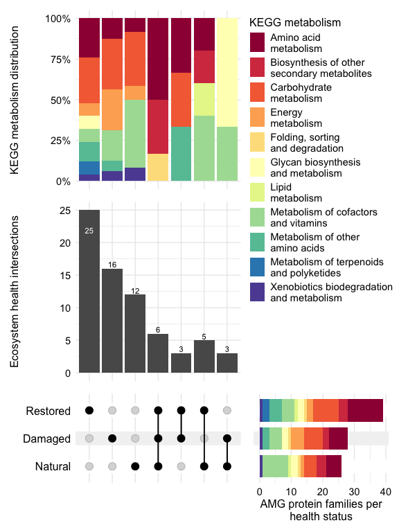
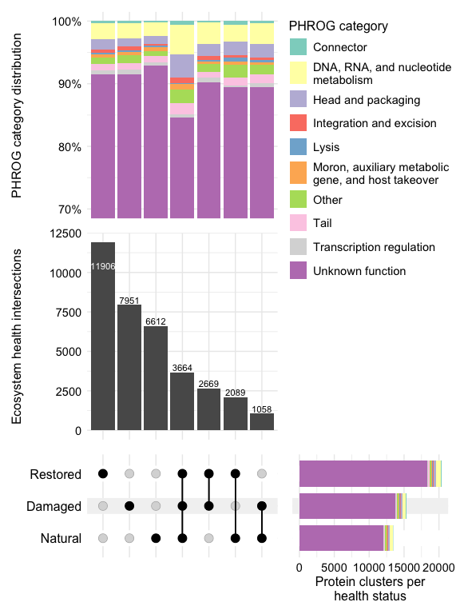
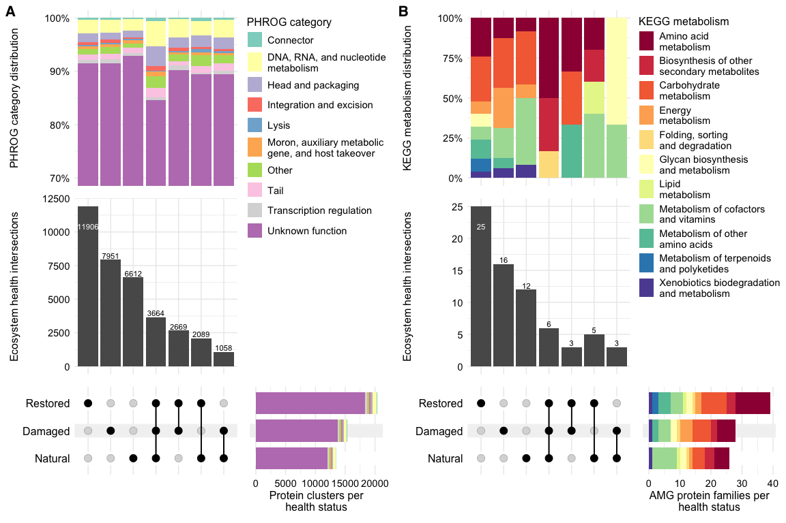

Virus Genes
================
James C. Kosmopoulos
2024-11-18

# Load packages

``` r
library("tidyverse");packageVersion("tidyverse")
```

    ## [1] '2.0.0'

``` r
library("ComplexUpset");packageVersion("ComplexUpset")
```

    ## [1] '1.3.3'

``` r
library("RColorBrewer");packageVersion("RColorBrewer")
```

    ## [1] '1.1.3'

``` r
library("ComplexHeatmap");packageVersion("ComplexHeatmap")
```

    ## [1] '2.20.0'

``` r
library("viridis");packageVersion("viridis")
```

    ## [1] '0.6.5'

# Load data

``` r
metadata <- readRDS("../Data/metadata_simple.RDS")
metadata_groups <- readRDS("../Data/metadata_groups.RDS")
amgs_viruses <- readRDS("../Data/amgs_from_vmags.RDS") %>%
  mutate(Viral_Flanking_Genes = as.logical(Viral_Flanking_Genes))
gene_annots <- readRDS("../Data/virus_gene_annots.RDS") %>%
  mutate(Viral_Flanking_Genes = as.logical(Viral_Flanking_Genes))
gene_annots$Assembly <- sapply(strsplit(gene_annots$Genome, "_"), `[`, 1)
gene_annots <- gene_annots %>%
  left_join(metadata_groups, by = join_by("Assembly" == "sample.id")) %>%
  distinct()
virus_prot_clusters <- readRDS("../Data/virus_prot_clusters.RDS")
kegg_map <- readRDS("../Data/KEGG_map_pathway_KO.RDS")
phrog_cats <- readRDS("../Data/phrog_cats.RDS")
```

# AMG presence

## All identified AMGs (with verified viral flanking genes)

### Format data

``` r
amgs_viruses <- amgs_viruses %>%
  filter(Viral_Flanking_Genes == TRUE)

amgs_viruses$Assembly <- sapply(strsplit(amgs_viruses$Genome, "_"), `[`, 1)
amgs_viruses <- amgs_viruses %>%
  left_join(metadata_groups, by = join_by("Assembly" == "sample.id")) %>%
  distinct()
head(amgs_viruses)
```

    ##                                        Protein
    ## 1     vRhyme_bin_13__BAr1A1B1C_000000439479_20
    ## 2     vRhyme_bin_14__BAr1A1B1C_000000077132_21
    ## 3       vRhyme_bin_2__BAr1A1B1C_000000108289_5
    ## 4     vRhyme_bin_24__BAr1A1B1C_000000105221_40
    ## 5 vRhyme_unbinned_17__BAr1A1B1C_000000084126_3
    ## 6 vRhyme_unbinned_3__BAr1A1B1C_000000024208_13
    ##                                       Contig                       Genome
    ## 1      vRhyme_bin_13__BAr1A1B1C_000000439479      BAr1A1B1C_vRhyme_bin_13
    ## 2      vRhyme_bin_14__BAr1A1B1C_000000077132      BAr1A1B1C_vRhyme_bin_14
    ## 3       vRhyme_bin_2__BAr1A1B1C_000000108289       BAr1A1B1C_vRhyme_bin_2
    ## 4      vRhyme_bin_24__BAr1A1B1C_000000105221      BAr1A1B1C_vRhyme_bin_24
    ## 5 vRhyme_unbinned_17__BAr1A1B1C_000000084126 BAr1A1B1C_vRhyme_unbinned_17
    ## 6  vRhyme_unbinned_3__BAr1A1B1C_000000024208  BAr1A1B1C_vRhyme_unbinned_3
    ##   KEGG_hmm_id                        KEGG_Description Pfam_hmm_id
    ## 1        <NA>                                    <NA>  PF00550.29
    ## 2      K00812 aspartate aminotransferase [EC:2.6.1.1]  PF04864.17
    ## 3        <NA>                                    <NA>  PF03567.18
    ## 4        <NA>                                    <NA>  PF01762.25
    ## 5      K03426        NAD+ diphosphatase [EC:3.6.1.22]  PF00293.32
    ## 6      K10536        agmatine deiminase [EC:3.5.3.12]  PF04371.19
    ##                                 Pfam_Description dbCAN_hmm_id dbCAN_Description
    ## 1             Phosphopantetheine attachment site         <NA>              <NA>
    ## 2                                       Allinase         <NA>              <NA>
    ## 3                        Sulfotransferase family         <NA>              <NA>
    ## 4                          Galactosyltransferase         <NA>              <NA>
    ## 5                                   NUDIX domain         <NA>              <NA>
    ## 6 Porphyromonas-type peptidyl-arginine deiminase         <NA>              <NA>
    ##   METABOLIC_hmm_id METABOLIC_Description PHROG_hmm_id PHROG_Description
    ## 1             <NA>                  <NA>         <NA>              <NA>
    ## 2             <NA>                  <NA>   phrog_5879              <NA>
    ## 3             <NA>                  <NA>         <NA>              <NA>
    ## 4             <NA>                  <NA>         <NA>              <NA>
    ## 5             <NA>                  <NA>         <NA>              <NA>
    ## 6             <NA>                  <NA>         <NA>              <NA>
    ##   top_hit_hmm_id                     top_hit_description top_hit_db
    ## 1     PF00550.29      Phosphopantetheine attachment site       Pfam
    ## 2         K00812 aspartate aminotransferase [EC:2.6.1.1]       KEGG
    ## 3     PF03567.18                 Sulfotransferase family       Pfam
    ## 4     PF01762.25                   Galactosyltransferase       Pfam
    ## 5         K03426        NAD+ diphosphatase [EC:3.6.1.22]       KEGG
    ## 6         K10536        agmatine deiminase [EC:3.5.3.12]       KEGG
    ##   window_avg_KEGG_L.score_viral window_avg_Pfam_L.score_viral
    ## 1                          TRUE                          TRUE
    ## 2                          TRUE                          TRUE
    ## 3                          TRUE                          TRUE
    ## 4                          TRUE                          TRUE
    ## 5                          TRUE                          TRUE
    ## 6                          TRUE                          TRUE
    ##   Viral_Flanking_Genes  Assembly     site treatment
    ## 1                 TRUE BAr1A1B1C Balmoral       NAT
    ## 2                 TRUE BAr1A1B1C Balmoral       NAT
    ## 3                 TRUE BAr1A1B1C Balmoral       NAT
    ## 4                 TRUE BAr1A1B1C Balmoral       NAT
    ## 5                 TRUE BAr1A1B1C Balmoral       NAT
    ## 6                 TRUE BAr1A1B1C Balmoral       NAT

## Upset plot of AMG annotations

### Format data for the UpSet plot

``` r
amgs_viruses_kegg <- amgs_viruses %>%
  filter(!is.na(KEGG_hmm_id)) %>%
  left_join(kegg_map %>%
              distinct(),
            by = join_by("KEGG_hmm_id" == "KOs"))

upset_data_kegg_metab <- amgs_viruses_kegg %>%
  select(KEGG_hmm_id, treatment, Metabolism) %>%
  distinct() %>%
  filter(!is.na(Metabolism)) %>%
  mutate(present = 1) %>% 
  pivot_wider(names_from = treatment, values_from = present, values_fill = list(present = 0)) %>%
  mutate(across(c('NAT', 'REST', 'DAM'), ~ . > 0)) %>%
  dplyr::rename(Natural = NAT,
                Damaged = DAM,
                Restored = REST) %>%
  select(KEGG_hmm_id, Metabolism, Restored, Natural, Damaged) # To set manual order of set axis
```

### UpSet plot with annotations

``` r
# Updated Metabolism labels with line breaks
metabolism_labels <- c(
  "Amino acid\nmetabolism",
  "Biosynthesis of other\nsecondary metabolites",
  "Carbohydrate\nmetabolism",
  "Energy\nmetabolism",
  "Folding, sorting\nand degradation",
  "Glycan biosynthesis\nand metabolism",
  "Lipid\nmetabolism",
  "Metabolism of cofactors\nand vitamins",
  "Metabolism of other\namino acids",
  "Metabolism of terpenoids\nand polyketides",
  "Xenobiotics biodegradation\nand metabolism"
)

upset.amgs.treatment.KEGG <- ComplexUpset::upset(
  upset_data_kegg_metab,
  intersect = c('Natural', 'Damaged', 'Restored'),
  sort_sets = FALSE,
  sort_intersections = FALSE,
  intersections = list(
    'Restored',
    'Damaged',
    'Natural',
    c('Restored', 'Natural', 'Damaged'),
    c('Damaged', 'Restored'),
    c('Natural', 'Restored'),
    c('Damaged', 'Natural')
    ),
  name = 'AMG families per health status',
  annotations = list(
    'KEGG metabolism distribution' = (
      ggplot(mapping = aes(fill = Metabolism)) +
        geom_bar(stat = 'count', position = 'fill') +
        scale_y_continuous(labels = scales::percent_format()) +
        scale_fill_brewer(palette = "Spectral",
                          na.value="grey",
                          name = "KEGG metabolism",
                          labels = metabolism_labels) +  # Apply custom labels
        theme_minimal() +
        theme(axis.text.x = element_blank(),
              axis.title.x = element_blank(),
              axis.text.y = element_text(color = 'black',
                                         size = 11),
              axis.title.y = element_text(color = 'black',
                                          size = 12),
              legend.text = element_text(color = 'black',
                                         size = 11),
              legend.title = element_text(color = 'black',
                                          size = 12),
              legend.position = c(1, 0.2), # Move legend down
              legend.justification = c("right", "bottom"),  # Adjust justification
              legend.margin = margin(0, 0, -130, 0), # Add margin to move it down
              legend.key.spacing.y = unit(5, 'pt') # Increase space between legend items
              ) +
        ylab('KEGG metabolism distribution')
    )
  ),
  base_annotations = list(
      'Intersection size' = (
        intersection_size(text = list(size = 3)) +
          ylab("Ecosystem health intersections")
        )
    ),
    themes = upset_modify_themes(
      list(
        'overall_sizes' = theme(axis.text.x = element_text(color = 'black', size = 11),
                                axis.title.x = element_text(color = 'black', size = 12)
                                ),
        'intersections_matrix' = theme(axis.text.x = element_blank(),
                                       axis.title.x = element_blank(),
                                       axis.text.y = element_text(color = 'black', size = 12)
                                       ),
        'Intersection size' = theme(axis.text.y = element_text(color = 'black', size = 11),
                                    axis.title.y = element_text(size = 12)
                                    )
        )
    ),
  set_sizes=(
        upset_set_size(
            geom=geom_bar(
                aes(fill=Metabolism, x=group),
                show.legend = FALSE,
                width=0.8,
                height = 4,
            ),
            position='right'
        )) +
    ylab("AMG protein families per\nhealth status") +
    scale_fill_brewer(palette = "Spectral", na.value="grey",
                      labels = metabolism_labels),  # Apply custom labels
  # moves legends over the set sizes
  guides='over',
  width_ratio = 0.45,
  wrap = F,
  min_size = 1 # Ensure even small intersections are shown
)

# Plot the UpSet plot
upset.amgs.treatment.KEGG
```

<!-- -->

### Save the plot

``` r
ggsave(upset.amgs.treatment.KEGG, file="../Plots/virus_genes/upset_AMGs_KEGG_treatment.png", device = "png", width = 6, height = 8, units = "in", dpi = 600, bg = "white")
```

### Gather unique annotations

``` r
# NAT unique subset
nat_unique_ids <- setdiff(amgs_viruses_kegg[amgs_viruses_kegg$treatment == "NAT",]$top_hit_hmm_id, 
                          union(amgs_viruses_kegg[amgs_viruses_kegg$treatment == "DAM",]$top_hit_hmm_id, 
                                amgs_viruses_kegg[amgs_viruses_kegg$treatment == "REST",]$top_hit_hmm_id))
nat_unique_subset <- amgs_viruses_kegg[amgs_viruses_kegg$treatment == "NAT" & amgs_viruses_kegg$top_hit_hmm_id %in% nat_unique_ids,]

# DAM unique subset
dam_unique_ids <- setdiff(amgs_viruses_kegg[amgs_viruses_kegg$treatment == "DAM",]$top_hit_hmm_id, 
                          union(amgs_viruses_kegg[amgs_viruses_kegg$treatment == "NAT",]$top_hit_hmm_id, 
                                amgs_viruses_kegg[amgs_viruses_kegg$treatment == "REST",]$top_hit_hmm_id))
dam_unique_subset <- amgs_viruses_kegg[amgs_viruses_kegg$treatment == "DAM" & amgs_viruses_kegg$top_hit_hmm_id %in% dam_unique_ids,]

# REST unique subset
rest_unique_ids <- setdiff(amgs_viruses_kegg[amgs_viruses_kegg$treatment == "REST",]$top_hit_hmm_id, 
                           union(amgs_viruses_kegg[amgs_viruses_kegg$treatment == "NAT",]$top_hit_hmm_id, 
                                 amgs_viruses_kegg[amgs_viruses_kegg$treatment == "DAM",]$top_hit_hmm_id))
rest_unique_subset <- amgs_viruses_kegg[amgs_viruses_kegg$treatment == "REST" & amgs_viruses_kegg$top_hit_hmm_id %in% rest_unique_ids,]

# Summarize NAT unique subset
nat_summary <- nat_unique_subset %>%
  group_by(top_hit_hmm_id, top_hit_description, Metabolism, treatment) %>%
  summarize(count = n()) %>%
  mutate(unique = "NAT")

# Summarize DAM unique subset
dam_summary <- dam_unique_subset %>%
  group_by(top_hit_hmm_id, top_hit_description, Metabolism, treatment) %>%
  summarize(count = n()) %>%
  mutate(unique = "DAM")

# Summarize REST unique subset
rest_summary <- rest_unique_subset %>%
  group_by(top_hit_hmm_id, top_hit_description, Metabolism, treatment) %>%
  summarize(count = n()) %>%
  mutate(unique = "REST")

# Combine all summaries into one dataframe
amg_unique_summary <- bind_rows(nat_summary, dam_summary, rest_summary)

amg_unique_summary <- amg_unique_summary %>%
  select(top_hit_hmm_id, top_hit_description, treatment, count, unique)

amg_unique_summary <- as.data.frame(amg_unique_summary)
amg_unique_summary
```

    ##                                   Metabolism top_hit_hmm_id
    ## 1                    Carbohydrate metabolism         K00627
    ## 2                      Amino acid metabolism         K01687
    ## 3       Metabolism of cofactors and vitamins         K01687
    ## 4       Metabolism of cofactors and vitamins         K01737
    ## 5       Metabolism of cofactors and vitamins         K03426
    ## 6  Xenobiotics biodegradation and metabolism         K07104
    ## 7       Metabolism of cofactors and vitamins         K10026
    ## 8                    Carbohydrate metabolism         K18983
    ## 9       Metabolism of cofactors and vitamins         K19286
    ## 10                   Carbohydrate metabolism         K21030
    ## 11                   Carbohydrate metabolism         K21071
    ## 12                         Energy metabolism         K21071
    ## 13                     Amino acid metabolism          AA3_2
    ## 14      Metabolism of cofactors and vitamins         K00275
    ## 15      Metabolism of cofactors and vitamins         K01498
    ## 16                   Carbohydrate metabolism         K01635
    ## 17                     Amino acid metabolism         K01649
    ## 18                   Carbohydrate metabolism         K01649
    ## 19      Metabolism of cofactors and vitamins         K01950
    ## 20                         Energy metabolism         K02107
    ## 21 Xenobiotics biodegradation and metabolism         K04118
    ## 22                   Carbohydrate metabolism         K07404
    ## 23                   Carbohydrate metabolism         K08261
    ## 24                         Energy metabolism         K15229
    ## 25                   Carbohydrate metabolism         K16370
    ## 26                         Energy metabolism         K16370
    ## 27                         Energy metabolism         K20034
    ## 28                                      <NA>     PF02348.23
    ## 29                                      <NA>     PF02397.20
    ## 30                   Carbohydrate metabolism         K00036
    ## 31           Metabolism of other amino acids         K00036
    ## 32      Metabolism of cofactors and vitamins         K00287
    ## 33                   Carbohydrate metabolism         K00848
    ## 34  Metabolism of terpenoids and polyketides         K00919
    ## 35                     Amino acid metabolism         K01501
    ## 36                         Energy metabolism         K01501
    ## 37           Metabolism of other amino acids         K01501
    ## 38 Xenobiotics biodegradation and metabolism         K01501
    ## 39                   Carbohydrate metabolism         K01569
    ## 40                     Amino acid metabolism         K01652
    ## 41                   Carbohydrate metabolism         K01652
    ## 42      Metabolism of cofactors and vitamins         K01652
    ## 43           Metabolism of other amino acids         K01775
    ## 44                   Carbohydrate metabolism         K03077
    ## 45  Metabolism of terpenoids and polyketides         K05553
    ## 46                     Amino acid metabolism         K06718
    ## 47                     Amino acid metabolism         K09483
    ## 48                         Energy metabolism         K14940
    ## 49                     Amino acid metabolism         K16165
    ## 50        Glycan biosynthesis and metabolism         K21344
    ## 51                   Carbohydrate metabolism     PF00106.29
    ## 52                                      <NA>     PF00132.28
    ## 53                                      <NA>     PF01370.25
    ## 54        Glycan biosynthesis and metabolism     PF03567.18
    ## 55                     Amino acid metabolism     PF05013.16
    ## 56                   Carbohydrate metabolism     PF05013.16
    ##                                                                                                                                                                                                                                                                                                        top_hit_description
    ## 1                                                                                                                                                                                                                        pyruvate dehydrogenase E2 component (dihydrolipoyllysine-residue acetyltransferase) [EC:2.3.1.12]
    ## 2                                                                                                                                                                                                                                                                                  dihydroxy-acid dehydratase [EC:4.2.1.9]
    ## 3                                                                                                                                                                                                                                                                                  dihydroxy-acid dehydratase [EC:4.2.1.9]
    ## 4                                                                                                                                                                                                                                     6-pyruvoyltetrahydropterin/6-carboxytetrahydropterin synthase [EC:4.2.3.12 4.1.2.50]
    ## 5                                                                                                                                                                                                                                                                                         NAD+ diphosphatase [EC:3.6.1.22]
    ## 6                                                                                                                                                                                                                                                                                  catechol 2,3-dioxygenase [EC:1.13.11.2]
    ## 7                                                                                                                                                                                                                                                                          7-carboxy-7-deazaguanine synthase [EC:4.3.99.3]
    ## 8                                                                                                                                                                                                                                                                          D-galactarolactone cycloisomerase [EC:5.5.1.27]
    ## 9                                                                                                                                                                                                                                                                                    FMN reductase [NAD(P)H] [EC:1.5.1.39]
    ## 10                                                                                                                                                                                                                                                                D-ribitol-5-phosphate cytidylyltransferase [EC:2.7.7.40]
    ## 11                                                                                                                                                                                                                    ATP-dependent phosphofructokinase / diphosphate-dependent phosphofructokinase [EC:2.7.1.11 2.7.1.90]
    ## 12                                                                                                                                                                                                                    ATP-dependent phosphofructokinase / diphosphate-dependent phosphofructokinase [EC:2.7.1.11 2.7.1.90]
    ## 13 cellobiose dehydrogenase (EC 1.1.99.18); glucose 1-oxidase (EC 1.1.3.4); aryl alcohol oxidase (EC 1.1.3.7); alcohol oxidase (EC 1.1.3.13); pyranose oxidase (EC 1.1.3.10); glucose 1-dehydrogenase (FAD, quinone) (EC 1.1.5.9); pyranose dehydrogenase (EC 1.1.99.29); oligosaccharide dehydrogenase (FAD) (EC 1.1.5.-)
    ## 14                                                                                                                                                                                                                                                                          pyridoxamine 5'-phosphate oxidase [EC:1.4.3.5]
    ## 15                                                                                                                                                                                                                                                     diaminohydroxyphosphoribosylaminopyrimidine deaminase [EC:3.5.4.26]
    ## 16                                                                                                                                                                                                                                                                         tagatose 1,6-diphosphate aldolase [EC:4.1.2.40]
    ## 17                                                                                                                                                                                                                                                                                2-isopropylmalate synthase [EC:2.3.3.13]
    ## 18                                                                                                                                                                                                                                                                                2-isopropylmalate synthase [EC:2.3.3.13]
    ## 19                                                                                                                                                                                                                                                                      NAD+ synthase (glutamine-hydrolysing) [EC:6.3.5.1]
    ## 20                                                                                                                                                                                                                                                                         V/A-type H+/Na+-transporting ATPase subunit G/H
    ## 21                                                                                                                                                                                                                                                                                pimeloyl-CoA dehydrogenase [EC:1.3.1.62]
    ## 22                                                                                                                                                                                                                                                                                 6-phosphogluconolactonase [EC:3.1.1.31]
    ## 23                                                                                                                                                                                                                                                                      D-sorbitol dehydrogenase (acceptor) [EC:1.1.99.21]
    ## 24                                                                                                                                                                                                                                                                      methylamine dehydrogenase heavy chain [EC:1.4.9.1]
    ## 25                                                                                                                                                                                                                                                                                   6-phosphofructokinase 2 [EC:2.7.1.11]
    ## 26                                                                                                                                                                                                                                                                                   6-phosphofructokinase 2 [EC:2.7.1.11]
    ## 27                                                                                                                                                                                                                                                                      3-(methylthio)propionyl---CoA ligase [EC:6.2.1.44]
    ## 28                                                                                                                                                                                                                                                                                                    Cytidylyltransferase
    ## 29                                                                                                                                                                                                                                                                                             Bacterial sugar transferase
    ## 30                                                                                                                                                                                                                                                             glucose-6-phosphate 1-dehydrogenase [EC:1.1.1.49 1.1.1.363]
    ## 31                                                                                                                                                                                                                                                             glucose-6-phosphate 1-dehydrogenase [EC:1.1.1.49 1.1.1.363]
    ## 32                                                                                                                                                                                                                                                                                    dihydrofolate reductase [EC:1.5.1.3]
    ## 33                                                                                                                                                                                                                                                                                             rhamnulokinase [EC:2.7.1.5]
    ## 34                                                                                                                                                                                                                                                        4-diphosphocytidyl-2-C-methyl-D-erythritol kinase [EC:2.7.1.148]
    ## 35                                                                                                                                                                                                                                                                                                  nitrilase [EC:3.5.5.1]
    ## 36                                                                                                                                                                                                                                                                                                  nitrilase [EC:3.5.5.1]
    ## 37                                                                                                                                                                                                                                                                                                  nitrilase [EC:3.5.5.1]
    ## 38                                                                                                                                                                                                                                                                                                  nitrilase [EC:3.5.5.1]
    ## 39                                                                                                                                                                                                                                                                                      oxalate decarboxylase [EC:4.1.1.2]
    ## 40                                                                                                                                                                                                                                                               acetolactate synthase I/II/III large subunit [EC:2.2.1.6]
    ## 41                                                                                                                                                                                                                                                               acetolactate synthase I/II/III large subunit [EC:2.2.1.6]
    ## 42                                                                                                                                                                                                                                                               acetolactate synthase I/II/III large subunit [EC:2.2.1.6]
    ## 43                                                                                                                                                                                                                                                                                           alanine racemase [EC:5.1.1.1]
    ## 44                                                                                                                                                                                                                                                                         L-ribulose-5-phosphate 4-epimerase [EC:5.1.3.4]
    ## 45                                                                                                                                                                                                                                                                                        minimal PKS acyl carrier protein
    ## 46                                                                                                                                                                                                                                                              L-2,4-diaminobutyric acid acetyltransferase [EC:2.3.1.178]
    ## 47                                                                                                                                                                                                                                                                           3-dehydroshikimate dehydratase [EC:4.2.1.118]
    ## 48                                                                                                                                                                                                                                                                     gamma-F420-2:alpha-L-glutamate ligase [EC:6.3.2.32]
    ## 49                                                                                                                                                                                                                                                                                 fumarylpyruvate hydrolase [EC:3.7.1.20]
    ## 50                                                                                                                                                                                                                                                        D-glycero-beta-D-manno-heptose-7-phosphate kinase [EC:2.7.1.167]
    ## 51                                                                                                                                                                                                                                                                                               short chain dehydrogenase
    ## 52                                                                                                                                                                                                                                                                         Bacterial transferase hexapeptide (six repeats)
    ## 53                                                                                                                                                                                                                                                                              NAD dependent epimerase/dehydratase family
    ## 54                                                                                                                                                                                                                                                                                                 Sulfotransferase family
    ## 55                                                                                                                                                                                                                                                                                        N-formylglutamate amidohydrolase
    ## 56                                                                                                                                                                                                                                                                                        N-formylglutamate amidohydrolase
    ##    treatment count unique
    ## 1        NAT     3    NAT
    ## 2        NAT     1    NAT
    ## 3        NAT     1    NAT
    ## 4        NAT     2    NAT
    ## 5        NAT     1    NAT
    ## 6        NAT     4    NAT
    ## 7        NAT     1    NAT
    ## 8        NAT     1    NAT
    ## 9        NAT     1    NAT
    ## 10       NAT     1    NAT
    ## 11       NAT     4    NAT
    ## 12       NAT     1    NAT
    ## 13       DAM     1    DAM
    ## 14       DAM     1    DAM
    ## 15       DAM     1    DAM
    ## 16       DAM     1    DAM
    ## 17       DAM     1    DAM
    ## 18       DAM     1    DAM
    ## 19       DAM     1    DAM
    ## 20       DAM     1    DAM
    ## 21       DAM     1    DAM
    ## 22       DAM     1    DAM
    ## 23       DAM     1    DAM
    ## 24       DAM     1    DAM
    ## 25       DAM     4    DAM
    ## 26       DAM     1    DAM
    ## 27       DAM     1    DAM
    ## 28       DAM     1    DAM
    ## 29       DAM     1    DAM
    ## 30      REST     1   REST
    ## 31      REST     1   REST
    ## 32      REST     8   REST
    ## 33      REST     2   REST
    ## 34      REST     1   REST
    ## 35      REST     1   REST
    ## 36      REST     1   REST
    ## 37      REST     1   REST
    ## 38      REST     2   REST
    ## 39      REST     1   REST
    ## 40      REST     2   REST
    ## 41      REST     4   REST
    ## 42      REST     2   REST
    ## 43      REST     1   REST
    ## 44      REST     2   REST
    ## 45      REST     4   REST
    ## 46      REST     1   REST
    ## 47      REST     1   REST
    ## 48      REST     2   REST
    ## 49      REST     1   REST
    ## 50      REST     1   REST
    ## 51      REST     1   REST
    ## 52      REST     1   REST
    ## 53      REST     1   REST
    ## 54      REST     1   REST
    ## 55      REST     1   REST
    ## 56      REST     1   REST

## All proteins PHROG annots

``` r
virus_prot_clusters_annotated <- virus_prot_clusters %>%
  dplyr::rename(Protein = protein) %>%
  left_join(gene_annots) %>%
  left_join(phrog_cats %>%
              select(phrog, category) %>%
              dplyr::rename(PHROG_hmm_id = phrog,
                            PHROG_Category = category),
            by = "PHROG_hmm_id") %>%
  mutate(PHROG_Category = ifelse(is.na(PHROG_Category), "unknown function", PHROG_Category)) %>%
  distinct()
write_csv(virus_prot_clusters_annotated, file = "../Tables/virus_protein_clusters_annotated.csv")
head(virus_prot_clusters_annotated)
```

    ##                                         Protein
    ## 1   vRhyme_unbinned_5__BAr2D2E2F_000000039971_5
    ## 2  vRhyme_unbinned_5__BAr2D2E2F_000000039971_37
    ## 3 vRhyme_unbinned_5__BAr2D2E2F_000000039971_101
    ## 4       vRhyme_bin_13__CRr1A1B1C_000000322702_6
    ## 5   vRhyme_unbinned_6__BAr2D2E2F_000000057292_8
    ## 6  vRhyme_unbinned_7__BAr2D2E2F_000000064571_14
    ##                                     cluster_rep  Assembly     site treatment
    ## 1   vRhyme_unbinned_5__BAr2D2E2F_000000039971_5 BAr2D2E2F Balmoral      REST
    ## 2  vRhyme_unbinned_5__BAr2D2E2F_000000039971_37 BAr2D2E2F Balmoral      REST
    ## 3 vRhyme_unbinned_5__BAr2D2E2F_000000039971_101 BAr2D2E2F Balmoral      REST
    ## 4 vRhyme_unbinned_5__BAr2D2E2F_000000039971_101 CRr1A1B1C  Crocach       NAT
    ## 5   vRhyme_unbinned_6__BAr2D2E2F_000000057292_8 BAr2D2E2F Balmoral      REST
    ## 6  vRhyme_unbinned_7__BAr2D2E2F_000000064571_14 BAr2D2E2F Balmoral      REST
    ##                                      Contig                      Genome
    ## 1 vRhyme_unbinned_5__BAr2D2E2F_000000039971 BAr2D2E2F_vRhyme_unbinned_5
    ## 2 vRhyme_unbinned_5__BAr2D2E2F_000000039971 BAr2D2E2F_vRhyme_unbinned_5
    ## 3 vRhyme_unbinned_5__BAr2D2E2F_000000039971 BAr2D2E2F_vRhyme_unbinned_5
    ## 4     vRhyme_bin_13__CRr1A1B1C_000000322702     CRr1A1B1C_vRhyme_bin_13
    ## 5 vRhyme_unbinned_6__BAr2D2E2F_000000057292 BAr2D2E2F_vRhyme_unbinned_6
    ## 6 vRhyme_unbinned_7__BAr2D2E2F_000000064571 BAr2D2E2F_vRhyme_unbinned_7
    ##   KEGG_hmm_id KEGG_Description Pfam_hmm_id
    ## 1        <NA>             <NA>        <NA>
    ## 2        <NA>             <NA>        <NA>
    ## 3        <NA>             <NA>        <NA>
    ## 4        <NA>             <NA>        <NA>
    ## 5        <NA>             <NA>        <NA>
    ## 6        <NA>             <NA>  PF00097.29
    ##                        Pfam_Description dbCAN_hmm_id dbCAN_Description
    ## 1                                  <NA>         <NA>              <NA>
    ## 2                                  <NA>         <NA>              <NA>
    ## 3                                  <NA>         <NA>              <NA>
    ## 4                                  <NA>         <NA>              <NA>
    ## 5                                  <NA>         <NA>              <NA>
    ## 6 Zinc finger, C3HC4 type (RING finger)         <NA>              <NA>
    ##   METABOLIC_hmm_id METABOLIC_Description PHROG_hmm_id PHROG_Description
    ## 1             <NA>                  <NA>         <NA>              <NA>
    ## 2             <NA>                  <NA>         <NA>              <NA>
    ## 3             <NA>                  <NA>         <NA>              <NA>
    ## 4             <NA>                  <NA>  phrog_15834              <NA>
    ## 5             <NA>                  <NA>         <NA>              <NA>
    ## 6             <NA>                  <NA>         <NA>              <NA>
    ##   top_hit_hmm_id                   top_hit_description top_hit_db
    ## 1           <NA>                                  <NA>       <NA>
    ## 2           <NA>                                  <NA>       <NA>
    ## 3           <NA>                                  <NA>       <NA>
    ## 4    phrog_15834                                  <NA>      PHROG
    ## 5           <NA>                                  <NA>       <NA>
    ## 6     PF00097.29 Zinc finger, C3HC4 type (RING finger)       Pfam
    ##   Viral_Flanking_Genes   PHROG_Category
    ## 1                 TRUE unknown function
    ## 2                 TRUE unknown function
    ## 3                 TRUE unknown function
    ## 4                 TRUE unknown function
    ## 5                 TRUE unknown function
    ## 6                 TRUE unknown function

``` r
phrog_labels <- c(
  "Connector",
  "DNA, RNA, and nucleotide\nmetabolism",
  "Head and packaging",
  "Integration and excision",
  "Lysis",
  "Moron, auxiliary metabolic\ngene, and host takeover",
  "Other",
  "Tail",
  "Transcription regulation",
  "Unknown function"
)

# Pivot the data to create the intersection columns
upset_data_prot_clusters <- virus_prot_clusters_annotated %>%
  select(cluster_rep, treatment, PHROG_Category) %>%
  distinct() %>%
  mutate(present = 1) %>%
  pivot_wider(names_from = treatment, values_from = present, values_fill = list(present = 0)) %>%
  mutate(across(c('NAT', 'REST', 'DAM'), ~ . > 0))  %>%
  dplyr::rename(Natural = NAT,
                Damaged = DAM,
                Restored = REST) %>%
  filter(Natural != FALSE | Damaged != FALSE | Restored != FALSE)

# Create the UpSet plot
upset.virus_clusters <- ComplexUpset::upset(
  upset_data_prot_clusters,
  intersect = c('Natural', 'Restored', 'Damaged'),  # Use the actual treatment column names
  name = 'Cluster replication across treatments',
  annotations = list(
    'PHROG category distribution' = (
      ggplot(virus_prot_clusters_annotated, mapping = aes(fill = PHROG_Category)) +
        geom_bar(stat = 'count', position = 'fill') +
        scale_y_continuous(labels = scales::percent_format()) +
        coord_cartesian(ylim=c(0.7,1)) + # Set y-axis limits from 70% to 100%
        scale_fill_brewer(palette = "Set3",
                          na.value="grey",
                          name = "PHROG category",
                          labels = phrog_labels) +  # Apply custom labels with capitalized first letters
        theme_minimal() +
        theme(axis.text.x = element_blank(),
              axis.title.x = element_blank(),
              axis.text.y = element_text(color = 'black', size = 11),
              axis.title.y = element_text(color = 'black', size = 12),
              legend.text = element_text(color = 'black', size = 11),
              legend.title = element_text(color = 'black', size = 12),
              legend.position = c(1, 0.2), # Move legend down
              legend.justification = c("right", "bottom"),  # Adjust justification
              legend.margin = margin(0, 0, -65, 0), # Add margin to move it down
              legend.key.spacing.y = unit(5, 'pt')) +  # Increase space between legend items
        ylab('PHROG category distribution')
    )
  ),
  base_annotations = list(
      'Intersection size' = (
        intersection_size(text = list(size = 3)) +
          ylab("Ecosystem health intersections")
        )
    ),
    themes = upset_modify_themes(
      list(
        'overall_sizes' = theme(axis.text.x = element_text(color = 'black', size = 11),
                                axis.title.x = element_text(color = 'black', size = 12)
                                ),
        'intersections_matrix' = theme(axis.text.x = element_blank(),
                                       axis.title.x = element_blank(),
                                       axis.text.y = element_text(color = 'black', size = 12)
                                       ),
        'Intersection size' = theme(axis.text.y = element_text(color = 'black', size = 11),
                                    axis.title.y = element_text(size = 12)
                                    )
        )
    ),
  set_sizes = (
    upset_set_size(
      geom = geom_bar(
        aes(fill = PHROG_Category, x = group),
        show.legend = FALSE,
        width = 0.8,
        height = 4,
      ),
      position = 'right'
    )) +
    ylab("Protein clusters per\nhealth status") +
    scale_fill_brewer(palette = "Set3", na.value = "grey",
                      labels = c(phrog_labels, "Unknown function")),  # Include "Unknown function" in intersection plot
  # moves legends over the set sizes
  guides = 'over',
  width_ratio = 0.45,
  wrap = F,
  min_size = 1 # Ensure even small intersections are shown
)

# Plot the UpSet plot
upset.virus_clusters
```

<!-- -->

``` r
ggsave(upset.virus_clusters, file="../Plots/virus_genes/upset_virus_proteins_treatment.png", device = "png", width = 6, height = 8, units = "in", dpi = 600, bg = "white")
```

# Combine the two upset plots

``` r
upset.combined <- cowplot::plot_grid(upset.virus_clusters,
                                     upset.amgs.treatment.KEGG,
                                     ncol = 2,
                                     labels = c("A", "B"),
                                     label_fontfamily = "sans",
                                     label_fontface = "bold",
                                     label_size = 16,
                                     rel_widths = c(1, 1)
                                     )
upset.combined
```

<!-- -->

## Save the plot

``` r
ggsave(upset.combined,
       file = "../Plots/virus_genes/Fig4.png",
       width = 12,
       height = 8,
       units = "in",
       dpi = 600,
       bg = "white")
```
