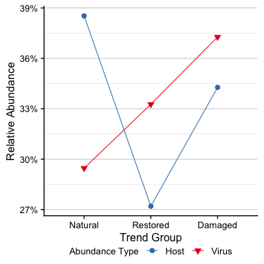
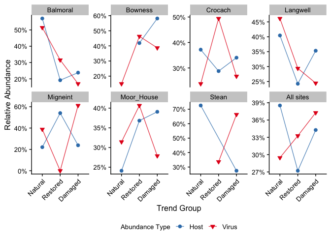
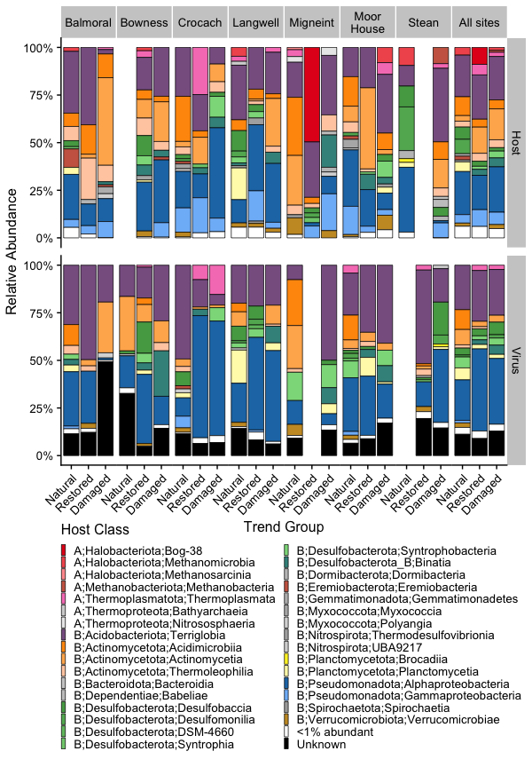
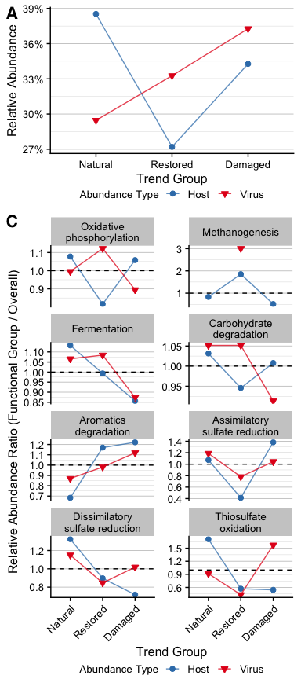
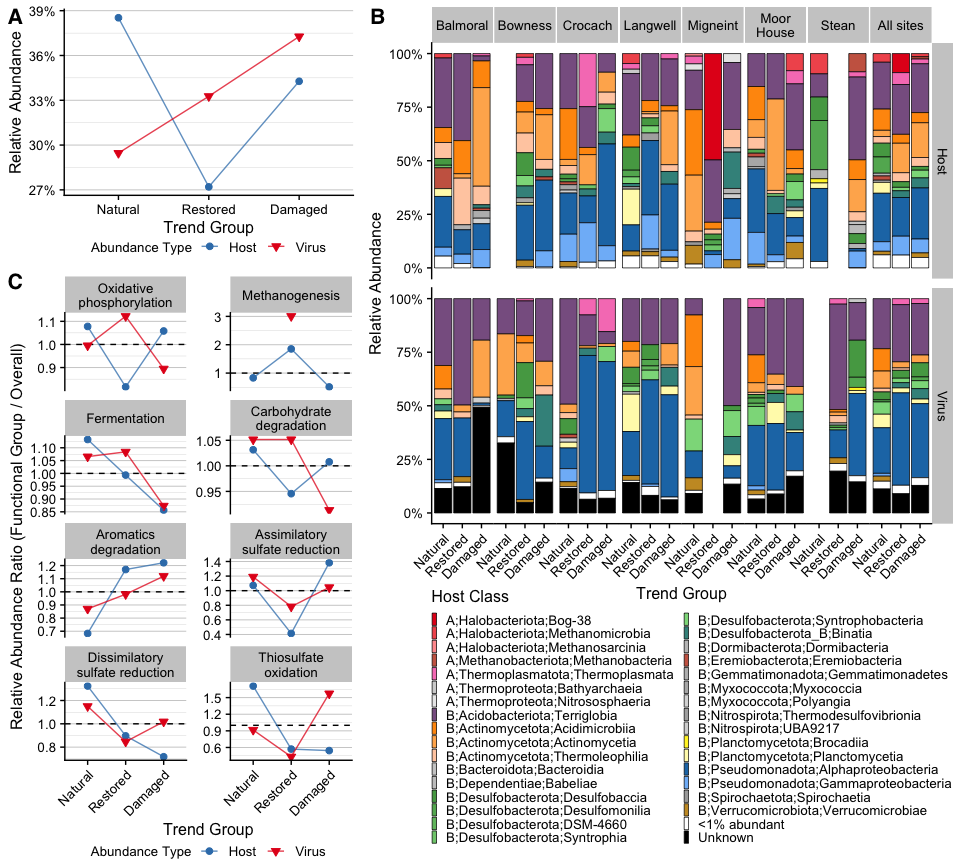

Virus-Host Interactions
================
James C. Kosmopoulos
2024-11-18

# Load packages

``` r
library("tidyverse");packageVersion("tidyverse")
```

    ## [1] '2.0.0'

``` r
library("RColorBrewer");packageVersion("RColorBrewer")
```

    ## [1] '1.1.3'

``` r
library("colorspace");packageVersion("colorspace")
```

    ## [1] '2.1.1'

``` r
library("grDevices");packageVersion("grDevices")
```

    ## [1] '4.4.0'

``` r
library("ggpubr");packageVersion("ggpubr")
```

    ## [1] '0.6.0'

``` r
library("cowplot");packageVersion("cowplot")
```

    ## [1] '1.1.3'

# Load and format data

``` r
metadata <- readRDS("../Data/metadata_simple.RDS")
virus_abundance_with_hosts <- readRDS("../Data/virus_abundance_with_hosts.RDS")
virus_abundance_with_hosts_and_all_sites_and_metabolism <- readRDS("../Data/virus_abundance_with_hosts_and_all_sites_and_metabolism.RDS")
virus_abundance_long_all <- readRDS("../Data/virus_abundance_long_all.RDS")
host_abundance_long_all_and_all_sites_and_metabolism <- readRDS("../Data/host_abundance_long_all_and_all_sites_and_metabolism.RDS")
virus_host_abundance <- readRDS("../Data/virus_host_abundance.RDS")
virus_abundance_with_hosts_and_all_sites <- readRDS("../Data/virus_abundance_with_hosts_and_all_sites.RDS")
virus_clusters <- readRDS("../Data/virus_clusters.RDS") %>%
  group_by(Virus) %>%
  select(Virus, site,  Title) %>%
  dplyr::rename(c(`Virus Trend Group` = Title)) %>%
  distinct()
host_clusters <- readRDS("../Data/host_clusters.RDS") %>%
  group_by(Host) %>%
  select(Host, site,  Title) %>%
  dplyr::rename(c(`Host Trend Group` = Title)) %>%
  distinct()
host_abundance_long_all <- readRDS("../Data/host_abundance_long_all.RDS")
host_abundance_long_all_and_all_sites <- readRDS("../Data/host_abundance_long_all_and_all_sites.RDS")
```

# Virus and Host relative abundance by metabolic functions

## Calculate virus relative abundance, separatley by Module since Modules are not independent

``` r
# Function to calculate relative abundance for each module for Hosts
calculate_relative_abundance_host <- function(data, module_name) {
  filtered_data <- data %>%
    filter(!is.na(`Host Trend Group`))

  # Subset the filtered_data to include only one entry per host
  subset_data <- filtered_data %>%
    select(Host, Sample, Host_Abundance, site, Module) %>%
    filter(Module == module_name) %>%
    distinct()
  
  module_data <- filtered_data %>%
    select(Host, Sample, Host_Abundance, site, `Host Trend Group`, Module) %>%
    filter(Module == module_name) %>%
    distinct()
  
  # Calculate the total abundance for the trend group and site
  total_abundance <- subset_data %>%
    group_by(site) %>%
    summarise(total_abundance = sum(Host_Abundance, na.rm = TRUE))
  
  # Calculate the relative abundance of hosts with the module
  relative_abundance_data <- module_data %>%
    group_by(site, `Host Trend Group`) %>%
    summarise(Abundance = sum(Host_Abundance, na.rm = TRUE)) %>%
    left_join(total_abundance, by = c("site")) %>%
    mutate(relative_abundance = Abundance / unique(total_abundance)) %>%
    mutate(Module = module_name) %>%
    mutate(Type = "Host") %>%
    dplyr::rename(Trend_Group = `Host Trend Group`)
  
  return(relative_abundance_data)
}

# Function to calculate relative abundance for each module for Viruses
calculate_relative_abundance_virus <- function(data, module_name) {
  filtered_data <- data %>%
    filter(!is.na(`Virus Trend Group`))

  # Subset the filtered_data to include only one entry per virus
  subset_data <- filtered_data %>%
    select(Virus, Sample, Virus_Abundance, site, Module) %>%
    filter(Module == module_name) %>%
    distinct()
  
  module_data <- filtered_data %>%
    select(Virus, Sample, Virus_Abundance, site, `Virus Trend Group`, Module) %>%
    filter(Module == module_name) %>%
    distinct()
  
  # Calculate the total abundance for the trend group and site
  total_abundance <- subset_data %>%
    group_by(site) %>%
    summarise(total_abundance = sum(Virus_Abundance, na.rm = TRUE))
  
  # Calculate the relative abundance of viruses with the module
  relative_abundance_data <- module_data %>%
    group_by(site, `Virus Trend Group`) %>%
    summarise(Abundance = sum(Virus_Abundance, na.rm = TRUE)) %>%
    left_join(total_abundance, by = c("site")) %>%
    mutate(relative_abundance = Abundance / unique(total_abundance)) %>%
    mutate(Module = module_name) %>%
    mutate(Type = "Virus") %>%
    dplyr::rename(Trend_Group = `Virus Trend Group`)
  
  return(relative_abundance_data)
}

# Calculate relative abundance for all modules for Hosts
combined_abundance_metab_rel_host <- bind_rows(
  lapply(unique(host_abundance_long_all_and_all_sites_and_metabolism$Module), function(module) {
    calculate_relative_abundance_host(host_abundance_long_all_and_all_sites_and_metabolism, module)
  })
)

# Calculate relative abundance for all modules for Viruses
combined_abundance_metab_rel_virus <- bind_rows(
  lapply(unique(virus_abundance_with_hosts_and_all_sites_and_metabolism$Module), function(module) {
    calculate_relative_abundance_virus(virus_abundance_with_hosts_and_all_sites_and_metabolism, module)
  })
)

# Combine Host and Virus data
combined_abundance_metab_rel <- bind_rows(combined_abundance_metab_rel_host,
                                          combined_abundance_metab_rel_virus) %>%
  mutate(Trend_Group = case_when(Trend_Group == "Natural-abundant" ~ "Natural",
                                 Trend_Group == "Restored-abundant" ~ "Restored",
                                 Trend_Group == "Damaged-abundant" ~ "Damaged")) %>%
  mutate(Trend_Group = factor(Trend_Group, levels = c("Natural", "Restored", "Damaged"))) %>%
  mutate(Module = factor(Module, levels = c(
    "Oxidative phosphorylation",
    "Methanogenesis",
    "Fermentation",
    "Carbohydrate degradation",
    "Aromatics degradation",
    "Assimilatory sulfate reduction",
    "Dissimilatory sulfate reduction",
    "Thiosulfate oxidation"
    )))
  
head(combined_abundance_metab_rel)
```

    ## # A tibble: 6 × 7
    ## # Groups:   site [3]
    ##   site     Trend_Group Abundance total_abundance relative_abundance Module Type 
    ##   <fct>    <fct>           <dbl>           <dbl>              <dbl> <fct>  <chr>
    ## 1 Balmoral Damaged         267.             541.             0.493  Aroma… Host 
    ## 2 Balmoral Natural         234.             541.             0.433  Aroma… Host 
    ## 3 Balmoral Restored         40.2            541.             0.0743 Aroma… Host 
    ## 4 Bowness  Damaged         468.             734.             0.638  Aroma… Host 
    ## 5 Bowness  Restored        266.             734.             0.362  Aroma… Host 
    ## 6 Crocach  Damaged         453.            1347.             0.336  Aroma… Host

# Calcualte the overall relative abundance of viruses and hosts across treatments

``` r
overall_abundance <- bind_rows(
  virus_abundance_long_all %>%
    left_join(metadata %>%
                select(SampleID, site),
              by = join_by("Sample" == "SampleID"),
              ) %>%
    left_join(virus_clusters, by = join_by("Virus", "site")) %>%
    dplyr::rename(Abundance = Virus_Abundance,
                  Trend_Group = `Virus Trend Group`) %>%
    mutate(Type = "Virus") %>%
    filter(!is.na(Trend_Group)) %>%
    group_by(site, Trend_Group) %>%
    summarise(Abundance = sum(Abundance, na.rm = TRUE)) %>%
    group_by(site) %>%
    mutate(total_abundance = sum(Abundance)) %>%
    ungroup() %>%
    mutate(relative_abundance = Abundance / total_abundance,
           Type = "Virus"),
  host_abundance_long_all %>%
    select(-site, -treatment, -`Host Trend Group`) %>%
    left_join(metadata %>%
                select(SampleID, site),
              by = join_by("Sample" == "SampleID"),
              ) %>%
    left_join(host_clusters, by = join_by("Host", "site")) %>%
    dplyr::rename(Abundance = Host_Abundance,
                  Trend_Group = `Host Trend Group`) %>%
    mutate(Type = "Host") %>%
    filter(!is.na(Trend_Group)) %>%
    group_by(site, Trend_Group) %>%
    summarise(Abundance = sum(Abundance, na.rm = TRUE)) %>%
    group_by(site) %>%
    mutate(total_abundance = sum(Abundance)) %>%
    ungroup() %>%
    mutate(relative_abundance = Abundance / total_abundance,
           Type = "Host")
  )

overall_abundance_all_sites <- overall_abundance %>%
  select(Trend_Group, Type, Abundance) %>%
  group_by(Trend_Group, Type) %>%
  summarise(Abundance = sum(Abundance, na.rm = TRUE)) %>%
  group_by(Type) %>%
  mutate(total_abundance = sum(Abundance)) %>%
  ungroup() %>%
  mutate(relative_abundance = Abundance / total_abundance) %>%
  mutate(site = "All sites") %>%
  select(site, Trend_Group, Abundance, total_abundance, relative_abundance, Type)

overall_abundance <- rbind(overall_abundance, overall_abundance_all_sites)  %>%
  mutate(Trend_Group = case_when(Trend_Group == "Natural-abundant" ~ "Natural",
                                 Trend_Group == "Restored-abundant" ~ "Restored",
                                 Trend_Group == "Damaged-abundant" ~ "Damaged")) %>%
  mutate(Trend_Group = factor(Trend_Group, levels = c("Natural", "Restored", "Damaged"))) %>%
  mutate(site = factor(site, levels = c("Balmoral", "Bowness", "Crocach", "Langwell", "Migneint", "Moor_House", "Stean", "All sites")))

saveRDS(overall_abundance, "../Data/virus_host_overall_rel_abundance.RDS")
write_csv(overall_abundance, file = "../Tables/virus_host_overall_rel_abundance.csv")
head(overall_abundance)
```

    ## # A tibble: 6 × 6
    ##   site     Trend_Group Abundance total_abundance relative_abundance Type 
    ##   <fct>    <fct>           <dbl>           <dbl>              <dbl> <chr>
    ## 1 Balmoral Damaged         1263.           7424.              0.170 Virus
    ## 2 Balmoral Natural         3818.           7424.              0.514 Virus
    ## 3 Balmoral Restored        2344.           7424.              0.316 Virus
    ## 4 Bowness  Damaged         1443.           3727.              0.387 Virus
    ## 5 Bowness  Natural          557.           3727.              0.150 Virus
    ## 6 Bowness  Restored        1727.           3727.              0.463 Virus

## Plot the overall relative abundances

### All sites

``` r
plot.rel.abundance.virus.host.overall <-
  ggplot(overall_abundance %>%
           filter(site == "All sites"),
         aes(x = Trend_Group, y = relative_abundance,
             color = Type, fill = Type, shape = Type, group = Type)) +
  geom_point(size = 2) +
  geom_line(size = 0.5, alpha = 0.75) +
  cowplot::theme_cowplot() +
  scale_color_brewer(palette = "Set1", direction = -1) +
  scale_fill_brewer(palette = "Set1", direction = -1) +
  scale_shape_manual(values = c("Host" = 21, "Virus" = 25)) +
  labs(x = "Trend Group", y = "Relative Abundance",
       color = "Abundance Type", fill = "Abundance Type", shape = "Abundance Type") +
  theme(axis.text.x = element_text(angle = 0, hjust = 0.5, size = 10),
        axis.text.y = element_text(size = 10),
        axis.title = element_text(size=12),
        strip.text.x = element_text(size = 10),
        legend.title = element_text(size = 10),
        legend.text = element_text(size = 10),
        legend.position = "bottom",
        legend.justification = "center",
        legend.box.spacing = unit(0, "pt"),
        legend.margin = margin(0, 0, 0, 0),
        panel.grid.major.y = element_line(color = "grey80", size = 0.333), # Add horizontal gridlines
        panel.grid.major.x = element_blank(), # Optional: remove vertical gridlines if not needed
        panel.grid.minor.y = element_line(color = "grey80", size = 0.111),
        plot.title = element_text(hjust = 0.5)) +
  scale_y_continuous(labels = scales::percent_format())

plot.rel.abundance.virus.host.overall
```

<!-- -->

### For each site

``` r
plot.rel.abundance.virus.host.overall.by.site <-
  ggplot(overall_abundance,
         aes(x = Trend_Group, y = relative_abundance,
             color = Type, fill = Type, shape = Type, group = Type)) +
  geom_point(size = 2) +
  geom_line(size = 0.5, alpha = 0.75) +
  cowplot::theme_cowplot() +
  scale_color_brewer(palette = "Set1", direction = -1) +
  scale_fill_brewer(palette = "Set1", direction = -1) +
  scale_shape_manual(values = c("Host" = 21, "Virus" = 25)) +
  labs(x = "Trend Group", y = "Relative Abundance",
       color = "Abundance Type", fill = "Abundance Type", shape = "Abundance Type") +
  theme(axis.text.x = element_text(angle = 45, hjust = 1, size = 10),
        axis.text.y = element_text(size = 10),
        axis.title = element_text(size=12),
        strip.text.x = element_text(size = 10),
        legend.title = element_text(size = 10),
        legend.text = element_text(size = 10),
        legend.position = "bottom",
        legend.justification = "center") +
  scale_y_continuous(labels = scales::percent_format()) +
  facet_wrap(~site, scales = "free_y", nrow = 2)

plot.rel.abundance.virus.host.overall.by.site
```

<!-- -->

# Virus and Host relative abundance by host class

## Calculate virus relative abundance for each site x virus trend group

**N.B.**: A virus’s trend group is not always the same across all sites
due to how the clustering was performed. So make sure to include the
trend group of a virus for each sample site, separately.

``` r
# Calculate the total virus abundance for each site x virus trend group
total_virus_abundance <- virus_abundance_with_hosts_and_all_sites %>%
  filter(!is.na(`Virus Trend Group`)) %>%
  group_by(site, `Virus Trend Group`) %>%
  summarise(total_virus_abundance = sum(Virus_Abundance))

# Calculate the relative abundance for each Host Class within each site x virus trend group
virus_abundance_with_hosts_and_all_sites_rel <- virus_abundance_with_hosts_and_all_sites %>%
  filter(!is.na(`Virus Trend Group`)) %>%
  mutate(`Host Class` = as.character(`Host Class`)) %>%  # Ensure Host Class is a character
  left_join(total_virus_abundance, by = c("site", "Virus Trend Group")) %>%
  group_by(site, `Virus Trend Group`, `Host Domain`,  `Host Phylum`, `Host Class`) %>%
  summarise(
    Virus_Abundance = sum(Virus_Abundance),
    relative_abundance = sum(Virus_Abundance) / unique(total_virus_abundance),
    .groups = 'drop'
  ) %>%
  mutate(`Virus Trend Group` = factor(`Virus Trend Group`, levels = c("Natural-abundant",
                                                                      "Restored-abundant",
                                                                      "Damaged-abundant")))

head(virus_abundance_with_hosts_and_all_sites_rel)
```

    ## # A tibble: 6 × 7
    ##   site     `Virus Trend Group` `Host Domain` `Host Phylum`      `Host Class`    
    ##   <fct>    <fct>               <fct>         <fct>              <chr>           
    ## 1 Balmoral Damaged-abundant    Bacteria      Acidobacteriota    Terriglobia     
    ## 2 Balmoral Damaged-abundant    Bacteria      Actinomycetota     Actinomycetia   
    ## 3 Balmoral Damaged-abundant    Bacteria      Actinomycetota     Thermoleophilia 
    ## 4 Balmoral Damaged-abundant    Bacteria      Desulfobacterota_B Binatia         
    ## 5 Balmoral Damaged-abundant    Bacteria      Myxococcota        Polyangia       
    ## 6 Balmoral Damaged-abundant    Bacteria      Pseudomonadota     Alphaproteobact…
    ## # ℹ 2 more variables: Virus_Abundance <dbl>, relative_abundance <dbl>

## Calculate host relative abundance for each site x host trend group

Same note as above for the trend groups.

``` r
total_host_abundance <- host_abundance_long_all_and_all_sites %>%
  filter(!is.na(`Host Trend Group`)) %>%
  group_by(site, `Host Trend Group`) %>%
  summarise(total_host_abundance = sum(Host_Abundance))

# Calculate the relative abundance for each Host Class within each site x virus trend group
host_abundance_with_hosts_and_all_sites_rel <- host_abundance_long_all_and_all_sites %>%
  filter(!is.na(`Host Trend Group`)) %>%
  mutate(`Class` = as.character(`Class`)) %>%  # Ensure Host Class is a character
  left_join(total_host_abundance, by = c("site", "Host Trend Group")) %>%
  group_by(site, `Host Trend Group`, Domain, Phylum, Class) %>%
  summarise(
    Host_Abundance = sum(Host_Abundance),
    relative_abundance = sum(Host_Abundance) / unique(total_host_abundance),
    .groups = 'drop'
  ) %>%
  mutate(`Host Trend Group` = factor(`Host Trend Group`, levels = c("Natural-abundant",
                                                                      "Restored-abundant",
                                                                      "Damaged-abundant")))

head(host_abundance_with_hosts_and_all_sites_rel)
```

    ## # A tibble: 6 × 7
    ##   site  `Host Trend Group` Domain Phylum Class Host_Abundance relative_abundance
    ##   <fct> <fct>              <fct>  <fct>  <chr>          <dbl>              <dbl>
    ## 1 Balm… Damaged-abundant   Archa… Therm… Ther…           8.38            0.0112 
    ## 2 Balm… Damaged-abundant   Archa… Therm… Nitr…           1.03            0.00139
    ## 3 Balm… Damaged-abundant   Bacte… Acido… Terr…          17.3             0.0232 
    ## 4 Balm… Damaged-abundant   Bacte… Actin… Acid…          93.0             0.125  
    ## 5 Balm… Damaged-abundant   Bacte… Actin… Acti…         343.              0.460  
    ## 6 Balm… Damaged-abundant   Bacte… Actin… Ther…          64.5             0.0864

## Save the data

``` r
virus_host_relative_abundance_by_class <- rbind(virus_abundance_with_hosts_and_all_sites_rel %>%
                                                  dplyr::rename(Abundance = Virus_Abundance, Trend_Group = `Virus Trend Group`, Class = `Host Class`, Phylum = `Host Phylum`, Domain = `Host Domain`) %>%
                                                  mutate(Type = "Virus"),
                                                host_abundance_with_hosts_and_all_sites_rel %>%
                                                  dplyr::rename(Abundance = Host_Abundance, Trend_Group = `Host Trend Group`) %>%
                                                  mutate(Type = "Host"))
write_csv(virus_host_relative_abundance_by_class, file = "../Tables/virus_host_relative_abundance_by_class.csv")
```

## Combine virus and host relative abundance data into one dataframe for plotting together

``` r
# Virus data: Lump host phyla with <1% relative abundance into '<1% abundant' category
virus_abundance_with_hosts_and_all_sites_rel_01 <- virus_abundance_with_hosts_and_all_sites_rel %>%
  mutate(`Host Domain` = as.character(`Host Domain`)) %>%  # Ensure Host Domain is a character vector
  mutate(`Host Phylum` = as.character(`Host Phylum`)) %>%  # Ensure Host Phylum is a character vector
  mutate(`Host Class` = as.character(`Host Class`)) %>%  # Ensure Host Class is a character vector
  mutate(`Host Phylum` = ifelse(relative_abundance < 0.01, '<1% abundant', `Host Phylum`)) %>%
  mutate(`Host Domain` = ifelse(`Host Phylum` == '<1% abundant', '<1% abundant', `Host Domain`)) %>%
  mutate(`Host Class` = ifelse(`Host Phylum` == '<1% abundant', '<1% abundant', `Host Class`)) %>%
  filter(!is.na(`Virus Trend Group`) & !is.na(`Host Class`)) # NA only from formatting, it's ok

# Host data: Lump phyla with <1% relative abundance into '<1% abundant' category
host_abundance_with_hosts_and_all_sites_rel_01 <- host_abundance_with_hosts_and_all_sites_rel %>%
  mutate(`Domain` = as.character(`Domain`)) %>%  # Ensure Domain is a character vector
  mutate(`Phylum` = as.character(`Phylum`)) %>%  # Ensure Phylum is a character vector
  mutate(`Class` = as.character(`Class`)) %>%  # Ensure Class is a character vector
  mutate(`Phylum` = ifelse(relative_abundance < 0.01, '<1% abundant', `Phylum`)) %>%
  mutate(`Domain` = ifelse(`Phylum` == '<1% abundant', '<1% abundant', `Domain`)) %>%
  mutate(`Class` = ifelse(`Phylum` == '<1% abundant', '<1% abundant', `Class`)) %>%
  filter(!is.na(`Host Trend Group`) & !is.na(`Class`)) # NA only from formatting, it's ok

# Ensure consistent column names for combining
virus_abundance_with_hosts_and_all_sites_rel_01 <- virus_abundance_with_hosts_and_all_sites_rel_01 %>%
  dplyr::rename(Trend_Group = `Virus Trend Group`, Class = `Host Class`, Phylum = `Host Phylum`, Domain = `Host Domain`) %>%
  mutate(Type = "Virus")

host_abundance_with_hosts_and_all_sites_rel_01 <- host_abundance_with_hosts_and_all_sites_rel_01 %>%
  dplyr::rename(Trend_Group = `Host Trend Group`) %>%
  mutate(Type = "Host")

# Combine host and virus data
combined_abundance_rel <- bind_rows(virus_abundance_with_hosts_and_all_sites_rel_01, 
                                    host_abundance_with_hosts_and_all_sites_rel_01) %>%
  mutate(`Domain` = factor(`Domain`,
                           levels = c(setdiff(levels(factor(`Domain`)), c("<1% abundant", "Unknown")),
                                      "<1% abundant", "Unknown"))) %>% # Set levels with <1% abundant and Unknown at the end
  mutate(`Phylum` = factor(`Phylum`,
                           levels = c(setdiff(levels(factor(`Phylum`)), c("<1% abundant", "Unknown")),
                                      "<1% abundant", "Unknown"))) %>% # Set levels with <1% abundant and Unknown at the end
  mutate(`Class` = factor(`Class`,
                           levels = c(setdiff(levels(factor(`Class`)), c("<1% abundant", "Unknown")),
                                      "<1% abundant", "Unknown"))) %>% # Set levels with <1% abundant and Unknown at the end
  mutate(Label = paste0(Domain, ";", Phylum, ";", Class)) %>%
  mutate(Label = case_when(Phylum == "<1% abundant" ~ "<1% abundant",
                           Label == "Unknown;Unknown;Unknown" ~ "Unknown",
                           Domain == "Unknown" ~ "Unknown",
                           Phylum == "Unknown" ~ "Unknown",
                           !is.na(Label) ~ Label)) %>%
  mutate(Label = str_replace(Label, "^Bacteria", "B"),
         Label = str_replace(Label, "^Archaea", "A")) %>%
  mutate(Label = factor(Label,
                        levels = c(setdiff(levels(factor(Label)), c("<1% abundant", "Unknown")),
                                   "<1% abundant", "Unknown")))

# Group by Trend_Group, site, Type, and Label and summarize relative_abundance
combined_abundance_rel <- combined_abundance_rel %>%
  group_by(Trend_Group, site, Type, Domain, Phylum, Class, Label) %>%
  summarise(relative_abundance = sum(relative_abundance), .groups = 'drop') %>%
  mutate(Trend_Group = case_when(Trend_Group == "Natural-abundant" ~ "Natural",
                                 Trend_Group == "Restored-abundant" ~ "Restored",
                                 Trend_Group == "Damaged-abundant" ~ "Damaged")) %>%
  mutate(Trend_Group = factor(Trend_Group, levels = c("Natural", "Restored", "Damaged")))

head(combined_abundance_rel)
```

    ## # A tibble: 6 × 8
    ##   Trend_Group site     Type  Domain   Phylum      Class Label relative_abundance
    ##   <fct>       <fct>    <chr> <fct>    <fct>       <fct> <fct>              <dbl>
    ## 1 Natural     Balmoral Host  Archaea  Halobacter… Meth… A;Ha…             0.0207
    ## 2 Natural     Balmoral Host  Bacteria Acidobacte… Terr… B;Ac…             0.324 
    ## 3 Natural     Balmoral Host  Bacteria Actinomyce… Acid… B;Ac…             0.0698
    ## 4 Natural     Balmoral Host  Bacteria Actinomyce… Ther… B;Ac…             0.0746
    ## 5 Natural     Balmoral Host  Bacteria Desulfobac… Desu… B;De…             0.0316
    ## 6 Natural     Balmoral Host  Bacteria Desulfobac… Synt… B;De…             0.0118

## Plot the virus and host relative abundance

### Make a color palette

``` r
# Define a set of base colors manually for each unique phylum
phylum_base_colors <- c(
  "Pseudomonadota" = "#1F78B4",  # Blue
  "Acidobacteriota" = "#896191", # Purple
  "Actinomycetota" = "#FF980A",  # Orange
  "Desulfobacterota" = "#54A552", # Green #54A552
  "Desulfobacterota_B" = "#3F918B", # turquoise
  "Halobacteriota" = "#E41A1C", # Red
  "Eremiobacterota" = "#CB6651", # Clay Red
  "Planctomycetota" = "#FFF22D", # Yellow #FFF22D
  "Verrucomicrobiota" = "#C9992C", # Light Purple
  "Thermoplasmatota" = "#F781BF", # Pink
  "Methanobacteriota" = "#CB6651", # Brick Red 
  "<1% abundant" = "white",
  "Unknown" = "black"
)

# Initialize the color mapping list
flat_color_mapping <- list()

# Define the base color for unlisted phyla and classes (grey)
grey_palette <- colorRampPalette(c("lightgrey", "darkgrey"))

# Filter and sort the data by Phylum and Class
filtered_abundance <- combined_abundance_rel %>%
  filter(!Phylum %in% c("<1% abundant", "Unknown")) %>%
  arrange(Domain, Phylum, Class)

# Keep track of phyla that are not in the predefined color list
unlisted_phyla <- unique(filtered_abundance$Phylum[!filtered_abundance$Phylum %in% names(phylum_base_colors)])

# Assign colors to the phyla and their classes
for (phylum in unique(filtered_abundance$Phylum)) {
  classes_for_phylum <- filtered_abundance %>%
    filter(Phylum == phylum) %>%
    select(Domain, Phylum, Class) %>%
    unique() %>%
    na.omit()

  n_classes <- length(classes_for_phylum$Class)

  # Get the base color for this phylum or assign grey if not listed
  if (phylum %in% names(phylum_base_colors)) {
    base_color <- phylum_base_colors[phylum]
  } else {
    # For unlisted phyla, use the grey palette
    grey_color_index <- which(unlisted_phyla == phylum)
    base_color <- grey_palette(length(unlisted_phyla))[grey_color_index]
  }

  # If there's only 1 class, use the base color; otherwise, ramp the color
  if (n_classes == 1) {
    color_palette <- base_color
  } else {
    color_palette <- colorRampPalette(c(base_color, lighten(base_color, amount = 0.5)))(n_classes)
  }

  # Assign shades to each class for the current phylum
  for (i in seq_along(classes_for_phylum$Class)) {
    class <- classes_for_phylum$Class[i]
    domain <- classes_for_phylum$Domain[i]
    # Reconstruct the Label to match the format in your dataframe
    label <- paste0(domain, ";", phylum, ";", class)
    label <- str_replace(label, "^Bacteria", "B")
    label <- str_replace(label, "^Archaea", "A")
    flat_color_mapping[[label]] <- color_palette[i]
  }
}

# Add colors for "<1% abundant" and "Unknown"
flat_color_mapping["<1% abundant"] <- phylum_base_colors["<1% abundant"]
flat_color_mapping["Unknown"] <- phylum_base_colors["Unknown"]

# Convert the list to a named vector
final_color_mapping <- unlist(flat_color_mapping)

# Make sure the Label in your dataframe is consistent with final_color_mapping
sorted_labels <- combined_abundance_rel %>%
  arrange(Domain, Phylum, Class) %>%
  mutate(Label = factor(Label, levels = names(final_color_mapping))) # Ensure matching levels

# Clean up the names in final_color_mapping by removing extra suffixes after the second semicolon
cleaned_color_mapping_names <- names(final_color_mapping) %>%
  str_replace("\\.[^;]+$", "")  # Remove anything after the second semicolon

# Reassign the cleaned names back to final_color_mapping
names(final_color_mapping) <- cleaned_color_mapping_names

# Now ensure the Label column is formatted correctly in sorted_labels
sorted_labels <- combined_abundance_rel %>%
  mutate(Label = str_replace(Label, "\\.[^;]+$", "")) %>%  # Clean up any suffixes after semicolons
  arrange(Domain, Phylum, Class) %>%
  mutate(Label = factor(Label, levels = unique(Label))) %>% # Set Label as a factor with unique levels
  mutate(site = case_when(site == "Moor House" ~ "Moor\nHouse", !is.na(site) ~ site)) %>% # Add a line break for the plot
  mutate(site = factor(site, levels = c("Balmoral", "Bowness", "Crocach", "Langwell", "Migneint", "Moor\nHouse", "Stean", "All sites")))

# Print out the levels again to verify they match
levels(sorted_labels$Label)
```

    ##  [1] "A;Halobacteriota;Bog-38"              
    ##  [2] "A;Halobacteriota;Methanomicrobia"     
    ##  [3] "A;Halobacteriota;Methanosarcinia"     
    ##  [4] "A;Methanobacteriota;Methanobacteria"  
    ##  [5] "A;Thermoplasmatota;Thermoplasmata"    
    ##  [6] "A;Thermoproteota;Bathyarchaeia"       
    ##  [7] "A;Thermoproteota;Nitrososphaeria"     
    ##  [8] "B;Acidobacteriota;Terriglobia"        
    ##  [9] "B;Actinomycetota;Acidimicrobiia"      
    ## [10] "B;Actinomycetota;Actinomycetia"       
    ## [11] "B;Actinomycetota;Thermoleophilia"     
    ## [12] "B;Bacteroidota;Bacteroidia"           
    ## [13] "B;Dependentiae;Babeliae"              
    ## [14] "B;Desulfobacterota;Desulfobaccia"     
    ## [15] "B;Desulfobacterota;Desulfomonilia"    
    ## [16] "B;Desulfobacterota;DSM-4660"          
    ## [17] "B;Desulfobacterota;Syntrophia"        
    ## [18] "B;Desulfobacterota;Syntrophobacteria" 
    ## [19] "B;Desulfobacterota_B;Binatia"         
    ## [20] "B;Dormibacterota;Dormibacteria"       
    ## [21] "B;Eremiobacterota;Eremiobacteria"     
    ## [22] "B;Gemmatimonadota;Gemmatimonadetes"   
    ## [23] "B;Myxococcota;Myxococcia"             
    ## [24] "B;Myxococcota;Polyangia"              
    ## [25] "B;Nitrospirota;Thermodesulfovibrionia"
    ## [26] "B;Nitrospirota;UBA9217"               
    ## [27] "B;Planctomycetota;Brocadiia"          
    ## [28] "B;Planctomycetota;Planctomycetia"     
    ## [29] "B;Pseudomonadota;Alphaproteobacteria" 
    ## [30] "B;Pseudomonadota;Gammaproteobacteria" 
    ## [31] "B;Spirochaetota;Spirochaetia"         
    ## [32] "B;Verrucomicrobiota;Verrucomicrobiae" 
    ## [33] "<1% abundant"                         
    ## [34] "Unknown"

### Plot the combined data

``` r
plot.rel.abundance.virus.host <- ggplot(sorted_labels,
                                        aes(x = Trend_Group,
                                            y = relative_abundance,
                                            fill = Label)) +
  geom_bar(stat = "identity",
           position = "stack",
           color = "black",
           lwd = 0.25) +
  facet_wrap(~site, ncol = 4) +
  cowplot::theme_cowplot() +
  scale_fill_manual(values = final_color_mapping,
                    guide = guide_legend(ncol = 2, byrow = FALSE, title.position="top", title.hjust = 0)
                    ) +  # 2 columns in the legend
  labs(x = "Trend Group",
       y = "Relative Abundance",
       fill = "Host Class") +
  theme(axis.text.x = element_text(angle = 45, hjust = 1, size = 10),
        axis.text.y = element_text(size = 10),
        axis.title = element_text(size = 12),
        strip.text.x = element_text(size = 10),
        strip.text.y = element_text(size = 10),
        panel.spacing.x = unit(1, 'pt'),
        legend.position = c(0, -0.4),
        legend.title = element_text(size = 12),
        legend.text = element_text(size = 10),
        legend.spacing.x = unit(0.25, 'pt'),  # Adjust horizontal spacing between legend items
        legend.spacing.y = unit(0.25, 'pt'),  # Adjust vertical spacing between legend items
        legend.box = "vertical",  # Place title above the legend
        legend.box.spacing = unit(5, 'pt'),
        legend.key.size = unit(4, 'pt'),
        legend.key.height = unit(10, 'pt'),
        legend.key.spacing.y = unit(0.25, 'pt'),
        plot.margin = unit(c(5, 5, 197.5, 5), "pt")) + # Adjust margins: top, right, bottom, left
  scale_y_continuous(labels = scales::percent_format()) +
  facet_grid(Type ~ site, scales = "free_x", space = "free_x")

plot.rel.abundance.virus.host
```

<!-- -->

### Save the plot

``` r
ggsave(plot = plot.rel.abundance.virus.host,
       filename = "../Plots/virus_host/virus_host_relative_abundance.png",
       device = "png",
       width = 6.25,
       height = 9,
       units = "in",
       dpi = 600,
       bg = "white")
```

# Normalize relative abundances by module using overall relative abundances

``` r
combined_abundance_metab_rel_norm <- combined_abundance_metab_rel %>%
  left_join(overall_abundance %>%
              dplyr::rename(baseline_relative_abundance = relative_abundance) %>%
              select(site, Trend_Group, Type, baseline_relative_abundance),
            by = join_by("site", "Trend_Group", "Type")) %>%
  mutate(normalized_relative_abundance = relative_abundance / baseline_relative_abundance) %>%
  select(site, Trend_Group, Module, Type,
         Abundance, total_abundance, relative_abundance,
         baseline_relative_abundance, normalized_relative_abundance)
write_csv(combined_abundance_metab_rel_norm, file = "../Tables/virus_host_relative_abundance_by_metabolism.csv")
head(combined_abundance_metab_rel_norm)
```

    ## # A tibble: 6 × 9
    ## # Groups:   site [3]
    ##   site     Trend_Group Module Type  Abundance total_abundance relative_abundance
    ##   <fct>    <fct>       <fct>  <chr>     <dbl>           <dbl>              <dbl>
    ## 1 Balmoral Damaged     Aroma… Host      267.             541.             0.493 
    ## 2 Balmoral Natural     Aroma… Host      234.             541.             0.433 
    ## 3 Balmoral Restored    Aroma… Host       40.2            541.             0.0743
    ## 4 Bowness  Damaged     Aroma… Host      468.             734.             0.638 
    ## 5 Bowness  Restored    Aroma… Host      266.             734.             0.362 
    ## 6 Crocach  Damaged     Aroma… Host      453.            1347.             0.336 
    ## # ℹ 2 more variables: baseline_relative_abundance <dbl>,
    ## #   normalized_relative_abundance <dbl>

## Plot the normalzied relative abundances of metabolisms

``` r
plot.rel.abundance.virus.host.metab.all.norm <- ggplot(combined_abundance_metab_rel_norm %>%
                                                    filter(site == "All sites"),
                                                  aes(x = Trend_Group,
                                                      y = normalized_relative_abundance, 
                                                      fill = Type,
                                                      color = Type,
                                                      shape = Type,
                                                      group = Type)) +
  geom_hline(yintercept = 1, linetype = "dashed", color = "black") +
  # Specific function: solid lines with filled shapes
  geom_point(size = 2) +
  geom_line(size = 0.5, alpha = 0.75) +
  # Custom theme and colors
  cowplot::theme_cowplot() +
  scale_fill_brewer(palette = "Set1", direction = -1) +
  scale_color_brewer(palette = "Set1", direction = -1) +
  scale_shape_manual(values = c("Host" = 21, "Virus" = 25)) +
  labs(x = "Trend Group", y = "Relative Abundance Ratio (Functional Group / Overall)",
       fill = "Abundance Type", shape = "Abundance Type", color = "Abundance Type") +
  theme(axis.text.x = element_text(angle = 45, hjust = 1, size = 10),
        axis.text.y = element_text(size = 10),
        axis.title = element_text(size=12),
        strip.text.x = element_text(size = 10),
        legend.title = element_text(size = 10),
        legend.text = element_text(size = 10),
        legend.position = "bottom",
        legend.justification = "center",
        legend.box.spacing = unit(2, "pt"),
        panel.grid.major.y = element_line(color = "grey80", size = 0.333), # Add horizontal gridlines
        panel.grid.major.x = element_blank(), # Optional: remove vertical gridlines if not needed
        panel.grid.minor.y = element_line(color = "grey80", size = 0.111),
        plot.margin = unit(c(8, 8, 2, 8), "pt")) + # Adjust margins: top, right, bottom, left
  # Faceting
  facet_wrap(~Module, nrow = 4, scales = "free_y",
             labeller = labeller(Module = c("Oxidative phosphorylation" = "Oxidative\nphosphorylation",
                                            "Methanogenesis" = "Methanogenesis",
                                            "Fermentation" = "Fermentation",
                                            "Carbohydrate degradation" = "Carbohydrate\ndegradation",
                                            "Aromatics degradation" = "Aromatics\ndegradation",
                                            "Assimilatory sulfate reduction" = "Assimilatory\nsulfate reduction",
                                            "Dissimilatory sulfate reduction" = "Dissimilatory\nsulfate reduction",
                                            "Thiosulfate oxidation" = "Thiosulfate\noxidation")))

plot.rel.abundance.virus.host.metab.all.norm
```

<!-- -->

## Combine plots

``` r
plot.rel.abundance.virus.host.metab.combined <-
  cowplot::plot_grid(plot.rel.abundance.virus.host.overall + theme(legend.position = "bottom"),
  plot.rel.abundance.virus.host.metab.all.norm,
  ncol = 1,
  labels = c("A", "C"),
  rel_heights = c(4, 9),
  label_fontface = "bold",
  label_size = 16,
  label_fontfamily = "sans")

plot.rel.abundance.virus.host.metab.combined
```

<!-- -->

## And combine with the taxonomy plot

``` r
combined.plot <- cowplot::plot_grid(plot.rel.abundance.virus.host.metab.combined,
                                    plot.rel.abundance.virus.host + theme(legend.position = c(0, -0.4)),
                                    ncol = 2,
                                    labels = c("", "B"),
                                    rel_widths = c(4.25, 7),
                                    label_fontface = "bold",
                                    label_size = 16,
                                    label_fontfamily = "sans")
combined.plot
```

<!-- -->

### Save the plot

``` r
ggsave(plot = combined.plot,
       filename = "../Plots/virus_host/Fig3.png",
       device = "png",
       width = 10,
       height = 9,
       units = "in",
       dpi = 600,
       bg = "white")
```

## Get pairwise comparisons

``` r
# Define a function to calculate percent change
percent_change <- function(a, b) {
  (b - a) / b * 100
}

# Priority order for trend groups
priority_order <- c("Natural", "Restored", "Damaged")

# Filter the data for 'All sites' and ensure proper order of Trend Groups
filtered_data <- combined_abundance_metab_rel_norm %>%
  filter(site == "All sites") %>%
  mutate(Trend_Group = factor(Trend_Group, levels = priority_order)) %>%
  arrange(Trend_Group)

# Perform pairwise comparisons with a check for at least two trend groups
pairwise_comparisons <- filtered_data %>%
  group_by(site, Module, Type) %>%
  filter(n() > 1) %>% # Ensure there are at least two Trend Groups per Module/Type
  summarize(
    comparisons = list(combn(Trend_Group, 2)),
    values = list(combn(normalized_relative_abundance, 2))
  ) %>%
  rowwise() %>%
  mutate(
    comparison_results = list(
      data.frame(
        Group_A = comparisons[1, ],
        Group_B = comparisons[2, ],
        Group_A_value = values[1, ],
        Group_B_value = values[2, ],
        Percent_Change = percent_change(values[1, ], values[2, ])
      )
    )
  ) %>%
  unnest(cols = comparison_results) %>%
  filter(!(Group_A == "Restored" & Group_B == "Natural")) %>%
  filter(!(Group_A == "Damaged" & Group_B %in% c("Restored", "Natural")))


# View the pairwise comparison results
pairwise_comparisons <- pairwise_comparisons %>%
  select(site, Module, Type, Group_A, Group_B, Group_A_value, Group_B_value, Percent_Change) %>%
  arrange(site, Module, Type, Percent_Change)

write_csv(pairwise_comparisons,
          file = "../Tables/pairwise_comparisons.csv")
head(pairwise_comparisons)
```

    ## # A tibble: 6 × 8
    ## # Groups:   site, Module [1]
    ##   site   Module Type  Group_A Group_B Group_A_value Group_B_value Percent_Change
    ##   <fct>  <fct>  <chr> <fct>   <fct>           <dbl>         <dbl>          <dbl>
    ## 1 All s… Oxida… Host  Natural Restor…         1.08          0.816         -32.1 
    ## 2 All s… Oxida… Host  Natural Damaged         1.08          1.06           -1.85
    ## 3 All s… Oxida… Host  Restor… Damaged         0.816         1.06           22.9 
    ## 4 All s… Oxida… Virus Restor… Damaged         1.12          0.895         -25.4 
    ## 5 All s… Oxida… Virus Natural Damaged         0.995         0.895         -11.3 
    ## 6 All s… Oxida… Virus Natural Restor…         0.995         1.12           11.3
