Virus Replication
================
James C. Kosmopoulos
2025-08-05

# Load packages

``` r
library("tidyverse");packageVersion("tidyverse")
```

    ## [1] '2.0.0'

``` r
library("RColorBrewer");packageVersion("RColorBrewer")
```

    ## [1] '1.1.3'

``` r
library("ggpubr");packageVersion("ggpubr")
```

    ## [1] '0.6.0'

``` r
library("ggtext");packageVersion("ggtext")
```

    ## [1] '0.1.2'

``` r
library("cowplot");packageVersion("cowplot")
```

    ## [1] '1.1.3'

``` r
library("lme4");packageVersion("lme4")
```

    ## [1] '1.1.35.5'

``` r
library("car");packageVersion("car")
```

    ## [1] '3.1.2'

``` r
library("emmeans");packageVersion("emmeans")
```

    ## [1] '1.10.4'

``` r
library("dplyr");packageVersion("dplyr")
```

    ## [1] '1.1.4'

``` r
library("FSA");packageVersion("FSA")
```

    ## [1] '0.9.5'

``` r
library("ComplexHeatmap");packageVersion("ComplexHeatmap")
```

    ## [1] '2.20.0'

``` r
library("viridis");packageVersion("viridis")
```

    ## [1] '0.6.5'

# Load and format data

``` r
virus_info <- readRDS("../Data/virus_info.RDS")
virus_abundance_with_hosts <- readRDS("../Data/virus_abundance_with_hosts.RDS")
virus_abundance_with_hosts_and_all_sites <- readRDS("../Data/virus_abundance_with_hosts_and_all_sites.RDS")
virus_abundance_with_hosts_and_all_sites_and_metabolism <- readRDS("../Data/virus_abundance_with_hosts_and_all_sites_and_metabolism.RDS")
virus_host_abundance <- readRDS("../Data/virus_host_abundance.RDS")
eco_index <- readRDS("../Data/env_data.RDS") %>%
  select(SampleID, site, treatment, index) %>%
  mutate(
    shape = case_when(
      treatment == "NAT" ~ 21,
      treatment == "REST" ~ 24,
      treatment == "DAM" ~ 23
    )
  ) %>%
  filter(!is.na(index))
```

# Virus abundance over Host abundance

## Format data

### Summarize a the phylum level

``` r
virus_host_abundance_by_phylum <- virus_host_abundance  %>% # Cluster assignment isn't the same across all sites!
  filter(`Virus Trend Group` == `Host Trend Group`) %>%
  group_by(Sample, site, treatment, `Host Phylum`) %>%
  summarize(mean_virus_abundance = mean(Virus_Abundance),
            mean_host_abundance = mean(Host_Abundance),
            sd_virus_abundance = sd(Virus_Abundance),
            sd_host_abundance = sd(Host_Abundance),
            se_virus_abundance = sd(Virus_Abundance) / sqrt(n()),
            se_host_abundance = sd(Host_Abundance) / sqrt(n()),
            total_virus_abundance = sum(Virus_Abundance),
            total_host_abundance = sum(Host_Abundance))
write_csv(virus_host_abundance_by_phylum, file = "../Tables/virus_host_abundance_totals_by_phylum.csv")
```

``` r
# Step 1: Compute the slopes, R-squared, and p-values for each combination of Host Phylum and treatment
annotation_data <- virus_host_abundance_by_phylum %>%
  filter(`Host Phylum` %in% c("Pseudomonadota", "Planctomycetota", "Desulfobacterota",
                              "Desulfobacterota_B", "Actinomycetota", "Acidobacteriota")) %>%
  group_by(`Host Phylum`, treatment) %>%
  summarize(
    slope = coef(lm(total_virus_abundance ~ total_host_abundance))[2],
    r_squared = summary(lm(total_virus_abundance ~ total_host_abundance))$r.squared,
    p_value = summary(lm(total_virus_abundance ~ total_host_abundance))$coefficients[2, 4],
    .groups = 'drop'
  ) %>%
  # Apply Benjamini-Hochberg correction to adjust the p-values
  mutate(adj_p_value = p.adjust(p_value, method = "BH"))

# Step 2: Create a combined annotation text
annotation_data <- annotation_data %>%
  mutate(
    annotation = paste0(
      "<i>P</i> = ", signif(adj_p_value, 3), "<br>",
      "<i>R</i><sup>2</sup> = ", round(r_squared, 2), "<br>",
      "<i>m</i> = ", round(slope, 3)
    )
  )

# Step 3: Use the annotation data to add the text to the plot
plot.virus.over.host.abundance.phylum <- ggplot(virus_host_abundance_by_phylum %>%
                                           filter(`Host Phylum` %in% c("Pseudomonadota",
                                                                       "Planctomycetota",
                                                                       "Desulfobacterota",
                                                                       "Desulfobacterota_B",
                                                                       "Actinomycetota",
                                                                       "Acidobacteriota")),
                                         aes(x = total_host_abundance, y = total_virus_abundance, color = treatment)) +
  geom_abline(slope = 1, linetype = 3, color = "grey40") +
  geom_point() +
  geom_smooth(method = lm, formula = y ~ x, se = FALSE) +
  geom_richtext(data = annotation_data, aes(label = annotation),
                  x = -Inf, y = Inf,
                  hjust = -0.05, vjust = 1.1,
                  size = 3.5,
                  color = "black",
                  fill = NA,
                  label.color = NA) +
  scale_color_manual(values = c("Natural" = "#4DAF4A", "Restored" = "#377EB8", "Damaged" = "#E41A1C"),
                     name = "Ecosystem health") +
  facet_grid(treatment ~ `Host Phylum`, scales = "free") +
  cowplot::theme_cowplot() +
  theme(
    legend.position = "none",
    # axis.text.x = element_text(size = 10, angle = 45, hjust = 1),
    axis.text.x = element_text(angle = 45, hjust = 1),
    # axis.text.y = element_text(size = 10),
    strip.text.x = element_text(size = 10),
    strip.text.y = element_text(size = 10),
    # axis.title = element_text(size = 12)
  ) +
  xlab("Total Host Abundance") +
  ylab("Total Virus Abundance")

plot.virus.over.host.abundance.phylum
```

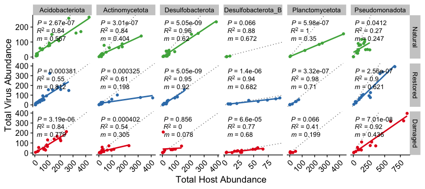<!-- -->

``` r
ggsave(plot = plot.virus.over.host.abundance.phylum,
       file = "../Plots/virus_replication/virus_over_host_abundance_by_phylum.png",
       device = "png",
       dpi = 600,
       width = 12,
       height = 4,
       units = "in",
       bg = "white")
```

# Lysogenic phage abundance

## Get lysogenic phages

``` r
lysogenic_phages <- virus_info %>%
  filter(lytic_state == "integrated_prophage" | lytic_state == "lysogenic_virus" | lytic_state == "lysogenic_scaffold")

lysogenic_phages_info <- virus_abundance_with_hosts_and_all_sites_and_metabolism %>%
  filter(Virus %in% lysogenic_phages$Virus) %>%
  dplyr::rename(Trend_Group = `Virus Trend Group`,
                Abundance = Virus_Abundance) %>%
  mutate(Trend_Group = case_when(Trend_Group == "Natural-abundant" ~ "Natural",
                                 Trend_Group == "Restored-abundant" ~ "Restored",
                                 Trend_Group == "Damaged-abundant" ~ "Damaged")) %>%
  mutate(Trend_Group = factor(Trend_Group, levels = c("Natural", "Restored", "Damaged")))
head(lysogenic_phages_info)
```

    ##                          Virus Sample Abundance      site treatment Trend_Group
    ## 1 CRr3G3H3I_vRhyme_unbinned_97  BAr1A  2.688540 All sites       NAT    Restored
    ## 2 CRr3G3H3I_vRhyme_unbinned_97  BAr1A  2.688540 All sites       NAT    Restored
    ## 3 CRr3G3H3I_vRhyme_unbinned_97  BAr1A  2.688540 All sites       NAT    Restored
    ## 4 BAr2D2E2F_vRhyme_unbinned_62  BAr1A  6.271825 All sites       NAT     Natural
    ## 5 BAr2D2E2F_vRhyme_unbinned_62  BAr1A  6.271825 All sites       NAT     Natural
    ## 6 BAr2D2E2F_vRhyme_unbinned_62  BAr1A  6.271825 All sites       NAT     Natural
    ##   Virus Sample              Host Host Sample Host Domain        Host Phylum
    ## 1    CRr3G3H3I SEr2D2E2F__bin_85   SEr2D2E2F    Bacteria Desulfobacterota_B
    ## 2    CRr3G3H3I SEr2D2E2F__bin_85   SEr2D2E2F    Bacteria Desulfobacterota_B
    ## 3    CRr3G3H3I SEr2D2E2F__bin_85   SEr2D2E2F    Bacteria Desulfobacterota_B
    ## 4    BAr2D2E2F BAr1A1B1C__bin_10   BAr1A1B1C    Bacteria    Acidobacteriota
    ## 5    BAr2D2E2F BAr1A1B1C__bin_10   BAr1A1B1C    Bacteria    Acidobacteriota
    ## 6    BAr2D2E2F BAr1A1B1C__bin_10   BAr1A1B1C    Bacteria    Acidobacteriota
    ##    Host Class    Host Order Host Family Host Genus                    Module
    ## 1     Binatia     Binatales  Binataceae    Binatus Oxidative phosphorylation
    ## 2     Binatia     Binatales  Binataceae    Binatus  Carbohydrate degradation
    ## 3     Binatia     Binatales  Binataceae    Binatus  Carbohydrate degradation
    ## 4 Terriglobia Terriglobales        SbA1    Bog-209 Oxidative phosphorylation
    ## 5 Terriglobia Terriglobales        SbA1    Bog-209  Carbohydrate degradation
    ## 6 Terriglobia Terriglobales        SbA1    Bog-209  Carbohydrate degradation
    ##                   Category                       Module_orig
    ## 1            ATP synthesis Cytochrome c oxidase, prokaryotes
    ## 2 Carbohydrate degradation                Amylolytic enzymes
    ## 3 Carbohydrate degradation                Amylolytic enzymes
    ## 4            ATP synthesis Cytochrome c oxidase, prokaryotes
    ## 5 Carbohydrate degradation                Amylolytic enzymes
    ## 6 Carbohydrate degradation                  Chitin degrading
    ##                     Pathway Module.ID
    ## 1 Oxidative phosphorylation    M00155
    ## 2        Amylolytic enzymes      <NA>
    ## 3        Amylolytic enzymes      <NA>
    ## 4 Oxidative phosphorylation    M00155
    ## 5        Amylolytic enzymes      <NA>
    ## 6          Chitin degrading      <NA>

``` r
lysogenic_phages_non_redundant <- lysogenic_phages_info %>%
  select(Virus, Sample, site, treatment, Trend_Group, Abundance) %>%
  distinct()
head(lysogenic_phages_non_redundant)
```

    ##                           Virus Sample      site treatment Trend_Group
    ## 1  CRr3G3H3I_vRhyme_unbinned_97  BAr1A All sites       NAT    Restored
    ## 2  BAr2D2E2F_vRhyme_unbinned_62  BAr1A All sites       NAT     Natural
    ## 3  CRr2D2E2F_vRhyme_unbinned_12  BAr1A All sites       NAT     Natural
    ## 4  BAr1A1B1C_vRhyme_unbinned_95  BAr1A All sites       NAT     Natural
    ## 5 SEr3G3H3I_vRhyme_unbinned_275  BAr1A All sites       NAT     Natural
    ## 6  CRr3G3H3I_vRhyme_unbinned_88  BAr1A All sites       NAT     Natural
    ##   Abundance
    ## 1  2.688540
    ## 2  6.271825
    ## 3  1.194054
    ## 4  2.131511
    ## 5  1.639766
    ## 6  1.252567

``` r
lysogenic_per_sample <- lysogenic_phages_non_redundant %>%
  group_by(Sample, site, treatment) %>%
  summarize(total_abundance = sum(Abundance),
            mean_abundance = mean(Abundance),
            sd_abundance = sd(Abundance),
            n = n(),
            se_abundance = sd_abundance / sqrt(n)) %>%
  ungroup()  %>%
  mutate(treatment = case_when(treatment == "NAT" ~ "Natural",
                               treatment == "REST" ~ "Restored",
                               treatment == "DAM" ~ "Damaged")) %>%
  mutate(treatment = factor(treatment, levels = c("Natural", "Restored", "Damaged")))
  
head(lysogenic_per_sample)
```

    ## # A tibble: 6 × 8
    ##   Sample site      treatment total_abundance mean_abundance sd_abundance     n
    ##   <chr>  <fct>     <fct>               <dbl>          <dbl>        <dbl> <int>
    ## 1 BAr1A  Balmoral  Natural              374.           6.23         5.65    60
    ## 2 BAr1A  All sites Natural              374.           6.23         5.65    60
    ## 3 BAr1B  Balmoral  Natural              512.           5.34         6.24    96
    ## 4 BAr1B  All sites Natural              512.           5.34         6.24    96
    ## 5 BAr1C  Balmoral  Natural              581.           7.65         8.65    76
    ## 6 BAr1C  All sites Natural              581.           7.65         8.65    76
    ## # ℹ 1 more variable: se_abundance <dbl>

## Get pariwise comparisons for “all sites” using mixed effects model

``` r
# Fit LME on all sites (to get emmeans contrasts for “All sites”)
m_all_non <- lmer(
  mean_abundance ~ treatment + (1 | site),
  data = lysogenic_per_sample %>% filter(site != "All sites")
)
emm_all_non  <- emmeans(m_all_non, ~ treatment)
pairs_all_non <- contrast(emm_all_non, method = "pairwise", adjust = "BH") %>%
  as.data.frame()

# Build an annotation table for “All sites” using the LME contrasts
y_max_non <- max(
  lysogenic_per_sample$mean_abundance[lysogenic_per_sample$site == "All sites"],
  na.rm = TRUE
)
gap_non <- 0.05 * y_max_non

annot_all_non <- pairs_all_non %>%
  mutate(
    group1 = sub(" - .*", "", contrast),
    group2 = sub(".* - ", "", contrast),
    ymin   = y_max_non + gap_non * row_number(),
    label  = case_when(
      p.value <= 0.0001 ~ "****",
      p.value <= 0.001  ~ "***",
      p.value <= 0.01   ~ "**",
      p.value <= 0.05   ~ "*",
      TRUE                  ~ NA_character_
    )
  ) %>%
  filter(!is.na(label))
annot_all_non
```

    ##  [1] contrast estimate SE       df       t.ratio  p.value  group1   group2  
    ##  [9] ymin     label   
    ## <0 rows> (or 0-length row.names)

``` r
plot.lysogenic.tmeans.mean <-
ggplot(lysogenic_per_sample,
       aes(x = treatment, y = mean_abundance, color = treatment)) +
  facet_wrap(~site, nrow = 1) +
  geom_jitter(width = 0.2, alpha = 0.6) +
  geom_boxplot(outlier.shape = NA, alpha = 0.25) +
  # For individual‐site pairwise tests:
  stat_pwc(
    data               = lysogenic_per_sample %>% filter(site!= "Stean" & site != "All sites"),
    p.adjust.method    = "BH",
    label              = "p.adj.signif",
    method             = "emmeans_test",
    hide.ns            = TRUE
  ) +
  # Add “All sites” LME‐based asterisks:
  geom_segment(
    data = annot_all_non,
    aes(
      x    = as.numeric(factor(group1, levels = c("Natural","Restored","Damaged"))),
      xend = as.numeric(factor(group2, levels = c("Natural","Restored","Damaged"))),
      y    = ymin, yend = ymin
    ),
    inherit.aes = FALSE,
    color = "black",
    size  = 0.5
  ) +
  geom_text(
    data = annot_all_non,
    aes(
      x     = (as.numeric(factor(group1, levels = c("Natural","Restored","Damaged"))) +
               as.numeric(factor(group2, levels = c("Natural","Restored","Damaged")))) / 2,
      y     = ymin + (0.02 * y_max_non),
      label = label
    ),
    size = 4,
    inherit.aes = FALSE
  ) +
  scale_y_continuous(labels = scales::scientific_format()) +
  scale_color_manual(
    values = c("Natural" = "#4DAF4A", "Restored" = "#377EB8", "Damaged" = "#E41A1C"),
    name = "Ecosystem health"
  ) +
  labs(
    x = "Ecosystem health status",
    y = "Mean lysogenic virus abundance (per sample)"
  ) +
  cowplot::theme_cowplot() +
  theme(
    axis.text.x    = element_text(angle = 45, hjust = 1, size = 10),
    axis.text.y    = element_text(size = 9),
    axis.title     = element_text(size = 12),
    strip.text.x   = element_text(size = 10),
    legend.position= "none"
  )
plot.lysogenic.tmeans.mean
```

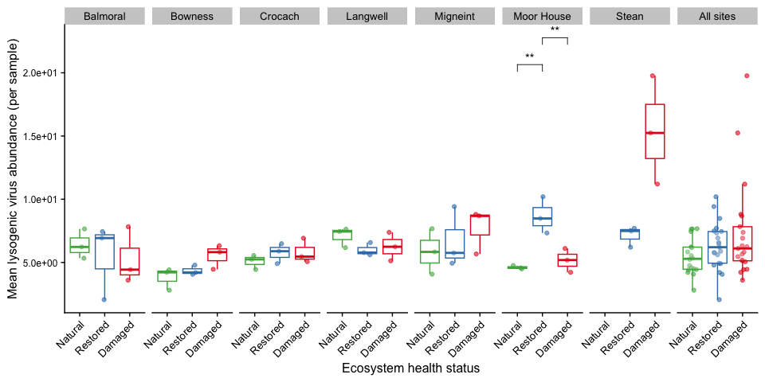<!-- -->

``` r
ggsave(plot.lysogenic.tmeans.mean,
       file="../Plots/virus_replication/lysogenic_phage_abundance.png",
       device = "png",
       width = 10, height = 5, units = "in",
       dpi = 600, bg = "white")
```

## Normalize by total virus abundance per sample

### Calculate the total virus abundance per sample

``` r
total_virus_abundance_per_sample <- virus_abundance_with_hosts_and_all_sites %>%
  filter(site != "All sites") %>%
  select(Virus, Sample, Virus_Abundance) %>%
  distinct() %>%
  group_by(Sample) %>%
  summarize(total_virus_abundance_in_sample = sum(Virus_Abundance)) %>%
  ungroup()
total_virus_abundance_per_sample
```

    ## # A tibble: 60 × 2
    ##    Sample total_virus_abundance_in_sample
    ##    <chr>                            <dbl>
    ##  1 BAr1A                            1459.
    ##  2 BAr1B                            1441.
    ##  3 BAr1C                            2002.
    ##  4 BAr2D                             308.
    ##  5 BAr2E                            1484.
    ##  6 BAr2F                            1346.
    ##  7 BAr3G                             551.
    ##  8 BAr3H                             489.
    ##  9 BAr3I                             281.
    ## 10 BOr1A                             912.
    ## # ℹ 50 more rows

### Normalize by total virus abundance per sample

``` r
lysogenic_per_sample_norm <- lysogenic_phages_non_redundant %>%
  left_join(total_virus_abundance_per_sample, by = "Sample") %>%
  mutate(Abundance_norm = Abundance / total_virus_abundance_in_sample) %>%
  group_by(Sample, site, treatment) %>%
  summarize(total_abundance = sum(Abundance),
            total_abundance_norm = sum(Abundance_norm),
            mean_abundance = mean(Abundance),
            mean_abundance_norm = mean(Abundance_norm),
            sd_abundance = sd(Abundance),
            sd_abundance_norm = sd(Abundance_norm),
            n = n(),
            se_abundance = sd_abundance / sqrt(n),
            se_abundance_norm = sd_abundance_norm / sqrt(n)) %>%
  ungroup() %>%
  mutate(treatment = case_when(treatment == "NAT" ~ "Natural",
                               treatment == "REST" ~ "Restored",
                               treatment == "DAM" ~ "Damaged")) %>%
  mutate(treatment = factor(treatment, levels = c("Natural", "Restored", "Damaged")))
write_csv(lysogenic_per_sample_norm, file = "../Tables/lysogenic_virus_abundance.csv")
head(lysogenic_per_sample_norm)
```

    ## # A tibble: 6 × 12
    ##   Sample site      treatment total_abundance total_abundance_norm mean_abundance
    ##   <chr>  <fct>     <fct>               <dbl>                <dbl>          <dbl>
    ## 1 BAr1A  Balmoral  Natural              374.                0.256           6.23
    ## 2 BAr1A  All sites Natural              374.                0.256           6.23
    ## 3 BAr1B  Balmoral  Natural              512.                0.356           5.34
    ## 4 BAr1B  All sites Natural              512.                0.356           5.34
    ## 5 BAr1C  Balmoral  Natural              581.                0.290           7.65
    ## 6 BAr1C  All sites Natural              581.                0.290           7.65
    ## # ℹ 6 more variables: mean_abundance_norm <dbl>, sd_abundance <dbl>,
    ## #   sd_abundance_norm <dbl>, n <int>, se_abundance <dbl>,
    ## #   se_abundance_norm <dbl>

### Fit a linear-mixed effects model with ecosystem health status as a fixed effect and sample site as a random intercept

``` r
m_treatment <- lmer(
  mean_abundance_norm ~ treatment + (1 | site),
  data = lysogenic_per_sample_norm %>% filter(site != "All sites"),
  REML = FALSE
)
summary(m_treatment)
```

    ## Linear mixed model fit by maximum likelihood  ['lmerMod']
    ## Formula: mean_abundance_norm ~ treatment + (1 | site)
    ##    Data: lysogenic_per_sample_norm %>% filter(site != "All sites")
    ## 
    ##      AIC      BIC   logLik deviance df.resid 
    ##   -563.8   -553.3    286.9   -573.8       55 
    ## 
    ## Scaled residuals: 
    ##     Min      1Q  Median      3Q     Max 
    ## -1.3971 -0.5609 -0.0620  0.2801  4.5018 
    ## 
    ## Random effects:
    ##  Groups   Name        Variance  Std.Dev.
    ##  site     (Intercept) 2.268e-06 0.001506
    ##  Residual             3.288e-06 0.001813
    ## Number of obs: 60, groups:  site, 7
    ## 
    ## Fixed effects:
    ##                    Estimate Std. Error t value
    ## (Intercept)       0.0036496  0.0007191   5.075
    ## treatmentRestored 0.0003114  0.0005914   0.527
    ## treatmentDamaged  0.0016115  0.0005914   2.725
    ## 
    ## Correlation of Fixed Effects:
    ##             (Intr) trtmnR
    ## trtmntRstrd -0.454       
    ## tretmntDmgd -0.454  0.552

### Get pairwise contrasts for each ecosystem health status with `emmeans`

``` r
emm_treat <- emmeans(m_treatment, ~ treatment)
pairs_treat <- contrast(emm_treat, method = "pairwise", adjust = "BH")
pairs_df <- as.data.frame(pairs_treat)
pairs_df
```

    ##  contrast                estimate           SE    df t.ratio p.value
    ##  Natural - Restored -0.0003114271 0.0006042867 55.78  -0.515  0.6083
    ##  Natural - Damaged  -0.0016114918 0.0006042867 55.78  -2.667  0.0300
    ##  Restored - Damaged -0.0013000647 0.0005703257 55.03  -2.280  0.0398
    ## 
    ## Degrees-of-freedom method: kenward-roger 
    ## P value adjustment: BH method for 3 tests

### Prepare emmeans annotation coordinates for the plot

``` r
y_max_allsites_norm <- max(subset(lysogenic_per_sample_norm, site != "All sites")$mean_abundance_norm, na.rm = TRUE)
gap <- 0.15 * y_max_allsites_norm
tick_height <- 0.04 * y_max_allsites_norm
annot_allsites_norm <- pairs_df %>%
  mutate(
    site = factor("All sites", levels = levels(lysogenic_per_sample_norm$site)),
    group1 = sub(" - .*", "", contrast),
    group2 = sub(".* - ", "", contrast),
    ymin = y_max_allsites_norm + gap * row_number(),
    ymax = ymin,  # horizontal bar at this y
    label = case_when(
      p.value <= 0.0001 ~ "****",
      p.value <= 0.001  ~ "***",
      p.value <= 0.01   ~ "**",
      p.value <= 0.05   ~ "*",
      TRUE              ~ NA_character_
    )
  ) %>%
  filter(!is.na(label))
annot_allsites_norm
```

    ##             contrast     estimate           SE       df   t.ratio    p.value
    ## 1  Natural - Damaged -0.001611492 0.0006042867 55.78404 -2.666767 0.03000852
    ## 2 Restored - Damaged -0.001300065 0.0005703257 55.03171 -2.279513 0.03980465
    ##        site   group1  group2       ymin       ymax label
    ## 1 All sites  Natural Damaged 0.02080016 0.02080016     *
    ## 2 All sites Restored Damaged 0.02320018 0.02320018     *

## Plot the normnalized total lysogenic phage abundance

``` r
plot.lysogenic.tmeans.mean.norm <-
ggplot(lysogenic_per_sample_norm,
       aes(x = treatment, y = mean_abundance_norm, color = treatment)) +
  facet_wrap(~site, nrow=1) +
  geom_jitter() +
  stat_pwc(
    data               = lysogenic_per_sample_norm %>% filter(site!= "Stean" & site != "All sites"),
    p.adjust.method    = "BH",
    label              = "p.adj.signif",
    method             = "emmeans_test",
    hide.ns            = TRUE
  ) +
  # Add “All sites” LME‐based asterisks:
  geom_segment(
    data = annot_allsites_norm,
    aes(
      x    = as.numeric(factor(group1, levels = c("Natural","Restored","Damaged"))),
      xend = as.numeric(factor(group2, levels = c("Natural","Restored","Damaged"))),
      y    = ymin,
      yend = ymax
    ),
    inherit.aes = FALSE,
    color = "black",
    size  = 0.25
  ) +
  # Add vertical ticks at both ends of each horizontal bracket
  geom_segment(
    data        = annot_allsites_norm,
    aes(
      x    = as.numeric(factor(group1, levels = c("Natural","Restored","Damaged"))),
      xend = as.numeric(factor(group1, levels = c("Natural","Restored","Damaged"))),
      y    = ymin+0.000025,
      yend = ymin - tick_height
    ),
    inherit.aes = FALSE,
    color       = "black",
    size        = 0.25
  ) +
  geom_segment(
    data        = annot_allsites_norm,
    aes(
      x    = as.numeric(factor(group2, levels = c("Natural","Restored","Damaged"))),
      xend = as.numeric(factor(group2, levels = c("Natural","Restored","Damaged"))),
      y    = ymin+0.000025,
      yend = ymin - tick_height
    ),
    inherit.aes = FALSE,
    color       = "black",
    size        = 0.25
  ) +
  # Asterisk labels centered between group1 and group2
  geom_text(
    data = annot_allsites_norm,
    aes(
      x = (as.numeric(factor(group1, levels = c("Natural","Restored","Damaged"))) +
           as.numeric(factor(group2, levels = c("Natural","Restored","Damaged")))) / 2,
      y = ymin + (0.02 * y_max_allsites_norm), # small vertical offset above the bar
      label = label
    ),
    size = 4,
    inherit.aes = FALSE) +
  geom_boxplot(outlier.shape = NA, alpha = 0.25) +
  scale_y_continuous(labels = function(x) format(x, scientific = TRUE)) +
  scale_color_manual(
    values = c("Natural" = "#4DAF4A", "Restored" = "#377EB8", "Damaged" = "#E41A1C"),
    name = "Ecosystem health") +
  labs(x = "Ecosystem health status", y = "Normalized lysogenic virus abundance (per sample)") +
  cowplot::theme_cowplot() +
  theme(
    axis.text.x = element_text(angle = 45, hjust = 1, size = 10),
    axis.text.y = element_text(size = 9),
    axis.title = element_text(size=12),
    strip.text.x = element_text(size = 10),
    legend.position = "none"
    )
plot.lysogenic.tmeans.mean.norm
```

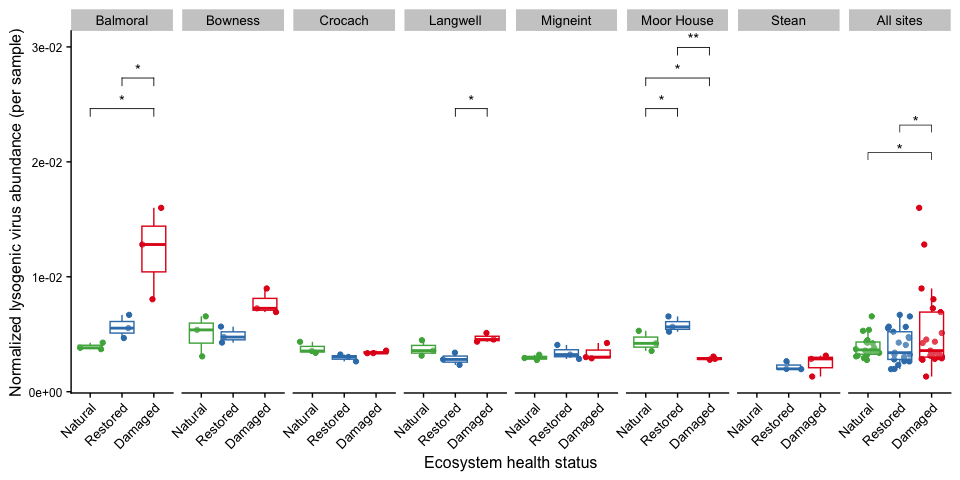<!-- -->

``` r
ggsave(plot.lysogenic.tmeans.mean.norm,
       file="../Plots/virus_replication/lysogenic_phage_abundance_normalized.png",
       device = "png",
       width = 10, height = 5, units = "in",
       dpi = 600, bg = "white")
```

## Combine the plots

``` r
plot.combined.lysogenic <- cowplot::plot_grid(plot.lysogenic.tmeans.mean,
                                              plot.lysogenic.tmeans.mean.norm,
                                              nrow = 2,
                                              align = "hv",
                                              axis = "l",
                                              labels = c("A", "B"),
                                              label_size = 16,
                                              label_fontfamily = "sans",
                                              label_fontface = "bold")
ggsave(plot.combined.lysogenic,
       file="../Plots/virus_replication/FigS5.png",
       device = "png",
       width = 10, height = 10, units = "in",
       dpi = 600, bg = "white")
plot.combined.lysogenic
```

<!-- -->

## Plot the mean normalized lysogenic virus abundance for just all sites

``` r
plot.lysogenic.tmeans.mean.norm.allsites <-
ggplot(lysogenic_per_sample_norm %>%
         filter(site == "All sites"),
       aes(x = treatment, y = mean_abundance_norm, color = treatment)) +
  geom_jitter() +
  geom_boxplot(outlier.shape = NA, alpha = 0.25) +
  scale_y_continuous(labels = function(x) format(x, scientific = TRUE), limits = c(0, 2e-2)) +
  scale_color_manual(
    values = c("Natural" = "#4DAF4A", "Restored" = "#377EB8", "Damaged" = "#E41A1C"),
    name = "Ecosystem health") +
  labs(x = "Ecosystem health status", y = "Normalized lysogenic virus\nabundance (per sample)") +
  cowplot::theme_cowplot() +
  theme(
    legend.position = "none"
    )

plot.lysogenic.tmeans.mean.norm.allsites <- plot.lysogenic.tmeans.mean.norm.allsites +
  # Add “All sites” LME‐based asterisks:
  geom_segment(
    data = annot_allsites_norm,
    aes(
      x    = as.numeric(factor(group1, levels = c("Natural","Restored","Damaged"))),
      xend = as.numeric(factor(group2, levels = c("Natural","Restored","Damaged"))),
      y    = ymin - 0.00375,
      yend = ymax - 0.00375
    ),
    inherit.aes = FALSE,
    color = "black",
    size  = 0.25
  ) +
  # Add vertical ticks at both ends of each horizontal bracket
  geom_segment(
    data        = annot_allsites_norm,
    aes(
      x    = as.numeric(factor(group1, levels = c("Natural","Restored","Damaged"))),
      xend = as.numeric(factor(group1, levels = c("Natural","Restored","Damaged"))),
      y    = ymin+0.000025 - 0.00375,
      yend = ymin - tick_height - 0.00375
    ),
    inherit.aes = FALSE,
    color       = "black",
    size        = 0.25
  ) +
  geom_segment(
    data        = annot_allsites_norm,
    aes(
      x    = as.numeric(factor(group2, levels = c("Natural","Restored","Damaged"))),
      xend = as.numeric(factor(group2, levels = c("Natural","Restored","Damaged"))),
      y    = ymin+0.000025 - 0.00375,
      yend = ymin - tick_height - 0.00375
    ),
    inherit.aes = FALSE,
    color       = "black",
    size        = 0.25
  ) +
  # Asterisk labels centered between group1 and group2
  geom_text(
    data = annot_allsites_norm,
    aes(
      x = (as.numeric(factor(group1, levels = c("Natural","Restored","Damaged"))) +
           as.numeric(factor(group2, levels = c("Natural","Restored","Damaged")))) / 2,
      y = ymin + (0.02 * y_max_allsites_norm) - 0.00375, # small vertical offset above the bar
      label = label
    ),
    size = 4,
    inherit.aes = FALSE) +
  theme(legend.position = "none")

plot.lysogenic.tmeans.mean.norm.allsites
```

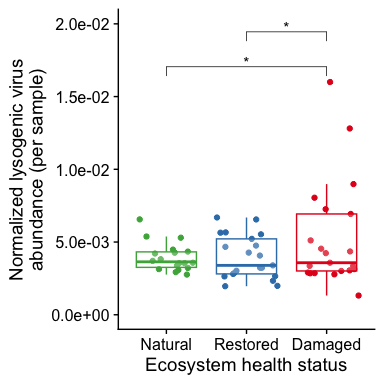<!-- -->

# “Active” viruses

## Get virus-host ratios for individual virus-host pairs

``` r
virus_host_abundance_indiv <- virus_host_abundance %>%
  mutate(virus_host_ratio = Virus_Abundance / Host_Abundance) %>%
  mutate(Label = paste0(`Host Domain`, "; ", `Host Phylum`, "; ", `Host Family`)) %>%
  mutate(Label = sub("^Bacteria; ", "B; ", Label),
         Label = sub("^Archaea; ", "A; ", Label)) %>%
  mutate(lysogenic = case_when(Virus %in% lysogenic_phages_non_redundant$Virus ~ TRUE,
                               Virus %in% lysogenic_phages_non_redundant$Virus == FALSE ~ FALSE))
write_csv(virus_host_abundance_indiv, file = "../Tables/virus_host_abundance_individual.csv")
```

### Get the numebr and distribution of active viruses (virus/host ratio \>=10)

``` r
print("Number of active viruses:")
```

    ## [1] "Number of active viruses:"

``` r
length(unique(subset(virus_host_abundance_indiv, virus_host_ratio >= 10)$Virus))
```

    ## [1] 51

``` r
print("Number of all viruses with host predictions and abundances > 0:")
```

    ## [1] "Number of all viruses with host predictions and abundances > 0:"

``` r
length(unique(virus_host_abundance_indiv$Virus))
```

    ## [1] 486

``` r
print("Fraction of active viruses out of all viruses with host predictions and abundances > 0:")
```

    ## [1] "Fraction of active viruses out of all viruses with host predictions and abundances > 0:"

``` r
length(unique(subset(virus_host_abundance_indiv, virus_host_ratio >= 10)$Virus))/length(unique(virus_host_abundance_indiv$Virus))
```

    ## [1] 0.1049383

``` r
print("Number of lysogenic viruses:")
```

    ## [1] "Number of lysogenic viruses:"

``` r
length(unique(lysogenic_phages_non_redundant$Virus))
```

    ## [1] 301

``` r
print("Fraction of lysogenic viruses out of all identified viruses:")
```

    ## [1] "Fraction of lysogenic viruses out of all identified viruses:"

``` r
length(unique(lysogenic_phages_non_redundant$Virus))/length(unique(virus_info$Virus))
```

    ## [1] 0.1319597

``` r
print("Number of active viruses that are lysogenic:")
```

    ## [1] "Number of active viruses that are lysogenic:"

``` r
length(unique(subset(virus_host_abundance_indiv, virus_host_ratio >= 10 & lysogenic == TRUE)$Virus))
```

    ## [1] 27

``` r
print("Fraction of active, lysogenic viruses out of all active viruses:")
```

    ## [1] "Fraction of active, lysogenic viruses out of all active viruses:"

``` r
length(unique(subset(virus_host_abundance_indiv, virus_host_ratio >= 10 & lysogenic == TRUE)$Virus))/length(unique(subset(virus_host_abundance_indiv, virus_host_ratio >= 10)$Virus))
```

    ## [1] 0.5294118

``` r
length(unique(subset(virus_host_abundance_indiv, virus_host_ratio >= 10)$Virus))
```

    ## [1] 51

``` r
print("Fraction of active, lysogenic viruses out of all lysogenic viruses:")
```

    ## [1] "Fraction of active, lysogenic viruses out of all lysogenic viruses:"

``` r
length(unique(subset(virus_host_abundance_indiv, virus_host_ratio >= 10 & lysogenic == TRUE)$Virus))/
length(unique(lysogenic_phages_non_redundant$Virus))
```

    ## [1] 0.089701

``` r
print("Number of hosts with active viruses:")
```

    ## [1] "Number of hosts with active viruses:"

``` r
length(unique(subset(virus_host_abundance_indiv, virus_host_ratio >= 10)$Host))
```

    ## [1] 60

``` r
print("Fraction of hosts with active viruses:")
```

    ## [1] "Fraction of hosts with active viruses:"

``` r
length(unique(subset(virus_host_abundance_indiv, virus_host_ratio >= 10)$Host))/length(unique(virus_host_abundance_indiv$Host))
```

    ## [1] 0.2230483

``` r
print("Number of samples with active viruses:")
```

    ## [1] "Number of samples with active viruses:"

``` r
length(unique(subset(virus_host_abundance_indiv, virus_host_ratio >= 10)$Sample))
```

    ## [1] 46

``` r
active_lysogens <- subset(virus_host_abundance_indiv, virus_host_ratio >= 10 & lysogenic == TRUE)
active_lysogens
```

    ##                                Virus  Sample Virus_Abundance       site
    ## 27   LASCr2D2E2F_vRhyme_unbinned_114   BAr1A        12.11484   Balmoral
    ## 522     BOr3G3H3I_vRhyme_unbinned_26   BAr2E        76.89652   Balmoral
    ## 1156 LASCr2D2E2F_vRhyme_unbinned_114   BOr2E        32.57959    Bowness
    ## 1199    BOr3G3H3I_vRhyme_unbinned_26   BOr2E        17.40979    Bowness
    ## 1378    BOr3G3H3I_vRhyme_unbinned_26   BOr3G        15.32080    Bowness
    ## 1819    MGr3G3H3I_vRhyme_unbinned_22   CRr1B        24.13249    Crocach
    ## 2102    CRr2D2E2F_vRhyme_unbinned_92   CRr2D        16.82141    Crocach
    ## 2270    CRr3G3H3I_vRhyme_unbinned_83   CRr2E        15.97765    Crocach
    ## 2287    CRr2D2E2F_vRhyme_unbinned_92   CRr2E        28.68396    Crocach
    ## 2485    MGr2D2E2F_vRhyme_unbinned_84   CRr2F        15.79529    Crocach
    ## 2537    CRr2D2E2F_vRhyme_unbinned_94   CRr2F        25.89732    Crocach
    ## 2978    MGr2D2E2F_vRhyme_unbinned_84   CRr3I        38.30907    Crocach
    ## 3152 LABRr1A1B1C_vRhyme_unbinned_118 LABRr1A        28.92451   Langwell
    ## 3275 LABRr1A1B1C_vRhyme_unbinned_118 LABRr1B        31.64873   Langwell
    ## 3379 LABRr1A1B1C_vRhyme_unbinned_121 LABRr1C        27.65561   Langwell
    ## 3669    MHr2D2E2F_vRhyme_unbinned_83 LASAr3H        23.18661   Langwell
    ## 4034   LAWAr2D2E2F_vRhyme_unbinned_2 LASCr2D        42.13223   Langwell
    ## 4277   LAWAr2D2E2F_vRhyme_unbinned_2 LASCr2E        41.47076   Langwell
    ## 4406 LASCr2D2E2F_vRhyme_unbinned_114 LASCr2F        20.41252   Langwell
    ## 4486   LAWAr2D2E2F_vRhyme_unbinned_2 LASCr2F        59.50671   Langwell
    ## 4525    BOr3G3H3I_vRhyme_unbinned_26 LASCr2F        21.98551   Langwell
    ## 4679  LASAr3G3H3I_vRhyme_unbinned_35   MGr1B        21.43217   Migneint
    ## 4823    MGr3G3H3I_vRhyme_unbinned_22   MGr1B        25.69486   Migneint
    ## 5330  LAWAr2D2E2F_vRhyme_unbinned_89   MGr2F        37.26246   Migneint
    ## 5844  LAWAr2D2E2F_vRhyme_unbinned_89   MGr3I        54.11900   Migneint
    ## 5947    MHr1A1B1C_vRhyme_unbinned_41   MHr1A        20.94842 Moor_House
    ## 6183    MGr3G3H3I_vRhyme_unbinned_22   MHr1B        19.65074 Moor_House
    ## 6194    BOr3G3H3I_vRhyme_unbinned_26   MHr1B        17.71023 Moor_House
    ## 6505     MHr2D2E2F_vRhyme_unbinned_6   MHr2E        26.33188 Moor_House
    ## 6619     MHr2D2E2F_vRhyme_unbinned_6   MHr2F        41.29559 Moor_House
    ## 7016    MGr2D2E2F_vRhyme_unbinned_84   MHr3I        41.50126 Moor_House
    ## 7055    MGr3G3H3I_vRhyme_unbinned_22   MHr3I        28.65775 Moor_House
    ## 7209    CRr2D2E2F_vRhyme_unbinned_95   SEr2D        37.84966      Stean
    ## 7459 LASCr2D2E2F_vRhyme_unbinned_114   SEr2F        33.53860      Stean
    ## 7464    BAr2D2E2F_vRhyme_unbinned_43   SEr2F        39.95605      Stean
    ## 7568          SEr3G3H3I_vRhyme_bin_7   SEr3G        18.70847      Stean
    ## 7597   SEr3G3H3I_vRhyme_unbinned_267   SEr3G        49.54958      Stean
    ## 7607    BOr1A1B1C_vRhyme_unbinned_27   SEr3G        61.86221      Stean
    ## 7670   SEr3G3H3I_vRhyme_unbinned_263   SEr3G        18.52032      Stean
    ## 7758    SEr3G3H3I_vRhyme_unbinned_29   SEr3H        45.00036      Stean
    ## 7766    BOr1A1B1C_vRhyme_unbinned_27   SEr3H        45.36638      Stean
    ## 7892          SEr3G3H3I_vRhyme_bin_7   SEr3I        65.98206      Stean
    ## 8013 LASCr2D2E2F_vRhyme_unbinned_114   SEr3I        82.60574      Stean
    ## 8014    SEr3G3H3I_vRhyme_unbinned_20   SEr3I        20.38195      Stean
    ## 8061   SEr3G3H3I_vRhyme_unbinned_276   SEr3I       211.84587      Stean
    ## 8105   SEr2D2E2F_vRhyme_unbinned_187   SEr3I        19.22859      Stean
    ## 8173   SEr3G3H3I_vRhyme_unbinned_299   SEr3I        25.03615      Stean
    ## 8191 LABRr1A1B1C_vRhyme_unbinned_121   SEr3I        46.98938      Stean
    ## 8216    CRr2D2E2F_vRhyme_unbinned_95   SEr3I       113.93412      Stean
    ## 8218    CRr2D2E2F_vRhyme_unbinned_95   SEr3I       113.93412      Stean
    ## 8245   SEr3G3H3I_vRhyme_unbinned_304   SEr3I        36.76962      Stean
    ##      treatment Virus Trend Group Virus Sample                 Host Host Sample
    ## 27     Natural  Natural-abundant  LASCr2D2E2F    BAr2D2E2F__bin_44   BAr2D2E2F
    ## 522   Restored Restored-abundant    BOr3G3H3I    CRr2D2E2F__bin_75   CRr2D2E2F
    ## 1156  Restored Restored-abundant  LASCr2D2E2F   BAr1A1B1C__bin_104   BAr1A1B1C
    ## 1199  Restored              <NA>    BOr3G3H3I   CRr1A1B1C__bin_118   CRr1A1B1C
    ## 1378   Damaged              <NA>    BOr3G3H3I    CRr2D2E2F__bin_75   CRr2D2E2F
    ## 1819   Natural              <NA>    MGr3G3H3I    CRr2D2E2F__bin_75   CRr2D2E2F
    ## 2102  Restored Restored-abundant    CRr2D2E2F  LAWAr2D2E2F__bin_98 LAWAr2D2E2F
    ## 2270  Restored Restored-abundant    CRr3G3H3I   SEr3G3H3I__bin_276   SEr3G3H3I
    ## 2287  Restored Restored-abundant    CRr2D2E2F  LAWAr2D2E2F__bin_98 LAWAr2D2E2F
    ## 2485  Restored              <NA>    MGr2D2E2F    CRr3G3H3I__bin_47   CRr3G3H3I
    ## 2537  Restored              <NA>    CRr2D2E2F     SEr2D2E2F__bin_6   SEr2D2E2F
    ## 2978   Damaged              <NA>    MGr2D2E2F    CRr3G3H3I__bin_47   CRr3G3H3I
    ## 3152   Natural  Natural-abundant  LABRr1A1B1C   BAr1A1B1C__bin_132   BAr1A1B1C
    ## 3275   Natural  Natural-abundant  LABRr1A1B1C   BAr1A1B1C__bin_132   BAr1A1B1C
    ## 3379   Natural              <NA>  LABRr1A1B1C LAWAr2D2E2F__bin_134 LAWAr2D2E2F
    ## 3669   Damaged  Damaged-abundant    MHr2D2E2F LASCr2D2E2F__bin_140 LASCr2D2E2F
    ## 4034  Restored Restored-abundant  LAWAr2D2E2F LAWAr2D2E2F__bin_138 LAWAr2D2E2F
    ## 4277  Restored Restored-abundant  LAWAr2D2E2F LAWAr2D2E2F__bin_138 LAWAr2D2E2F
    ## 4406  Restored Restored-abundant  LASCr2D2E2F    CRr2D2E2F__bin_75   CRr2D2E2F
    ## 4486  Restored Restored-abundant  LAWAr2D2E2F LAWAr2D2E2F__bin_138 LAWAr2D2E2F
    ## 4525  Restored Restored-abundant    BOr3G3H3I    CRr2D2E2F__bin_75   CRr2D2E2F
    ## 4679   Natural  Natural-abundant  LASAr3G3H3I     CRr3G3H3I__bin_3   CRr3G3H3I
    ## 4823   Natural  Natural-abundant    MGr3G3H3I    CRr2D2E2F__bin_75   CRr2D2E2F
    ## 5330  Restored  Damaged-abundant  LAWAr2D2E2F   LASAr3G3H3I__bin_7 LASAr3G3H3I
    ## 5844   Damaged  Damaged-abundant  LAWAr2D2E2F   LASAr3G3H3I__bin_7 LASAr3G3H3I
    ## 5947   Natural  Natural-abundant    MHr1A1B1C    BAr1A1B1C__bin_33   BAr1A1B1C
    ## 6183   Natural              <NA>    MGr3G3H3I    CRr2D2E2F__bin_75   CRr2D2E2F
    ## 6194   Natural              <NA>    BOr3G3H3I    CRr2D2E2F__bin_75   CRr2D2E2F
    ## 6505  Restored Restored-abundant    MHr2D2E2F  LABRr1A1B1C__bin_26 LABRr1A1B1C
    ## 6619  Restored Restored-abundant    MHr2D2E2F  LABRr1A1B1C__bin_26 LABRr1A1B1C
    ## 7016   Damaged              <NA>    MGr2D2E2F    CRr3G3H3I__bin_47   CRr3G3H3I
    ## 7055   Damaged              <NA>    MGr3G3H3I    CRr2D2E2F__bin_75   CRr2D2E2F
    ## 7209  Restored              <NA>    CRr2D2E2F    CRr3G3H3I__bin_90   CRr3G3H3I
    ## 7459  Restored              <NA>  LASCr2D2E2F   BAr1A1B1C__bin_104   BAr1A1B1C
    ## 7464  Restored Restored-abundant    BAr2D2E2F    BOr3G3H3I__bin_85   BOr3G3H3I
    ## 7568   Damaged  Damaged-abundant    SEr3G3H3I   SEr3G3H3I__bin_176   SEr3G3H3I
    ## 7597   Damaged  Damaged-abundant    SEr3G3H3I    SEr2D2E2F__bin_80   SEr2D2E2F
    ## 7607   Damaged              <NA>    BOr1A1B1C    SEr2D2E2F__bin_80   SEr2D2E2F
    ## 7670   Damaged  Damaged-abundant    SEr3G3H3I    SEr2D2E2F__bin_80   SEr2D2E2F
    ## 7758   Damaged  Damaged-abundant    SEr3G3H3I    CRr2D2E2F__bin_21   CRr2D2E2F
    ## 7766   Damaged              <NA>    BOr1A1B1C    SEr2D2E2F__bin_80   SEr2D2E2F
    ## 7892   Damaged  Damaged-abundant    SEr3G3H3I  LAWAr2D2E2F__bin_62 LAWAr2D2E2F
    ## 8013   Damaged              <NA>  LASCr2D2E2F     MHr2D2E2F__bin_7   MHr2D2E2F
    ## 8014   Damaged  Damaged-abundant    SEr3G3H3I   CRr1A1B1C__bin_138   CRr1A1B1C
    ## 8061   Damaged  Damaged-abundant    SEr3G3H3I    BAr1A1B1C__bin_33   BAr1A1B1C
    ## 8105   Damaged              <NA>    SEr2D2E2F   SEr3G3H3I__bin_159   SEr3G3H3I
    ## 8173   Damaged              <NA>    SEr3G3H3I LASCr2D2E2F__bin_104 LASCr2D2E2F
    ## 8191   Damaged              <NA>  LABRr1A1B1C LAWAr2D2E2F__bin_134 LAWAr2D2E2F
    ## 8216   Damaged              <NA>    CRr2D2E2F    CRr3G3H3I__bin_90   CRr3G3H3I
    ## 8218   Damaged              <NA>    CRr2D2E2F    BOr3G3H3I__bin_33   BOr3G3H3I
    ## 8245   Damaged  Damaged-abundant    SEr3G3H3I    CRr3G3H3I__bin_11   CRr3G3H3I
    ##      Host Domain        Host Phylum          Host Class          Host Order
    ## 27      Bacteria    Acidobacteriota         Terriglobia       Terriglobales
    ## 522     Bacteria    Acidobacteriota         Terriglobia       Terriglobales
    ## 1156    Bacteria    Acidobacteriota         Terriglobia       Terriglobales
    ## 1199    Bacteria    Acidobacteriota         Terriglobia       Terriglobales
    ## 1378    Bacteria    Acidobacteriota         Terriglobia       Terriglobales
    ## 1819    Bacteria    Acidobacteriota         Terriglobia       Terriglobales
    ## 2102    Bacteria Desulfobacterota_B             Binatia           Binatales
    ## 2270    Bacteria     Pseudomonadota Alphaproteobacteria         Rhizobiales
    ## 2287    Bacteria Desulfobacterota_B             Binatia           Binatales
    ## 2485    Bacteria     Pseudomonadota Alphaproteobacteria         Rhizobiales
    ## 2537    Bacteria     Pseudomonadota Alphaproteobacteria         Rhizobiales
    ## 2978    Bacteria     Pseudomonadota Alphaproteobacteria         Rhizobiales
    ## 3152    Bacteria     Actinomycetota       Actinomycetia Streptosporangiales
    ## 3275    Bacteria     Actinomycetota       Actinomycetia Streptosporangiales
    ## 3379    Bacteria    Acidobacteriota         Terriglobia       Terriglobales
    ## 3669    Bacteria     Pseudomonadota Alphaproteobacteria         Rhizobiales
    ## 4034    Bacteria   Desulfobacterota      Desulfomonilia    Desulfomonilales
    ## 4277    Bacteria   Desulfobacterota      Desulfomonilia    Desulfomonilales
    ## 4406    Bacteria    Acidobacteriota         Terriglobia       Terriglobales
    ## 4486    Bacteria   Desulfobacterota      Desulfomonilia    Desulfomonilales
    ## 4525    Bacteria    Acidobacteriota         Terriglobia       Terriglobales
    ## 4679    Bacteria     Actinomycetota     Thermoleophilia Solirubrobacterales
    ## 4823    Bacteria    Acidobacteriota         Terriglobia       Terriglobales
    ## 5330    Bacteria    Acidobacteriota         Terriglobia       Terriglobales
    ## 5844    Bacteria    Acidobacteriota         Terriglobia       Terriglobales
    ## 5947    Bacteria     Pseudomonadota Alphaproteobacteria         Rhizobiales
    ## 6183    Bacteria    Acidobacteriota         Terriglobia       Terriglobales
    ## 6194    Bacteria    Acidobacteriota         Terriglobia       Terriglobales
    ## 6505    Bacteria    Acidobacteriota         Terriglobia       Terriglobales
    ## 6619    Bacteria    Acidobacteriota         Terriglobia       Terriglobales
    ## 7016    Bacteria     Pseudomonadota Alphaproteobacteria         Rhizobiales
    ## 7055    Bacteria    Acidobacteriota         Terriglobia       Terriglobales
    ## 7209    Bacteria Desulfobacterota_B             Binatia           Binatales
    ## 7459    Bacteria    Acidobacteriota         Terriglobia       Terriglobales
    ## 7464    Bacteria    Acidobacteriota         Terriglobia       Terriglobales
    ## 7568    Bacteria     Pseudomonadota Alphaproteobacteria         Rhizobiales
    ## 7597    Bacteria     Pseudomonadota Alphaproteobacteria         Rhizobiales
    ## 7607    Bacteria     Pseudomonadota Alphaproteobacteria         Rhizobiales
    ## 7670    Bacteria     Pseudomonadota Alphaproteobacteria         Rhizobiales
    ## 7758    Bacteria     Pseudomonadota Gammaproteobacteria  Steroidobacterales
    ## 7766    Bacteria     Pseudomonadota Alphaproteobacteria         Rhizobiales
    ## 7892    Bacteria     Pseudomonadota Alphaproteobacteria         Rhizobiales
    ## 8013    Bacteria    Acidobacteriota         Terriglobia       Terriglobales
    ## 8014    Bacteria     Pseudomonadota Alphaproteobacteria         Rhizobiales
    ## 8061    Bacteria     Pseudomonadota Alphaproteobacteria         Rhizobiales
    ## 8105    Bacteria     Pseudomonadota Alphaproteobacteria         Rhizobiales
    ## 8173    Bacteria    Acidobacteriota         Terriglobia       Terriglobales
    ## 8191    Bacteria    Acidobacteriota         Terriglobia       Terriglobales
    ## 8216    Bacteria Desulfobacterota_B             Binatia           Binatales
    ## 8218    Bacteria Desulfobacterota_B             Binatia           Binatales
    ## 8245    Bacteria    Planctomycetota           Brocadiia             Unknown
    ##               Host Family         Host Genus Host_Abundance
    ## 27                   SbA1            Bog-209       1.062831
    ## 522                  SbA1            Bog-209       5.836897
    ## 1156                 SbA1            Bog-209       1.404517
    ## 1199                 SbA1            Bog-209       1.517121
    ## 1378                 SbA1            Bog-209       1.045748
    ## 1819                 SbA1            Bog-209       2.209503
    ## 2102           Binataceae            Unknown       1.493290
    ## 2270     Beijerinckiaceae         Roseiarcus       1.469760
    ## 2287           Binataceae            Unknown       1.435874
    ## 2485    Xanthobacteraceae            BOG-931       1.251202
    ## 2537     Beijerinckiaceae         Roseiarcus       1.413128
    ## 2978    Xanthobacteraceae            BOG-931       3.797253
    ## 3152 Streptosporangiaceae          Palsa-504       1.845149
    ## 3275 Streptosporangiaceae          Palsa-504       2.071687
    ## 3379                 SbA1            Bog-209       2.666083
    ## 3669    Rhodomicrobiaceae     Rhodomicrobium       2.148771
    ## 4034    Desulfomonilaceae            Unknown       3.332852
    ## 4277    Desulfomonilaceae            Unknown       1.662421
    ## 4406                 SbA1            Bog-209       1.892896
    ## 4486    Desulfomonilaceae            Unknown       1.539793
    ## 4525                 SbA1            Bog-209       1.892896
    ## 4679 Solirubrobacteraceae          Palsa-744       1.291402
    ## 4823                 SbA1            Bog-209       2.045499
    ## 5330                 SbA1 Sulfotelmatobacter       1.084520
    ## 5844                 SbA1 Sulfotelmatobacter       1.641817
    ## 5947     Beijerinckiaceae       Rhodoblastus       1.876556
    ## 6183                 SbA1            Bog-209       1.615764
    ## 6194                 SbA1            Bog-209       1.615764
    ## 6505                 SbA1            Bog-209       1.539722
    ## 6619                 SbA1            Bog-209       1.227712
    ## 7016    Xanthobacteraceae            BOG-931       3.605675
    ## 7055                 SbA1            Bog-209       1.253737
    ## 7209           Binataceae            Binatus       1.769987
    ## 7459                 SbA1            Bog-209       1.288018
    ## 7464                 SbA1 Sulfotelmatobacter       2.063673
    ## 7568    Rhodomicrobiaceae     Rhodomicrobium       1.596025
    ## 7597    Xanthobacteraceae            BOG-931       1.713759
    ## 7607    Xanthobacteraceae            BOG-931       1.713759
    ## 7670    Xanthobacteraceae            BOG-931       1.713759
    ## 7758  Steroidobacteraceae           Bog-1198       2.107424
    ## 7766    Xanthobacteraceae            BOG-931       4.093346
    ## 7892    Rhodomicrobiaceae     Rhodomicrobium       4.141168
    ## 8013                 SbA1            Bog-209       5.218556
    ## 8014    Xanthobacteraceae            BOG-931       1.887317
    ## 8061     Beijerinckiaceae       Rhodoblastus       5.537401
    ## 8105     Beijerinckiaceae     Methylovirgula       1.859957
    ## 8173    Acidobacteriaceae    Terracidiphilus       2.374997
    ## 8191                 SbA1            Bog-209       4.470954
    ## 8216           Binataceae            Binatus       8.694224
    ## 8218           Binataceae            Binatus       3.535136
    ## 8245              Unknown            Unknown       1.865517
    ##                                        Label  Host Trend Group virus_host_ratio
    ## 27                  B; Acidobacteriota; SbA1              <NA>         11.39865
    ## 522                 B; Acidobacteriota; SbA1  Natural-abundant         13.17421
    ## 1156                B; Acidobacteriota; SbA1 Restored-abundant         23.19630
    ## 1199                B; Acidobacteriota; SbA1  Damaged-abundant         11.47554
    ## 1378                B; Acidobacteriota; SbA1              <NA>         14.65057
    ## 1819                B; Acidobacteriota; SbA1              <NA>         10.92214
    ## 2102       B; Desulfobacterota_B; Binataceae              <NA>         11.26466
    ## 2270     B; Pseudomonadota; Beijerinckiaceae Restored-abundant         10.87092
    ## 2287       B; Desulfobacterota_B; Binataceae              <NA>         19.97666
    ## 2485    B; Pseudomonadota; Xanthobacteraceae  Natural-abundant         12.62409
    ## 2537     B; Pseudomonadota; Beijerinckiaceae              <NA>         18.32624
    ## 2978    B; Pseudomonadota; Xanthobacteraceae  Natural-abundant         10.08863
    ## 3152 B; Actinomycetota; Streptosporangiaceae              <NA>         15.67598
    ## 3275 B; Actinomycetota; Streptosporangiaceae              <NA>         15.27679
    ## 3379                B; Acidobacteriota; SbA1  Natural-abundant         10.37312
    ## 3669    B; Pseudomonadota; Rhodomicrobiaceae Restored-abundant         10.79064
    ## 4034  B; Desulfobacterota; Desulfomonilaceae  Natural-abundant         12.64149
    ## 4277  B; Desulfobacterota; Desulfomonilaceae  Natural-abundant         24.94601
    ## 4406                B; Acidobacteriota; SbA1  Damaged-abundant         10.78375
    ## 4486  B; Desulfobacterota; Desulfomonilaceae  Natural-abundant         38.64592
    ## 4525                B; Acidobacteriota; SbA1  Damaged-abundant         11.61475
    ## 4679 B; Actinomycetota; Solirubrobacteraceae  Damaged-abundant         16.59604
    ## 4823                B; Acidobacteriota; SbA1  Damaged-abundant         12.56166
    ## 5330                B; Acidobacteriota; SbA1 Restored-abundant         34.35847
    ## 5844                B; Acidobacteriota; SbA1 Restored-abundant         32.96288
    ## 5947     B; Pseudomonadota; Beijerinckiaceae              <NA>         11.16322
    ## 6183                B; Acidobacteriota; SbA1 Restored-abundant         12.16189
    ## 6194                B; Acidobacteriota; SbA1 Restored-abundant         10.96090
    ## 6505                B; Acidobacteriota; SbA1  Damaged-abundant         17.10170
    ## 6619                B; Acidobacteriota; SbA1  Damaged-abundant         33.63621
    ## 7016    B; Pseudomonadota; Xanthobacteraceae              <NA>         11.50998
    ## 7055                B; Acidobacteriota; SbA1 Restored-abundant         22.85787
    ## 7209       B; Desulfobacterota_B; Binataceae              <NA>         21.38415
    ## 7459                B; Acidobacteriota; SbA1  Damaged-abundant         26.03892
    ## 7464                B; Acidobacteriota; SbA1              <NA>         19.36162
    ## 7568    B; Pseudomonadota; Rhodomicrobiaceae              <NA>         11.72191
    ## 7597    B; Pseudomonadota; Xanthobacteraceae              <NA>         28.91280
    ## 7607    B; Pseudomonadota; Xanthobacteraceae              <NA>         36.09737
    ## 7670    B; Pseudomonadota; Xanthobacteraceae              <NA>         10.80684
    ## 7758  B; Pseudomonadota; Steroidobacteraceae              <NA>         21.35326
    ## 7766    B; Pseudomonadota; Xanthobacteraceae              <NA>         11.08296
    ## 7892    B; Pseudomonadota; Rhodomicrobiaceae              <NA>         15.93320
    ## 8013                B; Acidobacteriota; SbA1              <NA>         15.82923
    ## 8014    B; Pseudomonadota; Xanthobacteraceae              <NA>         10.79943
    ## 8061     B; Pseudomonadota; Beijerinckiaceae              <NA>         38.25728
    ## 8105     B; Pseudomonadota; Beijerinckiaceae  Natural-abundant         10.33819
    ## 8173   B; Acidobacteriota; Acidobacteriaceae              <NA>         10.54155
    ## 8191                B; Acidobacteriota; SbA1              <NA>         10.50992
    ## 8216       B; Desulfobacterota_B; Binataceae              <NA>         13.10458
    ## 8218       B; Desulfobacterota_B; Binataceae              <NA>         32.22907
    ## 8245             B; Planctomycetota; Unknown  Natural-abundant         19.71015
    ##      lysogenic
    ## 27        TRUE
    ## 522       TRUE
    ## 1156      TRUE
    ## 1199      TRUE
    ## 1378      TRUE
    ## 1819      TRUE
    ## 2102      TRUE
    ## 2270      TRUE
    ## 2287      TRUE
    ## 2485      TRUE
    ## 2537      TRUE
    ## 2978      TRUE
    ## 3152      TRUE
    ## 3275      TRUE
    ## 3379      TRUE
    ## 3669      TRUE
    ## 4034      TRUE
    ## 4277      TRUE
    ## 4406      TRUE
    ## 4486      TRUE
    ## 4525      TRUE
    ## 4679      TRUE
    ## 4823      TRUE
    ## 5330      TRUE
    ## 5844      TRUE
    ## 5947      TRUE
    ## 6183      TRUE
    ## 6194      TRUE
    ## 6505      TRUE
    ## 6619      TRUE
    ## 7016      TRUE
    ## 7055      TRUE
    ## 7209      TRUE
    ## 7459      TRUE
    ## 7464      TRUE
    ## 7568      TRUE
    ## 7597      TRUE
    ## 7607      TRUE
    ## 7670      TRUE
    ## 7758      TRUE
    ## 7766      TRUE
    ## 7892      TRUE
    ## 8013      TRUE
    ## 8014      TRUE
    ## 8061      TRUE
    ## 8105      TRUE
    ## 8173      TRUE
    ## 8191      TRUE
    ## 8216      TRUE
    ## 8218      TRUE
    ## 8245      TRUE

``` r
print("Number of samples with active lysogens:")
```

    ## [1] "Number of samples with active lysogens:"

``` r
length(unique(active_lysogens$Sample))
```

    ## [1] 29

``` r
print("Number of active lysogens in natural samples:")
```

    ## [1] "Number of active lysogens in natural samples:"

``` r
length(unique(subset(active_lysogens, treatment == "Natural")$Virus))
```

    ## [1] 7

``` r
print("Fraction of active lysogens in natural samples:")
```

    ## [1] "Fraction of active lysogens in natural samples:"

``` r
length(unique(subset(active_lysogens, treatment == "Natural")$Virus)) / length(unique(active_lysogens$Virus))
```

    ## [1] 0.2592593

``` r
print("Number of restored samles with active lysogens:")
```

    ## [1] "Number of restored samles with active lysogens:"

``` r
length(unique(subset(active_lysogens, treatment == "Restored")$Virus))
```

    ## [1] 11

``` r
print("Fraction of active lysogens in restored samples:")
```

    ## [1] "Fraction of active lysogens in restored samples:"

``` r
length(unique(subset(active_lysogens, treatment == "Restored")$Virus)) / length(unique(active_lysogens$Virus))
```

    ## [1] 0.4074074

``` r
print("Number of damaged samles with active lysogens:")
```

    ## [1] "Number of damaged samles with active lysogens:"

``` r
length(unique(subset(active_lysogens, treatment == "Damaged")$Virus))
```

    ## [1] 18

``` r
print("Fraction of active lysogens in damaged samples:")
```

    ## [1] "Fraction of active lysogens in damaged samples:"

``` r
length(unique(subset(active_lysogens, treatment == "Damaged")$Virus)) / length(unique(active_lysogens$Virus))
```

    ## [1] 0.6666667

``` r
print("Number of active lysogens active in > 1 sample:")
```

    ## [1] "Number of active lysogens active in > 1 sample:"

``` r
active_lysogens_virus_count <- active_lysogens %>%
  dplyr::count(Virus)
length(subset(active_lysogens_virus_count, n > 1)$Virus)
```

    ## [1] 13

``` r
active_viruses <- subset(virus_host_abundance_indiv, virus_host_ratio >= 10)
```

## Summarize the ratios for each family and sample

``` r
virus_host_abundance_indiv_summary <- subset(virus_host_abundance_indiv, lysogenic == TRUE) %>%
  filter(`Host Family` != "Unknown") %>%
  group_by(Label, Sample, treatment, site) %>%
  summarize(total_virus_abundance = sum(Virus_Abundance),
            total_host_abundance = sum(Host_Abundance),
            ratio_of_totals = total_virus_abundance/total_host_abundance,
            mean_ratio = mean(virus_host_ratio, na.rm = TRUE),
            sd_ratio = sd(virus_host_ratio, na.rm = TRUE),
            n = n(),
            se_ratio = sd_ratio / sqrt(n),
            ) %>%
  ungroup()
virus_host_abundance_indiv_summary
```

    ## # A tibble: 938 × 11
    ##    Label       Sample treatment site  total_virus_abundance total_host_abundance
    ##    <chr>       <chr>  <fct>     <chr>                 <dbl>                <dbl>
    ##  1 A; Thermop… LABRr… Natural   Lang…                  2.87                 2.80
    ##  2 A; Thermop… LABRr… Natural   Lang…                  1.73                 1.75
    ##  3 A; Thermop… LABRr… Natural   Lang…                  1.08                 1.37
    ##  4 A; Thermop… LASCr… Restored  Lang…                  3.12                 2.70
    ##  5 A; Thermop… LASCr… Restored  Lang…                  2.06                 2.08
    ##  6 A; Thermop… LASCr… Restored  Lang…                  1.58                 1.38
    ##  7 A; Thermop… MGr1A  Natural   Mign…                  9.50                10.0 
    ##  8 A; Thermop… MGr1B  Natural   Mign…                  6.07                 7.05
    ##  9 A; Thermop… MGr1C  Natural   Mign…                  3.44                 3.80
    ## 10 A; Thermop… MGr2D  Restored  Mign…                  6.95                10.1 
    ## # ℹ 928 more rows
    ## # ℹ 5 more variables: ratio_of_totals <dbl>, mean_ratio <dbl>, sd_ratio <dbl>,
    ## #   n <int>, se_ratio <dbl>

## Format the summay as a matrix

``` r
# Pivot the data to make it suitable for heatmap
data_matrix <- virus_host_abundance_indiv_summary %>%
  mutate(site = case_when(site == "Moors_House" ~ "Moor House",
                          !is.na(site) ~ site)) %>%
  select(Label, Sample, mean_ratio) %>%
  pivot_wider(names_from = Sample, values_from = mean_ratio) %>%
  column_to_rownames("Label")

# Cap the maximum value at 10 to avoid color skew
data_matrix <- pmin(data_matrix, 10)
data_matrix[is.na(data_matrix)] <- 0 # Heatmap wont do NA
head(data_matrix)
```

    ##                                         LABRr1A   LABRr1B   LABRr1C  LASCr2D
    ## A; Thermoproteota; FEN-987            1.0233269 0.9880248 0.7843669 1.156119
    ## A; Thermoproteota; UBA233             0.9027990 0.8283894 0.7909151 1.188467
    ## B; Acidobacteriota; Acidobacteriaceae 1.1148491 1.1843969 0.0000000 0.517235
    ## B; Acidobacteriota; Bryobacteraceae   1.0647219 1.1014001 0.0000000 1.070061
    ## B; Acidobacteriota; Koribacteraceae   0.0000000 0.0000000 0.0000000 0.000000
    ## B; Acidobacteriota; SbA1              0.6513687 0.8537246 4.2794559 1.651779
    ##                                         LASCr2E  LASCr2F     MGr1A     MGr1B
    ## A; Thermoproteota; FEN-987            0.9934474 1.146834 0.9477368 0.8611905
    ## A; Thermoproteota; UBA233             2.3216877 2.025529 0.4707636 0.6838565
    ## B; Acidobacteriota; Acidobacteriaceae 0.0000000 1.058729 1.9142500 0.0000000
    ## B; Acidobacteriota; Bryobacteraceae   0.9465159 1.162349 1.0424113 1.0551076
    ## B; Acidobacteriota; Koribacteraceae   1.3798897 0.000000 0.0000000 1.0103702
    ## B; Acidobacteriota; SbA1              1.5202235 2.631377 0.6658608 2.2495157
    ##                                           MGr1C     MGr2D     MGr2E     MGr2F
    ## A; Thermoproteota; FEN-987            0.9043071 0.6861726 0.9271361 0.9768077
    ## A; Thermoproteota; UBA233             0.6697884 0.4888381 0.5916866 0.5814491
    ## B; Acidobacteriota; Acidobacteriaceae 0.0000000 0.9192207 0.9806348 0.8925882
    ## B; Acidobacteriota; Bryobacteraceae   1.0277447 1.1019408 1.1590421 1.0767911
    ## B; Acidobacteriota; Koribacteraceae   1.0714453 0.0000000 0.0000000 0.7714112
    ## B; Acidobacteriota; SbA1              1.8575847 2.5690997 1.2881449 3.2203802
    ##                                           MGr3G     MGr3H     MGr3I     MHr3H
    ## A; Thermoproteota; FEN-987            0.9758372 0.8696123 0.8273716 0.9879642
    ## A; Thermoproteota; UBA233             0.6189238 0.5403790 0.4094767 1.2910627
    ## B; Acidobacteriota; Acidobacteriaceae 1.1399191 0.9225134 1.0258205 0.8465897
    ## B; Acidobacteriota; Bryobacteraceae   0.9889305 1.1128535 0.9479193 1.0669798
    ## B; Acidobacteriota; Koribacteraceae   0.9675263 0.9121326 0.0000000 0.0000000
    ## B; Acidobacteriota; SbA1              0.7424761 2.8486724 3.5820778 0.4846093
    ##                                           SEr3I     BAr1A     BAr1C     SEr2D
    ## A; Thermoproteota; FEN-987            0.8782079 0.0000000 0.0000000 0.0000000
    ## A; Thermoproteota; UBA233             1.8960836 1.4852236 1.4599494 0.7637121
    ## B; Acidobacteriota; Acidobacteriaceae 2.9858743 0.0000000 0.0000000 0.6786903
    ## B; Acidobacteriota; Bryobacteraceae   1.3186368 0.6785151 1.3475536 0.8047767
    ## B; Acidobacteriota; Koribacteraceae   0.0000000 0.0000000 0.8353952 0.0000000
    ## B; Acidobacteriota; SbA1              3.3713437 2.4904588 1.8412887 1.4400634
    ##                                           SEr3G     SEr3H    BOr1A     CRr1B
    ## A; Thermoproteota; FEN-987            0.0000000 0.0000000 0.000000 0.0000000
    ## A; Thermoproteota; UBA233             3.0618672 3.1193445 0.000000 0.0000000
    ## B; Acidobacteriota; Acidobacteriaceae 0.6878088 0.5980110 1.655425 0.5304909
    ## B; Acidobacteriota; Bryobacteraceae   0.8698969 0.8762856 0.000000 1.3373917
    ## B; Acidobacteriota; Koribacteraceae   0.0000000 0.0000000 0.000000 0.9031840
    ## B; Acidobacteriota; SbA1              1.2174890 0.7504274 2.028879 1.9507413
    ##                                           CRr1C     CRr2D     CRr2E     CRr2F
    ## A; Thermoproteota; FEN-987            0.0000000 0.0000000 0.0000000 0.0000000
    ## A; Thermoproteota; UBA233             0.0000000 0.0000000 0.0000000 0.0000000
    ## B; Acidobacteriota; Acidobacteriaceae 0.4598481 4.3926604 0.3098117 0.6550690
    ## B; Acidobacteriota; Bryobacteraceae   1.4339677 0.7111946 0.8130976 0.8425230
    ## B; Acidobacteriota; Koribacteraceae   1.0286200 0.9752255 0.6806949 0.7329997
    ## B; Acidobacteriota; SbA1              1.5213978 0.7722835 0.8484975 0.8272837
    ##                                           CRr3H     CRr3I   LASAr3G   LASAr3H
    ## A; Thermoproteota; FEN-987            0.0000000 0.0000000 0.0000000 0.0000000
    ## A; Thermoproteota; UBA233             0.0000000 0.0000000 0.0000000 0.0000000
    ## B; Acidobacteriota; Acidobacteriaceae 0.9001458 0.1555361 0.8206898 0.8188398
    ## B; Acidobacteriota; Bryobacteraceae   0.9342681 0.7394264 1.0143101 1.0173621
    ## B; Acidobacteriota; Koribacteraceae   0.9517581 0.9878500 0.0000000 0.0000000
    ## B; Acidobacteriota; SbA1              2.0905728 1.1214732 1.2224387 1.3772404
    ##                                         LASAr3I     MHr1B     MHr1C     MHr3I
    ## A; Thermoproteota; FEN-987            0.0000000 0.0000000 0.0000000 0.0000000
    ## A; Thermoproteota; UBA233             0.0000000 0.0000000 0.0000000 0.0000000
    ## B; Acidobacteriota; Acidobacteriaceae 0.4994356 0.5086534 0.3541792 0.1262915
    ## B; Acidobacteriota; Bryobacteraceae   0.8183227 1.0791661 1.5560834 0.7574304
    ## B; Acidobacteriota; Koribacteraceae   0.0000000 1.0102350 1.0024620 0.8420300
    ## B; Acidobacteriota; SbA1              1.2867692 2.2890155 1.3823379 4.8462497
    ##                                           SEr2E     SEr2F     BAr1B     BAr2E
    ## A; Thermoproteota; FEN-987            0.0000000 0.0000000 0.0000000 0.0000000
    ## A; Thermoproteota; UBA233             0.0000000 0.0000000 0.0000000 0.0000000
    ## B; Acidobacteriota; Acidobacteriaceae 0.7254547 0.9390098 0.0000000 0.0000000
    ## B; Acidobacteriota; Bryobacteraceae   1.0382775 1.0800703 0.9621871 0.7745766
    ## B; Acidobacteriota; Koribacteraceae   0.6491524 0.6633574 2.0852857 0.0000000
    ## B; Acidobacteriota; SbA1              0.7579308 3.7481805 1.0671820 1.7347206
    ##                                          BAr2F     BOr1C     BOr2D     BOr2E
    ## A; Thermoproteota; FEN-987            0.000000 0.0000000 0.0000000 0.0000000
    ## A; Thermoproteota; UBA233             0.000000 0.0000000 0.0000000 0.0000000
    ## B; Acidobacteriota; Acidobacteriaceae 0.000000 0.0000000 0.0000000 0.0000000
    ## B; Acidobacteriota; Bryobacteraceae   0.713637 0.9667534 0.7929185 0.8687706
    ## B; Acidobacteriota; Koribacteraceae   3.404411 1.4674047 3.6563351 0.0000000
    ## B; Acidobacteriota; SbA1              1.215783 1.7535179 1.6920840 6.5397026
    ##                                           BOr2F     CRr1A     CRr3G     MHr1A
    ## A; Thermoproteota; FEN-987            0.0000000 0.0000000 0.0000000 0.0000000
    ## A; Thermoproteota; UBA233             0.0000000 0.0000000 0.0000000 0.0000000
    ## B; Acidobacteriota; Acidobacteriaceae 0.0000000 0.0000000 0.0000000 0.0000000
    ## B; Acidobacteriota; Bryobacteraceae   0.9944887 0.7126863 0.6900609 0.8314346
    ## B; Acidobacteriota; Koribacteraceae   1.1175919 0.9601497 0.9705951 0.8906808
    ## B; Acidobacteriota; SbA1              2.2993216 0.8144836 1.3752449 0.7762892
    ##                                           MHr3G    BOr1B    BOr3G     BOr3H
    ## A; Thermoproteota; FEN-987            0.0000000 0.000000 0.000000 0.0000000
    ## A; Thermoproteota; UBA233             0.0000000 0.000000 0.000000 0.0000000
    ## B; Acidobacteriota; Acidobacteriaceae 0.0000000 0.000000 0.000000 0.0000000
    ## B; Acidobacteriota; Bryobacteraceae   1.1427123 0.000000 0.000000 0.0000000
    ## B; Acidobacteriota; Koribacteraceae   0.0000000 2.023295 2.049438 1.6219310
    ## B; Acidobacteriota; SbA1              0.7701403 2.207544 3.102769 0.6187239
    ##                                           BOr3I    MHr2D    MHr2E    MHr2F
    ## A; Thermoproteota; FEN-987            0.0000000 0.000000 0.000000 0.000000
    ## A; Thermoproteota; UBA233             0.0000000 0.000000 0.000000 0.000000
    ## B; Acidobacteriota; Acidobacteriaceae 0.0000000 0.000000 0.000000 0.000000
    ## B; Acidobacteriota; Bryobacteraceae   0.0000000 0.000000 0.000000 0.000000
    ## B; Acidobacteriota; Koribacteraceae   0.4595173 0.000000 0.000000 0.000000
    ## B; Acidobacteriota; SbA1              3.5146235 2.310511 6.398528 6.220262
    ##                                       BAr2D BAr3G BAr3H BAr3I
    ## A; Thermoproteota; FEN-987                0     0     0     0
    ## A; Thermoproteota; UBA233                 0     0     0     0
    ## B; Acidobacteriota; Acidobacteriaceae     0     0     0     0
    ## B; Acidobacteriota; Bryobacteraceae       0     0     0     0
    ## B; Acidobacteriota; Koribacteraceae       0     0     0     0
    ## B; Acidobacteriota; SbA1                  0     0     0     0

## Set up annotations for the heatmap

``` r
# Create the annotation for columns based on treatment and site
annotation_col_df <- virus_host_abundance_indiv_summary  %>%
  mutate(site = case_when(site == "Moors_House" ~ "Moor House",
                          !is.na(site) ~ site)) %>%
  select(Sample, treatment, site) %>%
  distinct() %>%
  column_to_rownames("Sample")

# Map the colors for treatment (Ecosystem Health) and site
# Set1 palette for treatment (Ecosystem Health)
treatment_colors <- c("Natural" = "#4DAF4A", "Restored" = "#377EB8", "Damaged" = "#E41A1C")

# Dark2 palette for site in alphabetical order
site_levels <- sort(unique(annotation_col_df$site))
site_colors <- setNames(brewer.pal(n = length(site_levels), name = "Dark2"), site_levels)

# Create annotation objects with nrow adjustment
annotation_col <- HeatmapAnnotation(
  "Ecosystem Health" = annotation_col_df$treatment,
  "Site" = annotation_col_df$site,
  col = list(
    "Ecosystem Health" = treatment_colors,
    "Site" = site_colors
  ),
  annotation_legend_param = list(
    Site = list(nrow = 3)  # Set number of rows in site legend to 3
  )
)
```

## Generate the heatmap

``` r
# Filter rows where no mean_ratio is greater than 0
filtered_data_matrix <- data_matrix[rowSums(data_matrix > 0) > 0, ]
set.seed(123)
# Generate the heatmap without row and column titles
heatmap <- Heatmap(
  matrix = filtered_data_matrix,
  name = "Mean Ratio",
  col = viridis(10),
  top_annotation = annotation_col,
  cluster_rows = TRUE, # Or FALSE if you don't want to cluster rows
  cluster_columns = TRUE, # Or FALSE if you don't want to cluster columns
  show_row_names = TRUE,
  show_column_names = FALSE,
  row_title = NULL, # Remove row title
  column_title = NULL, # Remove column title
  width = unit(350, "pt"),
  height = unit(510, "pt"),
  heatmap_legend_param = list(
    title = "Mean Virus/Host Ratio", 
    at = c(0, 5, 10), 
    labels = c("0", "5", ">10"),
    legend_height = unit(30, "pt"), # Set fixed height to 30 pt
    legend_direction = "vertical" # Set legend direction to vertical
  ),
  use_raster = TRUE,
  raster_quality = 5
)

draw(
  heatmap,
  padding = unit(c(0, 0, 0, 60), "pt"), # Adjust padding: top, right, bottom, left
  heatmap_legend_side = "bottom", 
  annotation_legend_side = "bottom",
  merge_legends = TRUE # Merge legends together at the bottom
)
```

<!-- -->

### Save the heatmap as a PNG

``` r
png("../Plots/virus_replication/FigS6.png", width = 9, height = 9, res = 600, units = "in") 

draw(
  heatmap,
  padding = unit(c(0, 0, 0, 60), "pt"),
  heatmap_legend_side = "bottom", 
  annotation_legend_side = "bottom",
  merge_legends = TRUE
)

dev.off()
```

    ## quartz_off_screen 
    ##                 2

## Model the virus host ratios and their relationships with restoration status and taxonomy (host family)

``` r
model <- lmer(virus_host_ratio ~ treatment * `Host Family` +
              (1 | Virus) + (1 | Host) + (1 | site) + (1 | Sample),
              data = virus_host_abundance_indiv %>%
              filter(`Host Family` != "Unknown"))
anova_ii <- Anova(model, type = "II")
anova_ii
```

    ## Analysis of Deviance Table (Type II Wald chisquare tests)
    ## 
    ## Response: virus_host_ratio
    ##                            Chisq Df Pr(>Chisq)    
    ## treatment                 2.4308  2    0.29659    
    ## `Host Family`            73.2810 49    0.01389 *  
    ## treatment:`Host Family` 192.4745 81  4.592e-11 ***
    ## ---
    ## Signif. codes:  0 '***' 0.001 '**' 0.01 '*' 0.05 '.' 0.1 ' ' 1

``` r
anova_iii <- Anova(model, type = "III")
anova_iii
```

    ## Analysis of Deviance Table (Type III Wald chisquare tests)
    ## 
    ## Response: virus_host_ratio
    ##                           Chisq Df Pr(>Chisq)    
    ## (Intercept)               2.108  1  0.1465326    
    ## treatment                16.290  2  0.0002903 ***
    ## `Host Family`            76.303 49  0.0075189 ** 
    ## treatment:`Host Family` 192.475 81  4.592e-11 ***
    ## ---
    ## Signif. codes:  0 '***' 0.001 '**' 0.01 '*' 0.05 '.' 0.1 ' ' 1

``` r
anova_combined<- rbind(as.data.frame(anova_ii) %>% mutate(Test = "Type II ANOVA"),
                       as.data.frame(anova_iii) %>% mutate(Test = "Type III ANOVA"))
write.csv(anova_combined, file = "../Tables/virus_host_abundance_anova.csv", row.names = TRUE)
```

### **Type II ANOVA Interpretation:**

- **treatment** (`p = 0.29659`): The effect of treatment alone is not
  significant. This means that when considering the main effect of
  treatment across all host families, without accounting for
  interactions, the treatment does not significantly influence the
  `virus_host_ratio`.

- **`Host Family`** (`p = 0.01389`): The effect of host family is
  significant, indicating that different host families have different
  average `virus_host_ratio`, regardless of the treatment.

- **treatment:`Host Family` Interaction** (`p < 0.0001`): The
  interaction between treatment and host family is highly significant.
  This means that the effect of treatment on `virus_host_ratio` differs
  depending on the host family, which is crucial for understanding how
  specific treatments affect different host families.

### **Type III ANOVA Interpretation:**

- **(Intercept)** (`p = 0.1465326`): The intercept is not significant,
  which is typical and generally less informative in the context of
  understanding treatment and host family effects.

- **treatment** (`p = 0.0002903`): The treatment effect is significant
  in the Type III ANOVA. This indicates that after accounting for the
  interaction with host family, the treatment significantly affects the
  `virus_host_ratio`. This is an important finding because it suggests
  that some of the treatment effects were masked when not considering
  the interaction.

- **`Host Family`** (`p = 0.0075189`): The host family effect remains
  significant, reinforcing the idea that different host families have
  inherently different `virus_host_ratio` values.

- **treatment:`Host Family` Interaction** (`p < 0.0001`): The
  interaction between treatment and host family is still highly
  significant, confirming that the impact of treatment varies by host
  family.

### **Key Takeaways:**

1.  **Significant Interaction (treatment × Host Family):** The most
    critical finding is the highly significant interaction between
    treatment and host family. This indicates that the effect of
    treatment on the `virus_host_ratio` is not uniform across all host
    families. Different treatments impact different host families in
    varied ways.

2.  **Treatment Effect (from Type III ANOVA):** The treatment effect is
    significant when considering the interaction with host families.
    This suggests that, overall, treatments do influence the
    `virus_host_ratio`, but this effect is modulated by the specific
    host family involved.

3.  **Host Family Effect:** Different host families have different
    average `virus_host_ratio` values, suggesting intrinsic differences
    in how these families interact with viruses.

# Modeling lysogenic virus abundance

## Merge normalized mean lysogenic virus abundance (per sample) with ecosystem health index

``` r
lysogenic_per_sample_eco_index <- lysogenic_per_sample_norm %>%
  filter(site != "All sites") %>%
  left_join(eco_index %>%
              select(SampleID, index),
            by = join_by("Sample" == "SampleID"))
lysogenic_per_sample_eco_index
```

    ## # A tibble: 60 × 13
    ##    Sample site     treatment total_abundance total_abundance_norm mean_abundance
    ##    <chr>  <fct>    <fct>               <dbl>                <dbl>          <dbl>
    ##  1 BAr1A  Balmoral Natural             374.                0.256            6.23
    ##  2 BAr1B  Balmoral Natural             512.                0.356            5.34
    ##  3 BAr1C  Balmoral Natural             581.                0.290            7.65
    ##  4 BAr2D  Balmoral Restored             16.5               0.0535           2.06
    ##  5 BAr2E  Balmoral Restored            381.                0.257            6.93
    ##  6 BAr2F  Balmoral Restored            469.                0.349            7.44
    ##  7 BAr3G  Balmoral Damaged              17.7               0.0322           4.43
    ##  8 BAr3H  Balmoral Damaged              31.3               0.0640           7.83
    ##  9 BAr3I  Balmoral Damaged              21.6               0.0768           3.60
    ## 10 BOr1A  Bowness  Natural             166.                0.181            2.81
    ## # ℹ 50 more rows
    ## # ℹ 7 more variables: mean_abundance_norm <dbl>, sd_abundance <dbl>,
    ## #   sd_abundance_norm <dbl>, n <int>, se_abundance <dbl>,
    ## #   se_abundance_norm <dbl>, index <dbl>

## Linear mixed-effects models

Use linear mixed-effects modeling with (normalized, mean) lysogenic
virus abundance (`mean_abundance_norm`) as the response variable and
ecosystem health index (`index`) as a predictor. Since the data is also
stratified by ecosystem health status (`treatment`) and sampling site
(`site`), there are multiple ways the model can be fitted
(i.e. different random intercepts/slopes, including/excluding
`treatment` as a fixed effect). I will fit multiple models and infer
which one has the best fit using likelihood-ratio tests.

Models: - `m0`: null model, the intercept is sole predictor, with site
as a random intercept - `m1`: ecosystem health index is the only fixed
effect, with site as a random intercept - `m2`: both health index and
health status are fixed effects, with site as a random intercept - `m3`:
ecosystem health index is the only fixed effect, with random slopes for
health index for each site

### Fit the mixed-effects models and perform type II ANOVA (Wald Chi-square) for fixed effects

``` r
m0 <- lmer(mean_abundance_norm ~ 1 + (1 | site), data = lysogenic_per_sample_eco_index)

m1 <- lmer(mean_abundance_norm ~ index + (1 | site), data = lysogenic_per_sample_eco_index)
m1_anova <- car::Anova(m1, type="II")
m1_anova
```

    ## Analysis of Deviance Table (Type II Wald chisquare tests)
    ## 
    ## Response: mean_abundance_norm
    ##        Chisq Df Pr(>Chisq)    
    ## index 11.515  1  0.0006902 ***
    ## ---
    ## Signif. codes:  0 '***' 0.001 '**' 0.01 '*' 0.05 '.' 0.1 ' ' 1

``` r
m2 <- lmer(mean_abundance_norm ~ index + treatment + (1 | site), data = lysogenic_per_sample_eco_index)
m2_anova <- car::Anova(m2, type="II")
m2_anova
```

    ## Analysis of Deviance Table (Type II Wald chisquare tests)
    ## 
    ## Response: mean_abundance_norm
    ##            Chisq Df Pr(>Chisq)  
    ## index     3.8591  1    0.04948 *
    ## treatment 1.1408  2    0.56530  
    ## ---
    ## Signif. codes:  0 '***' 0.001 '**' 0.01 '*' 0.05 '.' 0.1 ' ' 1

``` r
m3 <- lmer(mean_abundance_norm ~ index + (1 + index | site), data = lysogenic_per_sample_eco_index)
m3_anova <- car::Anova(m3, type="II")
m3_anova
```

    ## Analysis of Deviance Table (Type II Wald chisquare tests)
    ## 
    ## Response: mean_abundance_norm
    ##        Chisq Df Pr(>Chisq)  
    ## index 3.3803  1    0.06598 .
    ## ---
    ## Signif. codes:  0 '***' 0.001 '**' 0.01 '*' 0.05 '.' 0.1 ' ' 1

### Compare the mixed-effects models

``` r
# Null vs health index
anova(m0, m1)
```

    ## Data: lysogenic_per_sample_eco_index
    ## Models:
    ## m0: mean_abundance_norm ~ 1 + (1 | site)
    ## m1: mean_abundance_norm ~ index + (1 | site)
    ##    npar     AIC     BIC logLik deviance  Chisq Df Pr(>Chisq)    
    ## m0    3 -559.70 -553.41 282.85  -565.70                         
    ## m1    4 -568.56 -560.18 288.28  -576.56 10.862  1  0.0009816 ***
    ## ---
    ## Signif. codes:  0 '***' 0.001 '**' 0.01 '*' 0.05 '.' 0.1 ' ' 1

``` r
# Health index vs health index + treatment
anova(m1, m2)
```

    ## Data: lysogenic_per_sample_eco_index
    ## Models:
    ## m1: mean_abundance_norm ~ index + (1 | site)
    ## m2: mean_abundance_norm ~ index + treatment + (1 | site)
    ##    npar     AIC     BIC logLik deviance  Chisq Df Pr(>Chisq)
    ## m1    4 -568.56 -560.18 288.28  -576.56                     
    ## m2    6 -565.59 -553.02 288.79  -577.59 1.0265  2     0.5986

``` r
# Health index vs health index (random slope)
anova(m1, m3)
```

    ## Data: lysogenic_per_sample_eco_index
    ## Models:
    ## m1: mean_abundance_norm ~ index + (1 | site)
    ## m3: mean_abundance_norm ~ index + (1 + index | site)
    ##    npar     AIC     BIC logLik deviance  Chisq Df Pr(>Chisq)   
    ## m1    4 -568.56 -560.18 288.28  -576.56                        
    ## m3    6 -576.52 -563.95 294.26  -588.52 11.957  2   0.002533 **
    ## ---
    ## Signif. codes:  0 '***' 0.001 '**' 0.01 '*' 0.05 '.' 0.1 ' ' 1

### Observations

1.  Does ecosystem health index (`index`) predict lysogenic virus
    abundance once you account for site? (`m0` vs `m1`)

- **Yes**, adding ecosystem health index cuts deviance
  ($\chi^2 = 10.862$) compared to the null model
  ($P = 9.82 \times 10^{-4}$)

2.  Is there any added value in including the ecosystem health status
    (`treatment`) categories? (`m1` vs `m2`)

- **No**, $\chi^2 = 1.0265$, $P = 0.5986$

3.  Do sites differ in their index–response slope? (`m1` vs `m3`)

- **Not really**, $\chi^2 = 11.957$ and $P = 2.533 \times 10^{-3}$,
  **but** lme4 throws a `boundary (singular) fit` warning and estimates
  the intercept–slope correlation at –1.0, that boundary condition means
  site‐specific slopes can’t be reliably estimated with only these seven
  sites

## Linear models (fixed effects only, no random intercept)

Investigate without adjusting for sampling site.

### Fit linear models

``` r
lm0 <- lm(mean_abundance_norm ~ 1, data = lysogenic_per_sample_eco_index)
summary(lm0)
```

    ## 
    ## Call:
    ## lm(formula = mean_abundance_norm ~ 1, data = lysogenic_per_sample_eco_index)
    ## 
    ## Residuals:
    ##        Min         1Q     Median         3Q        Max 
    ## -0.0030936 -0.0013931 -0.0008382  0.0007230  0.0115852 
    ## 
    ## Coefficients:
    ##              Estimate Std. Error t value Pr(>|t|)    
    ## (Intercept) 0.0044149  0.0003144   14.04   <2e-16 ***
    ## ---
    ## Signif. codes:  0 '***' 0.001 '**' 0.01 '*' 0.05 '.' 0.1 ' ' 1
    ## 
    ## Residual standard error: 0.002436 on 59 degrees of freedom

``` r
lm1 <- lm(mean_abundance_norm ~ index, data = lysogenic_per_sample_eco_index)
summary(lm1)
```

    ## 
    ## Call:
    ## lm(formula = mean_abundance_norm ~ index, data = lysogenic_per_sample_eco_index)
    ## 
    ## Residuals:
    ##        Min         1Q     Median         3Q        Max 
    ## -0.0044773 -0.0012456  0.0000122  0.0007985  0.0097492 
    ## 
    ## Coefficients:
    ##               Estimate Std. Error t value Pr(>|t|)    
    ## (Intercept)  0.0044060  0.0002726  16.160  < 2e-16 ***
    ## index       -0.0022185  0.0004902  -4.526 3.04e-05 ***
    ## ---
    ## Signif. codes:  0 '***' 0.001 '**' 0.01 '*' 0.05 '.' 0.1 ' ' 1
    ## 
    ## Residual standard error: 0.002112 on 58 degrees of freedom
    ## Multiple R-squared:  0.261,  Adjusted R-squared:  0.2482 
    ## F-statistic: 20.48 on 1 and 58 DF,  p-value: 3.037e-05

### Compare linear models

``` r
anova(lm0, lm1)
```

    ## Analysis of Variance Table
    ## 
    ## Model 1: mean_abundance_norm ~ 1
    ## Model 2: mean_abundance_norm ~ index
    ##   Res.Df        RSS Df Sum of Sq      F    Pr(>F)    
    ## 1     59 0.00035002                                  
    ## 2     58 0.00025867  1 9.135e-05 20.483 3.037e-05 ***
    ## ---
    ## Signif. codes:  0 '***' 0.001 '**' 0.01 '*' 0.05 '.' 0.1 ' ' 1

``` r
# or #
car::Anova(lm1, type="II")
```

    ## Anova Table (Type II tests)
    ## 
    ## Response: mean_abundance_norm
    ##               Sum Sq Df F value    Pr(>F)    
    ## index     0.00009135  1  20.483 3.037e-05 ***
    ## Residuals 0.00025867 58                      
    ## ---
    ## Signif. codes:  0 '***' 0.001 '**' 0.01 '*' 0.05 '.' 0.1 ' ' 1

### Observations

1.  Does ecosystem health index (`index`) predict lysogenic virus
    abundance? (`lm0` vs `lm1`)

- **Yes**, adding ecosystem health index to the null model reduces RSS
  by $9.135 \times 10^{-5}$ ($F = 20.483$, $P = 3.037 \times 10^{-5}$)

## Compare linear mixed-effects model (`m1`) to the linear model (`lm1`)

``` r
library("MuMIn");packageVersion("MuMIn")
```

    ## [1] '1.48.4'

``` r
anova(m1, lm1)
```

    ## Data: lysogenic_per_sample_eco_index
    ## Models:
    ## lm1: mean_abundance_norm ~ index
    ## m1: mean_abundance_norm ~ index + (1 | site)
    ##     npar     AIC     BIC logLik deviance  Chisq Df Pr(>Chisq)  
    ## lm1    3 -564.99 -558.70 285.49  -570.99                       
    ## m1     4 -568.56 -560.18 288.28  -576.56 5.5734  1    0.01824 *
    ## ---
    ## Signif. codes:  0 '***' 0.001 '**' 0.01 '*' 0.05 '.' 0.1 ' ' 1

``` r
r.squaredGLMM(m1)
```

    ##            R2m       R2c
    ## [1,] 0.1776598 0.4209318

``` r
r.squaredGLMM(lm1)
```

    ##            R2m       R2c
    ## [1,] 0.2577022 0.2577022

### Observations

1.  **Site‐to‐site variation matters:** Introducing a site‐level
    intercept reduces unexplained variance substantially (RSS = 0.000259
    in lm1 compared to RSS = 0.000234 in m1, after refitting with ML).
2.  **Slope shrinks** from –0.0022 to –0.0014 when accounting for
    clustering by site (that’s the portion of the “effect” that was
    really driven by systematic differences between sites)
3.  **Significance remains highly robust** in the mixed-effects model
    (p\<0.001), but the inference in the mixed effects model is now
    protected against pseudoreplication
4.  **Variance partitioning:** The mixed-effects model attributes some
    of the total variance to site intercepts (conditional R-squared =
    0.42 vs. marginal R-squared = 0.18), giving a clearer sense of how
    much variation index really explains within sites
5.  **The mixed-effects model has a better fit** over the linear model
    ($\chi^2 = 5.5734$, $P = 0.01824$, likelihood-ratio-test;
    $AIC_{lm1} = -564.99$; $AIC_{m1} = -568.56$), demonstrating that
    including sample site as a block is worthwhile and improves model
    fit

## Which model should be used to predict lysogenic virus abundance?

- The linear mixed-effects model with ecosystem health index– but not
  ecosystem health status– as a fixed effect and sample site as a random
  intercept (`m1`) is the “best” model
- Including ecosystem health index improves the overall model fit
  compared to the null model
- Adding ecosystem health status as a fixed effect, or including a
  random slope for ecosystem health index, does not improve (or worsens)
  model fit
- Modeling abundance with sample site as a random intercept improves
  model fit compared to linear modeling without the random intercept

## Get model statistics for the best model

### Model summary and ANOVA

``` r
summary(m1)
```

    ## Linear mixed model fit by REML ['lmerMod']
    ## Formula: mean_abundance_norm ~ index + (1 | site)
    ##    Data: lysogenic_per_sample_eco_index
    ## 
    ## REML criterion at convergence: -549.9
    ## 
    ## Scaled residuals: 
    ##     Min      1Q  Median      3Q     Max 
    ## -1.6544 -0.5279 -0.0606  0.3878  4.7415 
    ## 
    ## Random effects:
    ##  Groups   Name        Variance  Std.Dev.
    ##  site     (Intercept) 1.432e-06 0.001197
    ##  Residual             3.409e-06 0.001846
    ## Number of obs: 60, groups:  site, 7
    ## 
    ## Fixed effects:
    ##               Estimate Std. Error t value
    ## (Intercept)  0.0043167  0.0005121   8.429
    ## index       -0.0018233  0.0005373  -3.393
    ## 
    ## Correlation of Fixed Effects:
    ##       (Intr)
    ## index 0.015

``` r
m1_anova
```

    ## Analysis of Deviance Table (Type II Wald chisquare tests)
    ## 
    ## Response: mean_abundance_norm
    ##        Chisq Df Pr(>Chisq)    
    ## index 11.515  1  0.0006902 ***
    ## ---
    ## Signif. codes:  0 '***' 0.001 '**' 0.01 '*' 0.05 '.' 0.1 ' ' 1

### ANOVA *P*, Chi-square, and R-squared (marginal and conditional)

``` r
m1_p <- as.numeric(m1_anova$`Pr(>Chisq)`)
m1_p
```

    ## [1] 0.0006901766

``` r
m1_chisq <- as.numeric(m1_anova$Chisq)
m1_chisq
```

    ## [1] 11.51552

``` r
m1_r2 <- r.squaredGLMM(m1)
m1_r2m <- m1_r2[[1]]
m1_r2m
```

    ## [1] 0.1776598

``` r
m1_r2c <- m1_r2[[2]]
m1_r2c
```

    ## [1] 0.4209318

## Model diagnostics

### Residual diagnostics

#### Residuals vs fitted

``` r
plot(m1)
```

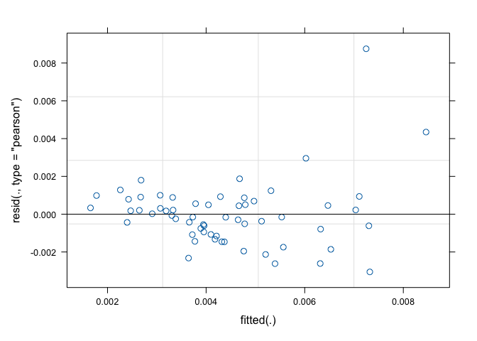<!-- -->

- There is no obvious trend in the scatter of (Pearson) residuals around
  zero as a function of the fitted values. The clouds of points sit
  roughly symmetrically about the horizontal line, suggesting
  homoscedasticity (constant variance) and no gross nonlinearity.

#### Grouped residuals

``` r
library("DHARMa");packageVersion("DHARMa")
```

    ## [1] '0.4.7'

``` r
sim <- simulateResiduals(m1)
plot(sim)  
```

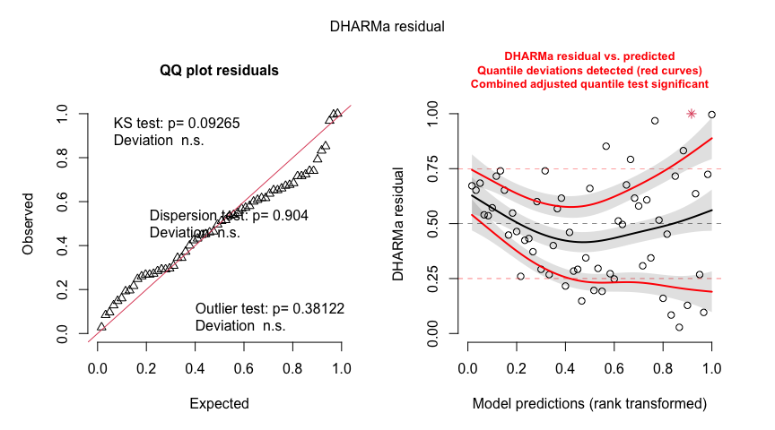<!-- -->

- **QQ‐plot:** points hug the 45-degree line except at the extremes. The
  Kolmogorov–Smirnov (KS) test p=0.09, dispersion p=0.90, outlier p=0.38
  -\> i.e. no significant deviations from uniformity, no over- or
  underdispersion, and no extreme outliers
- **Residual vs. predicted:** the red fitted LOESS curves occasionally
  stray beyond the simulation‐based 95% bands, yielding a significant
  combined quantile test– this hints at minor mis‐fit in certain parts
  of the prediction range-— but nothing dramatic

### Distribution of sample site intercepts

``` r
lattice::dotplot(ranef(m1, condVar=TRUE))  
```

    ## $site

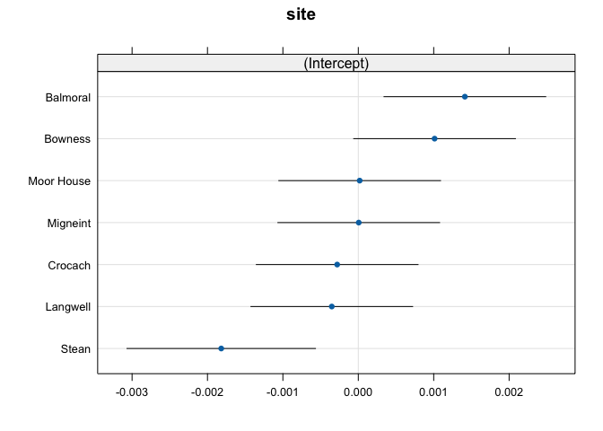<!-- -->

- The plot shows each site’s estimated intercept (with 95% CI):
  - Balmoral sits highest (+0.0013), meaning its average (mean,
    normalized) lysogenic virus abundance is above the grand mean
  - Stean sits lowest (–0.0017), well below the grand mean
  - The other sites cluster nearer zero
- This spread confirms that allowing `(1 | site)` was necessary: sites
  differ meaningfully in their baseline abundance

### Influence & outliers

#### Case-deletion diagnostics

``` r
library("influence.ME");packageVersion("influence.ME")
```

    ## [1] '0.9.9'

``` r
infl <- influence(m1, group="site")
plot(infl, which="cook")
```

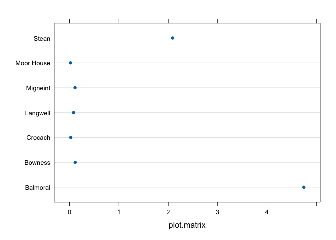<!-- -->

- The plot shows how the global fit changes when each site is dropped
- Stean and Balmoral have the highest influence scores (plotted at ~2.25
  and ~4.75 on the “plot.matrix” scale), indicating that excluding
  either of these sites would shift the overall model fit more than
  excluding others

#### DFBETAs

``` r
dfb <- dfbetas(infl)
dfb
```

    ##            (Intercept)      index
    ## Balmoral    0.86742113 -3.0073699
    ## Bowness     0.38591804 -0.2859739
    ## Crocach    -0.08493716  0.1954823
    ## Langwell   -0.11367484  0.3822579
    ## Migneint    0.06268683  0.4714141
    ## Moor House  0.01601166  0.1952015
    ## Stean      -1.37631929  1.5764088

- Balmoral and Stean are the two sites most driving the global index
  effect
- The fact that other sites have DFBETAs \<1 in magnitude means they are
  not unduly influential

### Interpretation of model diagnostics

Overall, the mixed‐effect model `m1` is broadly well‐supported,
residuals look good, and site‐baseline variation is well captured.
**But** a couple of sites (Balmoral and Stean) carry outsized influence
on the global index slope

### Sensitivity check: drop Balmoral and Stean

``` r
m1_noBal <- lmer(mean_abundance_norm ~ index + (1 | site), data = lysogenic_per_sample_eco_index %>% filter(site != "Balmoral"))
summary(m1_noBal)
```

    ## Linear mixed model fit by REML ['lmerMod']
    ## Formula: mean_abundance_norm ~ index + (1 | site)
    ##    Data: lysogenic_per_sample_eco_index %>% filter(site != "Balmoral")
    ## 
    ## REML criterion at convergence: -515.1
    ## 
    ## Scaled residuals: 
    ##      Min       1Q   Median       3Q      Max 
    ## -2.34585 -0.46373  0.05324  0.63180  2.94881 
    ## 
    ## Random effects:
    ##  Groups   Name        Variance  Std.Dev.
    ##  site     (Intercept) 1.254e-06 0.001120
    ##  Residual             1.107e-06 0.001052
    ## Number of obs: 51, groups:  site, 6
    ## 
    ## Fixed effects:
    ##               Estimate Std. Error t value
    ## (Intercept)  0.0038987  0.0004819   8.091
    ## index       -0.0007521  0.0003562  -2.112
    ## 
    ## Correlation of Fixed Effects:
    ##       (Intr)
    ## index -0.066

``` r
car::Anova(m1_noBal, type = "II")
```

    ## Analysis of Deviance Table (Type II Wald chisquare tests)
    ## 
    ## Response: mean_abundance_norm
    ##        Chisq Df Pr(>Chisq)  
    ## index 4.4587  1    0.03472 *
    ## ---
    ## Signif. codes:  0 '***' 0.001 '**' 0.01 '*' 0.05 '.' 0.1 ' ' 1

``` r
m1_noStean <- lmer(mean_abundance_norm ~ index + (1 | site), data = lysogenic_per_sample_eco_index %>% filter(site != "Stean"))
summary(m1_noStean)
```

    ## Linear mixed model fit by REML ['lmerMod']
    ## Formula: mean_abundance_norm ~ index + (1 | site)
    ##    Data: lysogenic_per_sample_eco_index %>% filter(site != "Stean")
    ## 
    ## REML criterion at convergence: -494.7
    ## 
    ## Scaled residuals: 
    ##     Min      1Q  Median      3Q     Max 
    ## -1.7556 -0.6110 -0.0270  0.4212  4.6285 
    ## 
    ## Random effects:
    ##  Groups   Name        Variance  Std.Dev. 
    ##  site     (Intercept) 1.065e-07 0.0003263
    ##  Residual             3.719e-06 0.0019286
    ## Number of obs: 54, groups:  site, 6
    ## 
    ## Fixed effects:
    ##               Estimate Std. Error t value
    ## (Intercept)  0.0047222  0.0002947  16.026
    ## index       -0.0026128  0.0005008  -5.217
    ## 
    ## Correlation of Fixed Effects:
    ##       (Intr)
    ## index -0.048

``` r
car::Anova(m1_noStean, type = "II")
```

    ## Analysis of Deviance Table (Type II Wald chisquare tests)
    ## 
    ## Response: mean_abundance_norm
    ##        Chisq Df Pr(>Chisq)    
    ## index 27.218  1  1.818e-07 ***
    ## ---
    ## Signif. codes:  0 '***' 0.001 '**' 0.01 '*' 0.05 '.' 0.1 ' ' 1

``` r
m1_noBalStean <- lmer(mean_abundance_norm ~ index + (1 | site), data = lysogenic_per_sample_eco_index %>% filter(!site %in% c("Balmoral", "Stean")))
summary(m1_noBalStean)
```

    ## Linear mixed model fit by REML ['lmerMod']
    ## Formula: mean_abundance_norm ~ index + (1 | site)
    ##    Data: lysogenic_per_sample_eco_index %>% filter(!site %in% c("Balmoral",  
    ##     "Stean"))
    ## 
    ## REML criterion at convergence: -451.8
    ## 
    ## Scaled residuals: 
    ##      Min       1Q   Median       3Q      Max 
    ## -2.11954 -0.54216  0.01609  0.64669  2.87718 
    ## 
    ## Random effects:
    ##  Groups   Name        Variance  Std.Dev. 
    ##  site     (Intercept) 5.902e-07 0.0007682
    ##  Residual             1.195e-06 0.0010930
    ## Number of obs: 45, groups:  site, 5
    ## 
    ## Fixed effects:
    ##               Estimate Std. Error t value
    ## (Intercept)  0.0042836  0.0003859   11.10
    ## index       -0.0009948  0.0004028   -2.47
    ## 
    ## Correlation of Fixed Effects:
    ##       (Intr)
    ## index -0.171

``` r
car::Anova(m1_noBalStean, type = "II")
```

    ## Analysis of Deviance Table (Type II Wald chisquare tests)
    ## 
    ## Response: mean_abundance_norm
    ##        Chisq Df Pr(>Chisq)  
    ## index 6.0993  1    0.01352 *
    ## ---
    ## Signif. codes:  0 '***' 0.001 '**' 0.01 '*' 0.05 '.' 0.1 ' ' 1

Across all of these leave‐one‐(or two)‐out refits, the ecosystem‐health
index retains a negative association with mean normalized lysogenic
abundance, and it remains statistically significant in every case, even
when dropping the two most influential sites. **Therefore, the negative
ecosystem health index effect isn’t driven by a single “outlier” site.**
I.e., the model is robust.

## Bottom line: ecosystem health index predicts lysogenic virus abundance

Ecosystem health index had a significant ($n = 60$, $\chi^2 = 11.515$,
$P = 6.902 \times 10^{-4}$, type II ANOVA), negative
($m = -1.8233 \times 10^{-3}$) effect on mean, normalized lysogenic
virus abundance after accounting for site-to-site differences. In
sensitivity analyses dropping either or both of the most‐influential
sites (Balmoral and Stean), the slope remained negative (–0.00075 to
–0.0026) and statistically significant ($P < 0.05$), indicating that the
relationship is robust across the seven peatland sites.

## Plot normalized mean lysogenic abundance over ecosystem health index with model statistics

### Format model prediction data for the plot’s best fit line and 95% CI

``` r
# 1. Create an evenly spaced grid of index values
new_index <- seq(
  min(lysogenic_per_sample_eco_index$index),
  max(lysogenic_per_sample_eco_index$index),
  length = 100
)

# 2. Build a data.frame with the dummy levels for site & treatment
#    just pick the first levels; they won't affect the marginal emmeans
newdata <- data.frame(
  index = new_index,
  site = levels(lysogenic_per_sample_eco_index$site)[1],
  treatment = levels(lysogenic_per_sample_eco_index$treatment)[1]
)

# 3. Ask emmeans for the marginal (population-level) predictions + 95% CI
emm <- emmeans(
  m1,
  ~ index,
  at = list(index = new_index),
  data = newdata
)
df_preds <- as.data.frame(emm)
head(df_preds)
```

    ##      index      emmean           SE    df    lower.CL    upper.CL
    ##  -1.497950 0.007047876 0.0009808982 28.84 0.005041233 0.009054519
    ##  -1.468715 0.006994572 0.0009668631 28.17 0.005014585 0.008974558
    ##  -1.439480 0.006941267 0.0009529071 27.49 0.004987706 0.008894828
    ##  -1.410244 0.006887963 0.0009390337 26.81 0.004960585 0.008815341
    ##  -1.381009 0.006834659 0.0009252466 26.12 0.004933210 0.008736108
    ##  -1.351773 0.006781355 0.0009115498 25.42 0.004905567 0.008657142
    ## 
    ## Degrees-of-freedom method: kenward-roger 
    ## Confidence level used: 0.95

### Plot it

``` r
p_raw <- m1_p  
p_exp <- floor(log10(p_raw))
p_mantissa <- round(p_raw / 10^p_exp, 2)

plot.lysogenic.over.eco.index.mean.norm <-
  ggplot(aes(x = index, y = mean_abundance_norm), data = lysogenic_per_sample_eco_index) +
  geom_point(
    aes(fill=site, shape=treatment),
    color = "black",
    size = 4,
    alpha = 0.8
    ) +
  scale_color_brewer(palette = "Dark2", name = "Site") +
  geom_ribbon(
    data = df_preds,
    aes(x = index, ymin = lower.CL, ymax = upper.CL),
    inherit.aes = FALSE, fill = "grey50", alpha = 0.25) +
  geom_line(
    data = df_preds, aes(x = index, y = emmean),
    color="black", size=1
    ) +
  ggplot2::annotate(
    "text",
    x = 0.975 * min(lysogenic_per_sample_eco_index$index), # when NOT using scale_x_reverse()
    # x = -0.975 * min(lysogenic_per_sample_eco_index$index), # when using scale_x_reverse()
    # y = 0.97 * max(lysogenic_per_sample_eco_index$mean_abundance_norm), # when NOT needing to be consistent with the boxplot
    y = 0.97 * 2e-2, # when needing to be consistent with the boxplot
    label = paste0(
      "italic(R[marg.]^2) == ", round(m1_r2m,2),
       "*','~",  # no space before the comma, small space after
      "italic(R[cond.]^2) == ", round(m1_r2c,2),
      "\n",
      "italic(P) == ", format(m1_p, scientific=TRUE, digits=2)
    ),
    parse    = TRUE,
    hjust    = 0,
    vjust    = 1,
    size     = 4
    ) +
  ggplot2::annotate(
    "text",
    x = 0.975 * min(lysogenic_per_sample_eco_index$index), # when NOT using scale_x_reverse()
    # x = -0.975 * min(lysogenic_per_sample_eco_index$index), # when using scale_x_reverse()
    # y = 0.89 * max(lysogenic_per_sample_eco_index$mean_abundance_norm), # when NOT needing to be consistent with the boxplot
    y = 0.89 * 2e-2, # when needing to be consistent with the boxplot
    label = paste0(
      "italic(P) == ", p_mantissa, " %*% 10^", p_exp, ""
    ),
    parse    = TRUE,
    hjust    = 0,
    vjust    = 1,
    size     = 4
    ) +
  labs(x = "Ecosystem health index", y = "Normalized lysogenic virus\nabundance (per sample)") +
  theme(
    legend.position = "right",
    text = element_text(size = 14)
    ) +
  scale_shape_manual(name = "Ecosystem\nhealth status",
                     values=c(21,24,23),
                     breaks = c("Natural", "Restored", "Damaged"),
                     labels=c("Natural", "Restored", "Damaged")) +
  scale_fill_brewer(name = "Sample site",
                    palette = "Dark2",
                    labels=c("Balmoral", "Bowness", "Crocach",
                             "Langwell", "Migneint", "Moor House",
                             "Stean")) +
  guides(fill = guide_legend(title.position = "top",
                             title.hjust = 0.5,
                             override.aes = list(shape = 21, color = "black")),
         shape = guide_legend(title.position = "top",
                              title.hjust = 0.5)) +
  scale_y_continuous(labels = function(x) format(x, scientific = TRUE), limits = c(0, 2e-2)) +
  # scale_x_reverse() + # To be consistent with Natural -> Damaged gradient
  cowplot::theme_cowplot()
plot.lysogenic.over.eco.index.mean.norm
```

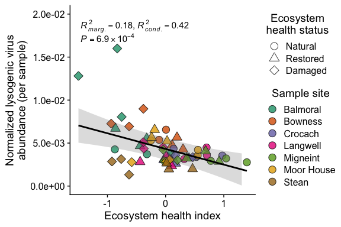<!-- -->

### Save

``` r
ggsave(plot.lysogenic.over.eco.index.mean.norm,
       file = "../Plots/virus_replication/lysogenic_abundance_over_eco_index.png",
       width = 6,
       height = 4,
       units = "in",
       dpi = 600,
       bg = "white")
```

# Combine the virus over host abundance and lysogenic phage abundance plots

## Create the lower section with lysogenic viorus abundance

``` r
plot.lysogenic.combined <- cowplot::plot_grid(
  plot.lysogenic.tmeans.mean.norm.allsites,
  plot.lysogenic.over.eco.index.mean.norm,
  nrow = 1,
  ncol = 2,
  rel_widths = c(4, 6),
  labels = c("B", "C"),
  label_size = 20,
  label_fontface = "bold",
  label_fontfamily = "sans"
  )
plot.lysogenic.combined
```

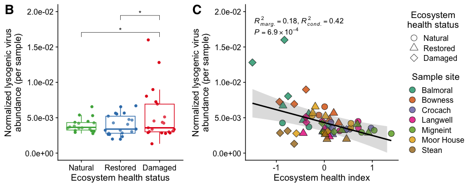<!-- -->

## Combine the upper and lower sections into one plot

``` r
plot.combined.lysogenic.virus.host <- cowplot::plot_grid(
  plot.virus.over.host.abundance.phylum,
  plot.lysogenic.combined,
  ncol = 1,
  labels = c("A", ""),
  label_size = 20,
  label_fontface = "bold",
  label_fontfamily = "sans",
  hjust = -0.5,
  rel_heights = c(4, 4)
  )
plot.combined.lysogenic.virus.host
```

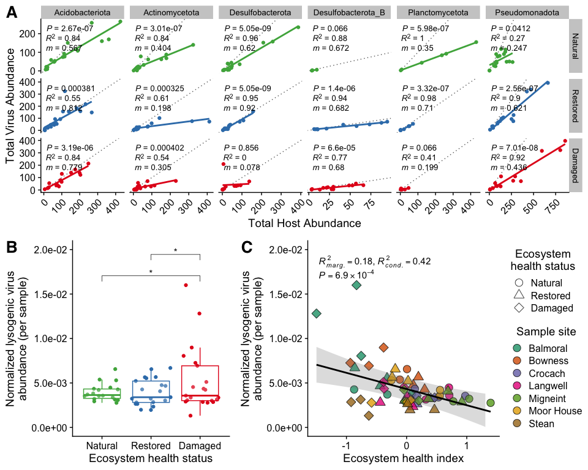<!-- -->

## Save

``` r
ggsave(plot.combined.lysogenic.virus.host,
       file = "../Plots/virus_replication/Fig5.png",
       width = 10,
       height = 8,
       units = "in",
       dpi = 600,
       bg = "white")
```
